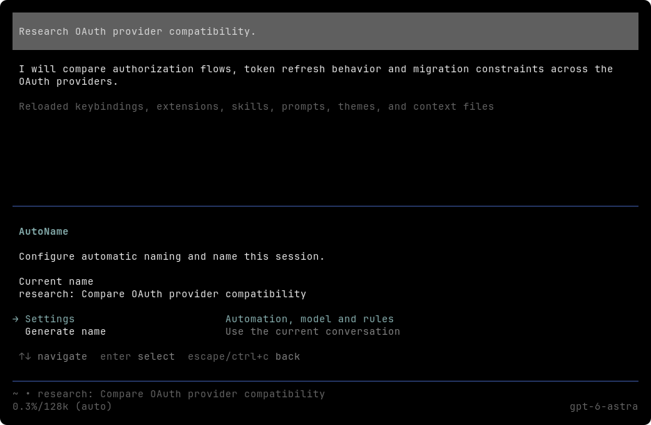
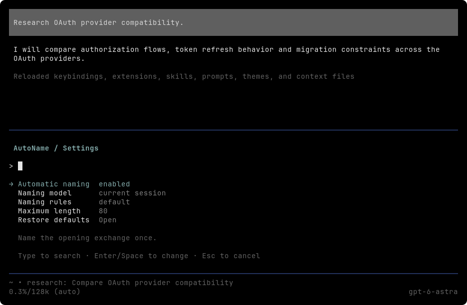
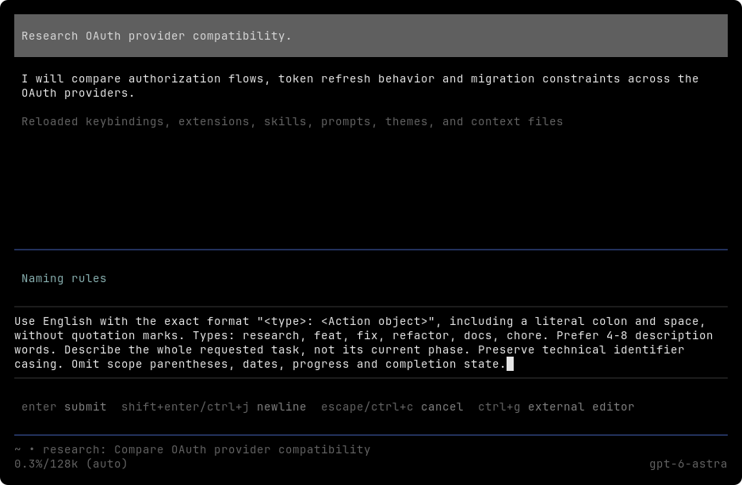
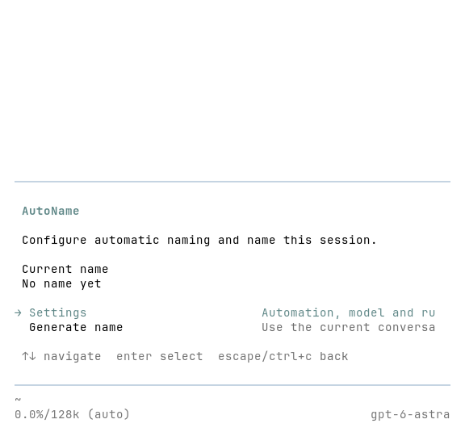

# AutoName native UI prototype

[中文](i18n/zh-CN/autoname-native-prototype.md)

This throwaway branch starts from `2e9aa1e`, the current AutoName implementation. It evaluates one choice: retain the home page's information order and use Pi components for interaction. It is not a production migration or a change to `design.md`.

## Run and inspect

From this worktree, with Bun 1.4.0 and the compiled Pi 0.87.1 host at `/opt/bin/pi`:

```sh
bun run tui run autoname-native-review -- bun tools/autoname-native.prototype.ts
```

Enter `Research OAuth provider compatibility.`, then `/autoname panel`. Open Settings, search for an item, edit rules or maximum length, choose a model, cancel a reset, and return with Ctrl-C or Esc. Generate name uses the fixed sample `research: Compare OAuth provider compatibility`. `/quit` exits the host and cleans its temporary directory. `PI_NATIVE_HOST` selects another host path; `PI_NATIVE_THEME=light` selects the light theme.

The launcher isolates settings, sessions and authentication in a temporary directory and serves a local fixed dialogue response. Settings changes last only for this extension instance. Model selection and rules do not affect the fixed generated name. Automatic naming is a displayed setting, without an automatic lifecycle in this prototype. The root entrypoint mounts only this prototype; other product extensions are not loaded.

## Native boundaries

Home uses `SelectList`; settings and model search use `SettingsList`. A small `Container` assembles borders and text, forwarding input to its list. Rule editing, numeric input and reset confirmation use `ctx.ui.editor`, `ctx.ui.input` and `ctx.ui.confirm`. There are no custom cancel-key handlers.

Cancellation follows Pi's `tui.select.cancel` binding. This differs from the current product design's fixed Esc rule and is an explicit subject of this prototype, not an adopted policy. The model page uses a native searchable settings list, not Pi's full model selector, whose runtime dependency is unavailable in the extension context.

## Observed behavior

Terminal Control exercised the real compiled host: home/settings/editor Ctrl-C cancellation, Esc return, settings search and toggle, model filtering and selection, rule submission, maximum-length editing, reset cancellation and confirmation, silent sample generation and restored editor focus. Dark captures use 100 × 32 cells; the light capture uses 60 × 28. At 60 columns, the native home list truncates descriptions. Custom key remapping, mouse use and external-editor launch were not exercised.

These are actual terminal-cell captures, rendered with JetBrainsMono Nerd Font Mono, Symbols Nerd Font Mono and LXGW WenKai Mono. Default foreground/background colors were set for the selected theme before rasterization. They do not establish compositor or host-font behavior.









Independent read-only code review found no blocking issues. `bun run check` and `git diff --check` passed. The launcher also preserved successful/failed child exit codes and cleaned temporary directories in the reviewer's isolated checks. Production naming quality, persistence and automatic timing are outside this UI prototype.
