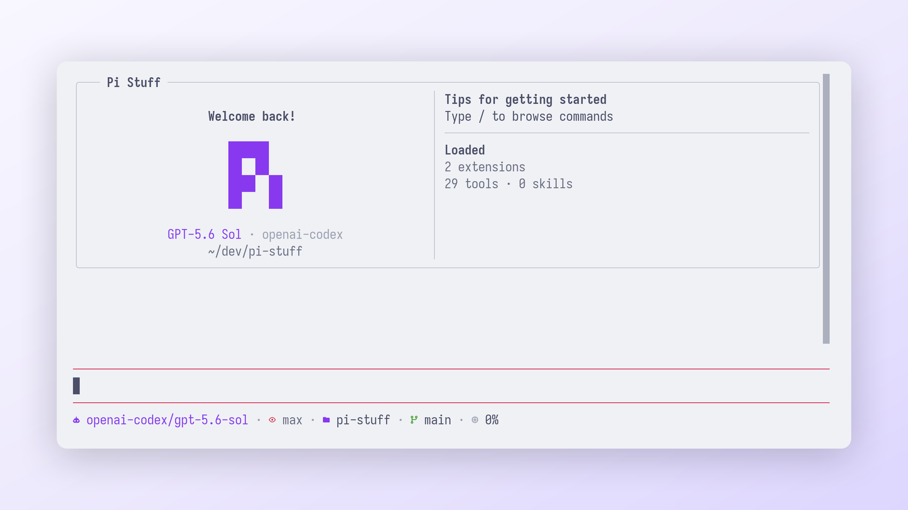
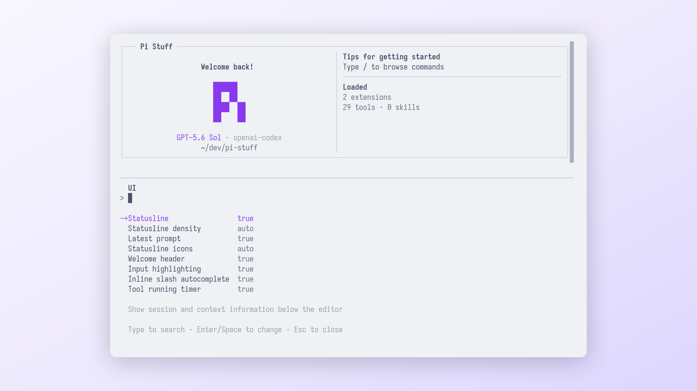
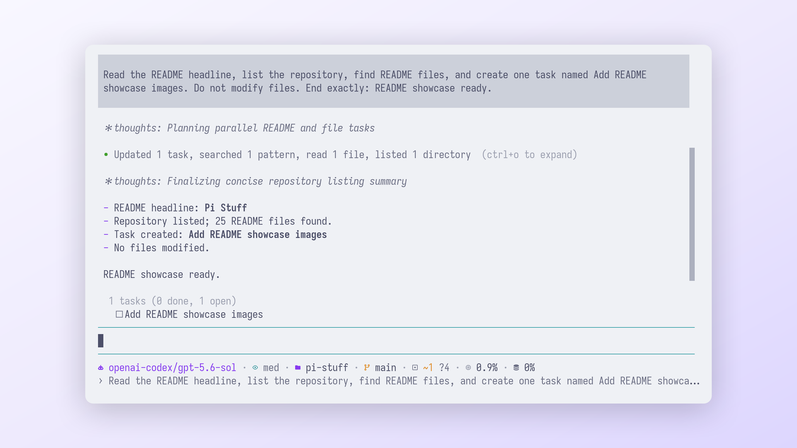
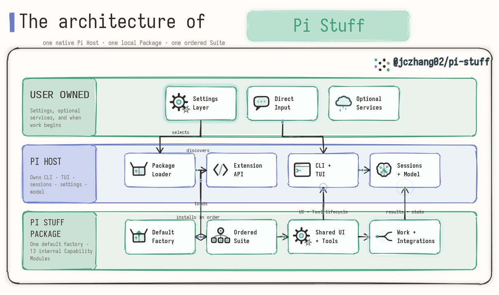

<div align="center">

# Pi Stuff

**为原生 [Pi coding agent](https://github.com/earendil-works/pi) 打造的对话优先能力套件。**

一个本地 Pi Package，提供紧凑的 Tool 活动展示、持久工作、专注的侧边流程与按需集成，同时不取代 Pi。

[English](../../../README.md) · 简体中文

[](https://github.com/jczhang02/pi-stuff/actions/workflows/ci.yml)
[](../../../LICENSE)

</div>

> 本文件是根目录 [`README.md`](../../../README.md) 的简体中文译本。英文版是当前产品与工程事实的权威
> 来源；两者如有差异，以英文版为准。

## 界面预览

以下界面画面是在 Ghostty `1.3.1` 与 Pi `0.84.1` 上记录的历史 UI 证据，不代表当前 Host 认证版本。
点击图片可查看原始尺寸。

**Welcome 与共享 Statusline**

[](../../assets/readme/pi-stuff-welcome.png)

| 原生 `/ui` 设置 | 紧凑的 Tool 活动与 Todo |
| :---: | :---: |
| [](../../assets/readme/pi-stuff-ui-settings.png) | [](../../assets/readme/pi-stuff-tool-activity.png) |

## Pi Stuff 是什么？

Pi Stuff 把一组个人能力组合为一个普通的 Pi Package。Pi 始终是 **Host**，继续负责 CLI、TUI、会话、设置、
Package 加载和模型交互；Pi Stuff 只通过 Pi 原生 Extension 接口加入一套有序的 **Suite**。

它让日常编码流程更紧凑，也更安静：

- **对话优先界面**——响应式 Welcome 卡片、单行有界 Statusline、实时 Thought 投影、输入高亮，以及使用 Pi
  原生交互方式的全宽 Command Dialog。
- **紧凑的 Tool 活动**——连续 Tool 工作会汇总为一个语义化 Activity Group；随时通过 `Ctrl+O` 或
  `/tools` 查看原始细节。
- **持久的目标与计划**——Goal 能自动推进一个需要证据才能结束的目标；Todo 则用有界清单维护可恢复的
  会话任务。
- **当前会话内的并行工作**——Background Shell、一次性 Monitor，以及前台或后台 Agent 都可检查、可控制，
  但不会演变成第二套调度器或运行时。
- **不打扰主对话的临时问题**——`/btw` 在主对话之外回答一个专注问题，关闭后恢复原来的编辑器草稿。
- **工作完成提醒**——仅当用户发起的 Agent 工作真正 settled 后发送终端原生提醒，并在短暂宽限期内因用户活动自动取消。
- **有界集成**——已配置的 Context 会在编辑器就绪前完成初始化；未配置的 Context、Web、MCP、RTK、Codex
  控制和可选 Code Mode 只在需要时激活，并在不可用时安全降级。

Pi Stuff 是一个私有、本地使用的 Package，不发布到 npm；其中的 Capability Module 也不是可独立安装的产品。

## 快速开始

要走已认证路径，请使用基于上游提交 `914cf1472e715297caa30db4b9535d534a9eb718` 构建的 Pi `0.84.2` Linux x64
Host。只有相同版本号并不足以证明已经认证。

```bash
git clone https://github.com/jczhang02/pi-stuff.git
cd pi-stuff
pi install ./packages/pi-stuff
pi
```

`pi install` 由 Pi 将 Package 添加到用户拥有的 Settings Layer。Pi Stuff 不会自行安装，也不会在导入或启动时
修改 Pi 设置。

Pi 启动后，可以从这些命令开始：

| 命令 | 用途 |
| --- | --- |
| `/ui` | 配置 Statusline、Welcome 卡片、输入呈现和 Tool 计时器 |
| `/ctx` | 查看 Context 状态并通过引导执行历史维护 |
| `/notifications` | 配置并测试完成与失败通知 |
| `/goal <目标>` | 开始持续推进一个需要证据才能结束的会话目标 |
| `/btw <问题>` | 提出一个不改变主对话记录、且不调用 Tool 的临时问题 |
| `/tasks` | 检查和控制 Background Shell 与 Monitor |
| `/agents` | 检查和控制当前会话中的 Agent |
| `/tools` | 查看一个 Tool Activity Group 的成员和有界结果 |
| `/diagnostics` | 查看当前进程中有界且已脱敏的 Suite 问题记录 |
| `/codex` | 使用受支持的 Codex 模型时，查看用量和 Fast mode |
| `/mcp` | 查看按需配置的 MCP 服务器 |
| `/rtk` | 验证或配置可选的 RTK 命令改写 |
| `/codemode` | 打开可选 Code Mode 控制面板，并把选择持久化到受信任项目 |

在 tmux 中使用终端原生通知时，需要配置 `set -g allow-passthrough on`。Pi Stuff 会为 tmux 封装通知协议，
但不会修改用户拥有的 tmux 设置。

通知的 `auto` 方式会为 Kitty 选择 OSC 99、为 Ghostty 选择 OSC 777，并为 iTerm2 和 WezTerm 选择 OSC 9。
响应预览默认关闭，因为桌面通知历史可能在 Pi 之外可见。可选的 terminal bell 设置发送 BEL；BEL 最终发出
声音还是视觉提示，由终端决定，而不是由 Pi Stuff 决定。

外部服务、身份认证、MCP 声明、Magic Context 配置和 RTK 可执行文件都保持可选，并由用户管理。缺少它们不会
阻止普通 Pi 对话。

## 架构

[](../../assets/readme/pi-stuff-architecture.png)

整体只有三层：

1. **Pi Host** 负责 CLI、TUI、会话、设置、Package 加载器和模型循环。
2. **`@jczhang02/pi-stuff`** 导出一个默认 Extension factory；生成后的入口严格遵循
   [`packages/pi-stuff/suite.json`](../../../packages/pi-stuff/suite.json) 声明的顺序。
3. **Capability Module** 在 Package 内分别拥有一种职责清晰的行为。`conversation-ui` 提供共享呈现与 Host
   生命周期协调；`tool-display` 提供共享 Tool 呈现契约。

导入过程保持纯净。会话启动不会访问网络、启动子进程、修改 Host 设置，也不会创建、重写或迁移用户配置。
根据 [ADR 0007](../../adr/0007-initialize-configured-context-before-editor-readiness.md)，对于已经识别且无需迁移的
Context 配置，可以在编辑器就绪前初始化可重建的派生 SQLite 状态。必要模块初始化失败时会直接暴露错误，
不会留下一个悄悄缺失功能的 Suite。

### Capability 一览

当前 Suite 按以下顺序组成：

| Capability Module | 提供的能力 |
| --- | --- |
| `conversation-ui` | Welcome、Statusline、实时 Thought、输入呈现、`/ui`、诊断与共享 Command Dialog 生命周期 |
| `tool-display` | 紧凑 Tool Activity Group、原生展开、`/tools` 与确定性的会话恢复重建 |
| `rtk` | 可选且 fail-open 的 Bash 命令改写，以及仅面向模型的 Bash/Grep 输出投影 |
| `codex` | `/codex`、Fast mode、订阅用量、`apply_patch`、`view_image` 与 `imagegen` |
| `goal` | 一个持久会话目标、自动延续，以及基于证据的完成或阻塞判定 |
| `context-management` | 集成已配置的 Magic Context，提供 `/ctx` 控制中心，并保留 Pi JSONL 作为原始会话权威 |
| `web` | 有界 Web 搜索、公开 HTTP(S) 内容读取、PDF 提取与后续片段检索 |
| `mcp` | 一个按需配置的 MCP gateway，支持显式认证与 stdio/HTTP transport |
| `background-work` | 当前会话中的 Background Shell、一次性 Monitor 和 `/tasks` 管理 |
| `subagents` | 前台与后台 Agent、紧凑 roster，以及 `/agents` 检查界面 |
| `todo` | 可按分支重放的 Task Tool，以及 Pi 编辑器上方的有界清单 |
| `btw` | 不进入主对话记录和模型上下文的一次性临时问题 |
| `notification` | 用户发起的 Agent 工作 settled 后，延迟发送终端原生完成或失败提醒 |
| `code-mode` | 可选 JavaScript 封装，通过一个模型可见的 schema 暴露当前 Suite Tool |

这些名称只是内部维护边界，没有各自独立的 manifest、版本、安装或发布生命周期。

### Context 控制

`/ctx` 会打开 Pi Stuff 自有的全宽 Context Dialog，显示当前用量、compartments、memories、notes、Historian
状态、待处理 drops 和可用维护操作。同一组操作也可以通过子命令执行：

```text
/ctx status
/ctx flush
/ctx wrapup [保留的消息数]
/ctx recomp [起始消息-结束消息]
/ctx upgrade
```

维护进度和结果会以 Pi Stuff Activity 的形式写入 Session，可在恢复会话后查看，但不会进入模型上下文。
Magic Context 仍负责数据和实际执行；它自己的 Header、Footer、Widget、Statusline 和 Dialog 不会与 Pi Stuff
界面争夺控制权。

## 主题

Package 包含 `catppuccin-latte`、`catppuccin-frappe`、`catppuccin-macchiato` 和 `catppuccin-mocha`。可以在 Pi
的 `/settings` 菜单中选择，也可以在 Pi 的 `settings.json` 中写入主题名称。终端颜色降级和最终主题选择仍由 Pi
及用户控制。

## 兼容性与项目状态

| 契约 | 已认证配置 |
| --- | --- |
| Pi Host | `0.84.2`，上游提交 `914cf1472e715297caa30db4b9535d534a9eb718` |
| 平台 | Linux x64；CI 系统工具基线为 Ubuntu 24.04 |
| Bun | `1.3.14` |
| Node.js / npm | `24.16.0` / `11.13.0`，用于构建认证 Host |
| TypeScript | `5.9.3` |
| 可选 RTK runtime | `0.42.4`，只认证 Linux x64 构建 |

仓库不声明兼容其他 Pi 构建。升级 Pi 必须作为一次协调变更，同时更新固定的 Host 源码配置、开发类型依赖和
公开接缝验收检查。完整信息见 [`兼容性契约`](../../compatibility.md)。

## 开发

安装冻结的依赖图并运行完整仓库检查：

```bash
bun install --frozen-lockfile --ignore-scripts
bun run check
```

检查范围包括格式、类型接口、测试、未使用代码、生成的 Suite 组合、仓库安全、Tool Activity 性能，以及提取后
本地 Package 的验证。`bun run host:build` 会在被忽略的 `.artifacts/` 下构建固定版本的 Pi Host，用于完整验收。

维护者文档统一收录在 [`docs/README.md`](../../README.md)。修改行为前，请阅读
[`CONTRIBUTING.md`](../../../.github/CONTRIBUTING.md)、[`CONTEXT.md`](../../../CONTEXT.md) 中的规范术语、
可见界面的[中文设计说明](./DESIGN.md)（英文 [`DESIGN.md`](../../../DESIGN.md) 为准），以及 [`adr/`](../../adr/)
下相关决策记录。工程工作遵循 [Beads 流程](../../agents/issue-tracker.md)，并同步到
[GitHub Issues](https://github.com/jczhang02/pi-stuff/issues)。

## 安全

Pi Extension 以用户的操作系统权限运行。Pi Stuff 不额外提供权限层或命令拦截层。安装前请审阅源码；安全问题
请使用[私密漏洞报告渠道](../../../.github/SECURITY.md)。

## 许可证

[MIT](../../../LICENSE) © 2026 JC Zhang。吸收的第三方源码保留其相邻许可证与来源记录。
