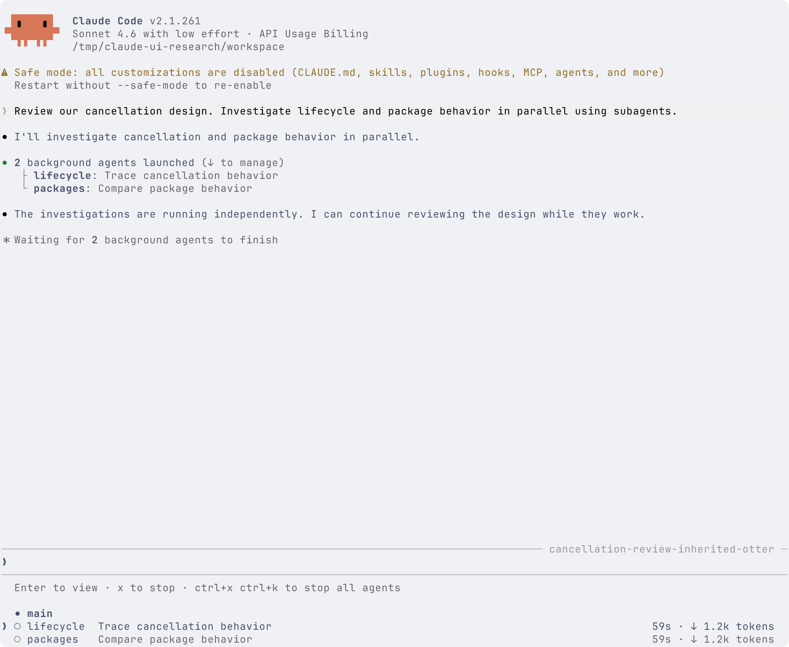
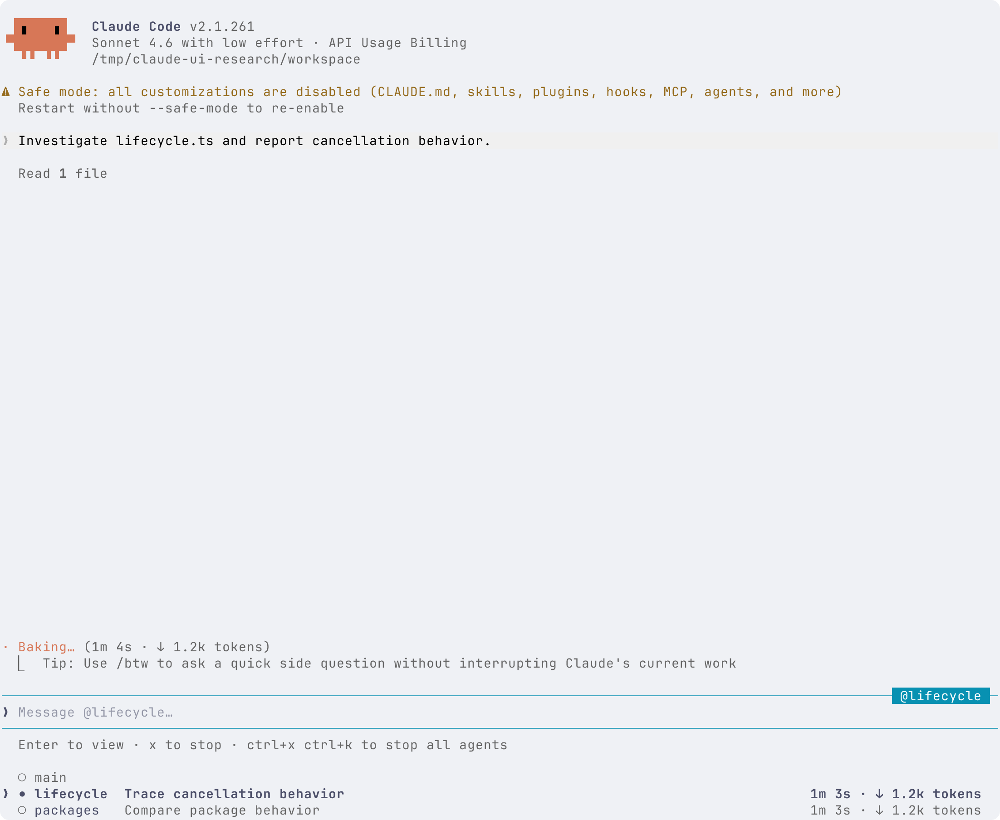
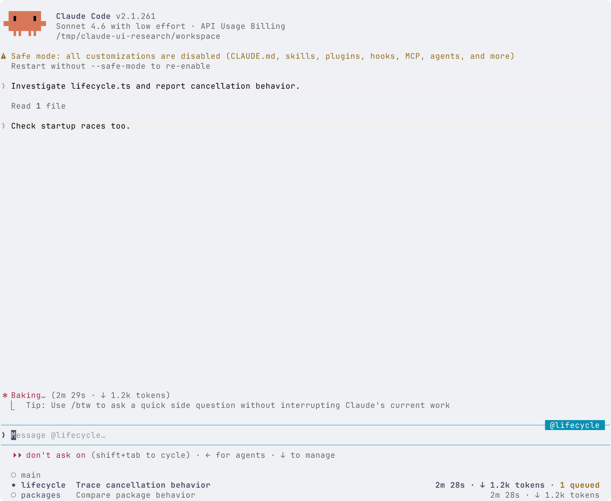
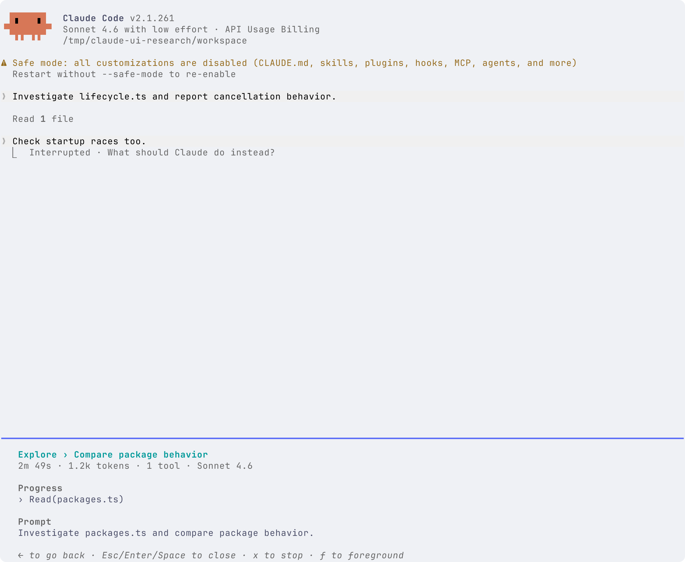
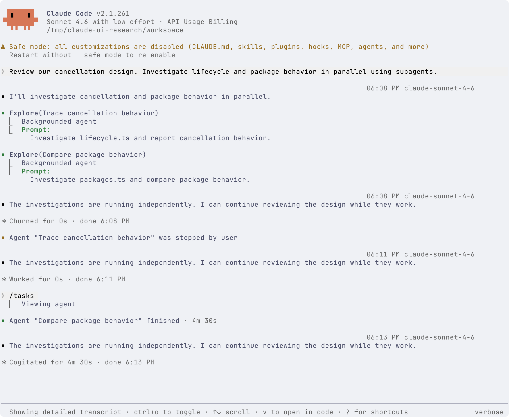
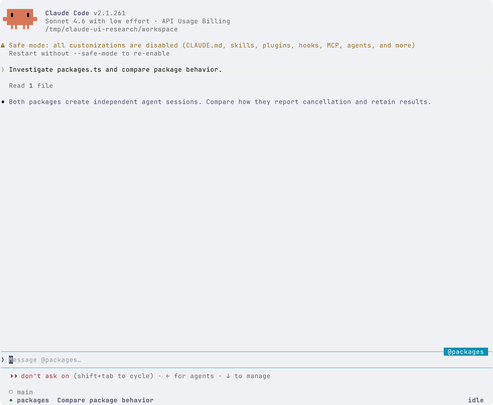
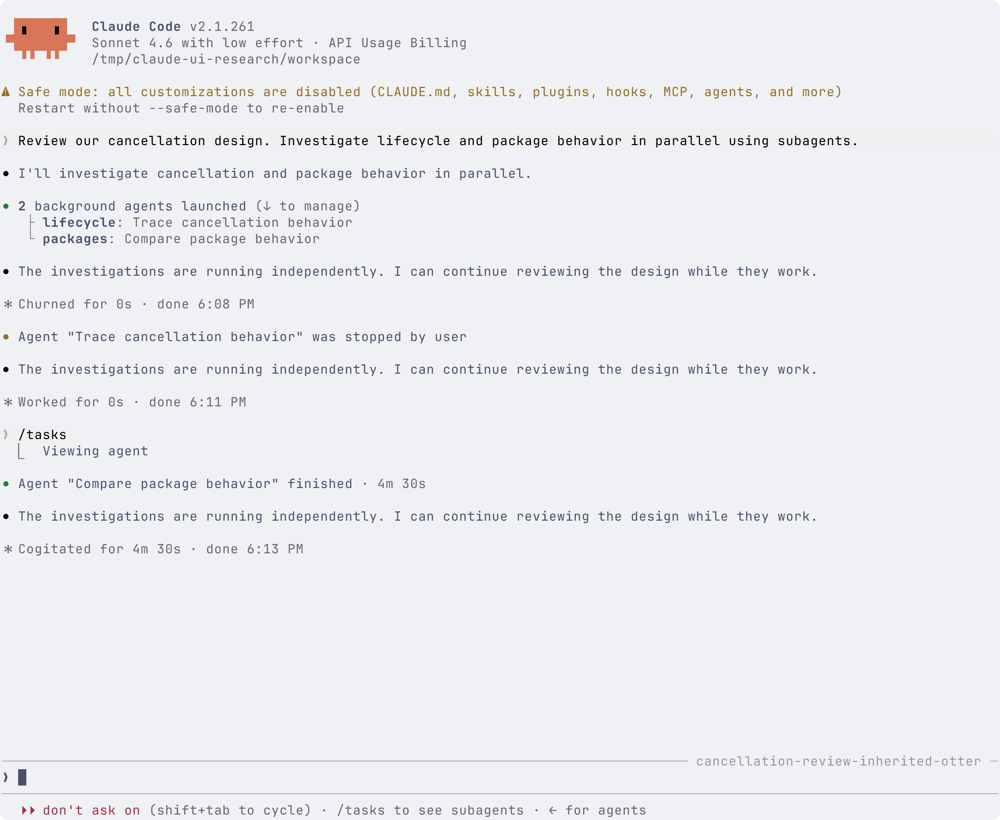

# Claude Code subagent UI 调研

[English](../../claude-subagent-ui-research.md)

调研日期: 2026-09-15. 关联工作: [#93](https://github.com/jczhang02/pi-stuff/issues/93), 属于 [#64](https://github.com/jczhang02/pi-stuff/issues/64).

Pi subagent 原型已经有底部代理列表, 但选中子代理之后如何交互, 仍未确定. 这份调研查看 Claude Code 在参考样式背后的真实行为, 记录观察和可借鉴之处. 本轮没有修改原型, 也没有确定新的 Pi UI 方案.

最重要的发现是, Claude 区分了接收键盘操作的行, 和当前显示对话的代理. 它的底部列表要与委派摘要、子代理对话、任务详情配合使用. 只照搬列表, 会漏掉大部分交互.

## 证据与阅读方式

**已实测**指在官方 Linux CLI **2.1.261** 中实际操作, 下方有截图. 模型响应来自本地脚本测试服务, Claude Code 自身执行委派、文件读取、输入路由、消息排队、取消和渲染. 这能验证这些 UI 路径, 不能验证真实 Claude 模型的质量或生产环境可靠性.

**官方文档**指调研当天读取的官方说明. **用户报告**指公开 Issue 中的第一手反馈, 本轮未必复现. **分析建议**指我们的解释或 Pi 的可选方向. 影响交互的版本差异会单独标明.

可以先看[选中一行](../../assets/claude-subagent-ui/02-selected.png)、[打开子代理](../../assets/claude-subagent-ui/03-transcript.png)、[发送并排队](../../assets/claude-subagent-ui/04-message.png). 三张图展示核心交互. 文末有保留的全部八张截图.

## 到底是哪种 agent, 哪个列表?

[官方总览](https://code.claude.com/docs/en/agents)区分了以下几种方式:

| 类型                        | 实际使用例子                         | 与本文 UI 的关系                      |
| --------------------------- | ------------------------------------ | ------------------------------------- |
| 普通 subagent               | 请研究员检查取消逻辑, 交回调查结果   | 当前主会话内部的委派工作              |
| 会话内 fork 子代理          | 带着已有讨论, 另查一条思路           | 创建会话内子代理的另一种方式          |
| Agent team                  | 负责人通过消息和共享任务协调团队     | 独立的实验性协作模式                  |
| Agent View 中的后台 session | 分别跑修 bug、审查和调查三个独立任务 | 完整独立对话, 用 `claude agents` 管理 |

本文的 **FleetView** 专指我们一直讨论的当前会话底部小列表. 官方文档称它为 **subagent panel**. 它与跨会话、占据整个终端的 **Agent View** 不同. 后台 session 派出的 subagent 和 teammate, 不会各自成为 Agent View 的顶层行.

截图中还要区分三个名字. `Explore` 是内置代理类型, `lifecycle` 是派发时给这一个代理取的名字, `Trace cancellation behavior` 是本次交办的描述. 自定义代理文件也可以提供一种代理类型, 但本轮截图没有加载自定义定义.

## 主对话如何保持可读

**已实测.** 一次 assistant 响应启动了两个带名字的后台代理. Claude 将两次工具调用合并成一条委派摘要, 下方列出两个分支. 两个子代理仍在运行时, 主代理可以继续输出.

下面按截图简化转录, 省略顶部和空白:

```text
2 background agents launched (↓ to manage)
├ lifecycle: Trace cancellation behavior
└ packages: Compare package behavior

[main conversation continues]

[prompt input]
[permission mode and keyboard hints]

  ● main
❯ ◯ lifecycle  Trace cancellation behavior            59s · ↓ 1.2k tokens
  ◯ packages   Compare package behavior               59s · ↓ 1.2k tokens
```



委派摘要回答派了谁、做什么. 底部列表回答哪些代理可以查看. 子代理读到的文件不会全部进入主对话, 主代理等待后台工作时, 可以在输入框上方另显示一行等待提示.

实际列表中, 名字列与描述列对齐, 统计贴右侧, 没有重复的 `Running` 标签. `main` 没有描述. 左侧有一小段空位放焦点标记, 没有整行选中底色. 名字和当前查看的行会通过文字强调. 这是 Claude 的现状, 不构成推翻我们既定留白偏好的理由.

还要区分两种树. 主对话中的分支是在总结一次委派事件; 嵌套代理导航树表达的是持续存在的父子关系. 这次两个子代理的运行验证了前者, 没有验证后者.

## 选中、查看、输入并非同一个状态

**已实测.** 移到 `lifecycle` 行时, 主对话没有立即被替换. 屏幕仍显示 `main`, 对应 `● main`; 行首 `❯` 标出将接收键盘操作的子代理. 按 Enter 后, 才打开子代理对话.

| 标记           | 在本次列表中的含义             | 不能据此判断的内容                 |
| -------------- | ------------------------------ | ---------------------------------- |
| 行首 `❯`       | 键盘操作指向这一行             | 哪个代理正在执行、正在显示哪个对话 |
| 实心 `●`       | 当前正在查看的代理             | 通用的 running/done 状态           |
| 空心 `◯`       | 列表中的其他代理               | 失败、空闲或未被键盘选中           |
| 颜色与行尾文字 | 停止、空闲、消息排队等执行信息 | 消息到底发给谁                     |

Enter 后, 正文显示原始交办内容和折叠的文件读取. 输入框边缘出现 `@lifecycle`, 占位文字也指向它. `main` 变为空心, `lifecycle` 变为实心.



关键变化如下:

```text
显示 main, 输入发给 main
    ↓ 在列表中选 lifecycle
仍显示 main, 列表操作指向 lifecycle
    Enter
显示 lifecycle, 输入发给 lifecycle
    列表获得焦点时按 Esc
仍显示 lifecycle, 键盘焦点回到输入框
```

在本次宿主中, 查看子代理确实改变了显示的 transcript 和输入路由. 这不能证明 Pi 扩展可以替换 Pi 当前运行的 agent/session. 还要注意[官方说明的命令边界](https://code.claude.com/docs/en/sub-agents#observe-and-steer-running-forks): 普通消息和 skill 发给当前查看的子代理, 内置斜杠命令仍作用于主会话. Agent View 中 attach 的独立 session 又是另一种命令上下文.

## Steer 直接使用有收件人的输入框

**已实测.** 子代理工作期间, 我把焦点退回它的输入框, 发了一句补查启动竞争问题的要求. 这句话成为子代理 transcript 中的用户消息, 列表右侧出现 `1 queued`.



用户得到了两项确认: 消息进入了正确的对话, 但仍在等待处理. 发送成功与修正已经生效是两个事件. 本轮在释放挂起的模型响应前停止了这个子代理, 所以**没有验证**它何时消费排队消息, 也没有验证它是否正确遵循修正.

**分析建议.** 讨论 steer 时, 可以从收件人和送达状态开始, 不必先设计带模型参数的专用表单. Pi 最终用普通编辑器, 还是单独的 inline 回复区域, 仍待确定.

## Esc 会受焦点影响, 也可能停止工作

**已实测.** 列表获得焦点时按 Esc, 行首标记消失, 焦点回到编辑器, 子代理对话和收件人保留. 此时再按 Esc, 由于已经位于工作中的子代理输入框, 该子代理被中断. 子对话显示中断信息, 主代理随后收到用户停止通知.

回到 main 需要选中 `main` 行, 再按 Enter. 不能假设连续按 Esc 一定是在逐层返回.

| 当前场景                  | 操作                | 实测结果                            |
| ------------------------- | ------------------- | ----------------------------------- |
| main 输入框, 有后台代理   | Down, 再用方向键    | Down 进入列表焦点; 方向键再移动焦点 |
| 选中子代理行, 仍查看 main | Enter               | 打开子对话, 输入发给它              |
| 列表获得焦点              | Esc                 | 焦点回到输入框, 保留当前查看的代理  |
| 工作中的子代理输入框      | Esc                 | 中断子代理                          |
| 选中 `main` 行            | Enter               | 恢复主对话和主输入收件人            |
| `/tasks` 详情             | Esc、Enter 或 Space | footer 提示可关闭; 未逐一验证三键   |
| 详细 transcript           | Ctrl+O              | 退出详细 transcript 显示            |

这里只覆盖本轮操作路径, 不代表所有编辑模式和光标位置. 自动操作起初猜测的停止提示与实际文字不同, 另一次截图捕获的是斜杠命令补全, 当时任务详情还未打开. 通过重新检查终端状态修正了这些探测, 它们不构成 Claude 的 bug 证据.

**官方文档.** [Panel 按键表](https://code.claude.com/docs/en/sub-agents#observe-and-steer-running-forks)中的 `x` 也依赖上下文: 停止选中的运行中子代理, dismiss 已结束行, 但位于 main 或正在查看的行时, 正常输入字符. [全局按键说明](https://code.claude.com/docs/en/interactive-mode)提供 Ctrl+X 后 Ctrl+K 停止后台代理, 需要重复确认. 本轮未执行这两种停止路径.

## `/tasks` 是单独的管理入口

**已实测.** 即使处于子代理视图, `/tasks` 仍被识别为内置命令. 当时只有 `packages` 还在执行, 因而直接打开它的详情. 这张图**不是**多任务列表, 也不是 FleetView 某一行展开后的样子.



详情显示代理类型和任务描述, 以及耗时、tokens、工具次数、模型、最近工具活动、原始交办内容. 它有自己的关闭、停止、foreground 提示. 图中上方仍是被中断的 `lifecycle` 对话, 下方却是 `packages` 详情, 因此详情标题承担了明确操作对象的职责.

按 `f` 后, 打开了 `packages` 对话和指向它的输入框, 可见[实测截图](../../assets/claude-subagent-ui/07-foreground.png). 仅凭这一可见变化, 不能断言主代理开始被阻塞, 或执行调度模式已经改变.

**已实测.** 在主对话按 Ctrl+O, 则打开更详细的 transcript, 展示每次委派的 prompt 以及模型、时间信息. 它控制阅读的详细程度, 与切换代理、管理任务是不同操作.



## 完成、停止与保留历史

**已实测.** 释放第二个子代理的测试响应后, 它显示最终文字. 由于此时正在查看它, 列表仍保留该行, 右侧显示 `idle`, 输入仍发给 `packages`.



切回 main 后, 主对话显示完成通知, 子代理行消失, footer 提示通过 `/tasks` 查看. 通知后重复出现的 assistant 句子来自测试脚本, 不能据此认为真实模型误判了完成状态.



**官方文档.** 当前[生命周期说明](https://code.claude.com/docs/en/sub-agents#run-subagents-in-foreground-or-background)规定, 成功行移除后, footer 和 `/tasks` 提供 30 秒查看机会; 失败或停止的行保留 30 秒, 可以提前 dismiss. 已经打开的详情继续保留. 实测中正在查看的子代理出现 `idle`, 因此不能笼统地说成功行在所有情形下都立即消失. 本轮没有计时验证 30 秒阈值.

同页的[续聊规则](https://code.claude.com/docs/en/sub-agents#resume-subagents)区分了模型停止和用户取消. 模型停止的子代理停妥后, 可以通过消息恢复; 用户取消的子代理拒绝被自动唤醒, 直到用户显式恢复. 已完成的子代理可以带着保留的上下文续聊. 这不能证明 Pi 已选的独立执行记录格式, 或下游依赖处理语义来自 Claude.

## 其他会影响 UI 的场景

以下属于**官方文档, 本轮未实测**. 例子描述用户会遇到的情况, 不代表又执行了一轮验收.

| 场景           | 实际例子                                 | 与交互有关的 Claude 行为                                                                                                                                                                         |
| -------------- | ---------------------------------------- | ------------------------------------------------------------------------------------------------------------------------------------------------------------------------------------------------ |
| 前台与后台     | 审查员阻塞下一步决策, 或与主代理同时调查 | 前台执行阻塞父代理; Ctrl+B 可以把符合条件的工作放到后台. tmux 中官方说明可能需要按两次. [Interactive mode](https://code.claude.com/docs/en/interactive-mode#background-bash-commands)            |
| 权限请求       | 子代理执行工具前需要批准                 | 从 2.1.186 起, 后台权限请求会到 main, 并标明请求者. Esc 拒绝这一次工具, 不会停止整个子代理. [Changelog](https://code.claude.com/docs/en/changelog)                                               |
| 向用户提问     | 研究员需要用户在两条思路中选择           | 非 fork 子代理没有 `AskUserQuestion`; fork 继承父级工具, 仍受权限约束. 不能假设每个子代理都有同一种提问对话框. [Tool availability](https://code.claude.com/docs/en/sub-agents#available-tools)   |
| API 错误       | 审查写出部分结果后被截断                 | 部分发现和错误需要与完整交付区分. 官方错误说明覆盖响应不完整和提前终止两类情况. [Errors](https://code.claude.com/docs/en/errors)                                                                 |
| 嵌套委派       | reviewer 再派两个核查员                  | 当前文档描述了 panel 树、后代计数和通过亲属关系回到 main 的导航. 它不等于依赖 DAG 查看器. [Nested subagents](https://code.claude.com/docs/en/sub-agents#let-subagents-spawn-their-own-subagents) |
| 复制已有上下文 | 长时间讨论方案后, 另查一条路径           | `/subtask` 创建会话内 fork; Agent View 开启时, `/fork` 通常创建独立后台 session. [Commands](https://code.claude.com/docs/en/commands)                                                            |
| 恢复历史       | 明天重开主会话, 回看某个子代理           | 子代理 transcript 独立持久化, 受保留期限约束. 行消失与记录删除是不同事件. [Claude directory](https://code.claude.com/docs/en/claude-directory)                                                   |

旧教程的命令表不能直接套用. [官方总览](https://code.claude.com/docs/en/agents#check-on-running-work)说明, 从 2.1.198 起, `/agents` 不再打开定义管理面板, 而是提示文件位置. `/tasks` 管当前会话的后台工作, shell 中的 `claude agents` 打开 Agent View. [交互帮助](https://code.claude.com/docs/en/interactive-mode)中的 Ctrl+T 在对话里切换任务清单, 不是这个运行管理器.

[2.1.232 更新记录](https://code.claude.com/docs/en/changelog)还改变了交互模式的 fork/background 默认值. 本轮明确关闭 fork mode, 请求带名字的后台 Explore 代理, 因而不能把截图解释为所有当前安装的默认委派选择.

## Teams 与跨会话 Agent View

**官方文档.** [Agent teams](https://code.claude.com/docs/en/agent-teams)支持进程内切换, 或 tmux/iTerm2 分屏. 进程内模式通过选择 teammate 和直接发消息交互; 分屏模式给 teammate 独立终端 pane. Teams 在普通交办与结果返回之外增加了共享协调, 目前是默认关闭的实验功能. 它的 pane 控制不能证明扩展可以切分 Pi 内部的对话渲染区.

**官方文档.** [Agent View](https://code.claude.com/docs/en/agent-view)按关注需求和状态分组独立后台 session. Space 打开简短查看区域, 展示活动、待回答问题或结果; Enter attach 完整会话; 空输入时按 Left detach. 子代理不会成为其中的顶层行. 本轮没有运行这个模式.

它的[管理操作](https://code.claude.com/docs/en/agent-view#organize-the-list)还包括 Ctrl+T pin、Ctrl+S 切换分组、Shift+Up/Down 排序, 以及 Ctrl+X 停止; 两秒内再次 Ctrl+X 删除条目, 按条件清理 worktree, 但保留 transcript. `Ready for review` 汇总有 open PR 的 session, `Completed` 也包含 failed 和 stopped. 因此分组标题不能代表每个 session 的精确状态.

**分析建议.** 可以借鉴的是摘要会随关注原因变化: 工作时显示活动, 被阻塞时显示具体问题, 完成后显示结果. Pi 可以评估这个思路, 而不必采用它的跨会话管理器或 peek UI. 需要用户回答的问题, 应该比泛泛的 waiting 标签更明确.

## Tokens 必须有明确含义

**已实测.** 测试服务在流开始时给出 `input_tokens = 1200`, `output_tokens = 0`, 行尾却显示 `↓ 1.2k tokens`. 因而不能直接称它为纯输出 tokens. 本轮测试没有设计成区分多次请求、各个状态下的全部累计规则.

只读检查同一个已验证的 2.1.261 二进制, 在字节偏移 `200176331` 发现 **Agent 工具 transcript 子行**的函数, 将最后一个 assistant 消息的 input、output、cache read、cache creation 相加. 这是另一条渲染路径, 尚未证明底部列表行尾复用它. 没有将提取的实现引入 Pi.

[Monitoring 文档](https://code.claude.com/docs/en/monitoring-usage)又分别定义了累计 token counter 和 `subagent_completed.total_tokens` 中最后一次请求的 footprint. 两者都没有定义底部箭头的含义. [公开 token 显示问题](https://github.com/anthropics/claude-code/issues/15704)进一步说明这种歧义存在, 但不能确定当前公式.

**分析建议.** 内部先区分使用量字段, 再决定 compact 数字的含义. 我们喜欢的 `↓ 8.2k tokens` 可以继续作为视觉偏好, 这份调研没有替它确定 Pi 的数据契约.

## 用户报告中的交互问题

这些报告提供值得测试的场景, 不代表 2.1.261 或当前最新版仍存在同样缺陷.

| 第一手报告                                                       | 报告的问题                                 | 对 Pi 验证的启发                     |
| ---------------------------------------------------------------- | ------------------------------------------ | ------------------------------------ |
| [#90492](https://github.com/anthropics/claude-code/issues/90492) | 方向键把子代理选择与 main 输入历史混在一起 | 移动列表不应偷偷改变编辑器草稿或历史 |
| [#77655](https://github.com/anthropics/claude-code/issues/77655) | 子代理视图显示 main 的 model、effort、身份 | 每个显示字段都需要明确属于谁         |
| [#58965](https://github.com/anthropics/claude-code/issues/58965) | 等权限的 session 看起来仍在工作            | 待回答请求应优先于缺少信息的活动摘要 |
| [#15704](https://github.com/anthropics/claude-code/issues/15704) | token 显示在执行中和完成后改变含义         | 同一个标签在各状态下应保持定义明确   |

## 对我们下一轮讨论的影响

以下是研究建议, 尚未成为已接受的 UI 决策:

1. 先决定选中与查看是否仍然独立. 若保留独立行为, 要能同时辨认两者, 不必照搬 Claude 的额外箭头.
2. 保持主对话简洁, 让详细证据有入口. 截图显示, 摘要、实时导航和历史记录承担不同职责.
3. steer/reply 输入旁明确标出收件人, 区分消息排队和修正已生效.
4. 给停止、返回、dismiss 不同含义. 即使喜欢 Claude 的外观, 它依赖上下文的 Esc 也有值得改进的交互成本.
5. 代理行离开实时列表后, 仍能找到完成结果. 保留时间和查看路径可以遵循 Pi 已定的生命周期, 不必照搬 Claude 的临时列表.

下一轮 UI 讨论最核心的问题是, 选中子代理之后, 它的 transcript 和回复输入放在哪里. 可以用这些相同操作评估既有 inline tree 方向. 本调研提供比较依据, 不重启已排除的 overlay 提案, 也不声称 Pi 可以真正切换宿主 agent.

## 截图来源与限制

官方 `linux-x64` 发布文件与 [2.1.261 manifest](https://downloads.claude.ai/claude-code-releases/2.1.261/manifest.json)校验一致, SHA256 为 `4ae40dd1784e85753e742e09f267d29ecbb82890361ad3817d27560866d364a6`.

Terminal Control 1.2.1 捕获了隔离的 **122 × 50** 终端. 渲染使用检查过的环境字体栈 `JetBrainsMono Nerd Font Mono, Symbols Nerd Font Mono, LXGW WenKai Mono`, 浅色背景 `#eff1f5`, 前景 `#4c4f69`, 截图 padding 为 2 像素. 图片来自实际终端单元格渲染, 并非 Ghostty 窗口照片. 本轮没有验证不同宽度或原生窗口合成效果.

启动使用隔离配置和工作目录, 设置 `--safe-mode`、空 setting sources、`--permission-mode dontAsk`, 允许 `Agent`/`Read`, 并设置 `CLAUDE_CODE_FORK_SUBAGENT=0`. 本地 SSE 测试服务给出两次 Agent 调用, 让原生 Read 工具读取合成文件, 挂起响应后再释放完成. Safe mode 和权限模式提示来自真实 CLI. 图中的模型名是请求标签, 没有使用 Anthropic 账户或远程 Claude 模型. 耗时包含人工保持的测试响应, 使用量也是合成数据, 都不代表性能.

原始请求和测试服务没有公开. 本轮创建的 CLI 会话和服务已停止, 用户的 Pi 原型终端保持运行. 没有运行或引入所谓泄露源码. 历史镜像不足以证明当前 UI 行为, 报告以官方发布版实测和官方来源为准.

本轮未执行成功的排队消息消费、已完成代理续聊、权限/提问、前台阻塞、嵌套委派、fork、teams、Agent View、提供方错误或跨重启恢复. 上面对这些行为的描述仍属于文档证据. 没有修改 Pi 产品代码.

| 截图                                                                    | 重点                         | 终端纯文本                                                    |
| ----------------------------------------------------------------------- | ---------------------------- | ------------------------------------------------------------- |
| [02 选中](../../assets/claude-subagent-ui/02-selected.png)              | 仍看 main, 选中 lifecycle    | [Text](../../assets/claude-subagent-ui/02-selected.txt)       |
| [03 子对话](../../assets/claude-subagent-ui/03-transcript.png)          | 子 transcript 与收件人输入框 | [Text](../../assets/claude-subagent-ui/03-transcript.txt)     |
| [04 消息](../../assets/claude-subagent-ui/04-message.png)               | 已提交消息与排队数           | [Text](../../assets/claude-subagent-ui/04-message.txt)        |
| [05 详情](../../assets/claude-subagent-ui/05-task-detail.png)           | `/tasks` 单任务详情          | [Text](../../assets/claude-subagent-ui/05-task-detail.txt)    |
| [07 Foreground 操作](../../assets/claude-subagent-ui/07-foreground.png) | `f` 打开 packages 视图       | [Text](../../assets/claude-subagent-ui/07-foreground.txt)     |
| [08 子代理完成](../../assets/claude-subagent-ui/08-completed.png)       | 正在查看的 child 保留为 idle | [Text](../../assets/claude-subagent-ui/08-completed.txt)      |
| [09 主对话完成](../../assets/claude-subagent-ui/09-main-completed.png)  | 完成通知与历史入口           | [Text](../../assets/claude-subagent-ui/09-main-completed.txt) |
| [10 详细显示](../../assets/claude-subagent-ui/10-expanded.png)          | Ctrl+O 展示交办详情          | [Text](../../assets/claude-subagent-ui/10-expanded.txt)       |
