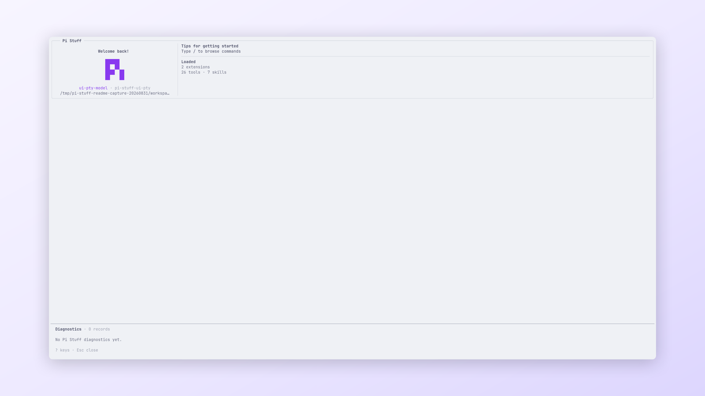

<!-- translation-source: docs/reports/README.md; translation-source-sha256: 7b3cdfd122afc826462735a6c90439bcbd5f47bff040e06d0820da283957e782 -->

# 报告

[English](../../../../../docs/reports/README.md)

这里保留 Pi Stuff 的验收、设计和性能证据。当前认证环境见[兼容性指南](../compatibility.md)，当前行为见
[文档索引](../README.md)。

  
   
  <em>Suite 诊断从当前进程提供范围明确的证据。</em>

## 基准与验收

- [Terminal-Bench 2.1 延迟比较](terminal-bench-2.1-pi-stuff-latency-2026-08-30.md)
- [Skill Discovery 启动有界确认](../../../../../docs/reports/skill-discovery-startup-bounded-confirmation-20260830.json)及其
  [预注册](../research/skill-discovery-startup-bounded-confirmation-20260830.md)
- [Skill Discovery 隔离确认](../../../../../docs/reports/skill-discovery-isolated-confirmation-20260830.json)及其
  [预注册](../research/skill-discovery-isolated-confirmation-20260830.md)
- [Skill Discovery 直接读取研究](../../../../../docs/reports/skill-discovery-direct-read-20260830.json)及其
  [预注册](../research/skill-discovery-direct-read-20260830.md)
- [Skill Discovery 确认](../../../../../docs/reports/skill-discovery-confirmation-20260830.json)及其
  [预注册](../research/skill-discovery-confirmation-20260830.md)
- [Skill Discovery 基准](../../../../../docs/reports/skill-discovery-benchmark-20260830.json)及其
  [预注册](../research/skill-discovery-benchmark-20260830.md)
- [ps-8z1 最终验收](ps-8z1-final-acceptance-2026-08-29.md)
- [Pi Stuff 0.3.0 最终验收](pi-stuff-0.3.0-final-acceptance.md)
- [Effect v4 采用基线](effect-v4-adoption-baseline-2026-08-30.md)

## 设计与迁移

- [单 Package 迁移](single-package-migration.md)
- [生命周期性能](pi-stuff-lifecycle-performance.md)
- [Context 提交并发](context-submit-concurrency-research-2026-08-14.md)

原始 JSON、ANSI、文本和图像证据与所属报告放在一起。历史版本、路径和哈希保持原样，便于确认当时的环境。
