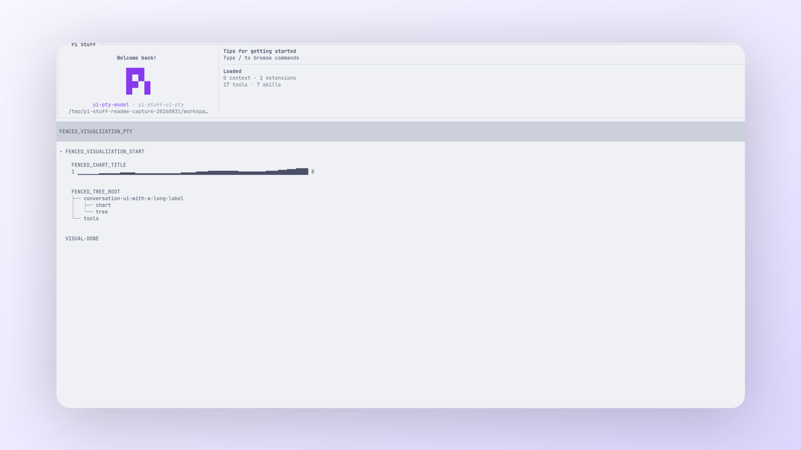

<!-- translation-source: docs/research/README.md; translation-source-sha256: 489cddad090561c6ccdbf871fd9792139d892ed2ca3578df22e6ded4bdfbc5c7 -->

# 研究

[English](../../../../../docs/research/README.md)

这里保留按日期记录的调查、测量、比较和设计输入，供以后复查。查看当前行为请从[文档索引](../README.md)开始。

  
   
  <em>使用真实 Pi 渲染，让界面研究始终对应实际交付的界面。</em>

## 架构与可行性

- [Code Mode 图像基准](code-mode-image-benchmark-20260827.md)
- [Skill Discovery 启动有界真实模型确认](skill-discovery-startup-bounded-confirmation-20260830.md)
- [Skill Discovery 隔离真实模型确认](skill-discovery-isolated-confirmation-20260830.md)
- [Skill Discovery 直接读取真实模型研究](skill-discovery-direct-read-20260830.md)
- [Skill Discovery 真实模型确认](skill-discovery-confirmation-20260830.md)
- [Skill Discovery 真实模型基准](skill-discovery-benchmark-20260830.md)
- [仓库代码量缩减](code-volume-reduction-20260823.md)
- [仅实时显示 Thoughts 的可行性](live-only-thoughts-feasibility-20260813.md)
- [Pi 最新 Markdown transform](pi-latest-markdown-transform-20260820.md)
- [Pi XDG base-directory 行为](pi-xdg-base-directory-20260811.md)
- [tmux/Kitty 图像可行性](pi-tmux-kitty-images-feasibility-20260815.md)

## 产品与界面参考

- [Agent 活动 UI](agent-activity-ui-reference.md)
- [Claude Code 分组与 Narrative Boundaries](claude-code-tool-grouping-narrative-boundary-20260826.md)
- [Claude Code Transcript 源码决策](claude-code-transcript-source-decisions.md)
- [Notification 能力](notification-capability-reference.md)
- [Operation Block 与 Tool Dialog 研究](pi-stuff-operation-block-dialog-study-20260829.md)
- [Pi Stuff Tool Activity 分类](pi-stuff-tool-activity-taxonomy-20260806.md)
- [Background Work 通知 UI](work-background-notification-ui-reference.md)
- [BTW UI](work-btw-ui-reference.md)
- [Todo UI](work-todo-ui-reference.md)

## 上游 Package 参考

- [Background Work Package](work-background-package-reference.md)
- [BTW Package](work-btw-package-reference.md)

每项研究都保留其快照对应的版本、路径和备选方案。已经丢弃的 harness 与重复调查留在 Git 历史中。
