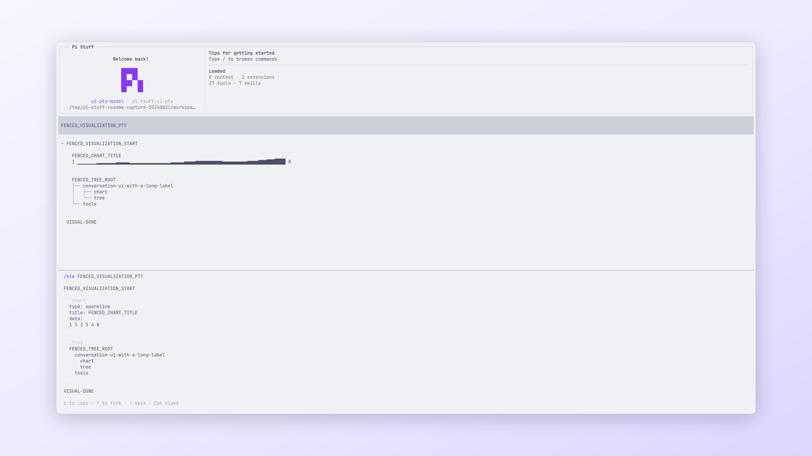

<!-- translation-source: packages/pi-stuff/src/btw/README.md; translation-source-sha256: 85e182a0bef6e6d2fe388f3deb7d37276c6e1325a92da2bfbb4786c8262900a0 -->

# BTW

[English](../../../../../../../packages/pi-stuff/src/btw/README.md)

在聚焦 dialog 中提出一个不使用 Tool 的支线问题，不改变主 conversation。

<p align="center">
  <a href="../../../../../../assets/readme/capabilities/btw.png">
    
  </a>
  <br>
  <em>BTW 在独立视图中回答支线问题，同时保留主 transcript。</em>
</p>

## 快速开始

```text
/btw Why did the typecheck fail?
```

阅读流式回答，再按 Escape 返回编辑器。使用 Left 和 Right 重看保留的回答，按 `c` 复制，或按 `f`
把 exchange 提升为新的 Pi Session。

## 亮点

- 使用 Pi 已完成、感知 compaction 的 context，并排除未完成 Assistant 输出。
- 在活动 model 上运行，使用独立 abort signal，不提供 Tool。
- 支线回答流式生成时，主 Agent 继续工作。
- 使用所属 Session 保存有界、不可见的 history。
- 把有用 exchange 提升为新 Session 中的普通 User 与 Assistant turn。
- 在任何终端宽度都使用一个响应式单栏 Command Dialog。

## 文档

- [BTW 指南](../../../../docs/capabilities/btw.md)
- [命令参考](../../../../docs/reference/commands.md#session-与支线问题)
- [Conversation UI 指南](../../../../docs/capabilities/conversation-ui.md)
- [共享 UI 契约](../../../../DESIGN.md)
- [上游参考](UPSTREAM.md)
