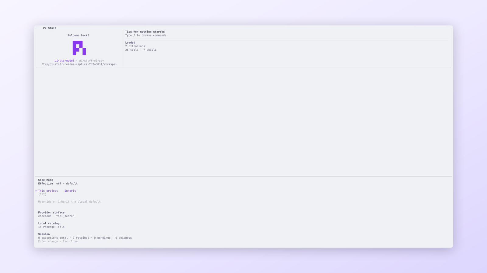

<!-- translation-source: packages/pi-stuff/src/code-mode/README.md; translation-source-sha256: ec6e766ab1db7de1a82ada9b140a11505d3f7854f6d73cd77901a12fb3c1ed33 -->

# Code Mode

[English](../../../../../../../packages/pi-stuff/src/code-mode/README.md)

在隔离 V8 host 中通过 JavaScript 组合活动 Pi Stuff Tool。

<p align="center">
  <a href="../../../../../../assets/readme/capabilities/code-mode.png">
    
  </a>
  <br>
  <em>Code Mode 在同一界面中展示项目策略和本地操作目录。</em>
</p>

## 快速开始

```text
/codemode on
```

Model 随后可以发现本地 catalog，并从 `codemode({ code })` 调用 `tools.*`。打开 `/codemode` 查看
有效策略、catalog、approval 与 Session ledger。

## 亮点

- 显式解析受信项目、全局、进程与 child-Agent policy。
- 阻止 sandbox 直接访问 Node、filesystem、process、network、module 与 credential。
- 保留每个 nested Tool 的 validation、permission、lifecycle、renderer 与 media behavior。
- 在有界 Session ledger 中记录稳定 execution 与 nested-call ID。
- 支持持久 approval、replay policy、rollback、checkpoint 与保存的 snippet。
- 只在第一次显式 execution 时安装和验证 pinned V8 helper。

## 文档

- [Code Mode 指南](../../../../docs/capabilities/code-mode.md)
- [命令参考](../../../../docs/reference/commands.md#code-mode)
- [设置参考](../../../../docs/reference/settings.md#codemode)
- [故障排查](../../../../docs/troubleshooting.md#codex-与-code-mode)
- [上游参考](UPSTREAM.md)
