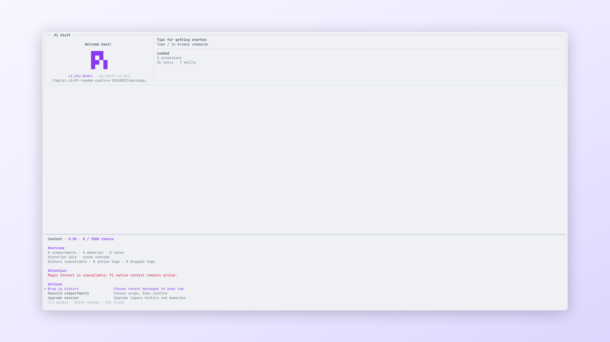

<!-- translation-source: packages/pi-stuff/src/context-management/README.md; translation-source-sha256: 90f243b8ac9ebe264a82f2b99403c302b1644b679c56e57a07965cb328aaa129 -->

# Context Management

[English](../../../../../../../packages/pi-stuff/src/context-management/README.md)

面向 Pi Session 的 Context 投影、检索、memory、note、compaction 与压力处理。

<p align="center">
  <a href="../../../../../../assets/readme/capabilities/context-management.png">
    
  </a>
  <br>
  <em>Context 状态和维护操作集中在一个对话框中。</em>
</p>

## 快速开始

```text
/ctx
```

Dialog 显示 Context 用量、compartment、memory、note、pending maintenance、Historian 状态、cache、history
token 和当前错误。

## 亮点

- 在编辑器就绪前激活已识别配置。
- 只有直接交互有权执行首次配置与迁移。
- 通过 `/ctx` 和持久 Context Activity 提供状态与维护。
- 在 Worker 中运行 Context engine，但不接管 Pi 的输入、Agent turn 或 Session 生命周期。
- 投影派生 context，同时保留 Pi Session JSONL 作为原始记录。
- Engine 不可用时退回 Pi 原生 context 与 compaction。

## 文档

- [Context Management 指南](../../../../docs/capabilities/context-management.md)
- [命令参考](../../../../docs/reference/commands.md#context)
- [故障排查](../../../../docs/troubleshooting.md#context)
- [架构](../../../../docs/architecture.md#生命周期所有权)
