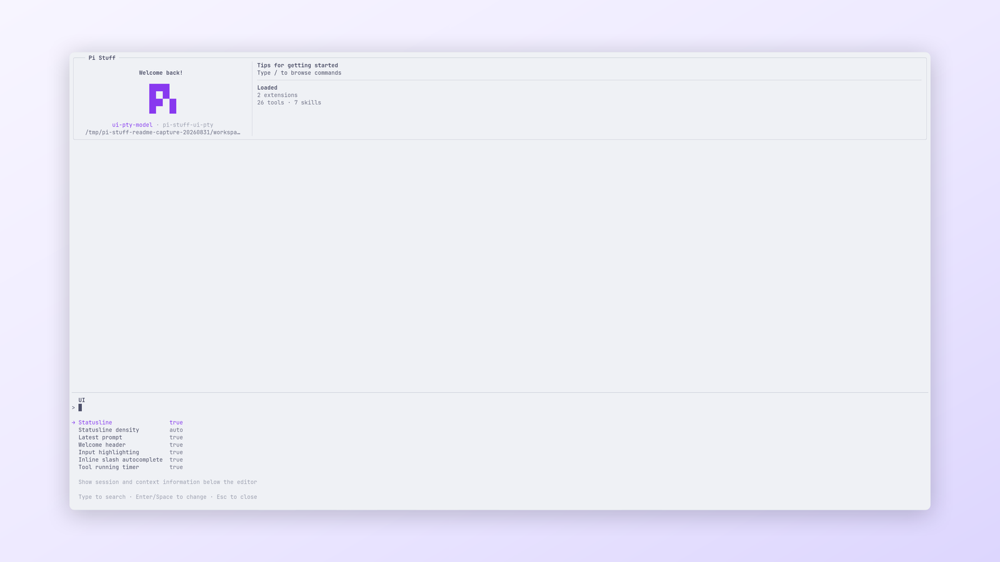

<!-- translation-source: packages/pi-stuff/src/conversation-ui/README.md; translation-source-sha256: 9bfbec8aa5fe0273cf273fe680cba7408c74316a99ba6b7beb6dd6710a0b70bf -->

# Conversation UI

[English](../../../../../../../packages/pi-stuff/src/conversation-ui/README.md)

Pi Stuff 面向 conversation、编辑器、Statusline、Welcome header 与聚焦 Command Dialog 的共享呈现层。

<p align="center">
  <a href="../../../../../../assets/readme/capabilities/conversation-ui.png">
    
  </a>
  <br>
  <em>UI 对话框集中配置 Statusline、prompt、欢迎卡片、高亮、补全和计时器。</em>
</p>

## 快速开始

```text
/ui
```

使用交互列表配置 Statusline、latest prompt、Welcome header、输入高亮、行内 slash 补全与 Tool running timer。

## 亮点

- 具有稳定 model、工作区、Context、用量、Goal 与 Ponytail 分组的响应式 Statusline；每个 settled Session
  leaf 与 model 的 context usage 只在 Host idle 时读取一次，因此 Tool 与输入 repaint 不会重新扫描它。
- Context 状态从 `recovering` 进入经验证的百分比；请求中止时显示 `unknown`。
- 单行 latest-prompt 预览与紧凑 Skill 标签。
- 原生编辑器输入高亮与 slash 补全；所有渲染行都不含 `/` 时，高亮跳过命令表相关工作，且不在重画之间缓存命令表内容。
- Host 拥有的 Thinking，显示为最新一条原生 Markdown 终端行或隐藏态 `• thoughts` 标签，保留原生鼠标和键盘
  可见性控制；并支持 `chart` 或 `tree` Markdown 投影。
- 关闭后恢复编辑器草稿的全宽 Command Dialog。
- 通过 `/diagnostics` 查看有界 Suite 诊断。

## 文档

- [Conversation UI 指南](../../../../docs/capabilities/conversation-ui.md)
- [设置参考](../../../../docs/reference/settings.md#ui)
- [命令参考](../../../../docs/reference/commands.md#界面与查看)
- [共享 UI 契约](../../../../DESIGN.md)
