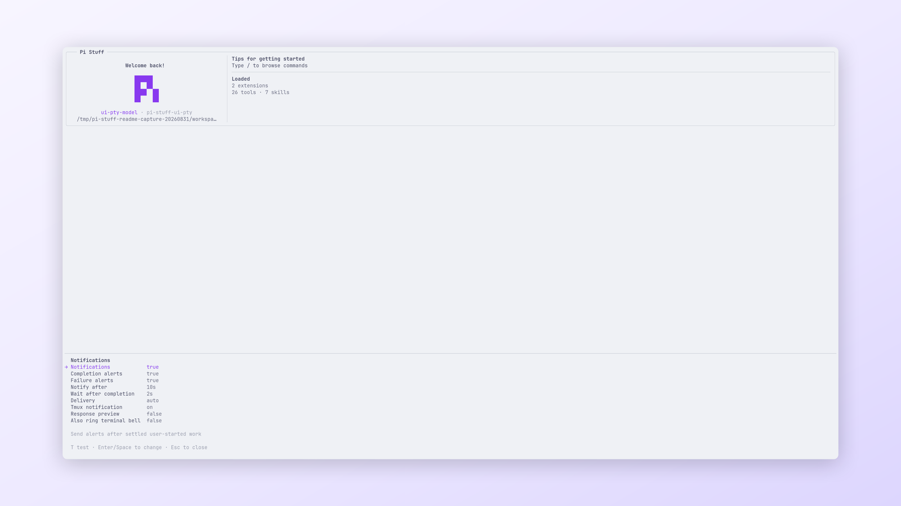

<!-- translation-source: packages/pi-stuff/src/notification/README.md; translation-source-sha256: 37d360b9c3b5ccf90b737ed946b257293010a2c88e9e07a95d10e6f659553708 -->

# Notification

[English](../../../../../../../packages/pi-stuff/src/notification/README.md)

有实质内容的用户启动 Agent 工作结算后，发送终端原生完成或失败提醒。

<p align="center">
  <a href="../../../../../../assets/readme/capabilities/notification.png">
    
  </a>
  <br>
  <em>通知策略可在 Pi 中明确配置并直接测试。</em>
</p>

## 快速开始

```text
/notifications
```

查看活动策略并发送测试通知。默认值要求 10 秒 Agent Work Duration，之后再经过 2 秒安静宽限期。

## 亮点

- 只在直接用户工作完全结算后提醒。
- 排除等待 Pi 输入或权限 prompt 的时间。
- 终端活动或新工作恢复时取消待发送提醒。
- 选择 Kitty OSC 99、Ghostty OSC 777、OSC 9 或 BEL delivery。
- 支持 tmux passthrough，并独立控制 attention BEL。
- 默认关闭 response preview。

## 文档

- [Notification 指南](../../../../docs/capabilities/notification.md)
- [设置参考](../../../../docs/reference/settings.md#notification)
- [故障排查](../../../../docs/troubleshooting.md#通知)
- [命令参考](../../../../docs/reference/commands.md#界面与查看)
