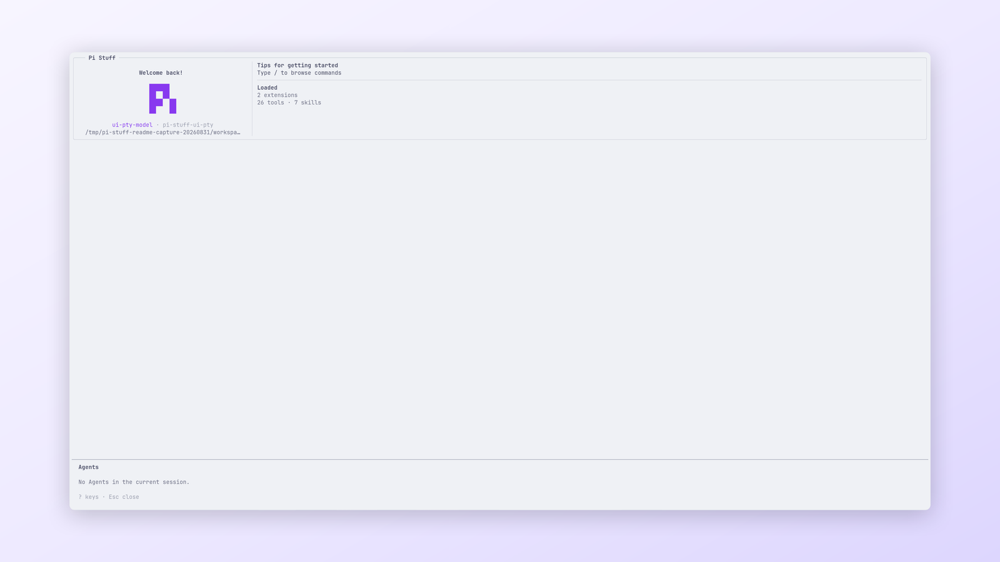

<!-- translation-source: packages/pi-stuff/src/subagents/README.md; translation-source-sha256: 81675094ad7ba0a0d65a3592a0ebcb684e6c721da9066e1f8e9cf367a64279fd -->

# Agents

[English](../../../../../../../packages/pi-stuff/src/subagents/README.md)

把有界工作委派给命名 child Agent，默认在后台执行，并通过一个界面管理生命周期。

<p align="center">
  <a href="../../../../../../assets/readme/capabilities/subagents.png">
    
  </a>
  <br>
  <em>Agents 对话框让委派工作保持在当前 Session 范围内。</em>
</p>

## 快速开始

使用 `subagent` Tool：

```json
{
  "agent": "general-purpose",
  "description": "Inspect parser",
  "task": "Find the parser boundary and report exact source evidence."
}
```

启动后继续独立工作。打开 `/agents` 检查、steer、stop、resume 或查看保留结果。

## 亮点

- 按明确优先级发现项目、用户与 Package Agent 定义。
- 支持单个 Agent、并行 grouped task，以及 status 或生命周期 control call。
- 默认后台运行；前台模式会等待结果。
- 送达紧凑 completion，不主动启动另一轮主 Agent。
- 应用并发、总 launch、嵌套、turn、Tool 和时间限制。
- 保存 Session-owned artifact，并保留已修改的隔离 worktree 供检查。

## 文档

- [Agents 指南](../../../../docs/capabilities/subagents.md)
- [命令参考](../../../../docs/reference/commands.md#工作控制)
- [Background Work 指南](../../../../docs/capabilities/background-work.md)
- [Tool Display 指南](../../../../docs/capabilities/tool-display.md)
- [上游参考](UPSTREAM.md)
