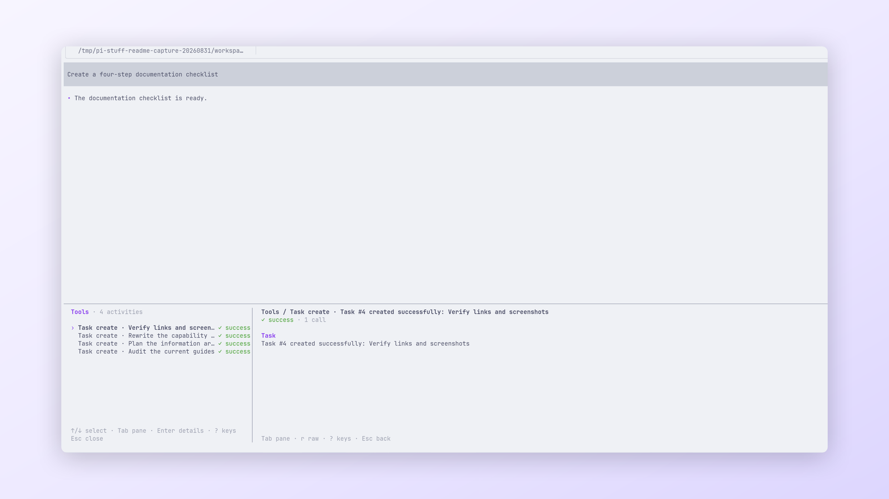

<!-- translation-source: packages/pi-stuff/src/tool-display/README.md; translation-source-sha256: f2db5b60864766034c53f6559d0b048330887fc2ff53ba0667ce9a314401ddc5 -->

# Tool Display

[English](../../../../../../../packages/pi-stuff/src/tool-display/README.md)

在 transcript 中紧凑显示 Tool activity，需要时仍可查看完整详情。

<p align="center">
  <a href="../../../../../../assets/readme/capabilities/tool-display.png">
    
  </a>
  <br>
  <em>Tool 活动在左侧提供紧凑状态，在右侧显示选中项详情。</em>
</p>

## 快速开始

连续运行几个 Read、Grep、Find 或 List 操作，再按 `Ctrl+O` 或打开：

```text
/tools
```

选择 Retrieval Group 或 Tool Activity 并按 Enter。按 `r` 在 Formatted 与 Raw detail 之间切换。

## 亮点

- 把连续检索合并为一个有序摘要行。
- 为 Bash、文件修改、Background 工作、Agent 与失败提供不同语义行。
- 保留失败、拒绝、取消和空结果供检查。
- 后续调用成功时，仍把之前的失败保留为历史事实。
- 通过 `Ctrl+O` 按来源顺序恢复展开 activity。
- 通过 `/tools [id]` 打开有界、可搜索的 activity 视图。
- 在 `/ui` 中启用后，为长时间运行的活动 Tool 显示经过时间。

## 文档

- [Tool Display 指南](../../../../docs/capabilities/tool-display.md)
- [Conversation UI 指南](../../../../docs/capabilities/conversation-ui.md)
- [命令参考](../../../../docs/reference/commands.md#界面与查看)
- [共享 UI 契约](../../../../DESIGN.md)
