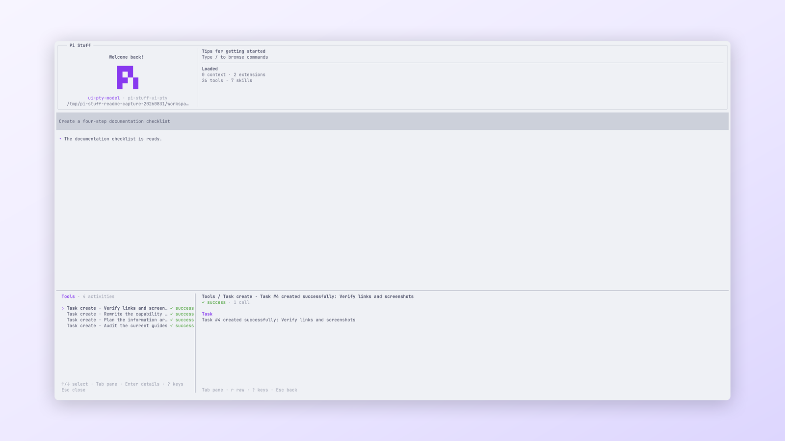

<!-- translation-source: packages/pi-stuff/src/web/README.md; translation-source-sha256: cd7424420f15954e707578ab7d6c3814df7e734acd5ac808c07f3728fc160904 -->

# Web

[English](../../../../../../../packages/pi-stuff/src/web/README.md)

通过三个 model-facing Tool 提供搜索、公开 HTTP 提取与有界 continuation。

<p align="center">
  <a href="../../../../../../assets/readme/capabilities/web.png">
    
  </a>
  <br>
  <em>Web 调用与 Suite 的其他 Tool 共用同一套可检查活动界面。</em>
</p>

## 快速开始

```json
{ "query": "Pi coding agent extension API" }
```

用 query 调用 `web_search`，用选定公开 URL 调用 `fetch_content`；需要更多内容时，把返回的
`responseId` 传给 `get_search_content`。

## 亮点

- 通过显式或自动 provider 路由搜索一到四个 query。
- 获取 readable 或 raw HTTP 内容、图像、PDF 与有界 GitHub 数据。
- 按片段或匹配段落继续保存结果。
- 应用 URL、domain、redirect、credential 与 SSRF 保护。
- 最多恢复一小时内有效的 Session result entry。
- 不让显式付费 provider 进入自动与 `all` 路由。

## 文档

- [Web 指南](../../../../docs/capabilities/web.md)
- [设置参考](../../../../docs/reference/settings.md#web)
- [Runtime 安全](runtime/SECURITY.md)
- [Runtime 契约](runtime/README.md)
- [上游参考](UPSTREAM.md)
