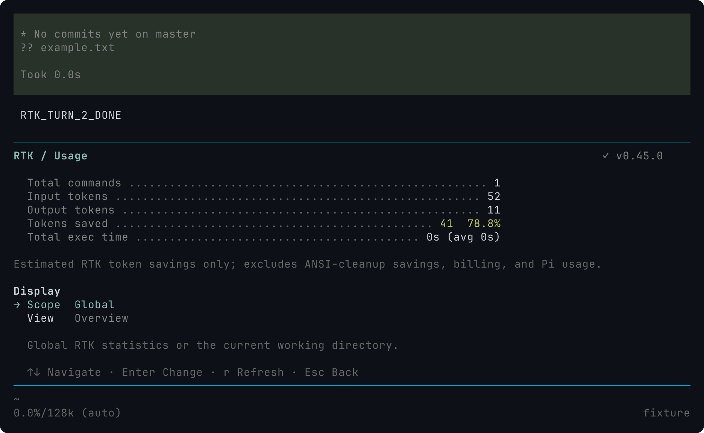

# RTK 集成

[English](../../rtk.md) · 英文为规范版本.

Pi Stuff 使用 RTK 改写支持的模型 Bash 命令并过滤输出, 另行清理最终工具结果文本中的 ANSI 控制码. 两个设置相互独立. 命令执行、取消、错误结果、流式输出和长输出截断仍由 Pi 管理.

## 配置

按[网页访问](web-access.md#加载开发版扩展)加载源码扩展, 然后打开 `/rtk`. Settings 包含 Command rewrite、ANSI cleanup 和 Executable. 两个开关默认开启. 自动发现先检查 Pi 进程 PATH, 再在当前工作目录通过 mise 查询 RTK, 不修改 PATH 或加载 shell profile.

设置与网页访问配置一起保存在 Pi agent 目录下的 `pi-stuff.json`. RTK 部分可省略:

```json
{
  "rtk": {
    "rewrite": true,
    "ansi": true,
    "executable": "/absolute/path/to/rtk"
  }
}
```

省略 `executable` 表示自动发现. 自定义路径必须是绝对路径, 空格和 shell 特殊字符按路径字面值处理. Pi Stuff 会探测可执行文件, 不只看文件名. 自定义路径无效时不会静默换用其他安装.

面板保存成功后立即影响后续操作, 并跨重启保留. Pi Stuff 写好临时文件后, 会在替换前再次核对加载时的内容和符号链接目标. 检测到外部修改时报告冲突, 使用 `/reload` 后重试. 锁会串行化 Pi Stuff 的保存, 但无法阻止其他编辑器在最后一次检查与替换之间写入; 避免同时从两个入口保存. 原子替换保留无关设置和现有符号链接, 不暴露半写文件. 保存被中断可能在解析后的配置文件旁留下 `.lock` 文件. 手动删除陈旧锁前, 先确认没有 Pi Stuff 保存操作在运行, 然后 reload. 不要删除其他会话正在使用的锁.

发现结果会缓存. 更新 RTK 安装后, 修改可执行设置或使用 `/reload`. RTK 缺失时, 普通 Bash 和独立 ANSI 清理仍可用.

## 面板

`/rtk` 打开 Settings、Usage 和 Diagnostics 的内联列表, 使用 Pi 主题、列表和选择键. Escape 从详情返回列表, 再返回编辑器. RTK 扩展不增加底部状态栏. 版本旁的对勾表示可执行探测成功, 运行详情保留文字状态.

直接命令及补全:

- `/rtk integration`: Settings.
- `/rtk gain`: Usage.
- `/rtk diagnostics`: 可执行发现与故障详情.
- `/rtk refresh`: 打开 Usage 并读取当前统计.
- `/rtk help`: 命令帮助.

Usage 提供 Overview、Daily、Weekly、Monthly、History 和 Failures. `r` 刷新或重试. 返回会取消临时查询, 查询失败不关闭 rewrite. 窄布局支持 56 列 26 行; 更小终端显示尺寸提示并保留退出动作.

Diagnostics 只读显示已解析的可执行文件、探测信息、本次扩展生命周期最近一次集成 rewrite 故障和 RTK 原生配置. Pi Stuff 不编辑 RTK 配置、信任设置、遥测、hook 或统计数据库.

下方 [100x30 截图](../../assets/rtk/usage.png)和 [56x26 截图](../../assets/rtk/usage-narrow.png)来自编译 Pi 0.85.1 与原生 RTK 0.45.0, 展示隔离 fixture 仓库执行 `git status` 后的结果. 数值只属于这一条命令, 不是通用压缩率基准. 这些是渲染后的 Terminal Control 抓取, 不是原生桌面截图.

导出使用 Pi 当前深色配色, 字体栈为 `JetBrainsMono Nerd Font Mono, Symbols Nerd Font Mono, LXGW WenKai Mono`.



## 统计含义

Usage 显示 RTK 对原始和过滤后命令输出 token 的估算, 不表示供应商账单、精确模型上下文、Pi 会话专属用量或 Pi Stuff ANSI 清理收益. Global 可以包含其他应用使用同一 RTK 数据库产生的记录. Project 沿用 RTK 当前工作目录范围, 不单独聚合 Git 根目录.

RTK 0.45.0 支持摘要和日/周/月 JSON. History 的 JSON 模式没有历史列表, 因此 Pi Stuff 读取原生文本历史; 该接口只提供最近记录, 命令名也可能已被截断. Failures 是全局文本报告, 面板不能暗示它已按项目过滤. 这些是原生解析/fallback 故障, 与 rewrite 准备错误和普通命令失败不同. 未识别格式会报告失败, 不显示成零统计.

## 执行与恢复边界

不支持的命令原样执行. 非取消的发现或 rewrite 准备错误也保留原命令并记录诊断. 已取消请求不执行 raw fallback.

命令开始执行后, Pi Stuff 不因非零退出、超时或过滤失败而重跑. RTK 可能有自己的内部 fallback, 仍归 RTK 管理. 无法安全绑定绝对路径的 shell 形式会绕过改写.

ANSI 清理修改最终文本块, 包括错误文本, 保留其他内容和结果元数据. 它不重写流式更新或 Pi 保留的完整输出文件. Pi 截断提示和完整输出路径仍可用. RTK 之后不再运行摘要、去重或自定义行筛选算法.

手工 `!` 和 `!!` 不属于自动改写范围. 安装升级 RTK、原生 hook 设置、统计重置/导出和其他 RTK 面板不在本集成范围内.

## 兼容性与回退

验收目标为 Linux、Bun 1.4.0、Pi 0.85.1 和 mise 管理的 RTK 0.45.0. 其他版本和平台需另行验证, RTK 输出格式也可能独立变化.

停用优化可关闭两个开关. 回退到此功能之前的 Pi Stuff 版本前, 删除 `pi-stuff.json` 的 `rtk` 部分, 保留其他字段; 旧版严格配置解码器会拒绝未知部分. 回退代码不会撤销已保存设置或 RTK 原生统计.
