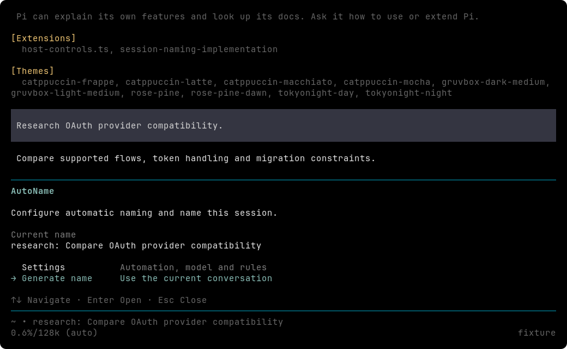
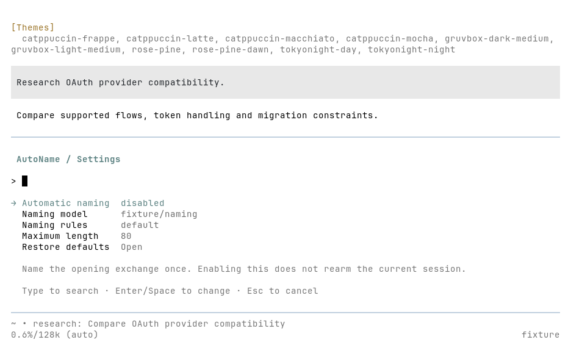
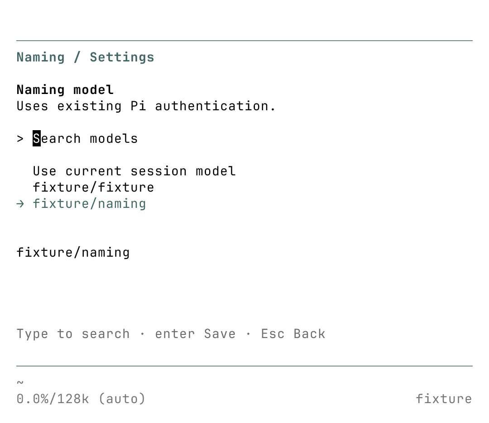
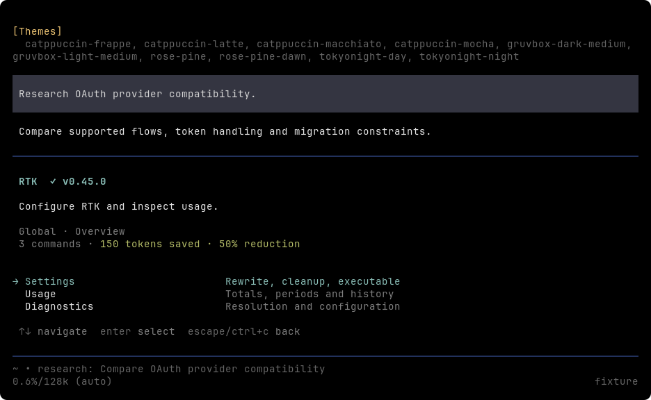
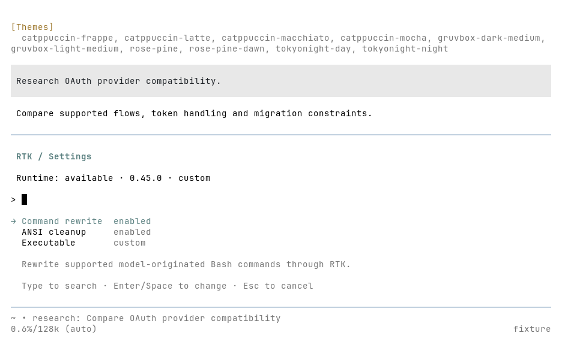
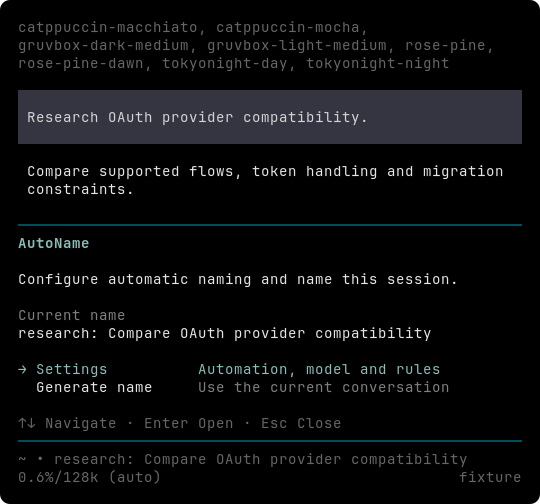
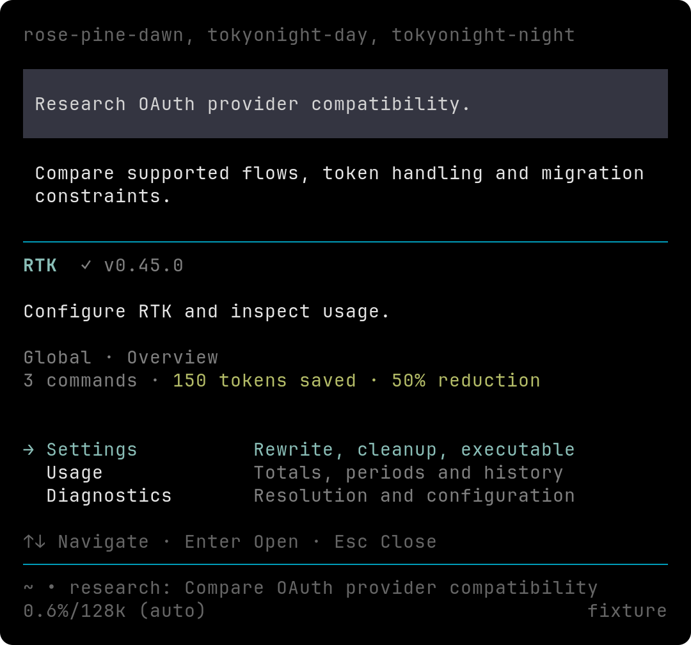

# 会话命名

[English](../../session-naming.md) · 英文版为准.

Pi Stuff 会在新建前台 TUI 会话的首次成功问答后尝试命名一次, 后续轮次不再改名. 首轮取消、失败或含义不明时会保持未命名, 等待手动处理.

Pi 原生 `/name Exact title` 用于直接赋名. `/autoname` 根据开场请求和最近对话生成替代名称; `/autoname Document OAuth migration risks` 提供优先于对话的任务提示. 一旦接受生成请求, 该会话就永久停止自动命名, 即使生成失败也一样. 新命令会取代尚未完成的请求.

生成期间没有进度提示, 成功后只更新原生会话名称. 错误使用 Pi 原生聊天区提醒. 名称尚未落盘时, 唯一与成功相关的提醒是 `Name not saved yet.`. Print/JSON 命令会等待完成并将反馈写入 stderr, 保持 JSON stdout 可供机器解析. 自动请求在后台安静运行. 旧结果不能覆盖后来的直接改名、导航或新生成. 名称属于整个会话, 各分支共用.

## AutoName 面板

在 TUI 中执行 `/autoname panel`, 可以查看当前名称、修改设置或生成替代名称. Settings 是首个菜单项. Generate name 直接根据当前对话生成并应用, 不再先进入 hint 页. 空白对话保持未命名, 不调用模型. 关闭面板或进入 Settings 会取消面板启动的未完成请求, 保留已经应用的名称. 仅打开面板不消耗开场自动机会. 完整参数 `panel` 保留给面板入口, 其他 `/autoname` 文本仍作为可选任务提示.

设置逐项保存并立即生效:

- **Automatic naming** 开关控制开场自动命名. 启用不会恢复当前会话的自动机会.
- **Naming model** 搜索 Pi 已有认证的模型, 不改变对话模型. 选择 `Use current session model` 清除独立模型配置. 已配置但不可用的模型仍可查看; 生成失败时不回退.
- **Naming rules** 使用 Pi 多行编辑器修改完整规则. `Use default` 恢复内置英文规则.
- **Maximum length** 接受正整数. `Use default` 恢复 80 码点.
- **Restore defaults** 确认后重置命名设置, 保留当前名称.

配置提交成功会取消旧命名请求, 不重试. 保存失败则保留生效配置和未完成请求. 不覆盖外部文件修改, 需先 `/reload` 再重试. 已确认的设置会保存; Esc 放弃未提交文本, 不撤销已经开始的保存. 会话替换或 reload 会等待已确认的保存结束, 再为新 runtime 加载设置.

面板沿用 Pi 主题、原生选择和输入按键. 即使重新绑定 cancel, Esc 仍用于返回或关闭. 长名称和模型标识符可用 `[` / `]` 翻页. 最小尺寸为 56 列、24 行, 更小终端显示尺寸提示并保留退出方式. AutoName 与 RTK 共用标题边框、菜单列宽间距、设置和编辑页布局、按键提示, 以及 Pi 内置浅色主题的局部对比度修正. 各功能分别管理操作、请求和保存生命周期, 不修改自定义主题.

## 配置

在 Pi agent 目录现有的 `pi-stuff.json` 中添加 `naming`, 然后执行 `/reload`. 省略的字段使用默认值:

```json
{
  "naming": {
    "automatic": true,
    "model": {"provider": "openai-codex", "id": "gpt-6-astra"},
    "maxLength": 80
  }
}
```

`model` 可省略. 省略时每次请求使用当前会话模型; 配置后, Pi 使用指定的 provider/model 和已有认证. 模型或认证不可用时直接失败, 不自动换模型. 示例不代表成本推荐.

将 `automatic` 设为 `false` 后, 仅通过 `/autoname` 或面板手动生成. `prompt` 替换命名风格指令, 支持其他语言和格式. 例如:

```json
{
  "naming": {
    "automatic": false,
    "prompt": "用中文简洁描述当前主任务, 保留技术标识符, 不写进度.",
    "maxLength": 40
  }
}
```

默认风格为英文 `type: Action object`, 类型为 `research`、`feat`、`fix`、`refactor`、`docs` 或 `chore`. 描述优先采用 4-8 个单词, 保留标识符大小写, 省略日期、括号 scope 和进度. 例如 `research: Compare OAuth provider compatibility`. 这是模型指引, 不保证语义总是准确. 即使替换风格, 用户请求也优先于助手的错误理解.

`maxLength` 独立生效, 是按 Unicode 码点计数的正整数. 空白、多行、含控制字符或过长的输出直接失败, 不截断也不调用模型修复. 空白 prompt/model 标识符和无效配置使用包现有的配置错误提示. 文件修改在 `/reload` 后生效, 面板保存立即生效. 两条路径都不会改名或恢复已有会话的自动机会.

## 适用范围与持久化

自动命名支持 regular/fullscreen TUI: 必须是新的原生会话文件, 没有已有对话、名称或 parent 链接. resume、import、reload、fork、已有空文件、非持久化会话和 RPC/JSON/print 启动均跳过. 首轮排入另一个用户请求时, 开场无法安全识别, 也会跳过. 内部工具调用及其续接仍属于首次问答.

Pi 扩展 API 没有通用的子代理标志. 将子代理伪装成普通前台 TUI 的第三方启动器必须关闭自动命名; 这种启动方式不在支持范围内.

空白会话的名称可能只保留在内存, 直到一次助手问答触发 Pi 正常持久化. 命令提示 `Name not saved yet.`, 面板显示 `Not saved yet` 并解释第一次助手回复会保存名称. 立即退出可能丢失名称, 完成一次问答则会保留. 使用 `--no-session` 时存储被禁用, 即使收到回复名称也仍是临时的, 面板会说明这一点. Pi Stuff 不强制写历史, 也不维护单独的名称数据库.

## 请求限制

自动输入包含原始开场请求和最终可见助手回答, 上限 2,000 码点. 手动输入上限 4,000 码点. 有提示时优先使用提示; 无提示时保留开场意图和最近的用户/助手文本. 长文本保留两端并标记省略部分. 排除工具、思考、图片、进程消息和加载的 skill 指令. 助手可能引用这些内容, 因此按角色过滤不构成保密保证.

每次尝试有 15 秒本地截止时间, 只调用一次生成, 没有扩展级重试、换模型、额外摘要或分类调用. 取消只影响命名. 支持的客户端关闭重试; 输出预算为 `min(model.maxTokens, 1024, max(64, 2 × maxLength))`, 默认 160 tokens. 风格 prompt 和请求框架在对话限制之外. 分词、provider 强制思考和网络行为使精确统一的费用上限无法保证.

Pi 0.85.1 API 映射请求 SSE、`maxRetries: 0` 和有限的 `maxTokens`. OpenAI completions/responses 使用适配器默认的关闭思考映射; Anthropic 接收 `thinkingEnabled: false`; Google 接收 `thinking.enabled: false` (Gemini 3 使用最低支持的思考级别); Codex 在支持时请求不思考, 否则请求 minimal. Provider 可能忽略输出或重试控制: 已检查的 Codex Responses 适配器不会把 `maxTokens` 写入请求体. 这些是本地限制, 不保证所有 provider 消耗相同的 tokens. Abort 也不能收回远端已经消耗的 tokens.

测试使用真实隔离的 Pi 命令、生命周期和原生会话文件, 只控制 HTTP 模型服务. 规格、运行时验收、真实模型名称样本及审查证据见 [Issue #108](https://github.com/jczhang02/pi-stuff/issues/108).

## 验收证据 (2026-09-22-23)

运行环境为 Linux、Bun 1.4.0、固定依赖中的 Pi 0.85.1, 以及维护者的编译版 Pi 0.87.0 (宿主实际报告 Bun 1.4.0). Terminal Control 1.2.1 驱动真实 regular/fullscreen 会话, 设置、会话文件和工作目录均隔离. 受控模型验证请求数、错误、截止时间、导航竞态、fork、reload/重启、预检失败和 compaction 队列回放. 只读会话文件和 Linux `/dev/full` 用于验证原生写入失败. 扩展会提前检查已知不可写文件; 如果 Pi 实际写入时仍意外失败, 显示的名称可能已经改变但尚未保存. 扩展会要求修复文件访问后带该会话重启再继续, 不再追加一次改名来补偿: Pi 在写入前就推进了内存历史, 第二次写入可能将断开的父链保存到磁盘. 恢复测试会重新打开修复后的文件, 检查原有消息和父链.

离线检查使用 `bun run check` 和 `bun run test`. 重复编译版命名验收时, 将 `PI_TEST_HOST` 设为编译版可执行文件, 执行 `bun test tests/system/naming*.test.ts`. 真实账号测试独立于离线测试集.

下列 8 个名称来自编译版宿主中的真实 `openai-codex/gpt-6-astra` 请求, 使用最终 prompt 和人工构造的对话. 6 次开场请求在终端观察中耗时 2.7-6.0 秒, 包含观察开销. 未测量实际 tokens 和费用. 较早的 prompt 曾出现一次遗漏冒号, 默认指令现已明确要求分隔符. 这组小样本支持任务相关性、标识符保留和格式判断, 不构成统计可靠性保证.

| 输入意图                                                    | 生成名称                                                               |
| ----------------------------------------------------------- | ---------------------------------------------------------------------- |
| 调研 OAuth 兼容性; 助手误称已实现                           | `research: Compare existing providers for OAuth compatibility`         |
| 实现 Pi 命名并补测试/文档; 助手讨论前期调研                 | `feat: Add configurable Pi auto session naming extension`              |
| 修复重复支付回调                                            | `fix: Prevent double charges from duplicate payment callbacks`         |
| 重构 RTK, 不改变行为                                        | `refactor: Restructure RTK command rewriting without behavior changes` |
| 编写 Exa key 设置和排障文档                                 | `docs: Document Exa API key setup and troubleshooting`                 |
| 更新固定 Bun 版本和 lockfile                                | `chore: Update pinned Bun version and regenerate lockfile`             |
| 主任务改为 OAuth 风险文档后执行 `/autoname`                 | `docs: Document OAuth migration risks only`                            |
| `/autoname Fix session rename races in Pi` 优先于之前的对话 | `fix: Resolve session rename races in Pi`                              |

面板测试覆盖逐项保存和重置、多行规则、无效长度、拒绝外部修改冲突、保存成功后取消旧请求、关闭面板取消、按键重映射、持久化状态刷新及长值分页. 下图来自编译版 Pi 0.87.0 和本地受控模型, 通过真实命令在 100×30、56×26 与 56×24 终端中取得. RTK 对照图使用本地可执行 fixture 和人工构造的统计. 图中名称由 fixture 返回, 与上面的真实模型样本分开记录.

紧凑 AutoName 首页的 100×30 和 56×26 截图已用编译版 Pi 0.87.1 更新. 短名称按实际行数显示, 缺省保存或错误提示不占位, 长名称翻页保持高度稳定. 此次修改在 Pi 0.85.1 通过 10 项定向测试, 编译版 Pi 0.87.1 通过 16 项, 覆盖共用布局、保存状态变化和面板取消. 其他截图保留上面的 Pi 0.87.0 证据.

浅色终端的默认前景/背景为黑/白, 深色为黑底浅色文字. 导出明确使用 `JetBrainsMono Nerd Font Mono, Symbols Nerd Font Mono, LXGW WenKai Mono`. 这些是无窗口终端截图, 不代表原生窗口或合成器体验.







下方 RTK 界面由同一套共享组件渲染. 功能摘要各异, 标题、菜单列、设置分组和按键提示使用共同布局.








