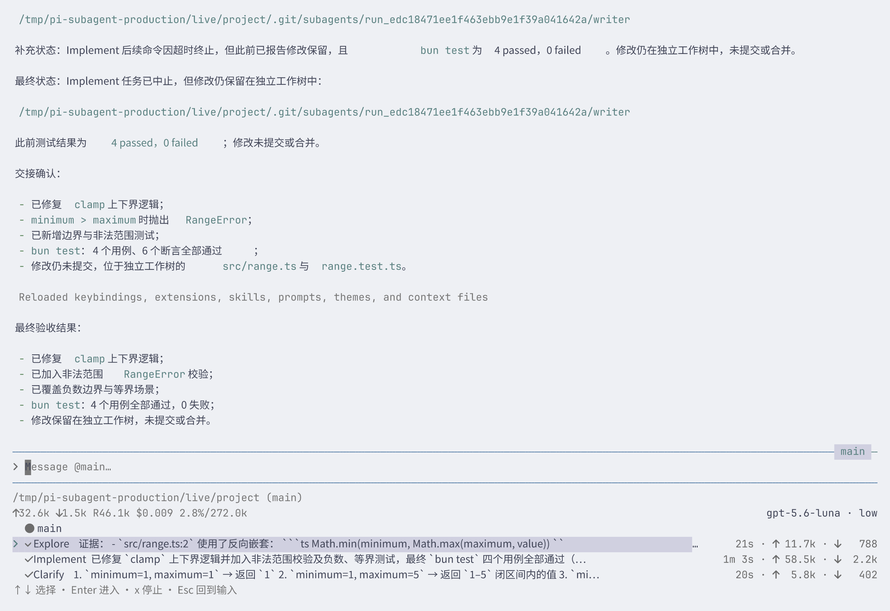
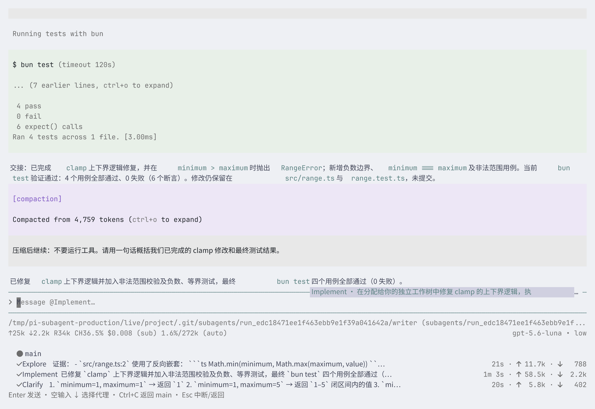
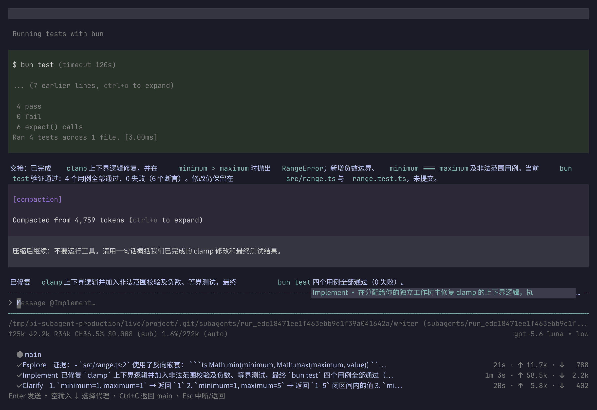
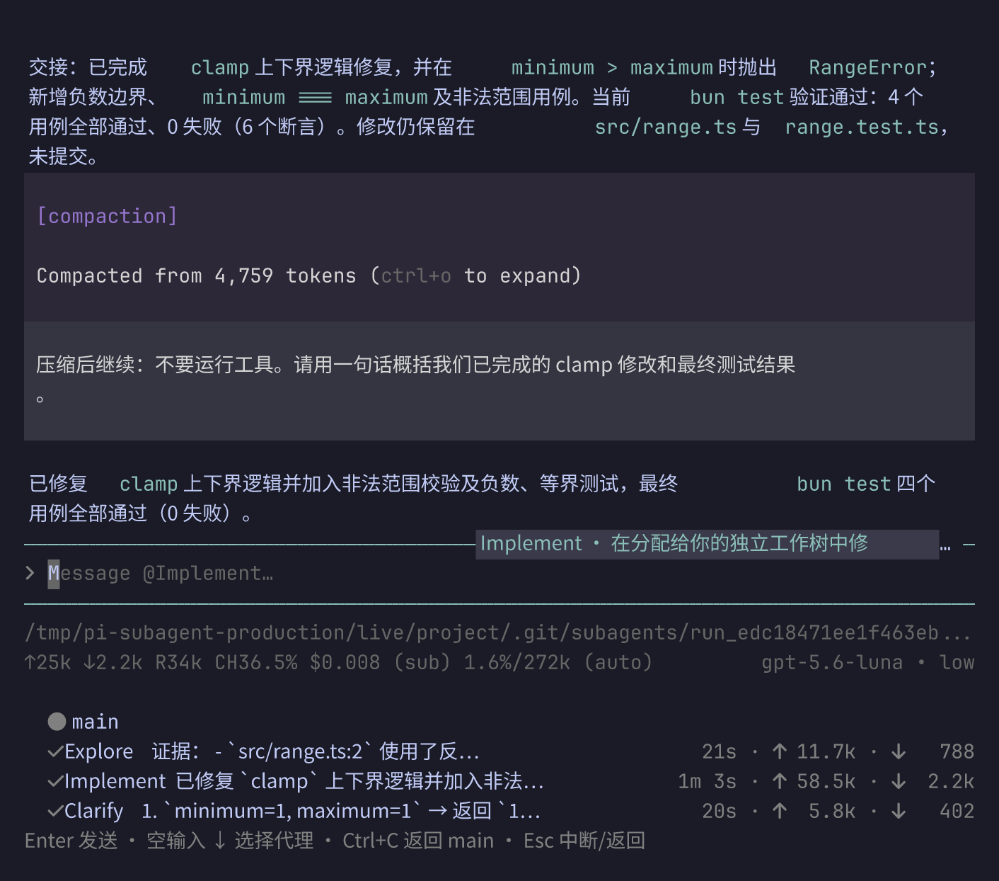

# Subagent 验证记录

[English](../../subagent-verification.md) · [使用指南](subagents.md)

本文记录 [#55](https://github.com/jczhang02/pi-stuff/issues/55) 的正式实现验证。测试使用正常 Pi 进程加载 `src/pi/index.ts`、独立子代理 SDK 会话和真实工具执行。截图没有使用原型宿主或模拟对话。

## 环境与复现

验收环境为 Linux、Bun 编译版 Pi `0.85.1`、Bun `1.4.0` 和 tuistory `0.11.0`。终端使用 `TERM=xterm-256color`、`COLORTERM=truecolor`、Pi 浅色／深色主题和 Nerd Font。截图由 tuistory 的终端渲染器生成，前景与背景设置匹配对应终端；这些是截图设置，没有修改截图中的界面图像。

离线测试隔离项目、Git 仓库、代理设置、会话、模型服务和 worker：

```bash
bun run check
bun run test
PI_TEST_HOST=/absolute/path/to/compiled/pi bun test tests/system
```

默认 system 测试使用 Bun 运行已安装的 Pi CLI，`PI_TEST_HOST` 选择编译后的可执行文件。确定性 provider 只替代远端模型 HTTP 边界；注册、运行时、会话文件、工作树、工具和 TUI 均使用正式实现。清理只停止该测试拥有的进程与临时目录。

真实模型测试使用已配置的 `openai-codex/gpt-5.6-luna`、`low` 推理、隔离 agent 目录，以及一个已提交的小型 TypeScript 项目。不公开凭证和完整会话记录。提取的计数与检查结果见 [live-results.json](../../evidence/subagents/live-results.json)。

## 真实开发过程

1. 主代理并行启动三个子代理：Explore 检查错误的 `clamp`，Implement 在独立工作树修改并运行 `bun test`，Clarify 用 `ask_parent` 询问非法上下界约定。子代理执行时主代理读取 README。本轮由主代理自动回答 Clarify；用户在子代理界面直接回复另由离线 TUI 测试验证。
2. 进入 Clarify 并发送第二条提示后，继续的是原会话。返回 main 时保留主代理对话和后台结果通知。
3. `/reload` 后进入 Implement，恢复此前的工具调用和修改 diff。第二轮要求补充 `RangeError` 校验和相等边界测试；执行中追加负数边界用例。该引导消息保存在同一个子代理会话中。
4. 真实 Bash 命令打印 `CANCEL_SECOND_READY` 后等待。Esc 在约 0.2 秒内中断命令。保存的工具结果包含 `Command aborted`，没有延迟输出 `UNEXPECTED_END`；其他子代理仍保持完成状态。
5. 取消后续聊使用同一个 Implement 会话和工作树，四个测试再次通过。在其工作树独立执行 `bun test` 也得到四个测试、六个断言通过。主工作树保持干净，两侧 HEAD 提交相同，子代理的修改没有自动提交。
6. 普通保留设置下手动 `/compact` 首先提示会话过小。将隔离测试设置中的 `keepRecentTokens` 设为 1000 后，实际压缩了 4,759 tokens。仍可向上翻阅旧工具调用，摘要使用 Pi 原生可展开组件；压缩后的新提示正确概括了原先修改。计数包含此次压缩用量。
7. Pi 正常退出后，新进程以深色主题重新打开原主会话，恢复 Fleet、子代理历史和压缩记录。未知子代理命令保留草稿，返回 main 再进入也不丢失。80 列界面仍对齐名称、活动、时间及输入输出 token。

Implement 在同一个子代理会话内累计七条用户消息和一次压缩。主代理保存了十二条 subagent 通知，全部为 `display: false`。保留的子代理费用是 SDK 报告值，不作为账户实际账单。

## 实际界面

Fleet 位于主代理 statusline 下方，当前有一行获得选择焦点：



子代理使用 Pi 消息／工具组件，并在 editor 边框标示自己的身份：



以深色主题恢复同一个会话：



80 列时截断活动文本，统计列仍对齐：



## 证据边界

这些结果适用于上述 Linux／Bun／Pi 环境及已配置的 Codex 模型，不能据此声称支持 Windows／macOS、Node 宿主、任意 provider 或任意自定义 footer。Pi 的公开 footer API 只允许一个拥有者，使用指南中的组合限制仍然存在。子代理查看器支持指南列出的命令，没有嵌入 Pi 的整套命令分发器。

PR 记录最终检查计数、比较提交、独立标准／需求审查、修正与验收边界。截图或模型回答成功本身不能证明取消和恢复机制正确。
