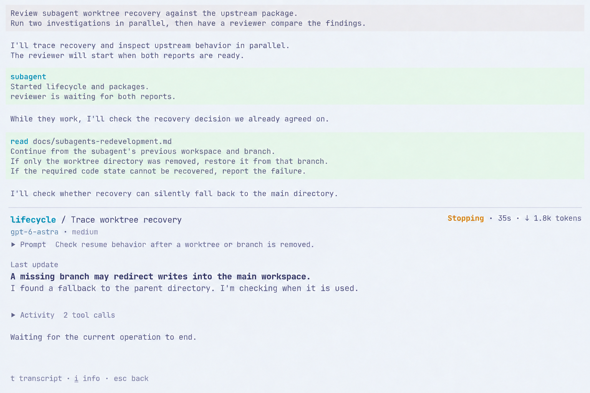
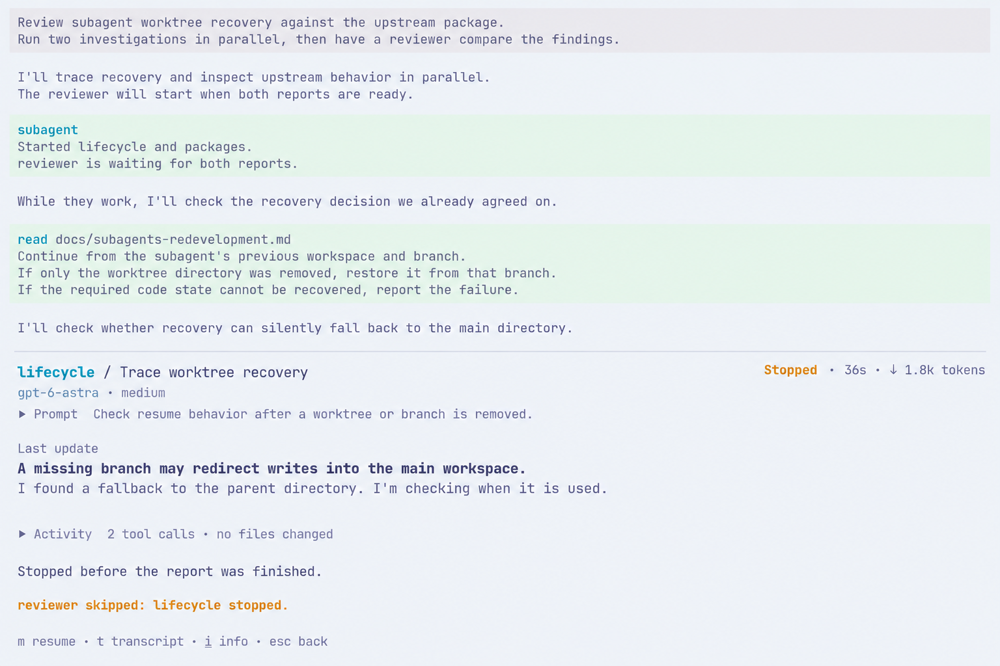
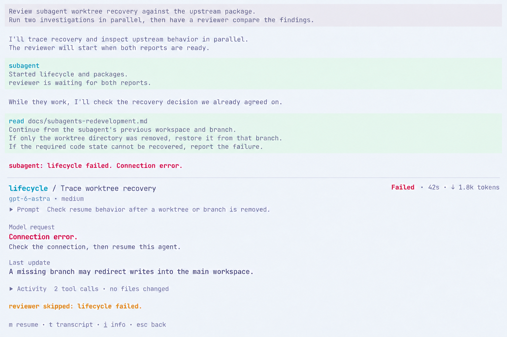
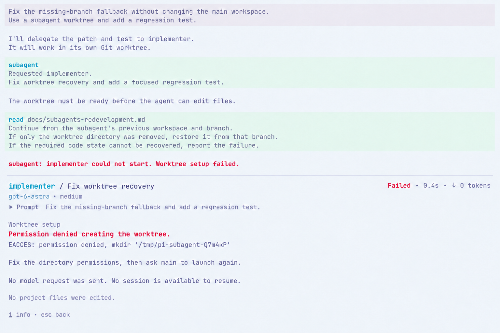
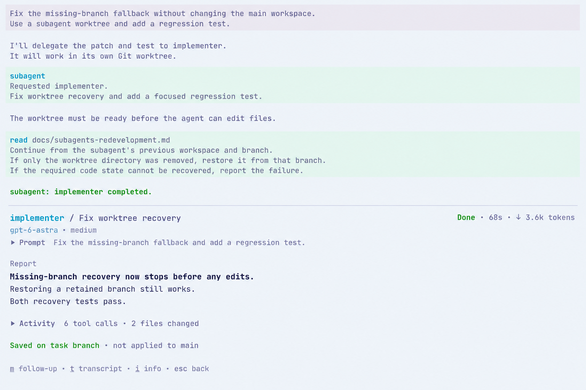

# Subagent UI 重新开发访谈

[English](../../subagents-redevelopment-ui.md). 以英文版为准.

状态: 2026-09-20 已接受 UIR01 和修订后的 UIR02; 2026-09-21 已接受 UIR03、UIR04 局部帮助规则及 UIR05-UIR08. UIR09 提议完成与续聊详情, 尚待回答. FleetView 只在列表获得键盘焦点时于列表上方显示帮助. 首版 UIR02 图片仍作为被否定的设计历史保留. 沿用 [#97](https://github.com/jczhang02/pi-stuff/issues/97), 属于 [#64](https://github.com/jczhang02/pi-stuff/issues/64). 运行范围已在[重新开发决策](subagents-redevelopment.md)中确定.

按真实使用场景逐一讨论 UI: 主界面与页面关系、FleetView 与任务结构、详情与可观测性、介入操作、完成与历史、键盘与视觉统一. 根据维护者反馈, 本轮同时梳理详情的信息层级. 先前 UI 作为起点, 不整套继承它所依赖的旧运行要求.

## 视觉参考

已核对的 Ghostty 配置使用 Catppuccin Latte, 背景 `#eff1f5`, 前景 `#4c4f69`, 字号 12pt、略加粗、禁用连字、2px padding. 字体栈为 JetBrainsMono Nerd Font Mono、Symbols Nerd Font Mono、LXGW WenKai Mono. 配置默认窗口为 150 列、50 行; Pi 使用同一浅色主题及 fullscreen 模式. 本轮没有可读取的 live Terminal Control 会话.

图片依据该配置及先前真实的 [FleetView](../../assets/subagents/light-fleet-120x36.png)和[详情](../../assets/subagents/light-detail-160x48.png)截图生成. 它们是 1536x1024 的 ImageGen 概念图, 任务内容和指标为示例. 字体栅格、字符几何及键盘行为仍需在 Pi 中验证. 完整提示词和来源保存在 [generation.json](../../assets/subagents-redevelopment-ui/generation.json).

## UIR01: 主布局已接受

保留主对话、编辑器和 statusline, 下方紧接占满可用宽度的 FleetView. main 没有 description. 选中仅改变圆圈, 正常运行不标 Running. 焦点在 FleetView 时, 编辑器保留草稿但隐藏文字光标.

维护者还要求 Waiting 等状态与耗时/token 区域对齐. 修订图将各行尾部内容放入同一个右对齐区域. Waiting 的右边缘与 tokens 齐平, 不再单独放在指标前面. 有指标的行共用耗时和 token 列位置; 名称和描述也各自共用列位置.

## 首版详情为何被否定

维护者认为[首版详情图](../../assets/subagents-redevelopment-ui/02-detail.png)信息冗余, 缺少辨别度. Prompt、Progress 和另外五个分类拥有接近的视觉权重, 读者必须在页面中寻找最新的有用信息.

实际观察到的 [Claude Code task detail](https://github.com/jczhang02/pi-stuff/blob/42fe5afa96caf31a255b76ac6ec751999fc10413/docs/assets/claude-subagent-ui/05-task-detail.png)将身份/指标、当前活动、prompt 和操作紧凑排列, 完整 transcript 另行阅读. [调研记录](https://github.com/jczhang02/pi-stuff/blob/42fe5afa96caf31a255b76ac6ec751999fc10413/docs/claude-subagent-ui-research.md)区分了真实 CLI 交互和 fixture 提供的内容.

当前 [Claude Agent View 文档](https://code.claude.com/docs/en/agent-view#peek-and-reply)在预览中优先显示最近输出或待回答的问题. [Cursor 的 review 流程](https://docs.cursor.com/en/agent/review)让用户直接从 agent 回复进入代码成果. 本提案借鉴这些信息顺序. Pi 的底部详情不依赖它们的会话切换、预览容器或 GUI 控件.

## UIR02: 修订详情已接受

打开子代理后接管底部整个交互区域, 上方保留可见主对话. 查看时不显示主编辑器、主 statusline 和 FleetView. 返回恢复先前 FleetView 选择及主输入草稿, 后台工作继续. 维护者已接受修订后的信息层级及沿用的页面关系. 图中按键和确切高度仍作示意.

### 运行中

标题只出现一次子代理身份和任务描述, 附近显示模型及用量. Prompt 收成可展开的一行. 页面中心是子代理最新的可见回复, 后面是最近的工具活动. 示例回复本身带有强调的发现, UI 无需再调用模型生成摘要. 树形仅用于局部工具活动, 不再作为所有数据分类的目录.

Transcript 进入完整记录. Info 提供配置、工作区、详细用量及历史的入口, 具体组织留到后续部分.

### 完成后

同一区域直接展示最终报告, 无需再打开 Result 分类才能看见结论和依据. 工具证据折叠. 标题显示 Done, 因为调查已成功完成; 报告发现上游问题不等于本次代理执行失败.

运行中和完成后是同一设计的两个状态. 操作提示相应从 message/stop 变为 follow-up. 具体按键和操作行为暂作示意, 在交互部分确定.

**UIR02 已接受.** 运行中先看最新回复和当前活动, 完成后直接看报告, 辅助信息深入一层查看. 完整证据仍可读取, 首屏自身就有用. UIR06 已覆盖待答问题, UIR08 已覆盖任务失败详情.

## UIR03: FleetView 与任务关系已接受

FleetView 继续使用 UIR01 已接受的紧凑列表, 不因任务存在依赖而改变行布局. 独立任务无需额外关系图. 选中的任务属于依赖流程时, 提供入口, 在底部查看区域打开其真实依赖图. 入口具体按键留到键盘交互部分确定.

### 独立调查

Lifecycle、packages 和 tests 独立调查, 每行都能打开详情. 不画依赖箭头, 也不构造父子树. 这张历史图底部的 `j/k` 提示由 UIR04 的焦点对比图取代.

### 存在依赖的流程

这是另一个场景: reviewer 需要 lifecycle 和 packages 的结果. 图中是从 FleetView 打开关系图之后的画面. Packages 已完成, lifecycle 仍在工作, reviewer 尚未启动. 两条依赖边保留, 选中节点下方明确说明还缺 lifecycle.

显式依赖统一使用有向图, 简单串行链也沿用这一形式. 箭头从前置任务指向使用结果的任务. 选择节点后查看状态, 并进入已接受的详情页; 返回先恢复图中选择, 再回到 FleetView. 上方主对话保持可见, 关系图接管底部交互区域.

已接受紧凑列表与按需关系图的分工, 不提供任意切换 list/tree/graph 的模式菜单. 关系来自已记录的依赖, 不从 prompt 文本或代理名称推断. 图中报告和时间为示例. Waiting 原因适用于这次汇合场景, 不表示所有排队任务都在等待未完成的依赖; 上游按就绪波次调度的运行基线保持不变. 接受范围是关系呈现, 不包括关系图中示意性的按键提示.

**UIR03 已接受.** 保留列表形式的 FleetView, 仅在存在真实依赖时提供关系图入口, 图中节点进入同一个详情页.

## UIR04: 局部帮助已接受

**已确定的修正.** FleetView 可见不等于它获得键盘焦点. 维护者要求列表获得焦点时才显示导航/操作帮助. 在主编辑器输入时隐藏这行帮助, 代理列表仍然保留.

### 参考行为

已检查的 Pi 0.85.1 [选择按键](https://github.com/earendil-works/pi/blob/d981de1229ef899957bbe968bc8dcda02a21f477/packages/tui/src/keybindings.ts)默认为上下键、Enter 和 Escape/Ctrl+C. [ExtensionSelector](https://github.com/earendil-works/pi/blob/d981de1229ef899957bbe968bc8dcda02a21f477/packages/coding-agent/src/modes/interactive/components/extension-selector.ts)额外接受 `j/k`, 但在列表下方显示 `↑↓ navigate` 及配置中的确认/取消按键. Pi 的其他选择器也有在列表上方显示帮助的例子, 帮助位置并非全局统一.

已记录的 Claude Code 2.1.261 [FleetView 焦点截图](https://github.com/jczhang02/pi-stuff/blob/42fe5afa96caf31a255b76ac6ec751999fc10413/docs/assets/claude-subagent-ui/02-selected.txt)将操作帮助放在列表上方. [编辑器焦点截图](https://github.com/jczhang02/pi-stuff/blob/42fe5afa96caf31a255b76ac6ec751999fc10413/docs/assets/claude-subagent-ui/04-message.txt)仍保留列表, 但用输入场景提示取代 FleetView 操作帮助. Claude 的行指针和当前会话圆圈含义不同. 我们沿用已接受的仅圆圈选中, 不复制这套双标记, 也不表示切换了宿主会话.

此前的 `j/k select` 页脚是概念稿自行选择的写法, 不是 Pi/Claude 共同的默认方案. 优先沿用 Pi 已配置的选择按键, 提示显示实际键位. 新图使用默认上下键/Enter 文案及 Pi Stuff 固定的 Esc 返回规则.

### 主编辑器获得焦点

草稿显示文字光标. FleetView 所有圆圈空心, 不显示局部帮助. 内部仍记住上次列表选择, 供返回列表时恢复. 编辑器的光标移动、历史和自动补全保持 Pi 行为.

### FleetView 获得焦点

草稿保留, 隐藏文字光标. 只有 lifecycle 的选中圆圈填实. statusline 和列表之间出现一行弱化的帮助: `↑↓ navigate · enter view · esc back`. 不增加指针、整行背景或列表下方的帮助. 两张图的行位置相同; 预留空行仅作示意, 不是固定高度要求.

已接受的帮助位置参考 Claude 的局部操作提示, 导航沿用 Pi 的选择按键. 先前已同意用上下键进入 FleetView, 入口须保留编辑器本身的正常处理. 本轮不决定 stop、message 等介入操作的键位.

**UIR04 已接受.** FleetView 局部操作提示放在列表上方、statusline 下方, 随键盘焦点改变. 列表获得焦点时显示 FleetView 操作, 返回编辑器时隐藏这些操作. 维护者明确接受了 Claude 的这条帮助规则. 具体提示文案及图中失焦后圆圈全空心的处理仍作示意; 先前仅通过圆圈表示选中的规则保持不变.

## UIR05: 从详情发送补充指令已接受

场景: lifecycle 正在调查 worktree 恢复, 用户希望它集中检查分支丢失的路径, 不修改文件. 以下三张图是同一次交互的连续状态.

### 上游支持什么

Arhen 的 [steering 工具](https://github.com/arhen/pi-extensions/blob/676b11eb415cd46fbede712b5bbb075ff3f043bf/packages/core/pi-core-subagent/src/index.ts#L351-L377)以 `streamingBehavior: "steer"` 调用运行中的子代理会话. Pi 在流式执行期间[将输入排队](https://github.com/earendil-works/pi/blob/d981de1229ef899957bbe968bc8dcda02a21f477/packages/coding-agent/src/core/agent-session.ts), 当对应 user-message 事件开始时从待处理列表移除. 这不会立即中止正在执行的工具, 也不能证明模型理解了指令.

它与同级代理主动轮询的 mailbox、回答 `ask_parent` 阻塞问题不同. 本轮只讨论给工作中的子代理补充指令. 完成后的续聊已由 RQ05 接受, UIR09 提议对应 UI. UIR06 已覆盖待答问题界面.

源码检查还发现 [steerTask](https://github.com/arhen/pi-extensions/blob/676b11eb415cd46fbede712b5bbb075ff3f043bf/packages/core/pi-core-subagent/src/manager.ts#L1434-L1441)的一条误报路径: 指定 ID 时即使没有 live child 也可能返回成功, 且未等待 session 调用结果. 重新开发须核实实际目标及入队结果后才显示成功. 这是既有修错范围内待复现和修复的源码发现, 不作为已执行的回归测试, 也不增加回执协议.

### 1. 填写时仍能看见当前发现

详情的 Message 操作在最新回复下方临时展开局部编辑器. 身份、任务和当前发现保持可见, 工具活动折叠以腾出空间. 输入区明确标出收件人 lifecycle. 不恢复主编辑器、statusline 或 FleetView, 也不切换宿主会话.

图示按键为 `m` 打开 Message、Enter 发送、Shift+Enter 换行、Esc 返回详情. 实现沿用 Pi 配置中的提交/换行按键和固定的 Esc 返回规则. 输入时只显示编辑器帮助, `m`、`x` 等字母作为文字输入, 不触发详情操作. Esc 不发送消息, 再次打开同一子代理输入区时保留局部草稿.

### 2. 显示待处理的指令

确认入队后收起编辑器并恢复详情. 指令仍在待处理列表时, 显示原文和 `Queued`. 图中工具仍在运行, 因而说明正在等待当前步骤结束. 该原因应来自实际活动, 不统一套用到所有延迟.

提交失败时保留草稿, 说明未能入队的原因. 不仅凭上游 manager 的布尔返回值显示成功. 不将入队标为 Read、Applied 或 Acknowledged.

### 3. 由子代理回复体现后续行为

该指令实际进入会话后才移除待处理提示, 任意其他子代理事件都不足以证明这一点. 示例随后出现新回复: 不修改文件, 继续追踪分支丢失后的回退路径. 这是示意性的模型输出, 不是 UI 自动生成的回执, 也不要求模型必须这样回复.

用户消息折叠为一行, 完整内容仍能从 transcript 查看. 页面再次优先展示最新回复和当前活动. 不另做消息管理页, 不额外调用模型总结是否遵从指令.

**UIR05 已接受.** 在子代理详情内临时展开输入区, 确认实际入队后收起, 在同一详情中展示待处理指令和子代理后续的真实回复. Esc 或提交失败时保留草稿. 整个过程都能看清发给谁、它正在做什么, 不编造已读或遵从回执.

## UIR06: 子代理向父代理提问已接受

场景: lifecycle 找到 worktree 回退路径后, 询问应该复现问题还是继续追踪源码. 两张图分别展示待答问题和用户可选的介入回复.

### 上游支持什么

Arhen 的 [ask_parent](https://github.com/arhen/pi-extensions/blob/676b11eb415cd46fbede712b5bbb075ff3f043bf/packages/core/pi-core-subagent/src/child.ts#L18-L34)接收一个纯文本问题, 阻塞子代理并询问父代理, 不直接询问人类. [Manager](https://github.com/arhen/pi-extensions/blob/676b11eb415cd46fbede712b5bbb075ff3f043bf/packages/core/pi-core-subagent/src/manager.ts#L572-L600)将状态改为 awaiting_parent, 通过父代理正在等待的结果或后续消息传递问题.

父代理通过 [reply_subagent](https://github.com/arhen/pi-extensions/blob/676b11eb415cd46fbede712b5bbb075ff3f043bf/packages/core/pi-core-subagent/src/index.ts#L331-L350)回答, 解除该调用的阻塞. 这与给工作中的子代理补充指令不同. 上游 [peek](https://github.com/arhen/pi-extensions/blob/676b11eb415cd46fbede712b5bbb075ff3f043bf/packages/core/pi-core-subagent/src/peek.ts#L136-L191)可以查看和取消, 没有供人类回复的输入区. 已接受的设计为同一个回答操作增加 UI 入口, 仍遵循已确定的单一工具设计.

[任务快照](https://github.com/arhen/pi-extensions/blob/676b11eb415cd46fbede712b5bbb075ff3f043bf/packages/core/pi-core-subagent/src/types.ts#L18-L51)记录等待状态, 不包含问题原文. UI 须从现有提问事件或子代理 transcript 取得原文, 并关联当前仍待回答的问题. 不从最新回复推测问题, 也不把旧问题显示为仍在等待. 本提案不增加持久化问题协议, 不改变恢复行为.

上游已有 [10 分钟回复超时](https://github.com/arhen/pi-extensions/blob/676b11eb415cd46fbede712b5bbb075ff3f043bf/packages/core/pi-core-subagent/src/manager.ts#L622-L650), 到时向子代理返回后备指令. UI 跟随真实的待答状态, 不增加倒计时或人工批准关卡.

### 1. 让待答问题成为详情主体

标题显示 Waiting for main, 不暗示人类必须回答. 待答问题取代 Latest update 成为中心内容. 示例中的解释属于子代理问题原文, 不是 UI 生成的摘要. 先前工具活动折叠在下方, 不在该子代理阻塞时描绘正在执行的工具.

父代理仍能按原有流程回答. 打开详情不会把问题保留给人类独占, 也不中断父代理. 主对话继续留在上方, 沿用已接受的底部详情布局.

### 2. 回复时保留问题原文

Enter 打开标为 Reply to lifecycle 的局部编辑器. 沿用 UIR05 的输入区形式及 Pi 配置中的提交/换行按键, Esc 不发送并返回. 问题原文始终可见. 输入时使用编辑器按键, 不触发详情快捷键.

提交通过回答操作回复当前问题, 不进入 steering 队列. 确认回答被接受后才收起编辑器. 可以短暂显示 Answer sent, 但须等子代理实际恢复后才回到正常工作详情. 后续真实回复和活动体现结果, 不编造 Read、Applied 或 Acknowledged.

提交必须对应打开时的那条问题. 若它已被回答、超时或取消, 保留草稿, 刷新详情并简短说明. 不将草稿发给后来的问题, 也不擅自转成补充指令. 投递失败同样保留草稿. 这些是回复入口的正确性要求, 不新增运行功能.

**UIR06 已接受.** 待答问题优先显示在子代理详情中, 用户可通过同一局部输入区介入回答, 父代理仍可正常回答. 填写时保留问题原文, 提交失败或该问题已不再等待时保留草稿.

## UIR07: 停止子代理并保留已有工作已接受

场景: 用户在 lifecycle 完成调查前将其停止, 它最近的发现仍有用. Packages 独立工作, reviewer 需要 lifecycle 的完整结果. 三张图是同一详情的连续状态.

### 上游支持什么

Arhen 将 [peek 的停止操作](https://github.com/arhen/pi-extensions/blob/676b11eb415cd46fbede712b5bbb075ff3f043bf/packages/core/pi-core-subagent/src/index.ts#L23-L52)绑定到选中的 task. 它的[就地确认](https://github.com/arhen/pi-extensions/blob/676b11eb415cd46fbede712b5bbb075ff3f043bf/packages/core/pi-core-subagent/src/peek.ts#L183-L191)使用 x 后按 y. 另一个 run 级取消操作才会停止整组未结束任务. 这里的详情操作只针对 lifecycle.

[单任务取消路径](https://github.com/arhen/pi-extensions/blob/676b11eb415cd46fbede712b5bbb075ff3f043bf/packages/core/pi-core-subagent/src/manager.ts#L1443-L1457)不取消无关同级任务. [调度器](https://github.com/arhen/pi-extensions/blob/676b11eb415cd46fbede712b5bbb075ff3f043bf/packages/core/pi-core-subagent/src/manager.ts#L1201-L1249)会跳过前置任务未完成的后续任务. 在这个场景中, packages 可以继续完成, reviewer 会被跳过. 这是依赖产生的后果, 不是递归取消.

上游[保留会话和最后的输出](https://github.com/arhen/pi-extensions/blob/676b11eb415cd46fbede712b5bbb075ff3f043bf/packages/core/pi-core-subagent/src/manager.ts#L1014-L1056). 写任务会尝试将部分改动提交到任务分支, 保存成功后移除 worktree 目录; 提交失败则保留目录供检查. 停止不会回滚已完成的编辑. 界面展示实际可用的输出及工作区证据, 不把停止等同于保存成功.

### 1. 在现有详情中确认

x 暂时将详情页脚替换为 Stop lifecycle?、简短的保留说明和已知的依赖后果. Enter 确认, Esc 取消确认. 确认前子代理继续工作. 当前发现和活动保持可见, 不弹窗或压暗背景. 实现沿用 Pi 配置中的确认键和固定的 Esc 返回规则.

Reviewer 提示来自当前流程的真实依赖, 独立任务不显示这行. 保留说明表达操作意图, 不是已完成保存的回执; 保存失败须按共享错误规则清楚呈现.

### 2. 区分请求停止与已经停止

确认后显示 Stopping, 保留最后的输出. 仍可阅读 transcript 和返回. 正在停止时不提供重复停止、消息或恢复操作. Esc 返回 FleetView, 不撤销停止请求.

源码中有一个时机问题待复现: 上游在底层 child abort 和收尾完成前就标为 aborted, cancelTask 没有等待它们结束. 不能仅凭这个状态显示本设计中的 Stopped. 重写时须沿现有执行生命周期观察停止和本次任务收尾的实际完成, 再改变界面. 这是已约定修错范围内的待验证修复, 不表示上游已有停止完成事件, 也不增加持久化恢复系统.

### 3. 保留未完成内容供阅读

Stopped 与 Done、Failed 分开. 最后的子代理回复和工具证据继续可读, 页面明确报告尚未完成. 不另行生成替代报告. 这是只读调查的示例, 没有文件改动. 调度器实际记录跳过结果后才将 reviewer 显示为 skipped.

最后这张图中, packages 也已完成, reviewer 已跳过, 整组任务已结束. 原会话仍可用, 因而 m resume 可以打开沿用 UIR05 形式的局部输入区, 填写后续要求时仍能看见最后输出. 恢复成功后在原子代理上下文中开始新一次交办, 按 RQ07 保留停止前的记录, 按 RQ08 沿用自己的工作区.

上游[恢复前提](https://github.com/arhen/pi-extensions/blob/676b11eb415cd46fbede712b5bbb075ff3f043bf/packages/core/pi-core-subagent/src/manager.ts#L1333-L1352)要求整组任务结束且原会话存在. 条件不满足时说明实际原因, 不提供无法执行的操作. 恢复[只执行当前子代理](https://github.com/arhen/pi-extensions/blob/676b11eb415cd46fbede712b5bbb075ff3f043bf/packages/core/pi-core-subagent/src/manager.ts#L1394-L1411), 不自动重启 reviewer. 已完成代理续聊仍由 RQ05 单独确定. 本轮不增加自动重试、回滚或整组流程重启.

**UIR07 已接受.** 在当前详情就地确认停止, 执行和本次任务收尾结束前显示 Stopping, 结束后保留未完成内容及真实依赖后果. 满足原有恢复条件时提供局部恢复输入区. 保留停止前的记录, 不自动重启后续依赖任务.

## UIR08: 任务失败详情已接受

以下两个例子沿用同一种详情布局. 优先显示失败的操作、实际原因及有用的下一步, 后面保留已有输出. 它们是不同场景, 不是连续状态或两种查看模式.

### 上游支持什么

Arhen 同时处理 [assistant 的失败 stop reason](https://github.com/arhen/pi-extensions/blob/676b11eb415cd46fbede712b5bbb075ff3f043bf/packages/core/pi-core-subagent/src/manager.ts#L652-L710)及[执行抛出的异常](https://github.com/arhen/pi-extensions/blob/676b11eb415cd46fbede712b5bbb075ff3f043bf/packages/core/pi-core-subagent/src/manager.ts#L1004-L1030). Provider 错误可能由最后一条 assistant 消息返回, 不一定表现为 prompt 调用 reject. 已产生的文字、用量和会话仍可保留, 界面不应丢掉它们, 也不把先前文字当作完整报告.

恢复依据真实的[原会话和整组结束条件](https://github.com/arhen/pi-extensions/blob/676b11eb415cd46fbede712b5bbb075ff3f043bf/packages/core/pi-core-subagent/src/manager.ts#L1333-L1352). 上游 [format helper](https://github.com/arhen/pi-extensions/blob/676b11eb415cd46fbede712b5bbb075ff3f043bf/packages/core/pi-core-subagent/src/format.ts#L223-L244)用缺少最终文字来判断启动失败, 但子代理在产生文字前就可能已有可恢复会话. 这是待复现修正的源码发现: 输出为空不能决定会话是否存在.

单次工具失败可以返回给模型, 任务继续进行. 它应显示在工具活动和 transcript 中, 不因一次读取或命令失败就将整个任务标为 Failed. 同样, 无效模型若在[创建 run 前就被拒绝](https://github.com/arhen/pi-extensions/blob/676b11eb415cd46fbede712b5bbb075ff3f043bf/packages/core/pi-core-subagent/src/manager.ts#L1125-L1139), 就是主对话中的派发错误, 不为此虚构子代理行或 transcript.

### 1. 已产生有用输出后执行失败

Lifecycle 已读取两次文件并发现可疑回退路径, 后续模型请求失败. 已结束的失败成为主要内容: Model request、示例 Connection error, 以及检查连接后恢复的建议. 显示实际报告的原因, 不另调模型编造诊断.

此前发现留在 Last update 下, Transcript 提供完整证据. Reviewer 因前置任务失败而显示 skipped. 此例中整组已结束, 保存的会话可用, 因而 m resume 打开 UIR07 已接受的局部输入区. 恢复沿用原上下文, 不是悄悄创建另一个代理的通用重试.

主对话仍按共享通知规则保留原生错误通知. 打开详情后提供上下文和可用操作, 不用短暂 toast 取代该通知.

### 2. 子代理启动前 worktree 初始化失败

这是另一个场景, 针对可写任务 implementer. 创建 worktree 目录时遇到权限错误. 它使用父代理当前模型, 尚未发送模型请求. 此时没有子代理会话或项目文件编辑, 详情显示启动原因, 提示修复权限后让主代理重新派发.

不显示 Last update 占位、子代理 transcript 入口或恢复操作. Info 仍提供已有任务配置及完整启动错误. 图中错误路径、耗时和零 token 是该例中已知事实的示意, 实现不能将未知用量替换成零.

这张图描述 RQ03 已接受的修复. 固定的 arhen 源码目前会[捕获 worktree 初始化错误并在源目录继续运行](https://github.com/arhen/pi-extensions/blob/676b11eb415cd46fbede712b5bbb075ff3f043bf/packages/core/pi-core-subagent/src/manager.ts#L768-L817). 必须复现并修复后, 才能将此图对应的行为作为运行证据. 本提案不增加自动重新派发或新的 Retry 操作.

### 区分执行结果和代码保存结果

模型任务完成后仍可能出现 [worktree 提交错误](https://github.com/arhen/pi-extensions/blob/676b11eb415cd46fbede712b5bbb075ff3f043bf/packages/core/pi-core-subagent/src/manager.ts#L957-L1001). 上游失败/中止后的[部分提交路径](https://github.com/arhen/pi-extensions/blob/676b11eb415cd46fbede712b5bbb075ff3f043bf/packages/core/pi-core-subagent/src/manager.ts#L1041-L1052)在保存失败时保留目录, 但没有将该错误写入 worktreeError. 记录为待复现修复的源码发现; 单有分支名不证明改动已保存. UIR09 提议完成场景的呈现, 包括提交失败与已有报告如何同时显示.

**UIR08 已接受.** 失败详情优先显示原因及下一步, 保留有用输出, 仅在实际条件满足时提供 Resume 和 Transcript. 同一布局覆盖工作中断和模型执行前的启动失败.

## UIR09: 完成与续聊

场景: implementer 在自己的 worktree 中修复分支丢失后的恢复行为. 前两张图依次展示完成结果和未发送的续聊草稿. 第三张是另一种结果: 同样的报告已经完成, 但 Git 未能提交改动.

### 上游支持什么

Arhen 在[提交 worktree 改动前写入报告和 completed 状态](https://github.com/arhen/pi-extensions/blob/676b11eb415cd46fbede712b5bbb075ff3f043bf/packages/core/pi-core-subagent/src/manager.ts#L950-L1003). 提交成功后保留分支, 允许清理 worktree 目录. 提交失败时任务仍为 completed, 记录 worktreeError 并保留目录. UI 须区分模型结果和 Git 结果, 实际收尾结束后才能声称改动已提交.

[提交函数](https://github.com/arhen/pi-extensions/blob/676b11eb415cd46fbede712b5bbb075ff3f043bf/packages/core/pi-core-subagent/src/worktree.ts#L128-L159)区分已提交和暂存区为空. 显示真实结果, 不能从分支名或子代理文字推断产生了新提交. 上游[结果文字](https://github.com/arhen/pi-extensions/blob/676b11eb415cd46fbede712b5bbb075ff3f043bf/packages/core/pi-core-subagent/src/format.ts#L174-L198)将审查和合并留给父代理. 子代理代码已保存, 不等于父代理工作区已收到改动.

完成后续聊是 RQ05 已接受的新增能力. 上游[拒绝恢复已完成任务, 恢复其他结束任务时会重置旧报告](https://github.com/arhen/pi-extensions/blob/676b11eb415cd46fbede712b5bbb075ff3f043bf/packages/core/pi-core-subagent/src/manager.ts#L1333-L1411). RQ07 要求每次交办独立留记录, RQ08 要求从子代理自己的代码继续. 图片呈现已约定的新增能力, 不表示当前上游已支持.

### 1. 直接阅读结果

报告直接可读, Activity 折叠在下方. 标题显示本次任务的耗时和输出 token, 详细及累计用量留在 Info. 一行工作区结果确认改动已保存到任务分支, 本例中尚未应用到 main; 完整分支和 diff 信息从 Info 查看. 只读任务不显示虚构的分支保存结果.

图中的报告和测试结论是示意性的子代理输出. 实际呈现原报告, 不额外调用模型生成摘要, 也不由 UI 编造测试结论. 长报告沿用共享的有界阅读和分页规则.

### 2. 看着原报告继续交办

m follow-up 打开与 UIR05 相同的局部输入区, 标签明确收件人 implementer, 原报告保持可见. 草稿要求将底层 Git 错误加入失败提示. 提交前, Done 和标题指标仍属于已完成的任务.

沿用 Pi 配置中的提交/换行按键, Esc 不发送并返回. Esc 或提交失败时保留草稿. 输入时字母属于编辑器, 只显示输入帮助. 新任务被接受后, 显示它真实的启动/工作详情. 按 RQ07 在历史中保留旧报告、状态、耗时和用量, 不覆盖旧记录, 也不将旧报告标成新任务的输出. 历史的阅读布局留到 Info 部分讨论.

整组任务已结束、子代理不再执行、原会话和所需代码状态可用时提供续聊. 前提检查失败则说明原因并保留草稿. 按 RQ05-RQ08 继续同一上下文和自己的分支, 不自动重跑前置或后续依赖任务.

### 3. 提交失败与已完成报告同时可见

本例中 Git 报告磁盘空间不足. 标题同时显示 Done 和 Commit failed, 强调错误. 主对话保留原生错误通知. 详情先说明改动仍留在 worktree、尚未提交, 下方保留完整报告. Info 提供完整错误及保留的工作区位置. 不显示保存成功文案.

图中假定收尾已经结束, 原会话和自己的 worktree 仍可用, 因而用户处理磁盘问题后可以续聊. 这不增加提交重试按钮, 也不承诺自动修复. Git 错误和文件保留说明须来自实际结果, 不能仅凭分支字段推断.

上游提交失败后仍依据 completed 状态调度, 下游 worktree 因而可能缺少这些未提交的改动. 这一源码发现限制了 Done 能表达的含义, UI 不应暗示代码已成功交接. 本轮不改变依赖调度或新增运行终态, 标题同时呈现现有的执行结果和保存结果.

**UIR09 问题. 是否在续聊时保留完成报告, 并在代码保存失败时突出错误、继续保留报告?** 推荐采用. 复用已接受的详情和局部输入区, 保留逐次任务记录, 展示真实 Git 结果.

## 验证与下一步

UIR01-UIR08 在各自记录的范围内保持已接受, UIR09 为提案. 已目视检查三张新概念图的报告层级、输入焦点、内容保留及完成与提交失败的区别. 核对了 Ghostty/Pi 配置和固定 arhen 1.3.55 源码. 本轮没有执行完成、续聊、恢复或提交失败的运行测试. 报告、测试结论、错误文本及指标均为示意. 图片由 ImageGen 生成, 不作为终端验收证据. 等待 UIR09 回答后继续历史、Transcript 和 Info.
