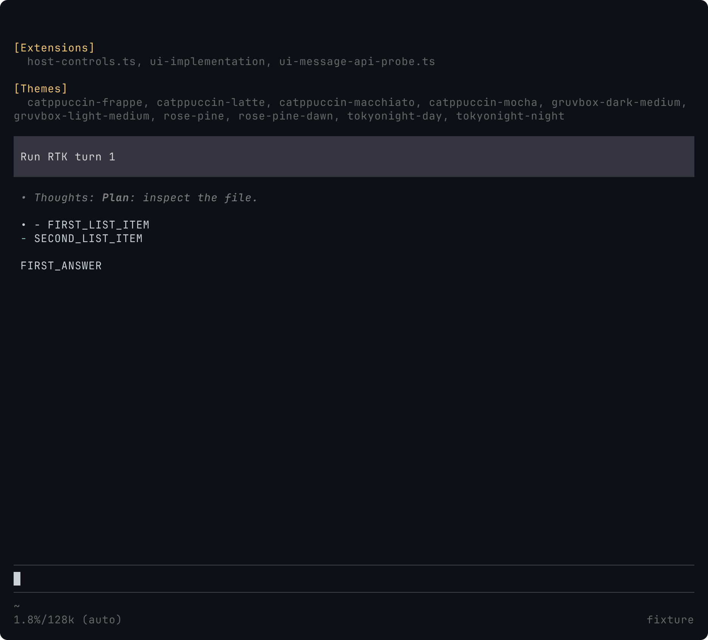
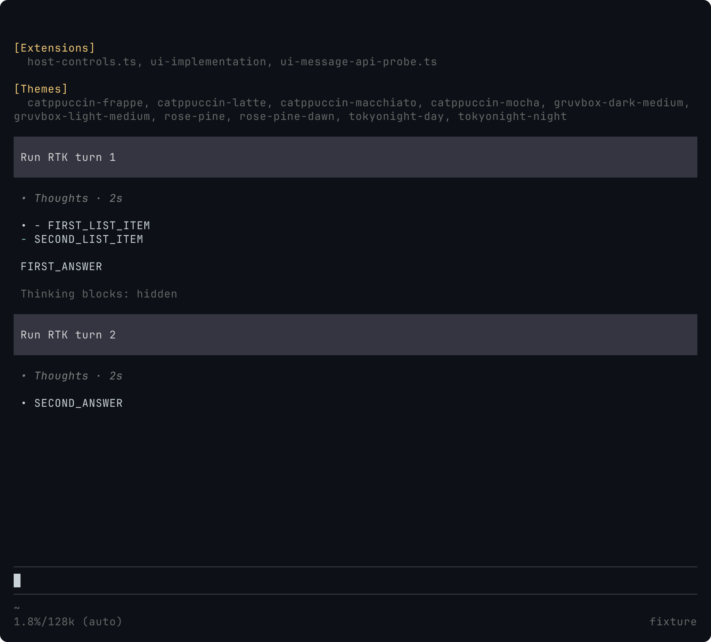

# Assistant UI 集成

[English](../../../docs/ui-integration.md) · 以英文版为准.

已确认的 assistant/Thoughts 展示仍未实现. 本文记录公开 API 实验, 不是最终 UI 方案. 实验使用当前 Pi 0.87.0 / Bun 1.4.0 编译宿主、隔离的确定性 provider 和100列×45行 Terminal Control 会话. 生产代码基线为 `5accad3`.

## 已观察到的限制

实验注册 Markdown transformer, 为 assistant 正文添加 `• `, 为 thinking 添加 `• Thoughts: `. 临时命令调用 Pi 的 `setHiddenThinkingLabel`.

| 操作                                                                           | 实际结果                                                     | 影响                                     |
| ------------------------------------------------------------------------------ | ------------------------------------------------------------ | ---------------------------------------- |
| 给以两个 Markdown 列表项开头的回答添加前缀                                     | 首行变成 `• - FIRST_LIST_ITEM`, 第二项的列表标记在其左侧两列 | 在源码前加文字不能得到已确认的消息前导栏 |
| 给展开的 thinking 添加前缀                                                     | 整行 Thoughts 仍为斜体, 截图对应的终端帧包含35个斜体单元格   | 前缀不能改变 Pi 默认的 thinking 字体样式 |
| 先将隐藏标签设为 `• Thoughts · 1s`, 再产生一个回答, 随后设为 `• Thoughts · 2s` | 两个历史 thinking 块都显示 `2s`                              | 全局标签不能表示各块独立耗时             |

`1s` 和 `2s` 是故意设置的标签, 不是实测耗时. provider 收到的上一条 assistant 正文保持原样, 没有展示前缀.





Pi 的[扩展类型](https://github.com/earendil-works/pi/blob/v0.87.0/packages/coding-agent/src/core/extensions/types.ts)提供 Markdown 渲染前的 transformer 和字符串形式的隐藏标签. [assistant 组件](https://github.com/earendil-works/pi/blob/v0.87.0/packages/coding-agent/src/modes/interactive/components/assistant-message.ts)负责 thinking 斜体和局部显示状态. 此扩展 API 没有注册 assistant 组件工厂的入口. 已安装的0.85.1类型声明具有相同的相关边界.

## 必须保留的行为

真实宿主消息测试检查 Ctrl+T 改变默认值并清除局部覆盖, 点击只展开一个 thinking 块, Ctrl+O 保持 thinking 收起. 同时检查下一次模型请求包含原始 assistant 正文. 这些原生行为检查已通过, 不代表新字体样式或计时已完成.

```sh
bun test tests/system/ui-messages.test.ts
PI_TEST_HOST=/opt/bin/pi bun test tests/system/ui-messages.test.ts
```

确定性 provider 先发送 reasoning, 再发送最终正文. 只有 provider 流使用脚本控制, 测试驱动真实 Pi TUI 和 renderer. 同一文件中的欢迎页测试保留.

## 建议的兼容补丁范围

建议在 `AssistantMessageComponent` 的内容组装处增加仅负责展示的适配层. 此建议需要按[规格第13项](https://github.com/jczhang02/pi-stuff/issues/106)确认具体补丁, 目前未实现、未批准.

- 在 Markdown 解析之后添加 assistant 前导栏, 复用 Pi Markdown、语法高亮和折行, 保留原生失败/Esc 展示.
- 按 Thoughts 块调整展示并记录内存中的实测耗时, 保留 Hide thinking、Ctrl+T 和局部鼠标展开. 不修改 canonical message、provider 上下文或会话记录, 缺少历史计时则省略.
- 每次 UI 扩展加载只安装一次, shutdown/reload 时恢复. 检查宿主结构、保留其他扩展, 无法安全适配时回退原生展示. 不修改 Pi 安装文件.
- 验收前检查重复 reload、切换会话、主题/宽度变化、流式输出、列表/代码开头的回答以及长历史性能.

把全局隐藏标签接口当成计时器还会反复更新历史组件. [所检查 pi-tool-display 版本](https://github.com/MasuRii/pi-tool-display/blob/91cef7580078371f8dc49a8607222807ad6a424d/src/thinking-label.ts)通过修改持久化 thinking 添加标签, 与已确认的记录保留要求冲突. 两种做法均不采用.

这项 assistant 适配与此前待决的 `ToolExecutionComponent` 历史 renderer 修复是两处不同的补丁. 整体实现尚未完成.
