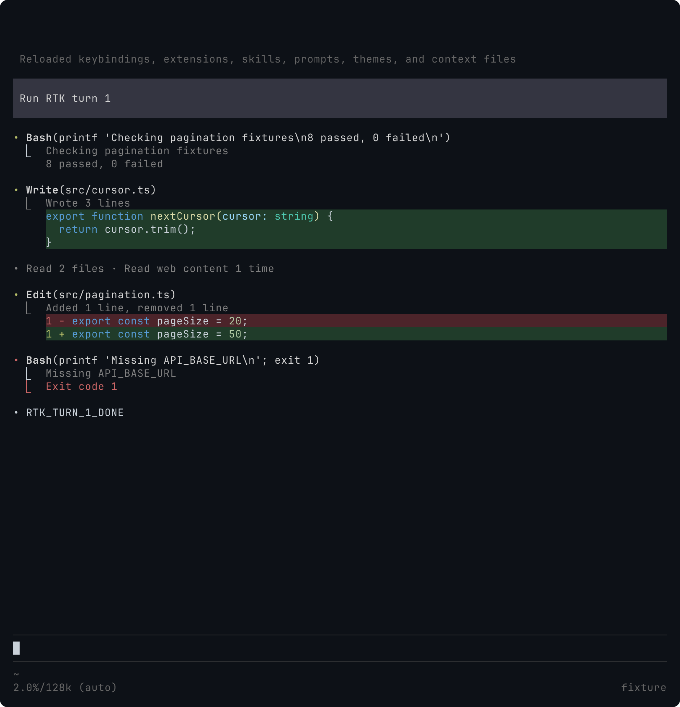
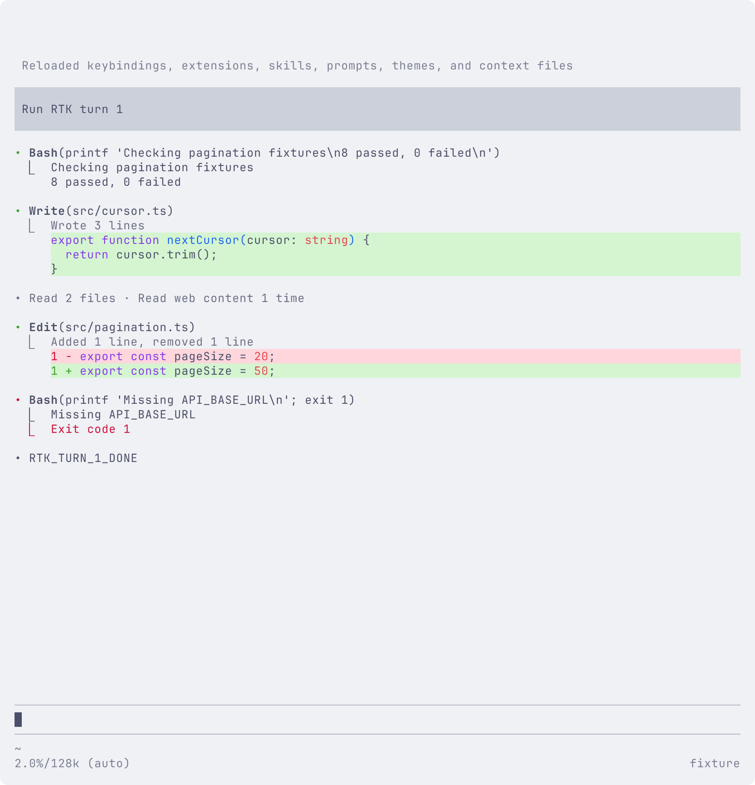
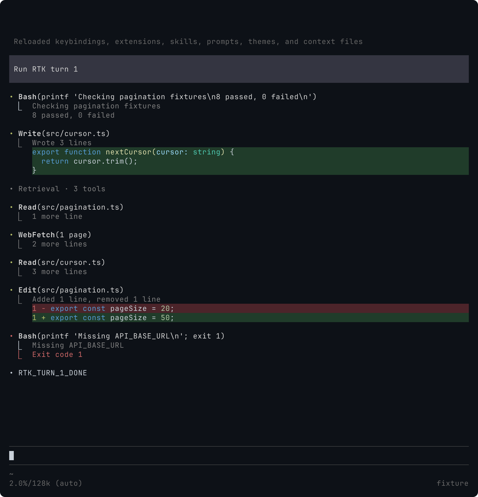
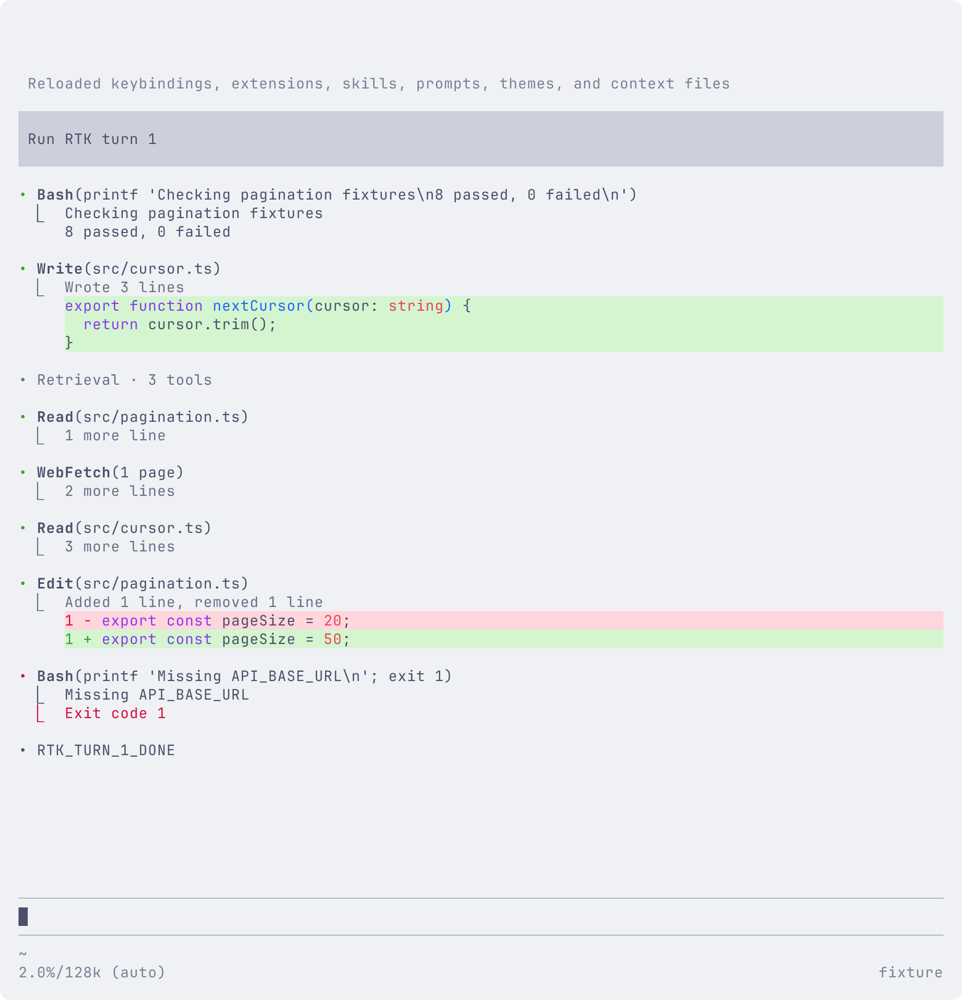

# 会话 UI

[English](../../../docs/ui.md) · 以英文版为准.

[已确认 UI 规格](https://github.com/jczhang02/pi-stuff/issues/106)已在本分支实现. 当前 CI 与交付状态记录于 [PR #107](https://github.com/jczhang02/pi-stuff/pull/107). 本分支修改原生 Bash、Write、Edit、Read、Grep、Find 和 Ls 展示. Web 工具使用同一套检索展示. assistant 正文已在原生 Markdown 外添加独立前导点区域. Thoughts 已添加前导点和行内标签, 保留原生斜体 Markdown 与展开行为. 已观察到的思考区间在内存中独立计时, 没有观测数据的历史块省略时长. 原型仍是视觉参考, 不代表生产验收通过.

[集成实验](ui-integration.md)记录公开 API 限制、真实截图、已批准的 assistant 与工具历史适配, 其中的实验截图不是目标设计.

## 欢迎页

欢迎页通过 Pi 的公开 `setHeader` 使用旧版直角框构图, 窄屏改为单栏. 模型、provider、目录、启用工具数以及可调用的 skills/扩展命令数量来自当前宿主. 公开接口没有完整扩展数量, 因此不沿用原型中的示例扩展计数. 首条消息后隐藏欢迎页, 已有会话不再显示; 原生资源列表、用户消息、输入和 footer 保持不变. `ui.welcome: false` 可单独保留原生欢迎内容.

以下是加载实际扩展的 Pi 0.85.1 / Bun 1.4.0 隔离终端截图, 模型名 fixture 来自测试 provider. 使用 Pi 默认暗色主题, 导出字体为 JetBrainsMono Nerd Font Mono、Symbols Nerd Font Mono、LXGW WenKai Mono. 这些截图不代表 Ghostty 窗口或真实模型验收.


## Bash

所有工具共用标题规则: 状态点、收起最多两行、续行对齐, 展开显示完整目标. Bash 显示命令标题和 `⎿` 输出. 完成后默认预览三个渲染行, 运行中显示最后两行. 隐藏的保留行数通过 `n more lines` 提示. 鼠标展开和 Ctrl+O 由 Pi 处理. 短结果即使展开前后视觉相同, 也保留原生展开行为.

上游截断和日志信息使用独立结果块. 每个 `⎿` 后统一两个普通空格, 续行前五个空格, 与正文起点对齐. 展开只显示仍保留的输出. 工具执行复用 Pi 公共原生定义, 保留宿主配置的 Shell 路径和命令前缀. 其他扩展的 Bash 定义不被接管.

成功调用只显示输出, 不追加 `Completed`、耗时或配置的 timeout. 空输出显示 `(no output)`. 失败时保留原生退出码、实际超时原因 (如 `Timed out after 10s`) 或取消状态, 零行预览时也可见. 参数或进程启动错误保持可见. 原生失败结果可能只在错误正文中保留截断/日志提示, 界面将其提到独立结果块. 模型可见结果和记录的错误不变.

以下截图展示当前结果间距、Bash 成功/失败、Write/Edit 及检索组. 使用编译 Pi 0.87.1 / Bun 1.4.0、隔离确定性 provider、100×52终端. 命令和文件操作实际执行, 打印的测试摘要为 fixture 内容. Terminal Control 导出字体为 JetBrainsMono Nerd Font Mono、Symbols Nerd Font Mono、LXGW WenKai Mono. 这些是终端截图, 不代表 Ghostty 窗口验收. 浅色 fixture 将终端默认前景设为 `#4c4f69`、背景设为 `#eff1f5`, 扩展不修改调色板.





## 展示输入处理

Pi 执行验证后的参数副本, renderer 收到的仍是原始值. 适用的可选 null 按省略处理. 流式参数缺字段时保留标题, 不宣称操作完成. 专用 renderer 的参数或结果 details 解码失败时, 自有工具保留我们的标题并完整显示原始结果, 不退回裸工具名或编造计数. 这类检索结果留在组外. 额外未知字段不影响其余可用输入. 此处理仅影响展示, 不修改执行、schema、会话记录或第三方工具归属.

## Write

Write 保留原生文件执行, 使用 Pi 语法高亮和绿色底色显示写入源码. 收起结果显示三个渲染行和隐藏行数, 原生展开显示保留的完整源码. 摘要按源码行数计数, 不将终端折行算作新行. 错误结果保留实际工具错误文本.

模型参数仍在流式传入时, 工具标题保持可见, 不宣称写入完成. 真实宿主测试检查了此时的输入、缩至60列、参数完成, 以及参数收齐前按 Esc. 取消的调用不创建文件, 下一轮仍可正常写入.

CRLF 内容沿用原生 Write 的展示规范化, 预览不在源码行之间插入空行. 文件保留原始换行和 Tab. 工具目标、Bash 输出、检索文本、结果块和代码预览在着色前复用 Pi 的终端序列清理函数. 清理只影响展示, 关闭 RTK 的模型结果清理后也仍然生效.

## Edit

Edit 使用原生结果中的 patch, 采用单一行号栏, 删除行用旧行号, 新增和上下文用新行号. 每个 hunk 中可用的旧/新源码分别高亮, 配合增删背景, 展开前显示六个渲染行. 折行不重复行号栏. 摘要统计增删源码行数. 即使文件后来改变, 展开历史结果仍使用记录中的 patch. 记录 hunk 之外的语法上下文不可用.

内置 dark/light 和本包 Catppuccin Latte 在代码结果内使用更鲜明的绿/红底色, 色带延伸至代码区域右边缘. 上下文行保留终端底色. 带来源信息的自定义主题和索引色终端沿用其提供的语义背景色. 匿名内存主题若使用内置名称及完全相同的颜色, 则无法与内置主题区分. 此调整不修改全局主题或终端调色板.

## 检索工具

Read、Grep、Find 和 Ls 使用紧凑标题和保留行数提示, 原生鼠标展开或 Ctrl+O 显示文本. 无匹配、空结果、错误以及上游截断/结果数量限制警告保持可见. 只有实际 `ls` 工具调用显示 Ls, Shell 命令保留 Bash 身份. 保留原生 Read 图片缩放设置. 连续成功的本地和 Web 调用现在组成紧凑检索组. 点击摘要显示左侧对齐的紧凑工具. 展开后的组标题替换为灰色 `• Retrieval · N tools` (单个调用为 `1 tool`), 下方留一行空白, 不重复显示统计摘要. 点击此标题收起整组, 点击单个工具展开保留结果. Ctrl+O 通过原生工具展开显示组内结果. 运行中、空结果、警告、失败和普通 Bash 保持在组外. 索引只保存调用标识和计数, 不复制输出.

并行调用即使按不同顺序完成, 仍按原始顺序显示. 等待中的调用保持可见; 成功后并入相邻成功项, 不跨过失败项. 会话关闭时释放旧 context, 避免 Pi 渲染过渡帧时访问失效引用. 新建会话不会因此崩溃, 也不保留前一个会话的分组成员.

Ctrl+O 展开全部工具后, 仍可点击组标题收起成员. 后续 Ctrl+O 改变全局状态时会重置该局部覆盖. assistant 正文、Thoughts (包括隐藏的 Thoughts)、写入和新的用户轮次都会打断聚合. 宿主测试也覆盖成功读取之间的本地数量限制、无匹配结果和 Web 批次失败.

两个已完成读取之间的 Web 调用若被取消, 其结果保持原位可见. 成功读取仍分属不同组, 后续轮次不跨过取消项合组或重发请求. assistant 中断提示保留原生展示.

以下截图展示鼠标展开后的同一会话. 组内工具与其他工具左侧对齐, 正文仍可分别展开或收起.





Read 含有图片的结果留在文本检索组之外, 结果渲染交回 Pi. 图片显示、转换和带 MIME 类型及尺寸的文本回退均由 Pi 处理. 已在锁定宿主和当前 Pi 0.87.0 编译宿主检查文本回退; 真实 Kitty/Ghostty 图片显示仍待视觉验收.

隐藏行数只统计保留的正文渲染行. 原生 Read 的后续读取说明、本地结果数量限制提示单独可见, 不计入行数或重复显示. Web 标头与 excerpt 位置仅在展开时显示, 保持原始条目顺序.

原生 Read 范围若产生无法可靠拆分的续读提示, 如小数 limit, 就完整显示结果. 展示层不缩窄 Pi 接受的参数范围.

## Web 工具

既有 Web access 工具分别显示为 WebSearch、WebFetch 和 WebRead. 紧凑标题显示操作数量或保留内容标签, 展开后显示 query/URL/content ID 以及分页/find 参数. 原 API 名称、输出和缓存行为不变. 批次失败项和保留内容分页提示在收起时仍可见. 展开本身不抓取更多内容.

WebRead find 没有 excerpt 时显示 `No matches found`; 空页按实际情况显示 `No content` 或 `End of content`, 均不加入成功检索组. 展示层按工具的 UTF-16 内容范围区分标头与正文, 页内类似元信息的示例仍作为正文. 若先前的结果 hook 已使边界无法识别, 则在组外完整显示结果, 不猜测隐藏行数.

WebSearch 的 query/provider/selection/fallback 标头也仅在展开时显示. 搜索正文为空时显示 `No results found`. 源文本中类似标头的内容仍保留, 包括抓取页面和多行 query.

工具错误和提示每个结果块只保留一个 `⎿`, 与普通输出一样使用两个空格间距和对齐的续行.

## 第三方工具

默认保留第三方 renderer. 将精确工具 API 名称写入 `ui.takeoverTools` 数组, 如 `["foreign_job"]`, reload 后这些工具使用通用展示. 标题显示工具标签及 JSON 参数, 保留的文本结果默认收起, 通过 Pi 原生交互展开. 错误保持可见. 通用结果不加入检索组, 不套用原生工具的元信息解析规则. 图片结果有原 renderer 时继续使用它. 执行、schema 和模型可见结果不变.

此选项只在配置文件中编辑, 通过 `/ui` 保存常用设置时会保留. 未知名称不会注册或启用工具. 原生工具和 Pi Stuff 自有 Web 工具即使列入数组, 仍保留专用展示. 移除名称并 reload 后恢复第三方 renderer, 包括保留的历史.

## 配置

在全局 `pi-stuff.json` 中添加 `ui`, 与已有 `web`、`tools`、`rtk` 并列. 编辑后 reload Pi. 这些选项不读取项目配置.

```json
{
  "ui": {
    "enabled": true,
    "welcome": true,
    "takeoverTools": [],
    "retrievalGroups": true,
    "bashPreviewLines": 3,
    "bashRunningPreviewLines": 2,
    "writePreviewLines": 3,
    "editPreviewLines": 6,
    "codeHighlighting": true,
    "diffLineNumbers": true,
    "diffBackgrounds": true
  }
}
```

`retrievalGroups` 默认开启, 设为 `false` 则分别显示检索工具.

`enabled` 默认为 `true`, 设为 `false` 保留原生工具渲染. 所有预览行数均为非负整数, 默认值见上例. 零表示隐藏收起态正文, 保留摘要和隐藏行数. 这些限制不改变模型可见输出、上游截断或展开内容.

`codeHighlighting` 控制 Write 和 Edit 的语法颜色. `diffLineNumbers` 与 `diffBackgrounds` 分别控制 diff 行号和增删背景 (包括 Write 预览背景), 三项默认均为 `true`. 关闭后仍保留源码、`+/-` 标识和原生执行行为.

通过 `/ui` 调整全局开关、检索聚合、预览行数和代码展示. 面板复用 Pi SettingsList, UI 展示关闭时仍可打开. 修改立即保存, 使用 `/reload` 生效. 文件被外部修改后拒绝覆盖, 保存保留其他配置区块. Theme 和 Hide thinking 仍在 Pi 自身设置中调整.

UI 实现由 `src/ui/` 管理, 入口在共享配置解码后注册. 上述选项均已实现.

## 验证状态

Terminal Control 1.2.1 在关闭自动折行时, 会将最后一列的组合重音符放错位置. 单独执行 printf 即可复现, 不涉及 Pi. 对受影响的60列边界, 测试检查本次展开输出的 ANSI 中完整组合字符串, 同时检查屏幕基本字符顺序和重音符数量; 80/120列仍逐字符比较完整显示文本. 这是虚拟终端单元格采集限制, 不代表已验证实体终端显示.

检索结果复用 Pi 原生结果组件, 只保留当前宽度布局. 最终六次独立进程、321次调用的对照中, 重复展开中位耗时为 UI 关闭5,918 ms、开启36 ms; resume 为关闭49 ms、开启73 ms. 另一组定速流式对照中, 开启 UI 后宿主 CPU 增加8.2%, 最终瞬时 RSS 高约69 MiB. 这些负载未出现持续输出积压, 但不代表零开销或通用性能上限. [测量与限制](ui-performance.md)保留原始观测和早期优化实验.

Write/Edit 在展开状态变化时复用高亮源码和当前宽度的折行结果. Pi 的原生失效通知会清除这些缓存, 覆盖主题变化、新加载的语法规则和布局刷新. 不为每个历史宽度或主题累积缓存.

一次局部展开实验使用 Pi 0.85.1、Bun 1.4.0 和80×36终端: 替换1,500行 TypeScript 常量声明, 产生1,500行删除与1,500行新增, 随后交替按 Ctrl+O 十次. 从发送按键到末行源码或收起行数出现计时, 中位数由 `b8ffd3a` 的127 ms (119–149 ms) 降为缓存后的2 ms (1–4 ms). 这些观测包含 Terminal Control 通信, 不衡量首次高亮、内存、长历史 resume 或真实模型延迟, 不能替代完整性能对比.

锁定 Pi 0.85.1 在 `7a6fcb5` 的全量测试为201项通过. 历史 fixture 适配原生 system 条目后, 编译 Pi 0.87.1 在 `a7d63c0` 的全量测试为202项通过. 其中 HTML 导出测试使用隔离包目录, 指向同一安装中的完整导出资源; 宿主默认导出路径仍缺少 `template.css`. 后续契约测试在两个宿主均通过, 对比 UI 关闭/开启/关闭时全部七个原生工具定义及落盘的模型可见结果. RTK 重写和取消也在两个宿主分别通过 UI 关闭/开启对照.

获批的 TUI 查询保留原生执行定义, 为历史结果补充 renderer, 包括当前禁用的原生工具和 Web 工具. 历史测试覆盖 resume、reload、tree/fork 和 compaction, 不重跑工具或改写会话. 禁用工具仍不出现在模型请求中.

独立标准审查和规格审查覆盖 `bb03c4e..7a6fcb5`. 规格审查发现禁用原生工具的历史展示缺口, 已在 `1288e30` 修复并独立复核. 后续审查覆盖 system 条目 fixture、工具契约对照和截至 `f4a4051` 的 RTK 覆盖, 没有未解决的代码发现. 定速流式测量和两阶段共31轮真实模型运行已记录于[性能与长会话报告](ui-performance.md). 当前交付状态见 PR.

`34d776a` 整合主分支后保留会话命名、共用配置保存和兼容性矩阵. 开发 Pi 0.87.1 全量302项测试、2,134项断言通过, 此结果在取消键定向修复之前. 审查发现 `/ui` 固定使用 Esc, 未遵循原生取消键. 两项回归测试先失败; 修复后开发与编译 Pi 0.87.1 各通过全部三项 UI 设置测试、10项断言. 面板现由 SettingsList 处理取消和提示. 整合及定向复核未发现剩余代码问题. 这些定向结果不代表修复后重跑了全量套件; 后续远端 CI 结果记录于 PR.
