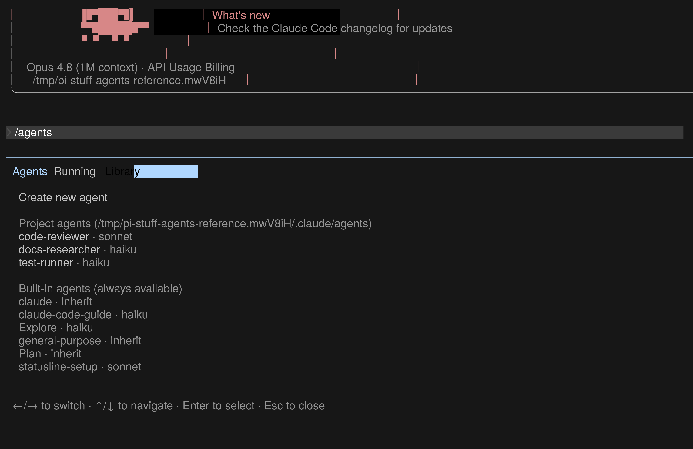
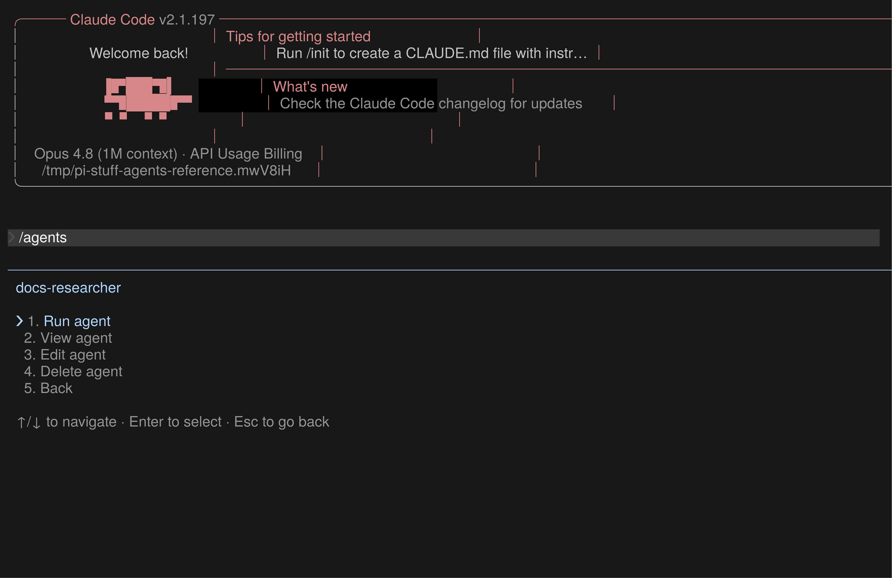
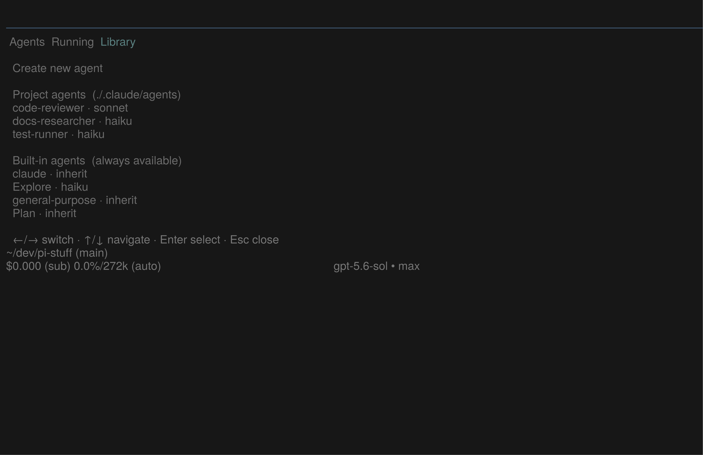
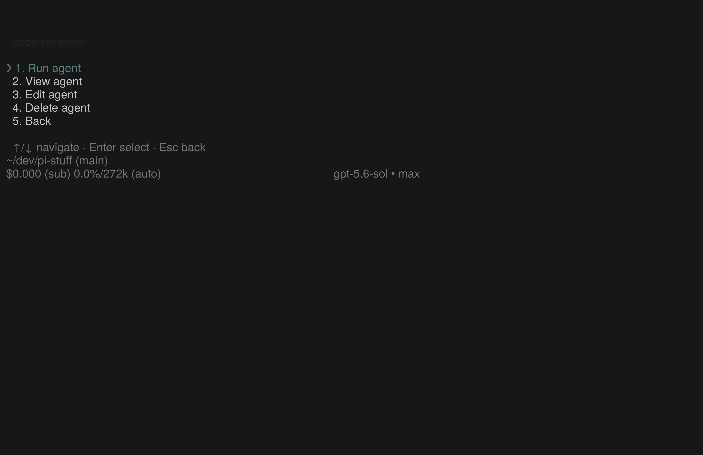

# TUI reference prototypes

This directory contains disposable, fixture-driven prototypes for decisions that must be judged inside the real Pi Host. They are engineering evidence, not publishable Capability code.

The [Agents UI reference report](./agents-ui-reference-report.html) presents the six matching Claude Code and Pi PTY frames, the current recommendation, and the review method in one browser-readable document. The report organizes evidence; it does not replace native-terminal acceptance.

The [Transcript UI reference report](./transcript-ui-reference-report.html) compares four released Claude Code `2.1.220` states with three fixture-driven Pi `0.83.0` states. It asks one product-level question: whether tools, diffs, tests, contextual errors, and foreground Agent work should share one compact, expandable presentation inside the conversation.

The [Tool UI comparison report](./tool-ui-comparison-report.html) narrows the next decision to default transcript density. It compares the same four deterministic tool operations as individual compact rows, one semantic exploration summary, or a bounded summary with two representative child rows. All three variants share one non-floating Tool Details Command Dialog rendered below the transcript divider.

The [Agent roster comparison report](./agent-roster-comparison-report.html) records the selected UI direction. It keeps the accepted launch/settled transcript lifecycle and compares three native Pi below-editor rosters: one-line vertical sessions, grouped batches, and a horizontal session rail. Eleven Pi `0.83.0` PTY frames exercise default, selected, completed, non-overlay detail, and `64 × 28` states. Three additional genuine Claude Code `2.1.197` frames verify Down-to-manage, child selection, and Enter-to-child behavior. The maintainer selected the one-line vertical roster; later overflow, long-label truncation, and linger rules remain open.

The [Work Todo comparison report](./work-todo-comparison-report.html) asks one large UI question: how much session Todo should remain visible while the full Work surface is closed. It compares a Claude-like bounded checklist, a one-line Work strip, and an on-demand-only default beside the already-selected Agent roster. Nine native Pi `0.83.0` frames cover running, needs-input, and `64 × 28` states. Genuine Claude Code `2.1.220` frames establish the current five-row-plus-overflow reference. The maintainer selected variant A: at most five task rows plus one overflow row above the editor, with zero height when empty.

The [Work BTW comparison report](./work-btw-comparison-report.html) compares three side-question lifecycles: a Claude-like single exchange, an ephemeral multi-turn side thread, and a detached silent mailbox. Eleven native Pi `0.83.0` frames cover dialog, history, draft restoration, Bring-to-main, zero-row return, and `64 × 28` states. Five genuine Claude Code `2.1.220` frames establish the released one-answer lifecycle and prove that the main turn continues while BTW owns the temporary surface. The maintainer selected variant A: one no-tool answer, separate session-local history, no follow-up composer, and zero normal-screen rows while closed. A later source audit selected an owned fork of `@juicesharp/rpiv-btw@2.3.1`; the higher-download multi-turn and tool-capable alternatives remain behavior evidence rather than fork bases.

The [Work Agent lifecycle report](./work-agent-lifecycle-spike-report.html) freezes how background completion, failure, stop, human-required input, and permission requests share the accepted transcript, Todo, roster, and Command Dialog. One genuine Claude Code `2.1.220` permission frame establishes the released interaction; nine native Pi `0.83.0` frames prove non-overlay BTW preemption and restoration, editor-owned typing while an Agent needs input, selection-before-stop, and mixed terminal states at both `100 × 32` and `64 × 28`. The spike establishes UI ownership through public Pi APIs. Pi Stuff has since selected unrestricted normal work with a narrowly tested destructive-command circuit breaker; it is not a sandbox or a claim to detect every dangerous equivalent.

The older [Agent activity comparison report](./agent-activity-comparison-report.html) is retained as historical evidence for where child-Agent work could live. Its lifecycle separation remains useful, but its recommended above-editor bounded widget has been superseded by the current below-editor roster direction.

## Claude Code Agents reference

Claude Code `2.1.197` is the last release in which `/agents` opens the tabbed Agents surface. The [official changelog](https://github.com/anthropics/claude-code/blob/main/CHANGELOG.md) records the original `/agents` entry point in `1.0.60`, the later `Running` and `Library` layout, and removal of the wizard in `2.1.198`. The reference release was installed in an isolated temporary directory with updates and nonessential network traffic disabled. The current Claude Code installation was not changed.

No Claude Code source was inspected or used. The observations below come from the official changelog and keyboard interaction with the released executable in a real PTY.

All reference and translation frames use the same `100 × 32` terminal grid.

### Observable interaction contract

- `/agents` leaves the existing conversation visible and temporarily replaces the editor area. It is not a floating window, card, or separate GUI.
- One divider introduces a quiet header row: `Agents`, `Running`, and `Library`.
- `Running` shows live instances or a plain empty state.
- `Library` puts creation first, then groups definitions by meaningful scope. The model is secondary text on the same row.
- Arrow keys move between tabs and rows; Enter opens the selected item.
- Create and Agent-action steps replace the body in the same region. Escape returns one level, then closes the surface and restores the editor.
- The bottom hint changes with the current step. There are no decorative borders, shadows, rounded panels, or persistent sidebars.

These points define the interaction skeleton. Claude-specific paths, labels, built-in Agent names, and colors are evidence, not Pi Stuff product decisions.

### Released Claude Code 2.1.197





The additional empty-state frame is [Claude Code 2.1.197 Running](./artifacts/claude-2.1.197-agents-running.png).

## Native Pi translation

[`agents-hub-reference.ts`](./agents-hub-reference.ts) translates only the observable interaction contract into a real Extension for the repository-certified Pi Host. It uses non-overlay `ctx.ui.custom()`, so the Host continues to own the transcript, theme, terminal lifecycle, footer, and restored editor.

Run it from the repository root:

```bash
./node_modules/.bin/pi \
  --no-session \
  --no-extensions \
  -e ./docs/prototypes/tui/agents-hub-reference.ts \
  --no-skills \
  --no-prompt-templates \
  --no-context-files \
  --no-tools \
  --no-themes \
  --offline \
  --approve
```

Then enter `/prototype-agents`.

[`agents-hub-reference.tape`](./agents-hub-reference.tape) replays the Running → Library → Agent-actions flow against the real Host and writes temporary GIF, ANSI, and PNG evidence under `/tmp`.





The additional empty-state frame is [Pi 0.83 Running](./artifacts/pi-0.83-agents-running.png).

## Conversation transcript reference

The current Claude Code frames use direct, harmless local shell commands, with model responses disabled. They show the released binary's default collapsed result, detailed transcript, live in-place update, and contextual error behavior at `100 × 38` cells:

- [Collapsed result](./artifacts/claude-2.1.220-inline-collapsed.png)
- [Detailed transcript](./artifacts/claude-2.1.220-inline-expanded.png)
- [Running result](./artifacts/claude-2.1.220-inline-running.png)
- [Contextual error](./artifacts/claude-2.1.220-inline-error.png)

[`transcript-content-fixture.ts`](./transcript-content-fixture.ts) uses Pi's public `SessionManager` to generate deterministic success and error sessions. [`transcript-content-blocks.ts`](./transcript-content-blocks.ts) registers an inert fixture tool so the real Host can pair and render those stored calls and results. No model, network, file read, or shell execution occurs inside the prototype tool.

Reproduce the `100 × 32` Pi frames from the repository root:

```bash
FREEZE_BIN=/tmp/pi-proto-bin/freeze \
  ./docs/prototypes/tui/capture-transcript-content-blocks.sh
```

The generated frames are [compact success](./artifacts/pi-0.83-transcript-compact-success.png), [expanded detail](./artifacts/pi-0.83-transcript-expanded-detail.png), and [compact error](./artifacts/pi-0.83-transcript-compact-error.png).

## Tool UI density comparison

[`tool-ui-comparison-fixture.ts`](./tool-ui-comparison-fixture.ts) generates three sessions with identical tool calls and results. [`tool-ui-comparison.ts`](./tool-ui-comparison.ts) changes only their transcript projection and provides the shared Tool Details surface. The registered prototype tool is inert: it performs no model, network, file, or shell I/O.

Reproduce all four `100 × 32` Pi frames from the repository root:

```bash
FREEZE_BIN=/tmp/pi-proto-bin/freeze \
  ./docs/prototypes/tui/tool-ui-comparison-capture.sh
```

The capture resolves the certified Pi version through [`scripts/pi-host-contract.ts`](../../../scripts/pi-host-contract.ts) and runs in an isolated temporary Agent directory. It does not modify the maintainer's Pi settings. That temporary settings layer unbinds both `app.tools.expand` and `app.tree.filter.cycleForward` before the prototype registers `Ctrl+O`; the final Pi Stuff shortcut remains a product decision.

The generated frames are [individual rows](./artifacts/pi-0.83-tool-ui-individual.png), [one semantic summary](./artifacts/pi-0.83-tool-ui-grouped.png), [bounded group](./artifacts/pi-0.83-tool-ui-bounded.png), and the shared [Tool Details Command Dialog](./artifacts/pi-0.83-tool-details-dialog.png).

## Agent activity location comparison

[`claude-2.1.197-agent-activity-mock.ts`](./claude-2.1.197-agent-activity-mock.ts) implements a localhost-only Anthropic Messages fixture that makes two tool-free child Agents finish after a deterministic delay. [`claude-2.1.197-agent-activity-capture.sh`](./claude-2.1.197-agent-activity-capture.sh) drives the released Claude Code `2.1.197` binary inside an isolated HOME and `100 × 32` PTY. It captures foreground running, foreground finished, global detailed transcript, background running, background finished, roster management, child selection, and Enter-to-child states. The script verifies both the displayed version and the Linux x64 release binary checksum before capture.

Reproduce the released-Claude frames from the repository root without using a Claude account or external model API:

```bash
CLAUDE_2197_BIN=/path/to/claude-code-2.1.197 \
FREEZE_BIN=/tmp/pi-proto-bin/freeze \
  ./docs/prototypes/tui/claude-2.1.197-agent-activity-capture.sh
```

The fixture uses a dummy API key approved only inside the temporary configuration. It does not read the maintainer's Claude settings, credentials, sessions, or project files. The generated frames are [foreground running](./artifacts/claude-2.1.197-agent-activity-foreground-running.png), [foreground finished](./artifacts/claude-2.1.197-agent-activity-foreground-finished.png), [global detailed transcript](./artifacts/claude-2.1.197-agent-activity-expanded.png), [background running](./artifacts/claude-2.1.197-agent-activity-background-running.png), [background finished](./artifacts/claude-2.1.197-agent-activity-background-finished.png), [roster management](./artifacts/claude-2.1.197-agent-activity-roster-manage.png), [selected child](./artifacts/claude-2.1.197-agent-activity-roster-manage-child.png), and [child session view](./artifacts/claude-2.1.197-agent-activity-roster-agent-view.png).

[`agent-activity-comparison-fixture.ts`](./agent-activity-comparison-fixture.ts) generates running and completed static states for three variants. [`agent-activity-comparison.ts`](./agent-activity-comparison.ts) projects a blocking foreground parallel group for the Claude-derived variant, then background launch-and-notification lifecycles for the tintinweb-derived and synthesis variants. The states are intentionally not presented as identical execution semantics. Its registered tool is inert and performs no model, Agent, network, file, or shell I/O.

Reproduce all six `100 × 32` frames from the repository root:

```bash
FREEZE_BIN=/tmp/pi-proto-bin/freeze \
  ./docs/prototypes/tui/agent-activity-comparison-capture.sh
```

The capture also runs the synthesis at `64 × 28` as a truncation and editor-availability smoke test. The tintinweb-derived running frame intentionally includes its two non-overlay live surfaces so its actual density can be judged. The original conversation overlay and Agent-specific statusline are excluded by the established Pi Stuff UI constraints.

## Agent roster density comparison

[`agent-roster-comparison-fixture.ts`](./agent-roster-comparison-fixture.ts) generates deterministic running and completed sessions with four child Agents. [`agent-roster-comparison.ts`](./agent-roster-comparison.ts) projects the same data as a vertical roster, grouped batches, or a horizontal rail. It uses Pi's public below-editor widget and terminal-input APIs. Down enters management from an empty editor; arrow keys select; Enter opens a non-overlay custom detail surface while the roster and footer are temporarily hidden.

Reproduce all eleven Pi frames from the repository root:

```bash
FREEZE_BIN=/tmp/pi-proto-bin/freeze \
  ./docs/prototypes/tui/agent-roster-comparison-capture.sh
```

The capture exercises each variant's running, selected, and completed frames, plus the vertical roster's detail surface and a `64 × 28` four-Agent smoke state. Its tool performs no Agent, model, network, file, or shell I/O. The narrow frame does not establish overflow or actual long-label truncation. Completed fixtures prove only the proposed immediate-linger layout; they do not establish a real timer or lifecycle transition.

## Work Todo normal-screen comparison

[`work-todo-comparison-fixture.ts`](./work-todo-comparison-fixture.ts) generates deterministic running and blocked sessions for a bounded checklist, one-line Work strip, and on-demand-only Todo. [`work-todo-comparison.ts`](./work-todo-comparison.ts) keeps the transcript, editor draft, and selected vertical Agent roster constant while changing only the Todo surface. The prototype tool is inert and performs no model, Agent, network, file, or shell I/O.

Reproduce all nine Pi frames from the repository root:

```bash
FREEZE_BIN=/tmp/pi-proto-bin/freeze \
  ./docs/prototypes/tui/work-todo-comparison-capture.sh
```

The capture records running, blocked, and `64 × 28` states for all three variants. It proves the layout and public Pi API path, not live Todo mutation or reload recovery.

[`claude-2.1.220-task-list-mock.ts`](./claude-2.1.220-task-list-mock.ts) supplies seven deterministic TaskCreate/TaskUpdate records to the genuine released Claude Code `2.1.220` binary over localhost. [`claude-2.1.220-task-list-capture.sh`](./claude-2.1.220-task-list-capture.sh) verifies the release binary checksum, isolates HOME and configuration, blocks external proxy traffic, and captures working, hidden, restored, mixed, and completed-idle states without a user Claude account or external model API.

```bash
CLAUDE_21220_BIN=/path/to/claude-code-2.1.220 \
FREEZE_BIN=/tmp/pi-proto-bin/freeze \
  ./docs/prototypes/tui/claude-2.1.220-task-list-capture.sh
```

## Work BTW lifecycle comparison

[`work-btw-comparison-fixture.ts`](./work-btw-comparison-fixture.ts) generates deterministic sessions for a one-answer exchange, an ephemeral side thread, and a detached mailbox. [`work-btw-comparison.ts`](./work-btw-comparison.ts) renders each through Pi's public non-overlay custom-UI path while preserving the same main transcript, bounded Todo, editor draft, and vertical Agent roster. The prototype performs no model, Agent, network, file, or shell I/O.

Reproduce all eleven Pi frames from the repository root:

```bash
FREEZE_BIN=/tmp/pi-proto-bin/freeze \
  ./docs/prototypes/tui/work-btw-comparison-capture.sh
```

The capture verifies both `100 × 32` and `64 × 28` terminal states. It asserts that BTW uses a divider-led full-width surface, hides Suite-owned Todo and Agent chrome while open, restores the exact captured editor draft on close, and leaves no normal-screen BTW row. The static mailbox proves only the proposed layout; it does not prove a production background-request lifecycle.

[`claude-2.1.220-btw-mock.ts`](./claude-2.1.220-btw-mock.ts) supplies a delayed main response and deterministic side answers to the genuine released Claude Code `2.1.220` binary over localhost. [`claude-2.1.220-btw-capture.sh`](./claude-2.1.220-btw-capture.sh) verifies the release checksum, isolates HOME and configuration, blocks external proxy traffic, and captures main-running, BTW-answering, answered, main-resumed, and BTW-history states without a user account or external model request.

```bash
CLAUDE_21220_BIN=/path/to/claude-code-2.1.220 \
FREEZE_BIN=/tmp/pi-proto-bin/freeze \
  ./docs/prototypes/tui/claude-2.1.220-btw-capture.sh
```

## Work Agent lifecycle and input ownership

[`work-agent-lifecycle-machine.ts`](./work-agent-lifecycle-machine.ts) is a pure reducer for BTW suspension, permission resolution, persistent human-input attention, roster selection, and stop settlement. [`work-agent-lifecycle-spike.ts`](./work-agent-lifecycle-spike.ts) projects those states through one Pi Stuff-owned custom editor and one non-overlay custom surface. [`work-agent-lifecycle-spike-fixture.ts`](./work-agent-lifecycle-spike-fixture.ts) supplies a deterministic transcript; no model, Agent, permission policy, network, or tool execution occurs.

Reproduce all nine native-Pi frames from the repository root:

```bash
FREEZE_BIN=/tmp/pi-proto-bin/freeze \
  ./docs/prototypes/tui/work-agent-lifecycle-spike-capture.sh
```

The capture verifies both permission choices, exact BTW and main-draft restoration, continued editor typing after human-required input arrives, explicit selection before `x` stops an Agent, and mixed `done` / `failed` / `stopped` / `waiting` rows at `100 × 32` and `64 × 28`. Production code must put `ctx.ui.custom()` and `ctx.ui.setEditorComponent()` behind one Suite coordinator; an Extension cannot reliably preempt an unrelated third-party dialog.

## Compact footer lifecycle acceptance

[`footer-shell-capture.ts`](./footer-shell-capture.ts) loads the production `conversation-ui` Capability Module and adds
one capture-only Command Dialog shortcut. [`footer-shell-fixture.ts`](./footer-shell-fixture.ts) supplies a deterministic
persisted CJK transcript and offline model metadata. The harness does not call a model or modify user settings.

Reproduce the nine native-Pi frames from the repository root:

```bash
FREEZE_BIN=/tmp/pi-proto-bin/freeze \
  ./docs/prototypes/tui/footer-shell-capture.sh
```

The [HTML report](./footer-shell-report.html) covers fixed `100 × 32` and `64 × 28` normal, dialog, and restored states,
plus a live `100 → 64 → 100` resize cycle. The script asserts one normal footer row, absence of footer/draft/floating chrome
inside the Command Dialog, project/branch/model/context presence after every restoration, and exact CJK draft recovery.

## Preview standard

For future Pi Stuff UI decisions:

1. Observe the relevant released reference behavior first, including an older release when the current one removed that behavior.
2. Implement the proposed state as a disposable, fixture-driven Extension loaded by the repository-pinned Pi Host.
3. Use `tmux` to fix the terminal grid and [Charmbracelet Freeze](https://github.com/charmbracelet/freeze#screenshot-tuis) to turn the captured ANSI cells into reviewable static images without window decoration.
4. Use [VHS](https://github.com/charmbracelet/vhs) when timing, navigation, or state transitions need a repeatable recording.
5. Perform the acceptance pass in the maintainer's native terminal and font, including resize, keyboard focus, Chinese IME, wrapping, and narrow-width behavior.

HTML may still compare rough information architecture. It cannot approve TUI appearance or interaction because it does not exercise Pi's renderer, focus ownership, keyboard path, terminal-cell widths, or resize behavior.

Freeze and VHS are evidence renderers rather than a pixel guarantee for every terminal emulator. The target native-terminal pass remains authoritative.
