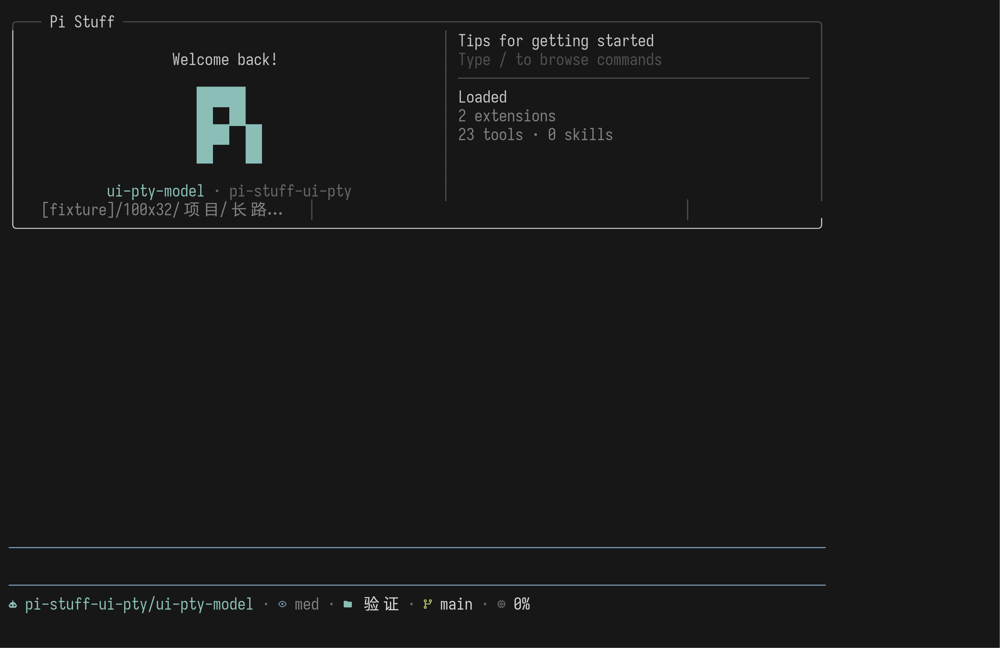
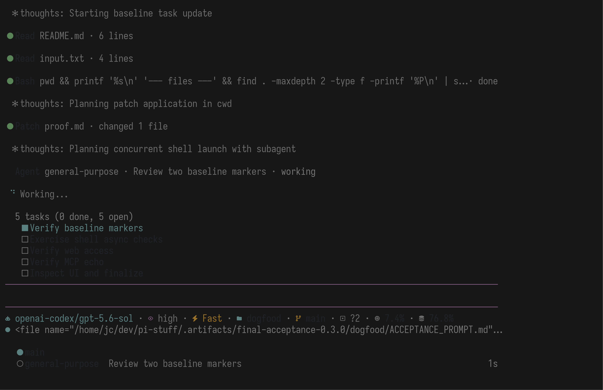
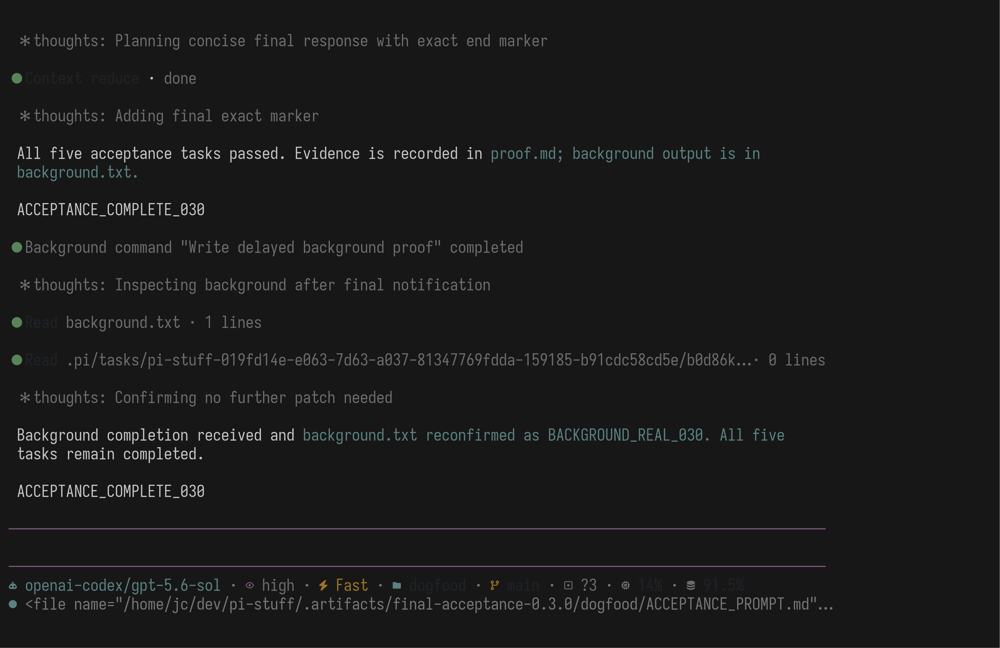
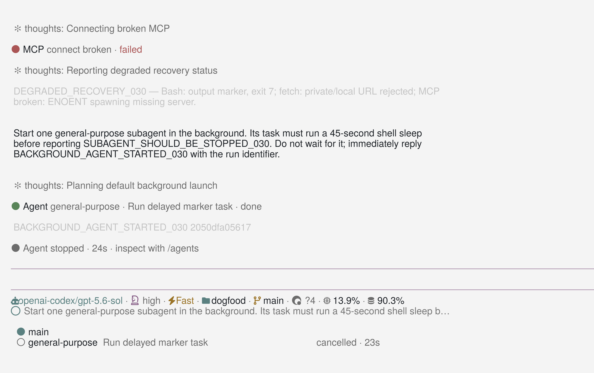
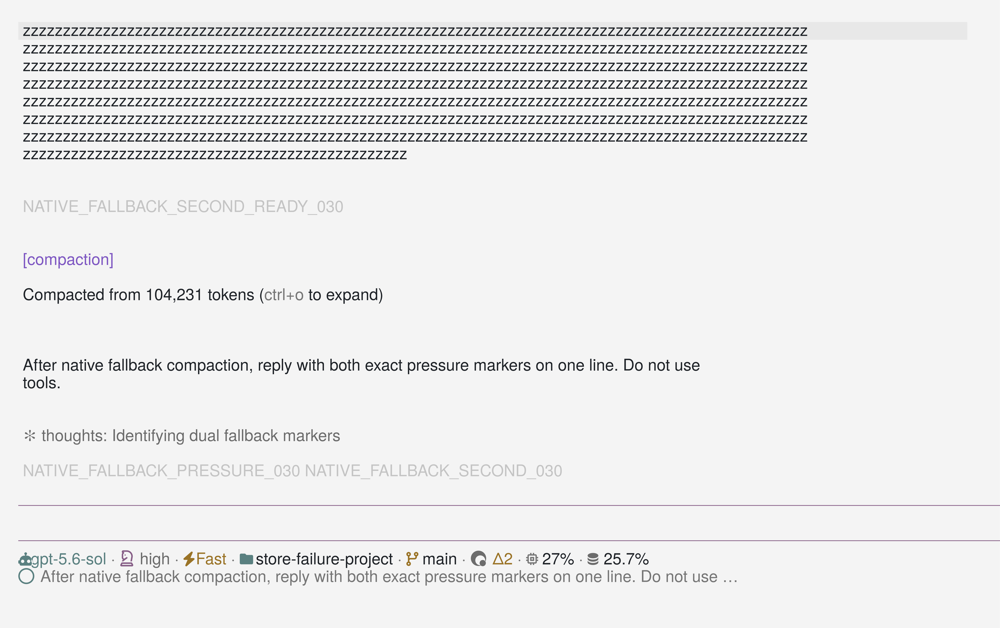

# Pi Stuff 0.3.0 最终验收报告

> **历史验收记录。** 本文保留 2026-08-05 的安装与验收环境，不代表当前 Host 或安装流程；当前认证以
> [`docs/compatibility.md`](../compatibility.md) 为准。

日期：2026-08-05 
目标版本：`@jczhang02/pi-stuff@0.3.0` 
Pi Host：`0.83.0`

## 人话结论

Pi Stuff 0.3.0 已经达到可以作为日常 Pi 配置使用的状态。它不是“源码里看起来做完了”，而是已经从最终 tarball 安装进真实 Settings Layer，并在真实 Pi TUI、真实 OpenAI Codex 模型中完成了写文件、Tools、Thinking、Todo、BTW、Agents、后台命令、Monitor、Goal、Web、MCP、Codex、RTK、Magic Context、故障退化和冷 Resume。

三个最重要的判断：

1. **能用。** 最终安装只加载 `packages/pi-stuff-current`，真实模型能够连续完成综合任务，退出再恢复后仍能继续。
2. **好用。** Welcome、两行底部信息、Todo、Tool 行、Thought、Fleetview 和全宽 Command Dialog 已统一为对话优先、无浮窗的 TUI；普通宽度、窄屏和 resize 均经过真实 PTY。
3. **能出色完成指令。** 综合任务一次完成了五项 Todo、前后台命令、Monitor、Web、MCP、subagent、图片检查和文件修改；独立 Goal 又完成了精确字节级文件验收。预期失败不会让主 Agent 停住。

Magic Context 仍是可替换的 Context Engine，不是新的 Session 数据库。Pi 的 JSONL 继续保存完整原始记录。正式配置保留 Pi 原生自动压缩作为**接管前故障兜底**；Magic 健康时在更早阈值独立整理，Pi 不产生原生摘要。

## 实际安装状态

| 项目 | 结果 |
|---|---|
| Aggregate | `@jczhang02/pi-stuff@0.3.0` |
| Release tarball | `.artifacts/release/jczhang02-pi-stuff-0.3.0.tgz` |
| Release SHA-256 | `6fdb2a410ad38c202dffd08a416e7119390887d95d06f47748737556dfbcbed0` |
| 不可变安装目录 | `~/.pi/agent/packages/pi-stuff-releases/0.3.0-6fdb2a410ad3/package` |
| 稳定入口 | `~/.pi/agent/packages/pi-stuff-current` |
| Settings packages | 只有 `packages/pi-stuff-current` |
| Thinking | `hideThinkingBlock: false`，由 Pi Stuff 实时 Thought UI 接管 |
| Compaction | `enabled: true`，仅作为 Magic 接管前的原生故障兜底 |
| 回滚点 | `~/.pi/agent/.pi-stuff-backups/final-0.3.0-20260805T1733/` |
| Release commit | `1581958e73194e76e89b2121bf4206f442155402`，GPG Good signature |
| 验收竞态修复 | `2facc4355313d61f5b0340797f2a8a9fe5fc0c47`，GPG Good signature |

## 真实界面

### Welcome 与底部信息

官方 Pi ASCII 标识、模型信息和目录信息属于可滚动 Welcome；底部第一行按模型、Thinking、Fast、目录、Git、Context、缓存和额度组织，第二行只保留上一次 Prompt。字段按完整语义降级，不把尾巴挤成 `tx… done`。

### 真实综合任务进行中

真实 `gpt-5.6-sol` 同时使用 Todo、统一 Tool 行和 Fleetview。Fleetview 位于底部信息下方；静止帮助槽保持空白，进入管理才原位显示按键提示。

### 综合任务完成

综合任务留下 `ACCEPTANCE_COMPLETE_030`，随后后台完成通知能够触发主 Agent 继续检查，而不是把后台结果丢失或要求用户再发一条消息。

### Resume、故障和 Agent 停止

冷 Resume 后 Tool 行没有退回 Raw 样式。Bash、Web 和 MCP 的预期失败各自使用同一状态槽；主 Agent 继续回复 `DEGRADED_RECOVERY_030`。后台 Agent 通过 `/agents` 停止后显示 `Agent stopped`，其 45 秒子进程已不存在。

### Magic 不可用时的原生兜底

把 `XDG_DATA_HOME` 指向普通文件后，Magic 因 `ENOTDIR` 在接管前退出；真实 Pi 原生 `/compact` 随后压缩了 `104,231` tokens，JSONL 标记 `fromExtension: false`，压缩后模型仍准确回复两个压力标记。这条路径只用于 Magic 尚未接管的故障，不会和健康 Magic 叠加。

## 真实模型验收记录

主验收 Session：

`.artifacts/final-acceptance-0.3.0/real-model-sessions/2026-08-05T09-43-55-235Z_019fd14e-e063-7d63-a037-81347769fdda.jsonl`

SHA-256：`cc14c9770b2a781539cd3f98c54cde2247337410648e248f95b4f28fcbb6b52e`

它包含 140 条原始 Session entries，实际 Tool 结果包括：

| 能力 | 真实结果 |
|---|---|
| Todo | 5 次 `TaskCreate`、10 次 `TaskUpdate`，最终 5/5 completed |
| 文件修改 | `apply_patch` 创建并修改 `proof.md`；Goal 创建 `goal-proof.txt` |
| Background Shell | 延迟写入 `BACKGROUND_REAL_030`，主 Agent 同时继续工作 |
| Monitor | 等到 `MONITOR_REAL_030`，无对话轮询 |
| Web | `fetch_content` 读取 pi.dev，`web_search` 找到官方 Package 页面 |
| MCP | 损坏 server 不阻塞 `local_echo` 返回 `MCP_REAL_030` |
| Agents | 前台只读复核成功；后台 Agent 启动后可从 `/agents` 停止 |
| View Image | 真实读取本报告所用的 TUI PNG |
| BTW | 回答 `PI_STUFF_030_REAL_ACCEPTANCE`；只保存为 `pi-stuff-btw/history/v1` custom entry，没有进入主 user/assistant transcript |
| Goal | 创建字节串 `GOAL_REAL_030\n`，验证 `exact_match=True` 后调用 `goal_complete` |
| 故障退化 | Bash exit 7、私网 URL 拒绝、损坏 MCP 均失败可见，随后正常回复 |
| Magic 手动压缩 | 53,297 tokens；唯一边界 `source: magic-context`，原生边界 0 |
| 压缩后召回 | Agent 自主使用 `ctx_search` 与 `ctx_expand` 找回两个精确早期标记 |
| 冷 Resume | 再次准确回复两个早期标记与 `GOAL_REAL_030` |

补充说明：若明确禁止模型使用 Context tools，仅让它凭当前投影视图猜早期字符串，它可能猜错；允许正常工作方式后，它会调用 Context search/expand 并准确找回。这符合“正常上下文或检索召回”的产品合同，也说明 Magic Context 是检索型连续性方案，而不是把全部旧文本永久塞在 Prompt 中。

## Magic-only 阻断验收

机器可读报告：[magic-context-real-acceptance.json](./magic-context-real-acceptance.json)。

这项测试使用最终 Aggregate tarball、真实 Pi、真实 provider 和真实 128k context window，并在隔离 Settings 中写死 `compaction.enabled: false`：

- 覆盖单个超长 Turn、大量 Tool 输出、多轮压力和冷 Resume；
- Provider 最大实际 Prompt 为 94,373/128,000 tokens（73.73%），官方 Magic 原始压力峰值为 113,765 tokens；
- Magic 产生 2 个严格前进的边界（ordinal 6 → 10），compartments 为 1–6 与 7–10，互不重叠；
- Pi 原生 boundary 与 lifecycle event 均为 0；
- Goal、Todo、JSONL、项目隔离和早期 canary 均保留；
- Prompt Cache 命中率实测为 46.64%，不以猜测代替测量。

第一次最终版本复测遇到 OpenAI 返回通用 server error，Pi 自动重试后任务本身恢复成功，但严格验收脚本仍按规则拒绝了该次运行。第二次完整运行零 Provider retry、零 Historian failure 并通过；失败工作区在完成诊断后移入系统回收站，没有拿“后来恢复了”冒充无感验收。

正式日用配置与这项阻断实验不同：日用保留 Pi 原生自动压缩开关，专门处理 Magic **在接管前**已经不可用的情况。健康 Magic 的实测手动边界仍为 `source: magic-context`，不存在双重摘要。

## 95 项执行清单证据索引

下面每一行覆盖原清单对应小节内的每个复选项；合计 95/95。原清单已经统一勾选，每项均在整节证据闭环后才标记完成。

| 清单小节 | 项数 | 证据 |
|---|---:|---|
| 0. Beads 与决策 | 6 | Beads 依赖图、关闭的排除项、保留的 Host-seam blocked 项、最终 publish 与 GitHub 镜像 |
| 1.1 Statusline | 8 | `verify-ui-pty` 的 100×32、64×28、48×22、32×18、24×16、中文、resize、resume；本报告 Welcome 截图 |
| 1.2 Fleetview | 6 | `verify-agents-pty`、综合任务 running/complete、真实 `/agents` stop；帮助槽与底部顺序截图 |
| 1.3 Welcome | 6 | 官方完整/紧凑 Pi mark 的真实 PTY 断言、不同宽度和主题渲染；Welcome 截图 |
| 2.1 Background Shell | 6 | packed/installed Work PTY、真实 `BACKGROUND_REAL_030`、进程树 TERM/KILL、bounded log 与退出后 `pgrep` 空结果 |
| 2.2 Monitor | 3 | Monitor matrix 与真实 `MONITOR_REAL_030`；主 Agent 无轮询继续工作 |
| 2.3 `/tasks` | 5 | packed/installed PTY、真实全宽 `Tasks · 0 current` Dialog、Esc 返回、窄屏和 stop matrix |
| 2.4 成熟来源 | 3 | Package research、`UPSTREAM.md`、许可证与 pinned fork；fork 只在 Monorepo 内 |
| 3. Context Adapter | 10 | 官方 `@cortexkit/pi-magic-context@0.33.1`、Adapter 测试、手动 Magic 边界、存储故障原生兜底、BTW/Agent projection |
| 3.1 Magic-only | 11 | 最终 0.3.0 tarball 的 `magic-context-real-acceptance.json`；真实手动压缩与冷 Resume Session |
| 4. 单一仓库 | 8 | `git worktree list` 只有 `~/dev/pi-stuff`；`~/dev` 只有 `pi-stuff`；依赖审计；远端最终 inventory |
| 5. 已实现能力回归 | 11 | 全套自动化、真实综合 Session、Goal、BTW、Agents、Web/MCP、Codex、RTK、`/ui` 与 Permission-absence 检查 |
| 6. 最终真实验收 | 12 | 备份、13 个 tarball、不可变安装、cold load、真实模型 fresh/resume/degraded、截图、最终 `bun run check`、签名提交与 push |

## 自动化与打包门

- `bun run release:pack` 从干净源码重新执行完整门，并产生 13 个不可变 tarball。
- `bun run check` 覆盖 unit/integration、Goal smoke、依赖审计、Package 安装、真实 Pi PTY 和 Aggregate closure。
- 最终主测试集为 `544 pass / 0 fail / 0 skip`；Goal 的 Node 测试与真实 runtime smoke 也全部通过。
- 完整日志为 `.artifacts/final-check-0.3.0.log`，SHA-256 `4ae1dcb537ed6775b0d4d29e6112c7e71c900dcc4ba97aa1292b5f3867a23505`。
- 最终门曾捕获 Agent matrix 读取并发 JSONL 尾行的竞态；读取器现只忽略尚未换行的写入中尾部、仍拒绝已完成的损坏记录，新增回归后真实 matrix 与完整门均通过。
- RTK 由交互 Shell 中的 certified source build 提供，版本 `0.42.4`；最终门通过显式 `RTK_BIN` 运行，避免非交互 PATH 造成假 skip。
- `/opt/bin/pi --version` 为 `0.83.0`；Settings-only cold RPC load 的命令包括 `agents`、`btw`、`codex`、`goal`、`mcp`、`rtk`、`tasks`、`tools`、`ui`，没有 Extension load error。

## 仓库与清理

- 正式源码 checkout 只有 `~/dev/pi-stuff`，`git worktree list` 只有 main。
- `~/dev` 的 `pi-*` 源码目录只有 `pi-stuff`。
- Magic、Web、MCP、Codex 与 RTK 的必要来源或 pinned Package 已进入 Monorepo/依赖闭包；本地旧 fork 已移入 Trash。
- `pi-stuff-current` 是安装状态的稳定符号链接，不是源码仓库。
- `jczhang02/magic-context`、`pi-web-access`、`pi-mcp-adapter`、`pi-codex-conversion`、`pi-extensions` 与 `pi-rtk-optimizer` 六个已迁移旧仓库均已删除。
- 最终远端只保留 `jczhang02/pi-stuff`；`jczhang02/pi-agent` 是历史参考配置，不属于 Pi Stuff 源码，也不会被运行时加载。

## 已知且诚实保留的边界

- `@jczhang02/pi-stuff-btw` 目前通过独立 provider call 保持主 transcript 隔离；Pi 0.83 尚未提供 transcript-free 的 Host-managed side-call 公共接口。现有行为已通过真实模型测试，不需要 fork Pi。
- Tool 相邻语义分组仍等待 Pi 提供可支持的 transcript transform seam；当前“一次操作一行 + `/tools` 局部详情”是稳定基线。
- Magic Context 是可替换试用方向。表现不满意时可以替换 Adapter 后的 Engine；Pi JSONL、项目文件与 `pi-stuff-current` 安装结构不需要迁移。
- Rewind、Permission、LSP、Plan/Ask、Loop/Cron、`/doctor`、捆绑 Skills、交互浏览器和浮窗明确不属于本轮产品范围。

## 最终判定

95 项清单全部有对应证据，GitHub inventory、Beads/GitHub 镜像、完整检查、签名提交、push 与干净 `main` 已共同闭环。Pi Stuff 0.3.0 可以投入日常使用。
