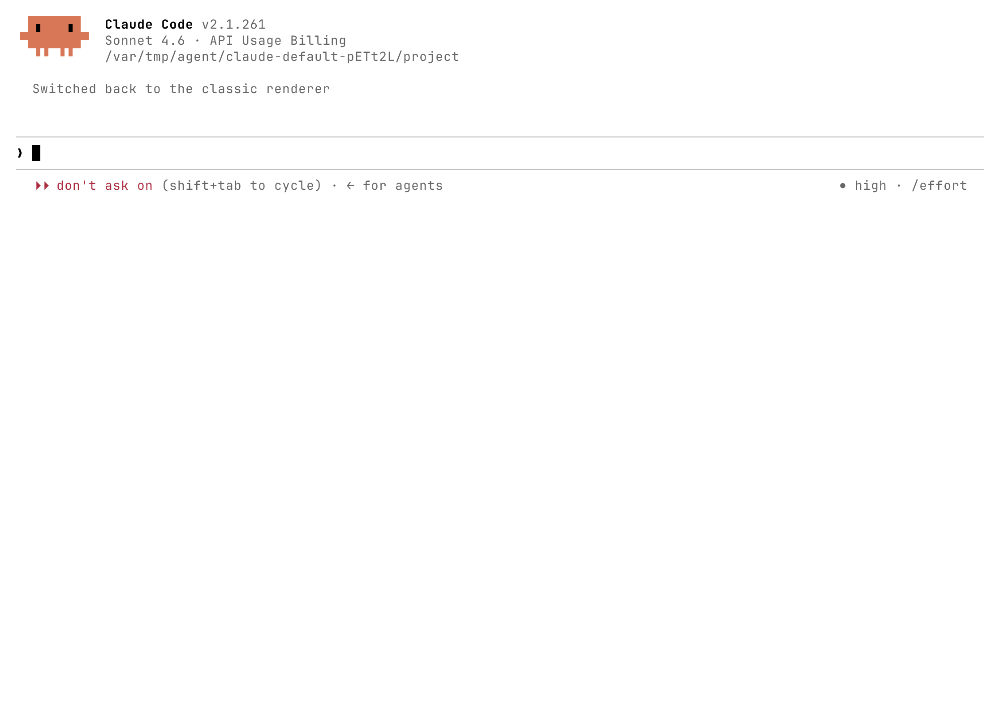
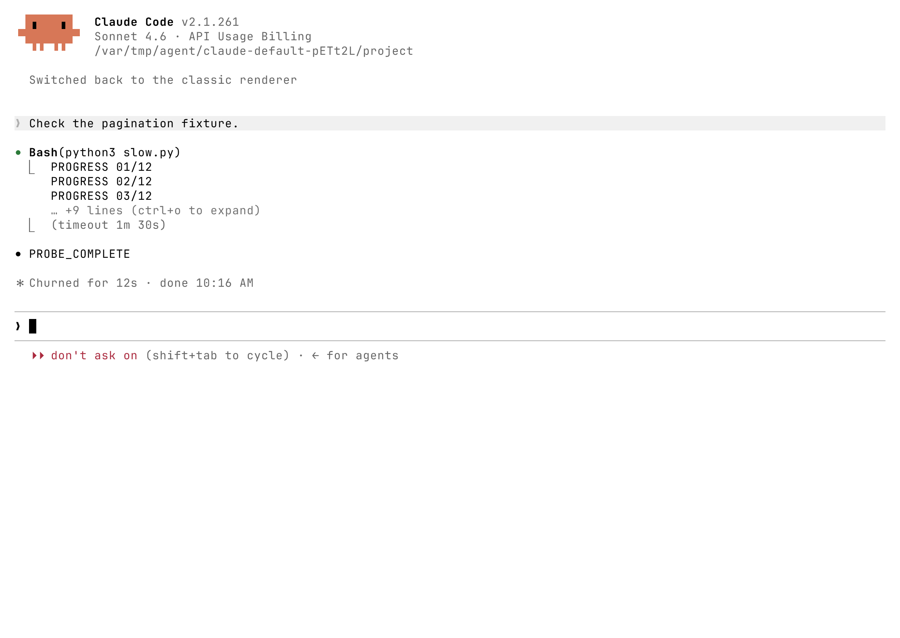
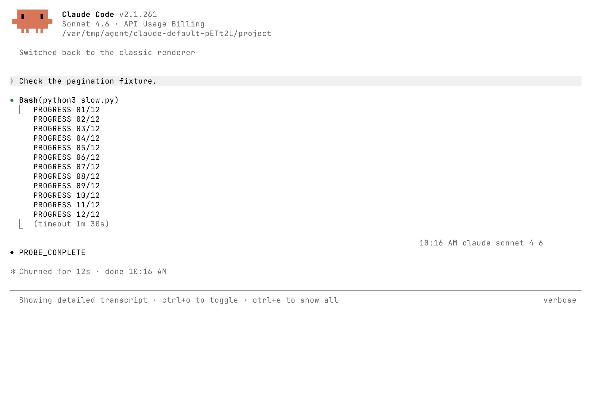
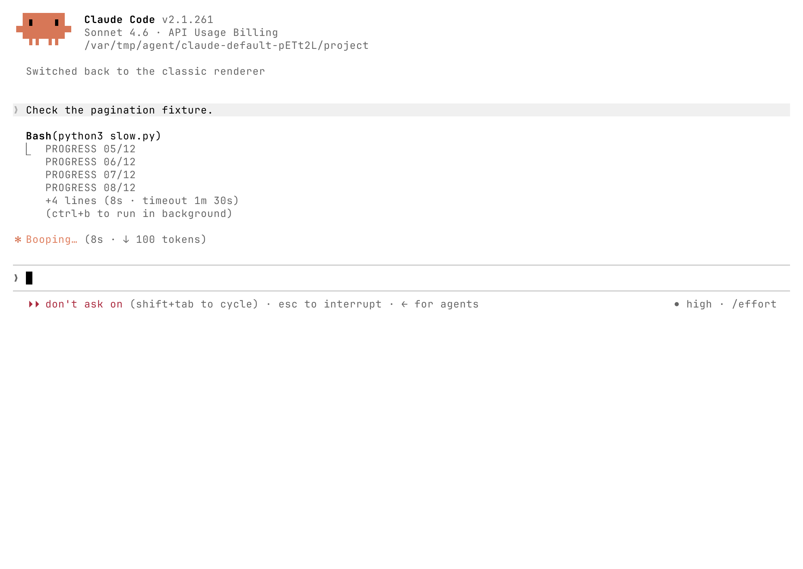
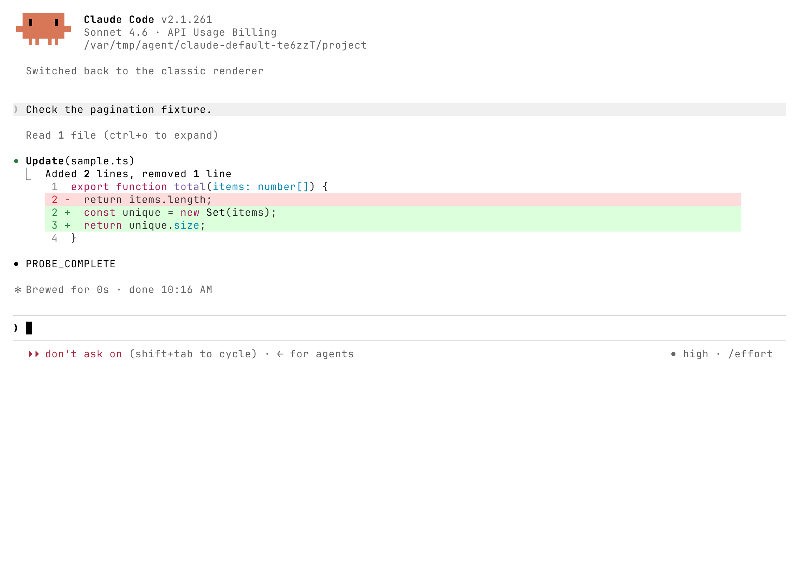
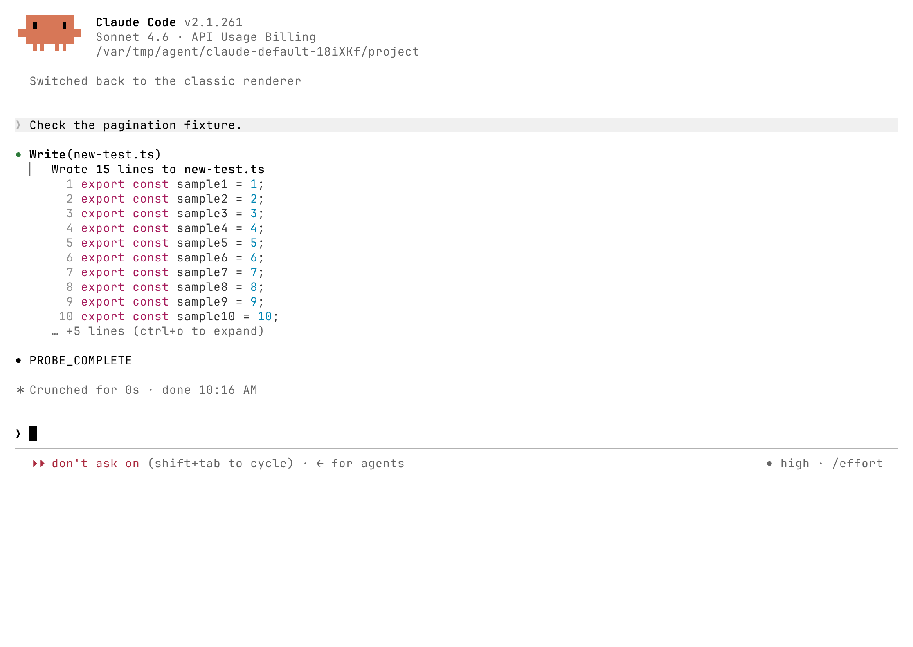
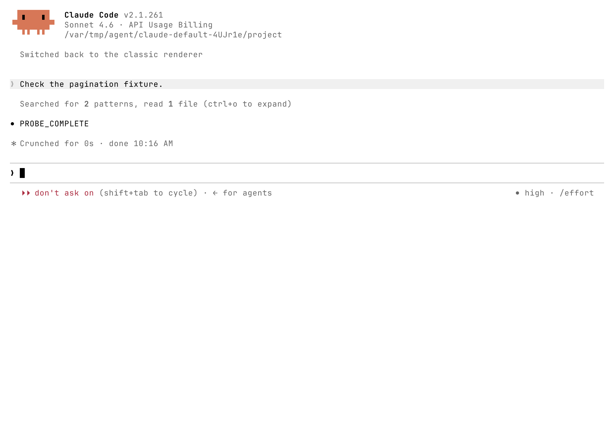

# Claude Code /tui default: tool blocks and disclosure

[简体中文](../i18n/zh-CN/research/claude-code-default-tui-2026-09-22.md) · [All captures](../../prototypes/ui-session/default-reference/README.md) · [UI spec](../ui-spec.md)

## What the previous study missed

A single Bash invocation can have multiple `⎿` blocks. The earlier probes covered short commands and interrupted running commands, but missed a completed command whose progress retained timeout metadata. They therefore did not establish a one-connector-per-tool rule.

This study uses the installed official Claude Code 2.1.261. Every retained run enters `/tui default` and records `Switched back to the classic renderer`. The command selects the renderer, not a permission mode. Official documentation distinguishes classic terminal scrollback and its transcript viewer from fullscreen mouse interaction. Do not transfer fullscreen click eligibility to Pi. [Commands](https://code.claude.com/docs/en/commands), [Renderer comparison](https://code.claude.com/docs/en/fullscreen#what-changes).

## One Bash call, two result blocks

The 12-second command printed twelve progress lines and received an explicit 90-second timeout. After completion, its output starts with one `⎿`; a second introduces `(timeout 1m 30s)`. Both survive Ctrl+O expansion. Output continuation and the hidden-line hint have no extra connector.

The controls matter:

| Input and execution                           | Completed display                          |
| --------------------------------------------- | ------------------------------------------ |
| Fast command, explicit 90-second timeout      | One output block, no timeout block         |
| Same fast command with a long command title   | Still one output block                     |
| 12-second command, explicit 90-second timeout | Output block plus timeout block            |
| 12-second command, no explicit timeout        | One output block                           |
| Actual timeout after one second               | One error block: exit 143 and timeout text |
| stdout plus stderr, successful command        | One combined output block in this fixture  |

The [manifest and per-case exchanges](../../prototypes/ui-session/default-reference/README.md) retain inputs and actual tool results. Inspecting the installed release's packaged renderer explains the first four cases: the Bash result path reads timeout metadata from the last progress event; its result renderer can append a separate timeout child. An explicit input alone did not produce that child in the fast probes. This is a finding about this release, not a universal timing threshold or a Pi requirement.

The user's screenshot adds `Allowed by auto mode classifier` as another child. That observation remains valid, but this study did not execute the classifier. Auto mode is Claude's permission system; it is not a result-layout requirement for Pi. [Official auto-mode documentation](https://code.claude.com/docs/en/auto-mode-config).

Neither “one connector per invocation” nor “one connector per stdout/stderr stream” describes these results. The useful layout unit is a displayed child block. Its first row carries `⎿`; its continuation rows align beneath the block's text.

## Other default-mode details

| Case                             | Observed compact view                                                                 | Ctrl+O                                                                          |
| -------------------------------- | ------------------------------------------------------------------------------------- | ------------------------------------------------------------------------------- |
| Two output lines                 | Both lines, no disclosure hint                                                        | Tool content unchanged; transcript chrome changes                               |
| Twelve output lines              | First three, then `… +9 lines (ctrl+o to expand)`                                     | All twelve                                                                      |
| Long command, 120 and 80 columns | Command title wraps onto a second row, then truncates                                 | Full command title                                                              |
| Running command                  | Recent output replaces older lines; elapsed time and configured timeout remain nearby | This study captures the running normal view, not every running transcript state |
| Empty successful command         | `(No output)`                                                                         | Same result                                                                     |
| Exit 3                           | Error line followed by stderr in one block                                            | Same error content                                                              |
| Small Edit                       | Change counts, syntax color and unchanged context around changed rows                 | Same Update diff; preceding Read becomes visible                                |
| Larger Edit                      | Full 20-line replacement hunk with surrounding context in a 72-row viewport           | No universal six-row Edit limit established                                     |
| Write, fifteen lines             | Ten highlighted source lines and `… +5 lines`                                         | Full content                                                                    |
| Glob, Read, Grep                 | `Searched for 2 patterns, read 1 file`, no `⎿`                                        | Three individual results                                                        |

The late running frame shows a later rolling window of the output already emitted at that moment. The completed compact view returns to the beginning of the result. This is observed behavior of this release, not a universal row-budget rule.

Ctrl+O changes Claude's global transcript view, including other calls and timestamps. A screenshot changing after Ctrl+O does not by itself prove that an individual short tool gained content. Pi's native click and Ctrl+O behavior remains its own contract, including toggling when both visual states happen to match.

## Changes worth considering for Pi Stuff

These are presentation proposals. The runnable prototype has not been changed by this research.

1. **Apply the agreed disclosure copy.** Remove `· expand` and `· collapse`. Show `n more lines` only for retained output hidden by the compact view. Place it after the preview, so it describes omitted output instead of competing with the result summary. Preserve native expansion even when no extra content is revealed. Long-title ellipses remain separate from output counts.
2. **Allow existing information to form separate child blocks.** Keep result summary and output together. A configured timeout or an upstream truncation notice with a log path can form another `⎿` block. Omit absent fields; do not create empty slots or a new permission system. Pi 0.85.1's Bash already accepts an optional timeout in seconds and exposes truncation/log-path details. Its stdout and stderr share the output accumulator, so do not invent a stream split. Showing configured timeout directly is simpler than copying Claude's progress-dependent visibility.
3. **Give long command titles two compact rows.** Current prototype titles truncate after one row. Two rows reveal more of the actual command while keeping a bounded preview; expansion retains the full title. Keep continuation aligned beneath the command text.
4. **Restore a little context in compact Edit.** Prefer a small local hunk containing unchanged context over isolated changed lines. For the user's three-line change, an enclosing function line and closing line explain where the edit belongs. Retain the current syntax colors and single line-number gutter. Do not copy Claude's unrestricted large-hunk height or invent a second diff engine; use context only when available from the real result.

Keep the existing Write three-row preview, Bash three-row completed preview, running output tail, Thoughts styling, Ls grouping, native user messages, footer and cancellation. Keep deterministic summaries; no test-output parser. Do not import classifier text, background-task controls, Claude's statusline or global transcript interaction.

## Method, limits and reproduction

There are 16 retained scenario/width runs and 86 frames. Each run uses a fresh temporary HOME, Claude config and project; an explicit tool allowlist and `dontAsk` permissions authorize only the fixture work. A localhost Anthropic-compatible SSE endpoint supplies tool calls. The official client executes Bash/Read/Edit/Write/Glob/Grep and returns the actual results before receiving `PROBE_COMPLETE`. No live inference, account credentials, copied personal config or host terminal changes are involved. The displayed billing/model label is client chrome for the dummy endpoint.

The [manifest](../../prototypes/ui-session/default-reference/manifest.json) records the binary hash, toolchain, dimensions and image hashes. Each case retains exact inputs, tool exchanges, mode confirmation, normal/detailed/restored PNGs, text and gzip-compressed raw ANSI. Most viewports are 120×42; the long-title check also uses 80×42, and the larger diff uses 120×72 to retain the full hunk. Font: JetBrainsMono Nerd Font Mono, Symbols Nerd Font Mono, LXGW WenKai Mono. Claude uses its light theme; the isolated PTY sets black default text and a white default background. These are terminal exports, not compositor screenshots.

To reproduce, create the sample files described by each case, serve its tool-use blocks through a local Messages endpoint, launch the pinned official client in isolated configuration, enter `/tui default`, submit the probe, and capture before/after Ctrl+O and after restoration. The two slow scripts emit twelve lines one second apart; only one supplies timeout=90000. The Edit file starts as a three-line function; the larger case defines item1..item28 and changes item4..item23. The Write case creates fifteen source lines. Exact tool inputs/results are retained with the frames.

Initial probes exposed setup failures: the dummy-key prompt was not handled, animated frames failed an idle-only capture, LSP recommendations covered code captures, and the export PTY initially had dark defaults despite a light client theme. The final retained runs handle the dummy key, capture active states as point-in-time frames, dismiss recommendations without installing plugins, and set the isolated palette before launch. All retained cases were rerun after the palette correction. Those setup failures are not renderer behavior.
