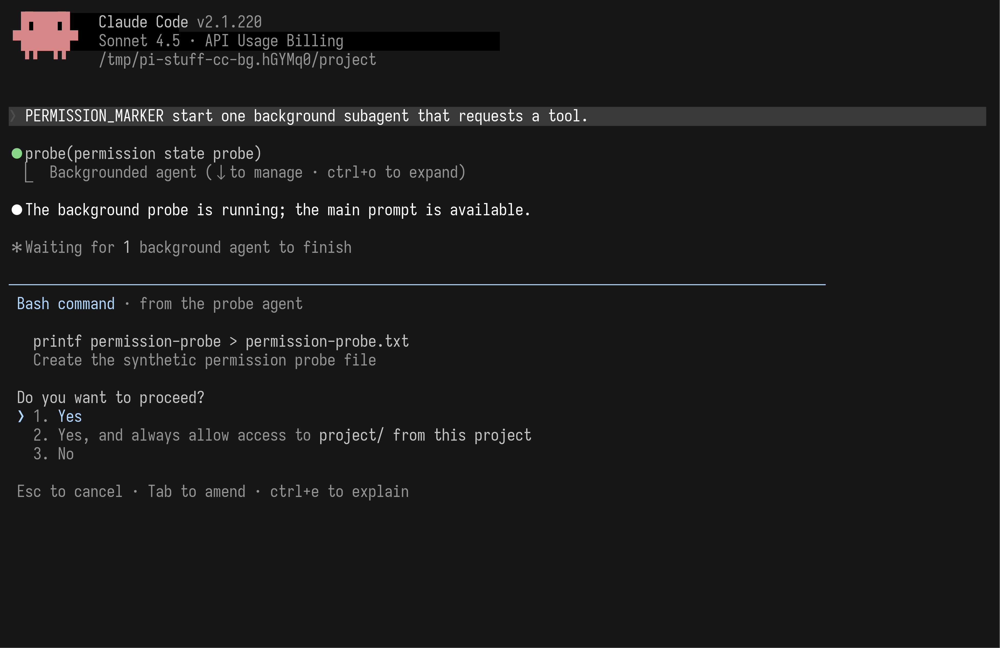

# Work background notification UI reference: Claude Code 2.1.220

**Research date:** 2026-08-01  
**Scope:** What the user sees when in-session subagents and background shell commands finish, fail, are stopped, or require permission; how those signals differ from `/tasks`, the below-prompt Agent roster, OS notifications, and the separate `claude agents` Agent View.

## Bottom line

Claude Code does not turn background work into one permanent dashboard. It assigns each fact to one of four surfaces:

1. **The originating tool record says what was launched.** A background Agent settles to a compact `Backgrounded agent` row and releases the main prompt.
2. **The below-prompt roster says what is happening now.** It is transient navigation for live subagents, not durable history.
3. **The transcript says what ended.** Completion, failure, and user stop produce compact terminal records; the parent Agent receives a real completion notification before it discusses the result.
4. **`/tasks` says what can still be managed in this session.** A successfully completed background subagent remains there until task-list cleanup; failed and stopped subagents leave. Background Bash has a different lifecycle and leaves when it ends.

The highest-priority exception is a **permission prompt**. A background subagent's tool request takes over the editor region in a full-width, divider-led confirmation surface, explicitly names the requesting Agent, and stays actionable until the user decides. Denying one request does not stop the Agent.

This does **not** establish a general “subagent asks the user a question” feature. Current official subagent documentation promises permission passthrough, not arbitrary clarifying questions, and a narrow 2.1.220 black-box probe could not make `AskUserQuestion` available to the tested custom subagent. Claude's generic **Needs input** state belongs to the separate full-session Agent View and must not be copied onto in-session subagents without a Pi Stuff product decision and implementation evidence.

For Pi Stuff, the Claude-like rule is therefore:

> The launch record is durable, the live roster is temporary, terminal outcomes return to the transcript, and only blocking permission replaces the editor. No floating window and no new statusline.

## Do not merge these three Agent UIs

| Surface | Unit represented | Lifetime | Entry | What it owns |
|---|---|---|---|---|
| Below-prompt Agent roster | Subagents inside the current conversation | While active, plus a short visual linger | Down from an empty editor | Live identity, selection, and entry to a child |
| `/tasks` | Background work owned by the current session | Session-local management lifetime | `/tasks` | Running shell/subagent details and stop action; successful subagent retention |
| Agent View | Independent full Claude Code sessions | Persistent across terminals and process restarts | `claude agents` | Cross-project dispatch, Needs input, reply, attach, stop, delete, pin, and grouping |

Anthropic explicitly says in-session subagents do not appear as separate rows in Agent View. Each Agent View row is a complete background Claude Code conversation, not a child of the current transcript ([Agent View documentation](https://code.claude.com/docs/en/agent-view)). Since 2.1.198, `/agents` also no longer opens the old subagent wizard; it tells the user to ask Claude or edit agent files instead ([subagent documentation](https://code.claude.com/docs/en/sub-agents)).

This naming boundary matters for Pi Stuff. A future session manager may borrow Agent View concepts, but the current Agent fork should not silently become a second persistent-session product.

## Evidence and provenance

### Official sources

Behavior was checked against Anthropic's current documentation and its official changelog at the Claude Code **2.1.220** tag:

- [Subagents: foreground/background behavior, permissions, completion delivery, `/tasks`, and API errors](https://code.claude.com/docs/en/sub-agents)
- [Interactive mode: shortcuts and background Bash](https://code.claude.com/docs/en/interactive-mode#background-bash-commands)
- [Commands reference](https://code.claude.com/docs/en/commands)
- [Keyboard bindings](https://code.claude.com/docs/en/keybindings)
- [Agent View](https://code.claude.com/docs/en/agent-view)
- [Terminal notifications](https://code.claude.com/docs/en/terminal-config#get-a-terminal-bell-or-notification)
- [Settings, including `preferredNotifChannel`](https://code.claude.com/docs/en/settings)
- [Notification hooks](https://code.claude.com/docs/en/hooks)
- [Official v2.1.220 changelog](https://github.com/anthropics/claude-code/blob/v2.1.220/CHANGELOG.md)

Official documentation is authoritative for supported behavior. Release observations below add concrete current UI and cleanup details; they do not broaden the documented contract.

### Released 2.1.220 black-box observation

The local Linux x64 release binary reported `2.1.220 (Claude Code)` and had SHA-256:

```text
674f61f20ff306f3100cf9200e4c36c4b70278b5bef2884549819b942a89c863
```

It was exercised in an isolated `100 × 32` tmux PTY with a temporary home, configuration directory, project, and deterministic localhost Anthropic Messages fixture. User credentials, Claude configuration, prior sessions, project source, browser integration, and external model APIs were unavailable. Proxy variables blocked non-local traffic; telemetry, updater, error reporting, and nonessential network behavior were disabled.

The fixture supplied only synthetic model prose and deterministic tool calls. Claude Code itself owned the renderer, keyboard routing, Agent lifecycle, permission UI, task registry, and transcript behavior. Consequently:

- the **layout, labels, state transitions, controls, and cleanup behavior** are genuine release observations;
- the **prompt, Agent task name, command, assistant prose, timings, and token counts** are synthetic test content;
- fixture assistant wording is not evidence of Anthropic's model behavior.

The checked-in permission image was produced from a genuine ANSI pane capture and rendered to PNG with the same `freeze`-based terminal capture method used by the existing [`claude-2.1.220-btw-capture.sh`](../prototypes/tui/claude-2.1.220-btw-capture.sh) harness. It is not a hand-built HTML mockup. The PNG is `3672 × 2381`, and its SHA-256 is:

```text
bdff5df564db5ff15d7d0a622a5fa535aba35a43686e0d77606a138317d670c6
```



The test command would have created `permission-probe.txt`. `Esc` was pressed at this screen; the file was confirmed absent, while the subagent continued and later completed. This makes the screenshot evidence of both the visual surface and the “deny one tool, do not kill Agent” lifecycle.

## Background subagent lifecycle

### 1. Launch releases the main prompt

As of 2.1.198, Claude Code runs subagents in the background by default unless the parent needs a result immediately. The original Agent tool record settles into a short background state, while the main prompt becomes usable. `Ctrl+B` or `Ctrl+X Ctrl+B` can also move a foreground Agent into the background ([subagent documentation](https://code.claude.com/docs/en/sub-agents), [keybindings](https://code.claude.com/docs/en/keybindings)).

Observed compact grammar:

```text
● probe(permission state probe)
  ⎿ Backgrounded agent (↓ to manage · ctrl+o to expand)
```

Below the editor, Claude retains the main/child roster and a `↓ to manage` hint. The parent may continue conversing while the child runs. This is the right moment to settle the launch record; it should not keep pretending that the parent call is blocked.

### 2. Foreground completion mutates; background completion notifies

Foreground and background work have deliberately different endings.

- A **foreground** Agent blocks the parent. When it completes, the existing Agent row mutates to a terminal `Done` summary and the parent continues in the same turn.
- A **background** Agent has already released the parent. When it completes, Claude inserts a later compact notification such as `Agent "…" finished · 5s`; the parent receives the result and responds in a later turn.

Anthropic states that the parent waits for the actual completion notification before reporting the result. A 2.1.211 fix specifically prevents premature result claims ([subagent documentation](https://code.claude.com/docs/en/sub-agents)). The notification is automated system input, not a user message or implied approval. The 2.1.205 changelog tightened this boundary so background notifications explicitly tell Claude that they do not represent human input ([official changelog](https://github.com/anthropics/claude-code/blob/v2.1.220/CHANGELOG.md)).

Pi Stuff should preserve that semantic boundary even if the visible line uses the same left-edge dot grammar as conversation events: **an Agent finishing is evidence, not user consent**.

### 3. Failure is explicit and terminal

In the 2.1.220 probe, a deterministic HTTP 400 child failure produced a visible record of this shape:

```text
● Agent "fail state probe" failed: Agent terminated early due to an API error: …
```

The parent then received the system task notification and could explain or retry. `/tasks` immediately reported no tasks for that failed subagent.

This matches current official behavior. Since 2.1.199, foreground subagents can return partial text with an explicit cutoff note, while background subagents are marked failed and their later notification includes the API error and last output ([API-error documentation](https://code.claude.com/docs/en/sub-agents#api-errors-in-subagents)). Failure must never be rendered as a successful Agent finding merely because the error text arrived through the same result channel.

### 4. Stop has a local and a global path

The current `/tasks` detail view shows `x to stop`. Pressing `x` stopped the selected running subagent immediately, closed its task detail, inserted an `Agent "…" was stopped by user` transcript notification, and removed it from `/tasks`.

The global `Ctrl+X Ctrl+K` path stops all background subagents in the current session. Official interactive-mode documentation requires a repeated chord within three seconds; the release probe displayed the first-press confirmation and only stopped the Agents after the second chord ([interactive-mode shortcuts](https://code.claude.com/docs/en/interactive-mode#keyboard-shortcuts)). The result was an `All background agents stopped` acknowledgement followed by the per-Agent terminal record.

The local stop is intentionally one-keystroke because the target is visible in `/tasks`; the global stop is confirmed because its scope is wider. Pi Stuff should retain this difference rather than forcing every stop through one generic dialog.

### 5. Successful work has two different kinds of persistence

After successful completion, the compact transcript notification survived a graceful exit and `--continue`. That is ordinary conversation history.

The `/tasks` management entry behaved differently:

- while the original process remained live, a completed subagent stayed in `/tasks`, sorted below running work, with a detail view showing `Completed`, duration, tokens, and prompt;
- after exit and resume, `/tasks` was empty even though the transcript completion record remained.

The first point is an official behavior introduced in 2.1.208: a successful background subagent remains in `/tasks` until the session cleans up its task list; failed and stopped subagents leave ([subagent documentation](https://code.claude.com/docs/en/sub-agents)). The second point is one direct 2.1.220 observation, not a documented universal definition of exactly when “session cleanup” occurs.

Pi Stuff should not make the management registry its only record of an outcome. A transient or session-local `/tasks` row and a durable transcript event solve different problems.

## Permission is immediate blocking input

### Official contract

Since 2.1.186, a background subagent tool call that needs permission surfaces in the main session and names the requesting subagent. Approval lets it continue; `Esc` denies that one call without stopping the Agent. Earlier releases auto-denied such calls ([subagent documentation](https://code.claude.com/docs/en/sub-agents#run-subagents-in-foreground-or-background)).

### Current visible structure

The 2.1.220 surface has these properties:

- a full-width horizontal divider separates prior conversation from the decision;
- the title combines the tool kind with the source: `Bash command · from the probe agent`;
- command and description appear before the question;
- choices are ordinary vertical selection rows: approve once, approve and persist an appropriate rule, or deny;
- footer hints expose `Esc`, `Tab` to amend, and `Ctrl+E` to explain;
- the ordinary editor, Agent roster, and normal footer yield while the decision owns focus;
- after the decision, the normal work surfaces return.

This is the accepted Pi Stuff **Command Dialog** family: divider-led, full width, within terminal flow, and non-floating. It is not a centered modal drawn over the transcript.

The essential information order is:

```text
tool kind · from <agent>

exact requested action
short reason

Do you want to proceed?
  1. approve once
  2. approve and remember rule
  3. deny

escape / amend / explain hints
```

The requesting Agent must be named in the title, not buried in a roster color. The user needs to know both **what** is being authorized and **whose work** will resume.

### Permission is not generic “needs input”

The current subagent docs explicitly guarantee permission forwarding. They do not say that an in-session background subagent can suspend itself on an ordinary clarification question.

To test the difference, the isolated fixture defined a custom child with both Bash and `AskUserQuestion` requested, then exercised background and foreground paths. In both observed child API requests, Claude Code exposed Bash but not `AskUserQuestion`; the synthetic attempted question failed as an unavailable tool, and the child continued. This is a narrow negative observation for this configuration, not proof that no future version or other mode can support arbitrary questions.

Therefore Pi Stuff must not label every subagent as capable of `needs-input` merely because Claude has the permission UI shown above. If the owned Agent fork later adds clarification requests, that requires a separate contract:

- which child tool or event produces the request;
- whether the parent Agent may answer automatically;
- how simultaneous requests queue;
- whether the request survives reload;
- what denial, cancellation, timeout, and child termination mean;
- which surface preempts BTW or another active Command Dialog.

Until that contract exists, Pi Stuff's in-session blocking state is specifically **needs permission**, not generic **needs input**.

## The transient roster and its cleanup

The below-prompt roster and `/tasks` do not share a cleanup rule.

The official 2.1.181 changelog says idle subagent rows auto-hide after 30 seconds, the visible list is capped at five, and footer hints expose management controls ([official changelog](https://github.com/anthropics/claude-code/blob/v2.1.220/CHANGELOG.md)). In a current 2.1.220 completion probe, the completed row remained visible through 24 seconds and was absent at the next check near the 30-second boundary. This supports a brief terminal-state linger rather than immediate disappearance.

Failure and user-stop probes also showed their roster rows lingering briefly before disappearing, but no exact per-state timer was measured and current official docs do not specify one. Do not freeze “30 seconds for every outcome” as a Pi Stuff requirement from this evidence.

The useful principle is weaker and clearer:

- keep running and blocked rows live;
- let a terminal row linger long enough for the user to perceive the transition;
- remove it automatically from the live roster;
- retain the outcome in the transcript;
- let the explicit management surface apply its own retention policy.

This prevents the roster from becoming a second archive while avoiding the jarring effect of a row disappearing the instant it finishes.

## `/tasks`: current-session work management

Anthropic defines `/tasks` as the background-task view, distinct from the `Ctrl+T` to-do checklist ([interactive-mode documentation](https://code.claude.com/docs/en/interactive-mode), [commands reference](https://code.claude.com/docs/en/commands)). Direct 2.1.220 observations establish two shapes.

### Background subagent detail

While running, the detail view shows the child prompt and a local `x to stop` action. Successful completion updates the same view in place to a terminal summary and keeps it open. The completed item remains selectable during the live session. Failure and stop remove the item.

### Background Bash detail

A shell command moved into the background receives a unique task ID and output path. `/tasks` shows status, runtime, command, current output, and the stop key. On completion, Claude inserts a compact record including exit status, closes the detail, and removes the task from `/tasks`.

Officially, background Bash is asynchronous, writes output to a file that Claude can read, and is cleaned up when Claude Code exits unless the whole session itself is backgrounded and takes ownership ([background Bash documentation](https://code.claude.com/docs/en/interactive-mode#background-bash-commands)). It should not inherit successful-subagent retention just because both appear in `/tasks`.

For Pi Stuff, `/tasks` can use one visual shell while preserving per-kind lifecycles:

| Kind | Running detail | Successful retention | Failure/stop |
|---|---|---|---|
| Background Agent | Prompt, state, timing, optional transcript entry | Keep until session cleanup | Remove from management list; retain transcript outcome |
| Background shell | Command, live output, runtime, output source | Remove when terminal; retain compact transcript result | Remove from management list; retain transcript outcome |

## OS and terminal notifications

Claude Code fires a notification event when work finishes or pauses for permission. This is separate from the transcript notification and should remain optional terminal integration, not a new in-app statusline ([terminal configuration](https://code.claude.com/docs/en/terminal-config#get-a-terminal-bell-or-notification)).

`preferredNotifChannel` defaults to `"auto"`. In current settings, auto sends a desktop notification in iTerm2, Ghostty, and Kitty and does nothing in other terminals. Users can choose `terminal_bell`, a specific supported terminal channel, or `notifications_disabled`; Notification hooks can run a custom command or sound ([settings reference](https://code.claude.com/docs/en/settings)).

Two details prevent overpromising:

- A terminal bell or desktop alert is not universal under the default. In an ordinary unsupported terminal, `auto` is intentionally silent.
- Notification hooks are side effects only. They cannot block or modify the underlying notification ([hooks reference](https://code.claude.com/docs/en/hooks#notification)).

The isolated xterm capture did not attempt to prove external desktop delivery. The official terminal/settings documentation is the authority for that integration.

## Generic Needs input belongs to Agent View

The separate `claude agents` interface provides the broad **Needs input** state that the in-session subagent UI does not establish. It groups independent background sessions under `Ready for review`, `Needs input`, `Working`, and `Completed`. The last group is a list section, not a one-to-one state: successful, failed, and stopped sessions can all be collected there. Row icons still distinguish Working, Needs input, Idle, Completed, Failed, and Stopped ([Agent View documentation](https://code.claude.com/docs/en/agent-view)).

For those full sessions, Needs input can mean:

- an ordinary question;
- a permission decision;
- a sandbox network-host prompt;
- MCP elicitation or authentication;
- a managed-settings request.

`Space` opens a peek panel with the exact question, current result, or status and permits a reply; `Enter` or Right attaches to the full conversation. `Ctrl+X` stops a session and a second press within two seconds deletes it. The transcript remains locally resumable even after removal from Agent View, subject to documented worktree protections ([Agent View documentation](https://code.claude.com/docs/en/agent-view)).

Notification hook matchers reinforce the distinction. `agent_needs_input` and `agent_completed` fire only while Agent View is open and refer to a background **session**. They are not in-session subagent events. In-session subagents instead have `SubagentStart` and `SubagentStop` hooks, while permission uses the general `permission_prompt` notification type ([hooks reference](https://code.claude.com/docs/en/hooks#notification)).

The product vocabulary should remain exact:

- **Agent/subagent**: child context inside the current Pi conversation;
- **background session**: independent conversation represented by an Agent View-like manager;
- **permission prompt**: immediate action request from either context;
- **ordinary question**: supported only when the relevant session system has an explicit reply channel.

## Current Pi Stuff direction supported by this evidence

These decisions follow the already-selected Claude Code UI direction without requiring another maintainer choice:

1. **Background launch settles the Agent tool record and restores the main editor.** The row carries only the Agent identity, task, and `manage`/`expand` affordances.
2. **One below-editor roster owns live Agent visibility.** Pi Stuff uses a deterministic event boundary instead of copying Claude's approximate timer: terminal rows remain while the user reviews the current main response, disappear on the next main-session user submission, and may be dismissed earlier with `x`. No duplicate statusline and no floating FleetView viewer.
3. **Every terminal Agent outcome becomes a compact durable transcript event.** Success, failure, stop, and partial failure must remain distinguishable.
4. **The parent consumes only real completion events.** A background result is system evidence; its arrival never impersonates a user message or approval.
5. **A destructive-command circuit-breaker prompt preempts the editor with the common full-width Command Dialog.** Normal Pi Stuff work is unrestricted and produces no prompt. A statically explicit outside-working-directory deletion or tested Git-discard form may ask about that exact call once; catastrophic or ambiguous targets are denied without offering a remembered rule. Name the requesting Agent, show the exact action and reason, and restore the prior work surface afterward.
6. **Denying one permission does not kill the Agent.** Stopping the Agent remains a separate local or confirmed-global control.
7. **`/tasks` is session-local Background Work management, not history.** It contains only live Background Shell and
   Monitor rows. Agent lifecycle remains in `/agents`, while the Tool call that launched work remains inspectable in
   `/tools`; no row-matching or display-time deletion is needed to enforce those ownership boundaries.
8. **Terminal notifications follow Claude's `auto` policy.** Supported terminal desktop alerts by default, silence elsewhere, explicit bell/disabled choices, and optional hooks. Do not add another on-screen footer/statusline count for this.
9. **Keep fork-specific human questions separate from Claude's permission evidence.** The selected Agent fork's native supervisor channel can trigger a main-Agent turn and accept a supervisor reply. Pi Stuff first lets the main Agent answer that internal request automatically. Only when the main Agent explicitly escalates a human-required choice does the UI add a persistent attention row and mark the child `waiting`; a non-empty editor keeps its focus and keystrokes. This is Pi Stuff synthesis, not a behavior inferred from the Claude permission screenshot.
10. **Recover lifecycle events idempotently.** Production events need stable event and origin-group IDs, durable terminal results, reload reconciliation, cross-process claiming, and suppression of duplicate transcript or OS notifications after recovery.

Behavioral sketches, not copied pixels:

```text
● reviewer(check API failure paths)
  ⎿ Backgrounded agent (↓ to manage · ctrl+o to expand)

...main conversation continues...

● Agent "check API failure paths" finished · 18s
```

```text
────────────────────────────────────────────────────────────────
Bash command · from the reviewer agent

pnpm test --filter integration
Run the integration tests requested by the review

Do you want to proceed?
› 1. Yes
  2. Yes, and remember an appropriate project rule
  3. No

Esc to cancel · Tab to amend · Ctrl+E to explain
```

## Evidence gaps that remain

No maintainer decision is needed for the lifecycle above, but implementation must not treat these unknowns as established Claude behavior:

1. **Many simultaneous completions:** a normal-view 2.1.220 capture did not establish whether a burst is coalesced, queued, or rendered as one transcript line per Agent. Existing 2.1.197 evidence shows individual background completion notifications; Pi Stuff's grouped terminal outcome remains its own accepted design choice.
2. **Ordinary Claude in-session Agent questions:** the current docs do not promise them and the narrow probe could not expose `AskUserQuestion`. Pi Stuff's selected fork has a separate internal supervisor request/reply seam, but the production event, persistence, escalation, and cancellation paths still require certification.
3. **Permission contention:** ordering and focus behavior when several background Agents request permission simultaneously were not captured.
4. **Exact roster linger by state:** successful completion aligns with the changelog's approximately 30-second idle-row rule; precise failed/stopped timers are not established.
5. **Exact `/tasks` cleanup trigger:** successful retention “until session cleanup” is official, while disappearance after one graceful exit/resume is only a direct observation.
6. **External alerts:** desktop notification pixels and platform delivery were not observed in the isolated xterm. Official configuration defines the supported behavior.
7. **Synthetic parent wording:** the fixture proves notification timing and rendering, not how a production Claude model will summarize, retry, or react to a particular result.

The native Pi lifecycle spike now proves Command Dialog priority against BTW, exact restoration, editor-owned typing during a human-required attention state, selection-before-stop, and mixed terminal rows. Implementation still must certify real simultaneous permission arbitration and the selected Agent fork's request/reply transport, persistence, reload, and cancellation paths. The normal completion/failure/stop UI lifecycle can already follow the decisions above.
