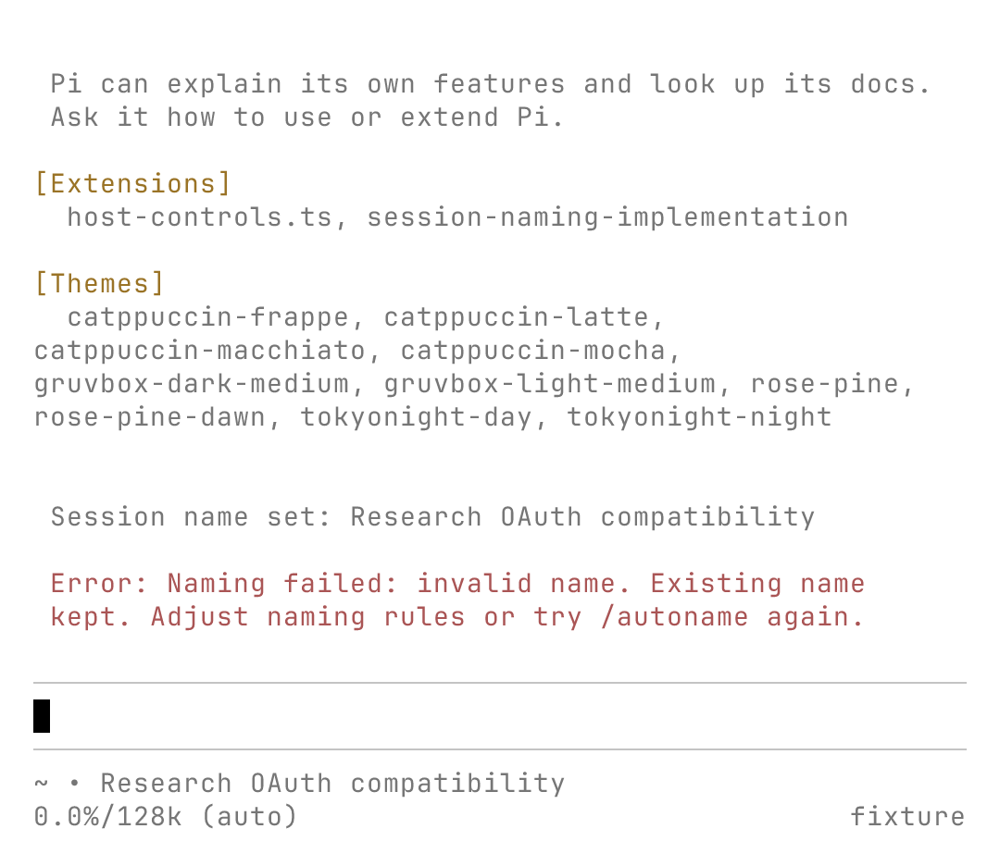
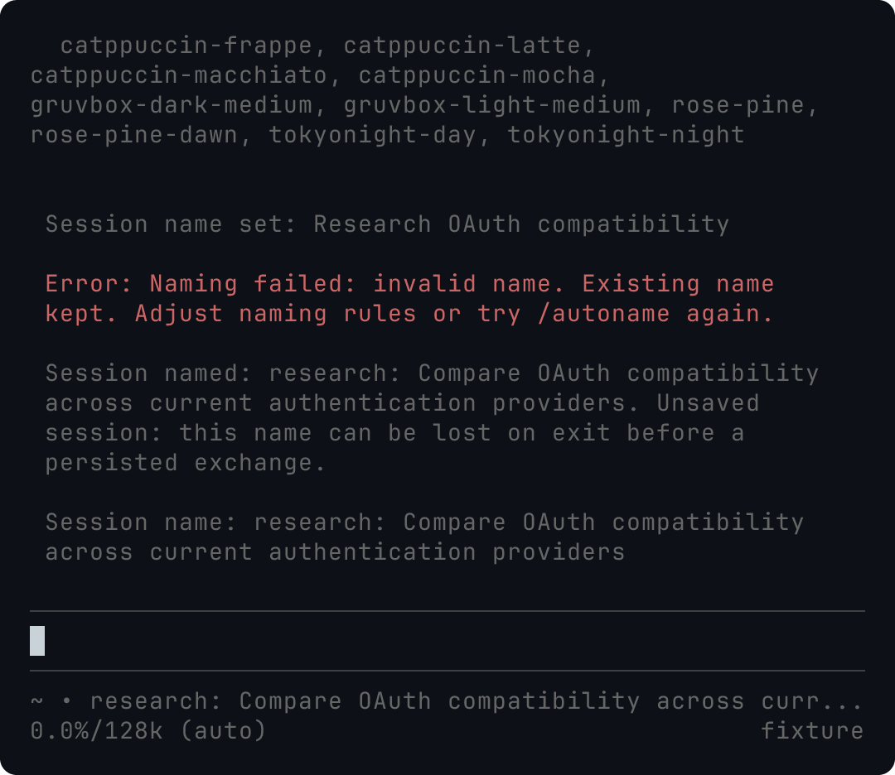

# Session naming

[简体中文](i18n/zh-CN/session-naming.md) · English is normative.

Pi Stuff names a fresh foreground TUI session after its first successful exchange. It makes one attempt and leaves that name alone on later turns. A cancelled, failed or ambiguous opening leaves the session unnamed until you choose a name yourself.

Use Pi's native `/name Exact title` for a direct assignment. `/autoname` generates a replacement from the opening request and recent dialogue; `/autoname Document OAuth migration risks` gives the model a task hint with priority over that dialogue. Accepting `/autoname` permanently ends automation for that session, including when generation fails. A newer command supersedes a pending request.

The command runs without a progress/status notice, then reports success or an actionable failure. Print/JSON commands wait for completion and send feedback to stderr, leaving JSON stdout machine-readable. Automatic requests run quietly in the background. A pending result cannot overwrite a later direct rename, navigation or another generation. Names belong to the whole session, including its branches.

## Configuration

Add `naming` to the existing `pi-stuff.json` in Pi's agent directory, then use `/reload`. Omitted fields use their defaults:

```json
{
  "naming": {
    "automatic": true,
    "model": {"provider": "openai-codex", "id": "gpt-6-astra"},
    "maxLength": 80
  }
}
```

`model` is optional. Without it, each request uses the current session model. With it, Pi resolves that exact provider/model and its existing authentication; an unavailable model or credential fails without selecting a fallback. The example is not a cost recommendation.

Set `automatic` to `false` to retain only `/autoname`. `prompt` replaces the naming style guidance, so another language or format is supported. For example:

```json
{
  "naming": {
    "automatic": false,
    "prompt": "用中文简洁描述当前主任务, 保留技术标识符, 不写进度.",
    "maxLength": 40
  }
}
```

The default style is English `type: Action object`, with `research`, `feat`, `fix`, `refactor`, `docs` or `chore`. It prefers 4-8 description words, preserves identifier casing and omits dates, scope parentheses and progress. For example: `research: Compare OAuth provider compatibility`. This is model guidance, not a semantic guarantee. The user's request takes precedence over an assistant misunderstanding even with a custom style.

`maxLength` is an independent positive integer counted in Unicode code points. Empty, multiline, control-containing and overlong outputs fail without truncation or a repair call. Blank prompts/model identifiers and invalid configuration use the package's existing configuration diagnostic. Configuration changes apply to future requests after reload; they do not rename or rearm existing sessions.

## Eligibility and persistence

Automatic naming supports regular/fullscreen TUI sessions with a fresh native session file, no prior dialogue/name and no parent link. It skips resume, import, reload, forks, existing empty files, nonpersistent sessions and RPC/JSON/print launches. A separate queued request makes the opening ambiguous and skips automation. Internal tool continuations remain part of the first exchange.

There is no universal child flag in Pi's extension API. A third-party launcher that disguises a child as an ordinary foreground TUI must disable automatic naming; that launch shape is not supported.

Pi can keep the name of a blank session only in memory until an assistant exchange causes normal persistence. `/autoname` identifies this as an unsaved session. Exiting immediately can lose the name; completing an exchange preserves it. Pi Stuff does not force a history write or maintain a separate name database.

## Request limits

Automatic input contains the raw opening request and final visible assistant answer, capped at 2,000 code points. Explicit input is capped at 4,000. A supplied hint takes that budget; without one, selection retains opening intent and recent user/assistant text. Long text keeps both ends with an omission marker. Tools, thinking, images, process messages and loaded skill instructions are excluded. Assistant text may quote excluded material, so role filtering is not a secrecy guarantee.

Every attempt has a 15-second local deadline, one generation call, no extension retry/fallback and no additional summarizer or classifier. Cancellation affects naming only. Client retries are disabled where supported; output budget is `min(model.maxTokens, 1024, max(64, 2 × maxLength))`, normally 160 tokens. The style prompt and framing are outside conversation limits. Tokenization, provider-required reasoning and transport behavior prevent an exact universal billing cap.

The Pi 0.85.1 API mapping requests SSE, `maxRetries: 0` and a finite `maxTokens`. OpenAI completions/responses use the adapter's default thinking-off mapping; Anthropic receives `thinkingEnabled: false`; Google receives `thinking.enabled: false` (Gemini 3 uses its minimum supported thinking level); Codex requests no reasoning when supported and minimal otherwise. Providers may ignore output/retry controls: the inspected Codex Responses adapter does not serialize `maxTokens` into its request body. These are bounded local controls, not a promise that all providers consume the same tokens. Abort cannot recover tokens already used remotely.

Tests use real isolated Pi commands, lifecycle events and native session files with a controlled HTTP model. See [issue #108](https://github.com/jczhang02/pi-stuff/issues/108) for specification, runtime acceptance, recorded model examples and review evidence.

## Acceptance evidence (2026-09-22)

The runtime checks use Linux, Bun 1.4.0, Pi 0.85.1 from the pinned dependency and the maintainer's compiled Pi 0.87.0 (runtime-reported Bun 1.4.0). Terminal Control 1.2.1 drives real regular/fullscreen sessions with isolated settings, session files and working directories. The controlled model verifies request counts, errors, deadlines, navigation races, forks, reload/restart, preflight failure and compaction queue replay. A readonly session file and Linux `/dev/full` exercise native write failures. The extension preflights known unwritable files; an unexpected failure during Pi's write can leave the displayed name changed but unsaved. The extension tells the user to fix file access and restart with that session before continuing. It does not append a compensating rename: Pi advances its in-memory history before writing, so a second write could persist a broken parent link. Recovery checks reopen the repaired file and verify its existing messages and parent chain.

Run offline checks with `bun run check` and `bun run test`. To repeat compiled-host naming acceptance, set `PI_TEST_HOST` to the compiled executable and run `bun test tests/system/naming*.test.ts`. Live account tests are separate from this offline suite.

The following eight names came from actual `openai-codex/gpt-6-astra` requests through the compiled host with the final prompt, using synthetic conversations. Six opening requests completed in 2.7-6.0 seconds as observed in the terminal (including observation overhead). Token usage and billing were not measured. An earlier prompt produced one missing colon; the default now states the exact separator explicitly. This small sample supports relevance, identifier preservation and style, not a statistical reliability claim.

| Input intent                                                                    | Generated name                                                         |
| ------------------------------------------------------------------------------- | ---------------------------------------------------------------------- |
| Research OAuth compatibility; assistant incorrectly claims implementation       | `research: Compare existing providers for OAuth compatibility`         |
| Implement Pi naming, including tests/docs; assistant discusses initial research | `feat: Add configurable Pi auto session naming extension`              |
| Fix duplicate payment callbacks                                                 | `fix: Prevent double charges from duplicate payment callbacks`         |
| Refactor RTK without behavior changes                                           | `refactor: Restructure RTK command rewriting without behavior changes` |
| Write Exa key setup/troubleshooting docs                                        | `docs: Document Exa API key setup and troubleshooting`                 |
| Update pinned Bun and lockfile                                                  | `chore: Update pinned Bun version and regenerate lockfile`             |
| `/autoname` after the agreed task changes to OAuth risk documentation           | `docs: Document OAuth migration risks only`                            |
| `/autoname Fix session rename races in Pi` overrides earlier dialogue           | `fix: Resolve session rename races in Pi`                              |

The actual terminal captures below cover failure, success and resizing from 100×30 to 56×24. The light terminal's default foreground/background were set to black/white before launching Pi. Exports explicitly use `JetBrainsMono Nerd Font Mono, Symbols Nerd Font Mono, LXGW WenKai Mono`. They are headless terminal evidence, not native window/compositor evidence. The narrow footer truncates a long title; `/name` displays its complete wrapped text. Input remains available while a request is pending, and failed generation preserves the prior name.




