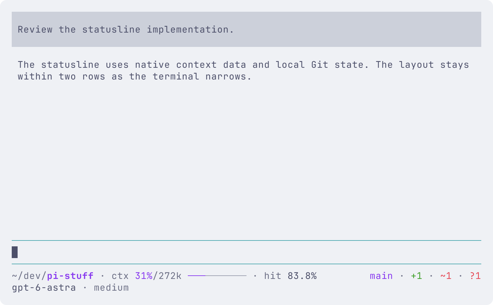
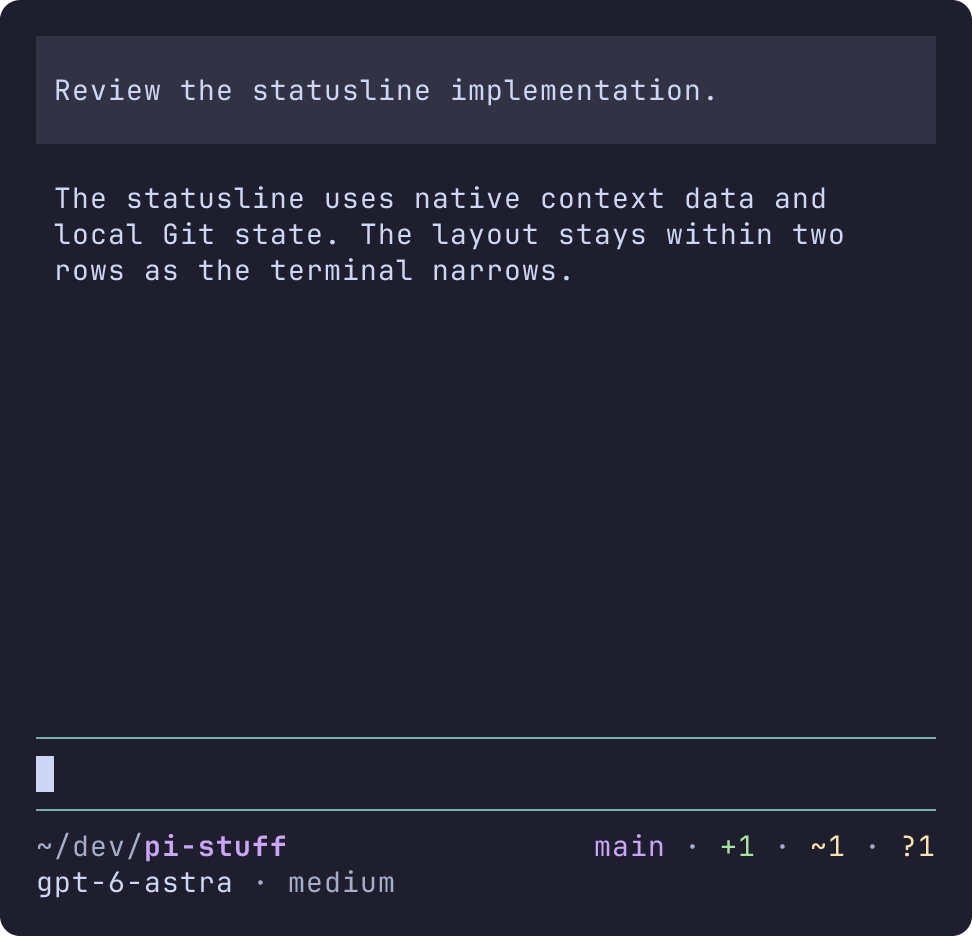
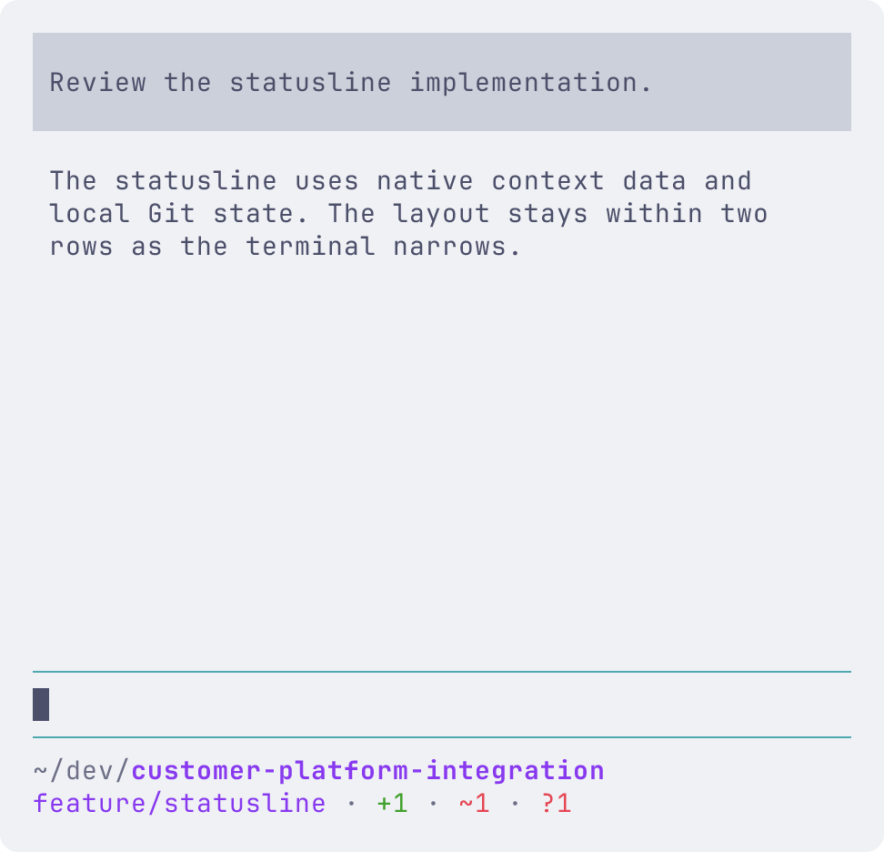

# Statusline

[简体中文](i18n/zh-CN/statusline.md) · English is normative.

Pi Stuff replaces the TUI footer with two rows by default. Load the package through the [development extension instructions](web-access.md#load-the-development-extension). RPC, JSON and print modes keep their native output.

The first row places the directory and `ctx 31%/272k ━━━━━━━━━━ · hit 83.8%` on the left, with Git on the right. The second row has model and thinking level on the left, and existing third-party `setStatus` messages on the right. Field separators are `·`; values keep their original case. No goal or account-quota provider is included. Session names remain available through native `/name` and `/autoname panel`; they do not occupy a footer segment.

## Git and narrow terminals

Git shows the branch (or `detached` plus commit), active operation, `!` conflicted files, `+` staged files, `~` modified files, `?` untracked files and `↑`/`↓` local ahead/behind commit counts. A file changed both in the index and working tree counts in both categories. Conflicts have their own category. Clean worktrees show `clean`.

Colors use the active Pi theme: branch/ahead use accent, staged uses success, modified/untracked/behind use warning, and conflicts use error. Symbols and counts carry the meaning without color.

At narrow widths, the complete ctx/hit block disappears first on row one. Git can move into row two; optional model, thinking and extension fields yield to it. Third-party fields disappear whole from the end of their key-sorted order. Directory and branch names are retained as far as their available row permits. The footer never adds a third row or removes normal word spacing.

Git reads are local and asynchronous, bounded by a five-second overall deadline and two-second subprocess deadlines. There is no fetch, fixed polling or recursive watcher. Native branch notifications, tool completion, agent completion and session lifecycle events trigger refresh. Ordinary external file edits while idle can remain stale until the next trigger. Outside a repository, Git disappears. A failed read removes old counts and shows `git ?` with any available native branch identity.

The official Linux binaries tested with embedded Bun 1.3.14 did not emit the native branch callback for one external checkout sequence: a minimal native-footer probe observed only `HEAD.lock`, with zero branch callbacks. Pi under Bun 1.4.0 refreshed automatically. On affected hosts, the next Pi tool/agent completion or reload refreshes the snapshot. This implementation deliberately inherits the native idle-watching limitation. A headless resize on the compiled hosts also sometimes needed the next editor input for a complete redraw; no private host workaround is installed.

## Usage and warnings

Context usage comes from Pi's current context estimate. Capacity follows the active model. After compaction, unknown usage is shown as `ctx ?/128k` with the actual capacity and no meter, until Pi has a new estimate. Missing capacity is `?`, never a made-up limit.

Cache hit is `cacheRead / (input + cacheRead + cacheWrite)` for the current branch's latest valid assistant response. Error and aborted responses are ignored. Known uncached input shows `hit 0%`; missing statistics hide the field. This is not a session total.

With automatic compaction enabled, the pressure boundary is model window minus effective `reserveTokens`: accent below 90% of that boundary, warning from 90%, error at the boundary. With compaction disabled, warning starts at 80% of the window and error at 90%. The displayed percentage remains used/window. Percentage and filled meter share a color.

Persisted settings come through the installed Pi host's native reader, including project trust and that version's model overrides. Reload and model selection re-read settings. If settings cannot be read reliably, usage stays neutral. SDK-only transient overrides are outside this contract.

## Native fallback and other extensions

In the global `pi-stuff.json` beside Pi's `settings.json`, set:

```json
{
  "statusline": {"enabled": false}
}
```

Run `/reload` to restore the native footer. Omit the field or use `true` to enable Pi Stuff again. No project-level override or new settings command is added.

Existing extension statuses keep their text, case and SGR colors, with line breaks/control sequences sanitized. Pi has one custom-footer slot: choose one complete footer implementation. Pi Stuff does not reclaim the slot during ordinary refreshes. Starting a new session or reloading reconstructs native extension state.

See the [accepted specification](statusline-spec.md) and [PR #118](https://github.com/jczhang02/pi-stuff/pull/118) for acceptance evidence and runtime limitations.

## Terminal captures

These are full-viewport Terminal Control captures of the unmodified package on compiled Pi 0.87.1, using a temporary real Git repository and deterministic external model usage. They are headless terminal evidence, not native Ghostty window captures. The light palette is Catppuccin Latte (`#eff1f5` background), dark is Catppuccin Mocha (`#1e1e2e`), with the terminal palette set through OSC 10/11. Export fonts: `JetBrainsMono Nerd Font Mono, Symbols Nerd Font Mono, LXGW WenKai Mono`. Both palettes were checked at 150/100/80/50 columns; compiled-host captures follow a resize and editor input, for the redraw limitation above.





