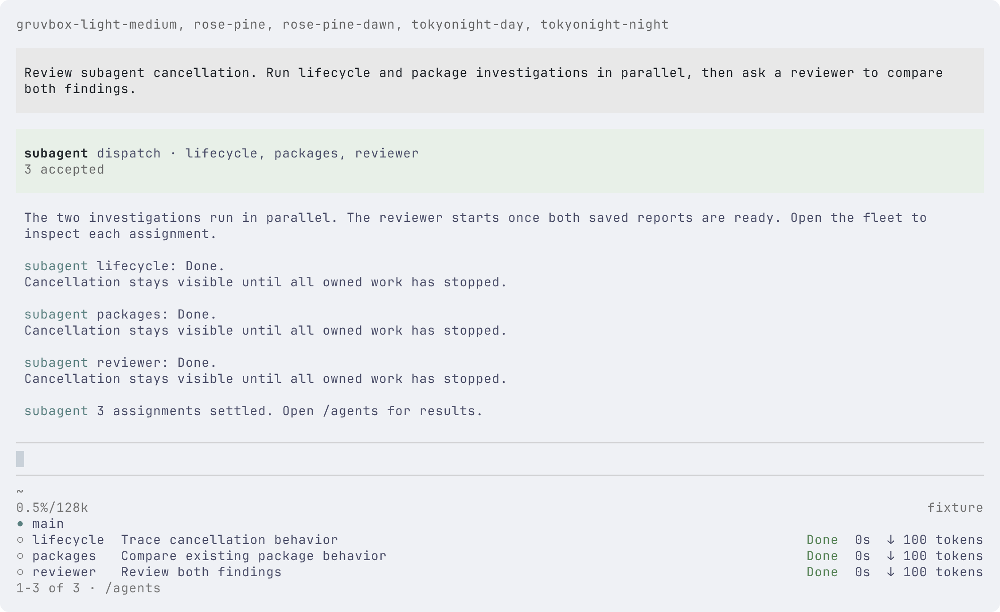
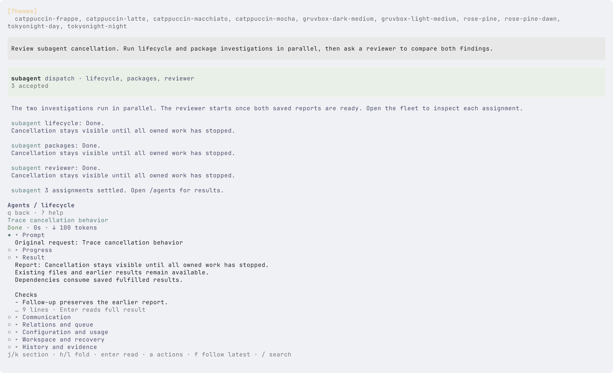

# Subagent implementation and acceptance

[简体中文](i18n/zh-CN/subagents-implementation.md) · English is normative.

This record accompanies implementation issue [#97](https://github.com/jczhang02/pi-stuff/issues/97) and the accepted F01-F33, Q1-Q60/R1-R8 and UI01-UI15 requirements in [#64](https://github.com/jczhang02/pi-stuff/issues/64). The implementation baseline is `cd0f174f65bdbacdca265646b4e191943063d0ac`. The PR records its final head, checks and independent review disposition. The [user guide](subagents.md) describes operation and recovery.

Acceptance was reopened after `543babafa62c060ee4b728d0eb825a456bd34dfc`: the earlier tests and short live trials did not establish mature everyday use. The reopened round exercises complete live workflows, repairs their failures and checks the final UI at the required sizes. The PR records the remaining review and publication gates.

## Live workflows and repairs

The trials use compiled Pi and `openai-codex/gpt-6-astra` in disposable cache projects, with separate settings and sessions. They exercise actual model tool calls and human keyboard actions, rather than scripted task records.

- **Pi 0.85.1:** parallel investigation, isolated implementation, dependent review, two retained follow-ups and a child question answered through the UI. The final cache checks passed 4 tests and 18 assertions.
- **Pi 0.86.0:** valid new host session records initially failed retained-context validation. Explicit decoding of system changes, usage records and compaction system messages repaired saving. After restarting the parent, both original investigators recovered in their retained contexts. An implementer then delivered a fixed artifact to a reviewer, which consumed a UI steer to check that reading one expired key does not sweep unrelated keys. Focused and full cache tests each passed 4 tests and 20 assertions. Earlier failed records remained unchanged.
- **Recursive work on Pi 0.86.0:** a lead created two read-only audits, both asked their parent policy questions, and the lead relayed them to main. UI Stop previewed the owned branch and cancelled all three assignments. Each ended cancelled and saved. Explicit UI recovery reused the lead's context for a new fulfilled, saved report; it did not resume or replace the cancelled children. Restart and `/reload` retained all four records.

The trials left their main workspaces unchanged and exited normally. Temporary authentication was removed. Regression fixes also prevent recovery from jumping a healthy queue or starting before cancellation settles, reject workspace-mode changes on retained agents, retain the lifecycle control tool when permissions narrow, and account for tool, compaction and cost-only usage exactly once.

The UI now puts concise previews ahead of execution metadata, keeps detail navigation and native input visible at small sizes, opens historical attention notices at their original assignment, and preserves state labels beside long descriptions. Navigation state and boundaries belong to the browser, action eligibility to the action controller, and viewport budgets to the renderer's geometry module. Full reports and metadata remain reachable.

## Review map

| Boundary                | Owner and responsibility                                                                                                                                                                                           |
| ----------------------- | ------------------------------------------------------------------------------------------------------------------------------------------------------------------------------------------------------------------ |
| Host integration        | [register.ts](../src/subagent/register.ts) exposes one tool, human inspection, notices and the session-departure barrier.                                                                                          |
| Admission and authority | [admission.ts](../src/subagent/admission.ts), [configuration.ts](../src/subagent/configuration.ts) and [authority.ts](../src/subagent/authority.ts) validate an entire admission before starting work.             |
| Task lifecycle          | [coordinator.ts](../src/subagent/coordinator.ts) coordinates scheduling; runtime, journal, mailbox, controls, recovery and view modules own their respective invariants.                                           |
| Child execution         | [session.ts](../src/subagent/session.ts) creates actual Pi sessions; [processes.ts](../src/subagent/processes.ts) tracks shell execution and confirmed stopping.                                                   |
| Code and records        | [workspace.ts](../src/subagent/workspace.ts) owns isolated workspaces and fixed artifacts; [store.ts](../src/subagent/store.ts) owns local executor evidence and persisted records.                                |
| Inspection              | [ui/controller.ts](../src/subagent/ui/controller.ts) connects host input to navigation, actions and reading. Section projection is shared by previews and full readers; graph geometry owns the dependency layout. |

Execution ending, declared fulfillment, saved evidence and main acceptance remain separate fields. Cancellation follows assignment ownership, while dependency arrows describe result flow. A retained agent's next assignment has a new record and cannot rewrite its previous consumers.

## Behavioral evidence map

These are executable regressions at real boundaries. System tests load the unmodified entrypoint in actual Pi; their local model provider controls timing and failure. Component cases isolate file, Git, process or editing boundaries where that gives more precise evidence.

| Requirements                                                                                  | Regression sources                                                                                                                                                                                                                                                                            |
| --------------------------------------------------------------------------------------------- | --------------------------------------------------------------------------------------------------------------------------------------------------------------------------------------------------------------------------------------------------------------------------------------------- |
| F01-F04, F06-F09: single, parallel, serial, DAG, background execution and bounded observation | [host](../tests/system/subagent-host.test.ts), [scheduling](../tests/system/subagent-scheduling.test.ts), [navigation](../tests/system/subagent-ui-navigation.test.ts)                                                                                                                        |
| F05: fixed upstream results and full retained output                                          | [artifacts](../tests/system/subagent-artifacts.test.ts), [UI reader](../tests/system/subagent-ui.test.ts)                                                                                                                                                                                     |
| F10-F12: cancellation, abnormal continuation and steering                                     | [control](../tests/system/subagent-control.test.ts), [recovery](../tests/system/subagent-recovery.test.ts), [authority](../tests/system/subagent-authority.test.ts), [processes](../tests/component/subagent-processes.test.ts)                                                               |
| F13-F15: questions, reports and mailbox delivery                                              | [communication](../tests/system/subagent-communication.test.ts), [control](../tests/system/subagent-control.test.ts), [host](../tests/system/subagent-host.test.ts), [UI communication](../tests/system/subagent-ui-interactions.test.ts)                                                     |
| F16-F21: inline/file roles, model/thinking, tool ceilings, cwd, rules and skills              | [configuration](../tests/system/subagent-configuration.test.ts), [context](../tests/system/subagent-context.test.ts), [authority](../tests/system/subagent-authority.test.ts), [artifacts](../tests/system/subagent-artifacts.test.ts)                                                        |
| F22-F25: shared limits, execution time, retries and usage                                     | [scheduling](../tests/system/subagent-scheduling.test.ts), [control](../tests/system/subagent-control.test.ts), [usage](../tests/system/subagent-usage.test.ts), [host](../tests/system/subagent-host.test.ts)                                                                                |
| F26-F27: worktrees, baselines and artifact handoff                                            | [workspace](../tests/component/subagent-workspace.test.ts), [artifacts](../tests/system/subagent-artifacts.test.ts)                                                                                                                                                                           |
| F28-F29: persistence, restore and lifecycle observers                                         | [store](../tests/component/subagent-store.test.ts), [persistence](../tests/system/subagent-persistence.test.ts), [observer](../tests/system/subagent-observer.test.ts), [recovery](../tests/system/subagent-recovery.test.ts)                                                                 |
| F30-F33: completed follow-up, history copy, recursive join and child extension tools          | [context](../tests/system/subagent-context.test.ts), [history](../tests/component/subagent-history.test.ts), [join](../tests/system/subagent-join.test.ts), [extensions](../tests/system/subagent-extensions.test.ts), [host](../tests/system/subagent-host.test.ts)                          |
| B01-B03: atomic admission, waiting slots and held queues                                      | [host](../tests/system/subagent-host.test.ts), [scheduling](../tests/system/subagent-scheduling.test.ts), [control](../tests/system/subagent-control.test.ts), [persistence](../tests/system/subagent-persistence.test.ts)                                                                    |
| B04-B06: stop timing, distinct timeouts and message ordering                                  | [processes](../tests/component/subagent-processes.test.ts), [authority](../tests/system/subagent-authority.test.ts), [control](../tests/system/subagent-control.test.ts), [communication](../tests/system/subagent-communication.test.ts)                                                     |
| B07-B09: fixed baselines, preservation and abnormal recovery                                  | [workspace](../tests/component/subagent-workspace.test.ts), [artifacts](../tests/system/subagent-artifacts.test.ts), [context](../tests/system/subagent-context.test.ts), [recovery](../tests/system/subagent-recovery.test.ts), [observer](../tests/system/subagent-observer.test.ts)        |
| B10-B12: authority, child-result consumption and durable settlement                           | [authority](../tests/system/subagent-authority.test.ts), [join](../tests/system/subagent-join.test.ts), [persistence](../tests/system/subagent-persistence.test.ts), [usage](../tests/system/subagent-usage.test.ts)                                                                          |
| U01-U03: keyboard operation, native editing and aligned twenty-agent fleet                    | [UI](../tests/system/subagent-ui.test.ts), [interactions](../tests/system/subagent-ui-interactions.test.ts), [geometry](../tests/system/subagent-ui-geometry.test.ts)                                                                                                                         |
| U04-U07: actual graphs, retained reading, communication and live Stop scope                   | [graph](../tests/system/subagent-graph.test.ts), [navigation](../tests/system/subagent-ui-navigation.test.ts), [UI](../tests/system/subagent-ui.test.ts), [interactions](../tests/system/subagent-ui-interactions.test.ts), [delayed actions](../tests/component/subagent-ui-actions.test.ts) |
| U08-U10: accounting, failures, actual host return and appearance                              | [usage](../tests/system/subagent-usage.test.ts), [persistence](../tests/system/subagent-persistence.test.ts), [context](../tests/system/subagent-context.test.ts), [host exit](../tests/system/subagent-ui-acceptance.test.ts), captures below                                                |

## Environments and execution

The pinned profile uses Bun 1.4.0, Pi 0.85.1, Effect 4.0.0-rc.112 and Terminal Control 1.2.1. The compiled-host profile runs the same actual Pi entrypoint through `PI_TEST_HOST`; an absent host fails. Tests isolate settings, sessions and project data. Native terminal interaction runs through Terminal Control, with tmux 3.6a in a separate UTF-8 server for the tmux trials.

```sh
bun run check
bun test tests
PI_TEST_HOST=/absolute/path/to/pi-0.85.1 bun test tests/system/subagent-*.test.ts
```

Reopened-round local verification on 2026-09-20:

- `bun run check` and `git diff --check`: passed.
- Full offline run before the final navigation regression was added, `bun test tests`: 271 passed, 0 failed, 3,312 assertions across 57 files.
- Compiled Pi 0.86.0, `bun test tests/system/subagent-*.test.ts tests/system/pi-host.test.ts`: 88 passed, 0 failed, 2,113 assertions across 26 files.
- Final compiled Pi 0.85.1 through the isolated UTF-8 tmux host, interaction/navigation/history/default-shortcut suites: 13 passed, 89 assertions. The tmux status bar is disabled to preserve the requested Pi viewport.
- After the final navigation repairs, the compiled Pi 0.86.0 UI/hierarchy subset passed 24 tests and 157 assertions across six files; local history/interactions passed six tests and 58 assertions. Native editor regressions also exercise 80x12, 80x14, 80x16 and 80x24, including a completion list and retained drafts.
- Compiled Pi 0.85.1 generated 24 fresh light/dark captures while each surface stayed open through all three required sizes. The screenshot section identifies controlled-provider and live-model evidence separately.

Final failures were repaired rather than accepted as skips. Deterministic regressions exposed a copied Git index losing racy-stat protection and a replacement index losing intent-to-add/skip-worktree metadata. The final capture preserves the index and gives its private copy a conservative timestamp. Native editor races, no-match search and misleading graph joins also have regression coverage. Two terminal tests now assert the matching snapshot directly instead of requiring a second quiet capture.

The first remote CI run exposed release requests arriving after public settlement but before private cleanup finished, and admission errors losing their storage failure cause during configuration loading. Release now reserves the agent, waits for cleanup outside the journal/workspace locks, and checks storage before releasing evidence. Removing the reservation also resumes eligible queued work. [Controlled release regressions](../tests/component/subagent-release.test.ts) cover these windows; the actual-host admission regression uses a 64-assignment atomic batch and reproduced the lost cause three times before the fix. The cancellation test now waits for its dependent explicitly, matching event-driven wait semantics; its outcome assertions remain unchanged.

The reopened regressions cover [queue recovery](../tests/system/subagent-recovery-queue.test.ts), [workspace/tool restrictions](../tests/system/subagent-dogfood-regressions.test.ts), [usage sources](../tests/component/subagent-activity.test.ts), [host history](../tests/component/subagent-history.test.ts), [attention navigation](../tests/system/subagent-ui-attention.test.ts), [content hierarchy](../tests/component/subagent-ui-hierarchy.test.ts) and [native editor viewports](../tests/system/subagent-ui-viewport.test.ts). The first full rerun found an observer test selecting the wrong action after menu reordering; it now selects the visible action label and retains its permission-rejection and draft-preservation assertions.

The final [history-navigation regression](../tests/system/subagent-ui-history.test.ts) exercises eight retained assignments at 80x24 and 80x12, including descriptions containing selection-like symbols. It verifies expansion, first/last selection, scrolling away and returning, and opening the selected old prompt. It reproduced expansion hiding the selected history row before the fix. The tmux fixture disables its own status bar so the requested viewport is the actual Pi viewport; leaving that bar on gave Pi only 11 rows in the 12-row trial and correctly triggered its minimum-size notice.

## Actual terminal captures

These captures are refreshed from the reopened round. The table below uses a controlled provider; the additional live captures show the actual recursive workflow described above.

The published captures use actual Pi cells, English UI, the configured Ghostty font stack (`JetBrainsMono Nerd Font Mono`, `Symbols Nerd Font Mono`, `LXGW WenKai Mono`) and corresponding Catppuccin Latte/Mocha terminal foreground/background colors. The controlled provider supplies repeatable task content. Each surface remains open while resizing through 80x24, 120x36 and 160x48 in both Pi light and dark themes.

These are headless terminal captures, not native Ghostty window/compositor evidence. Generated design images are not used as execution evidence.

| Surface                     | Light                                                      | Dark                                                           |
| --------------------------- | ---------------------------------------------------------- | -------------------------------------------------------------- |
| Main conversation FleetView | [120x36](assets/subagents/light-fleet-120x36.png)          | [80x24](assets/subagents/dark-fleet-80x24.png)                 |
| Dependency graph            | [80x24](assets/subagents/light-graph-80x24.png)            | [160x48](assets/subagents/dark-graph-160x48.png)               |
| Detail and full reading     | [Detail, 160x48](assets/subagents/light-detail-160x48.png) | [Full result, 120x36](assets/subagents/dark-reader-120x36.png) |

Live-model captures, both in the light theme: [cancelled children at 80x24](assets/subagents/live-children-80x24.png) and [recovered report at 120x36](assets/subagents/live-recovery-120x36.png).





## Review and recovery boundaries

The baseline reviews below apply through `543baba`. The reopened-round Standards and Spec review by read-only Astra `/root/dogfood_standards_review` covered the full subsequent increment, including runtime commit `1afd16a` and the final UI repairs. All material findings are closed. Its final independent rerun passed 20 tests and 148 assertions across hierarchy, history, navigation and interactions, plus 264 rendering combinations and actual-Pi selection probes. The separate visual review by `/root/dogfood_display_probe` inspected all 26 new captures without a blocking finding. The PR pins the final reviewed head.

The Standards and Spec reviews completed in separate read-only Astra contexts, `/root/standards_final` and `/root/spec_recheck`, under owner session `codex:01a0a0de-06e7-7980-b872-39d57c4dd7c0`. They covered the baseline-to-implementation full diff, the mandatory maintainability standard and focused follow-ups after repairs. Both closed with no unresolved material findings. The final graph follow-ups independently checked 318 and 180 layouts. The PR records the reviewed commit scope. Agent review is not GitHub approval or merge authorization.

Tool ceilings and workspace isolation are not an OS sandbox. Supported child extensions have explicit factories; arbitrary third-party global state is not assumed isolated. A code revert does not migrate or erase stored task records. Stop the owning session, preserve the record directory and follow the [recovery guide](subagents.md#code-persistence-and-recovery) before changing implementation versions.
