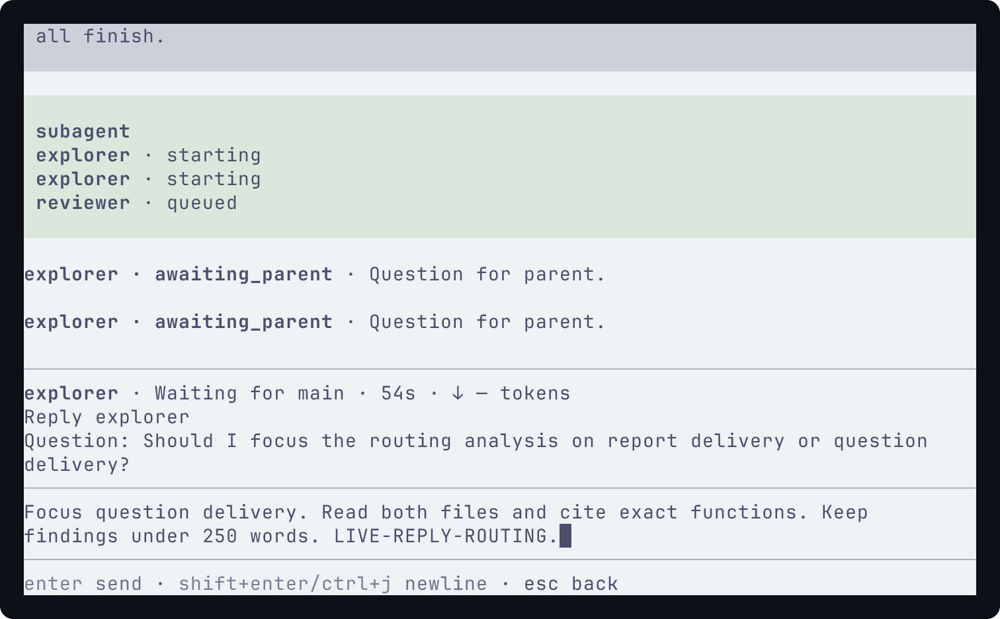
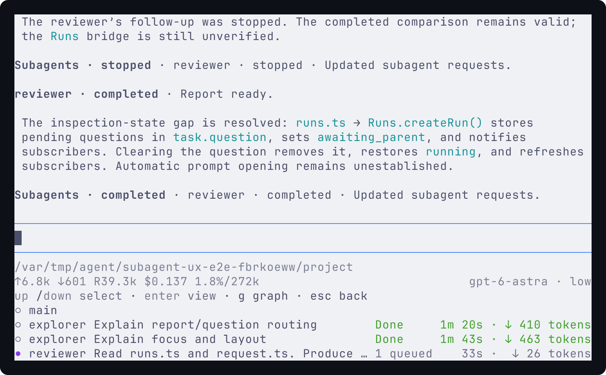
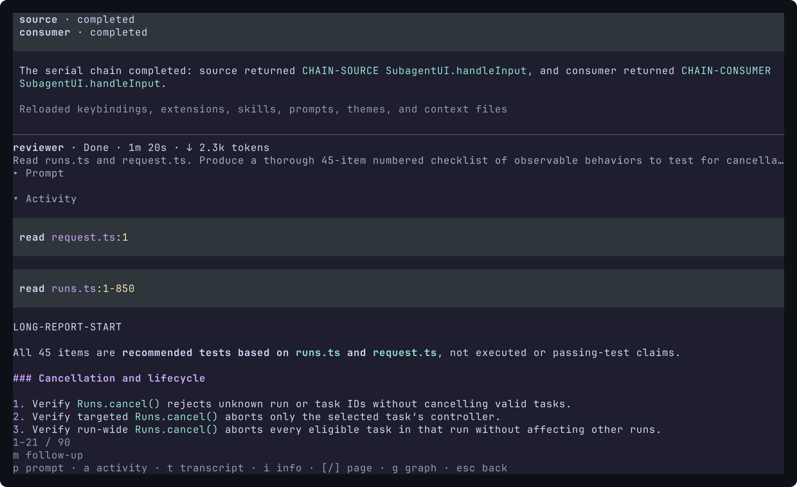
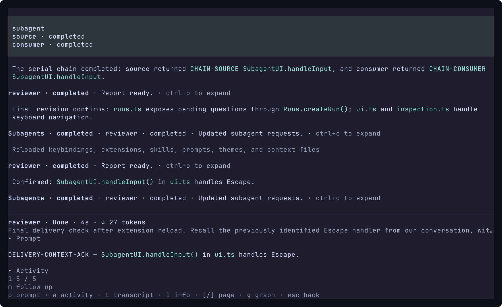
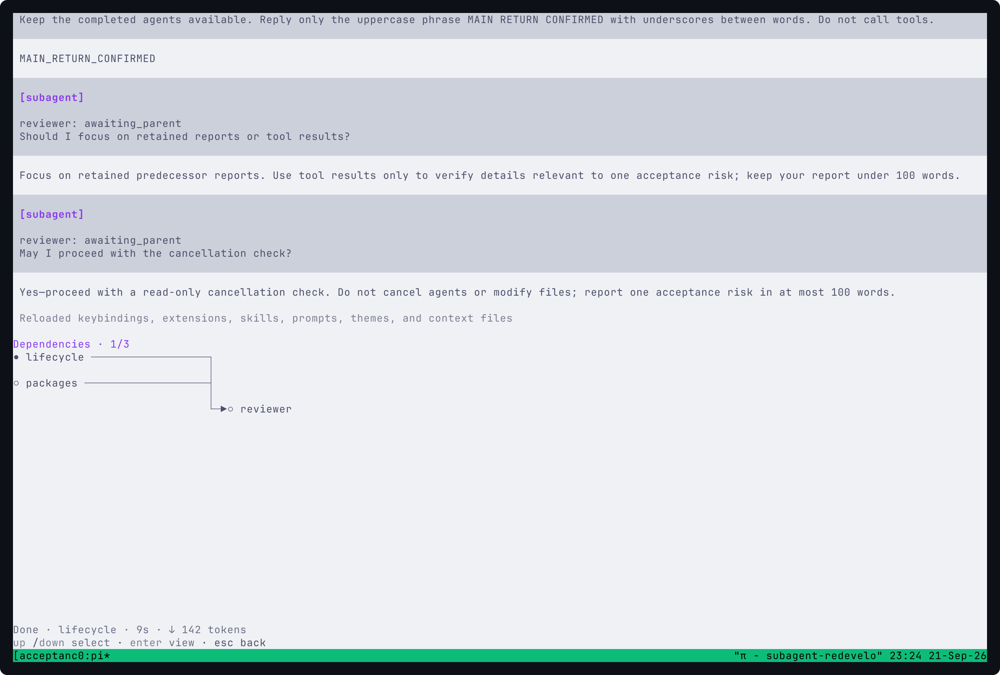
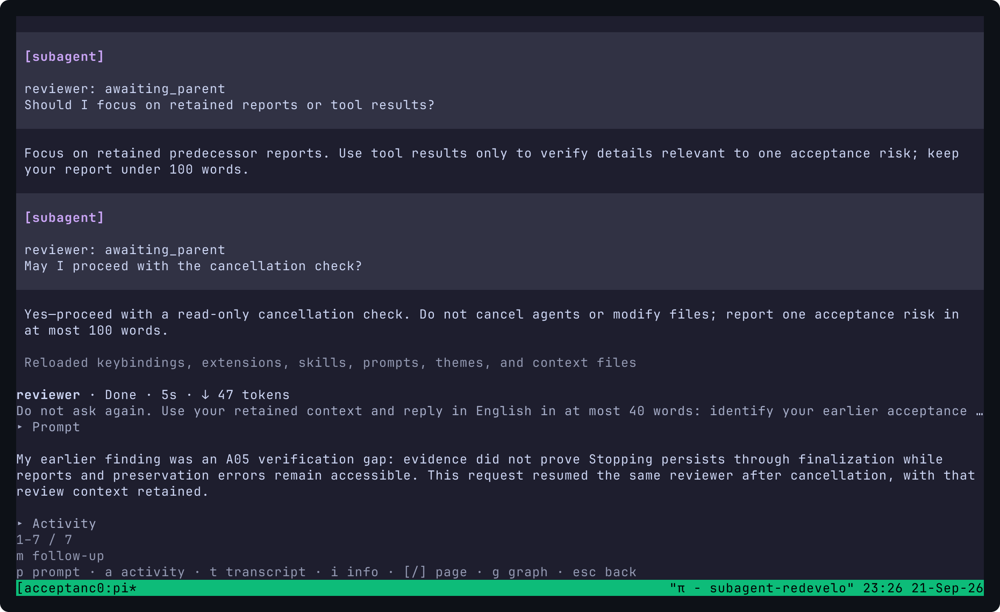
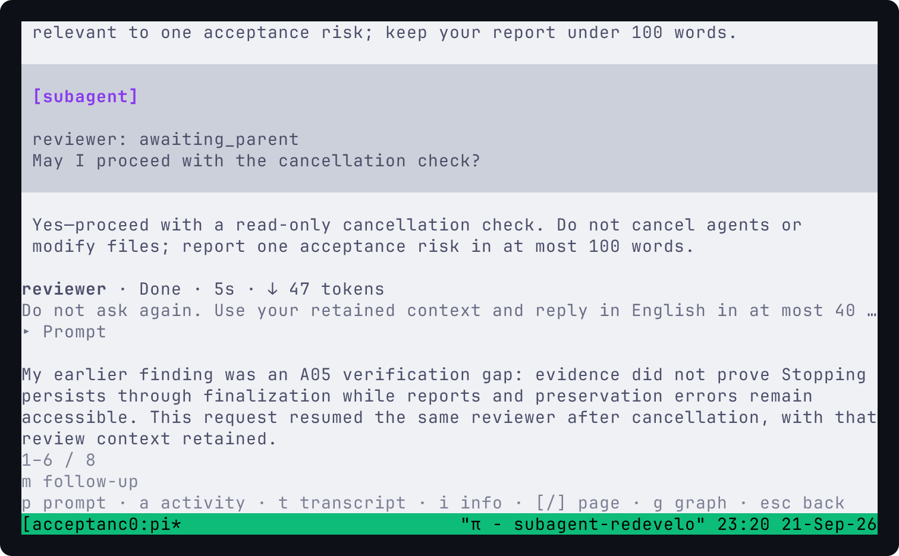

# Subagent redevelopment acceptance

[简体中文](i18n/zh-CN/subagents-redevelopment-acceptance.md). English is authoritative.

This record covers [issue #97](https://github.com/jczhang02/pi-stuff/issues/97) and [PR #103](https://github.com/jczhang02/pi-stuff/pull/103), against the [A01-A10 contract](subagents-redevelopment-spec.md#testing-decisions). The implementation starts at `cd0f174f65bdbacdca265646b4e191943063d0ac`. Its behavioral reference is arhen `pi-core-subagent` 1.3.55 at `676b11eb415cd46fbede712b5bbb075ff3f043bf`; [the retained license](../src/subagent/LICENSE) covers the adapted behavior and code.

## Evidence map

Tests under `tests/system/` load the real package entrypoint into an isolated Pi host. A local HTTP provider supplies model responses; it does not replace the child session, tool calls, terminal, Git or persistence. Component tests cover timing and pure calculations where they are clearer than terminal assertions.

| Acceptance                        | Evidence                                                                                                                                                                                                                                                                                                        |
| --------------------------------- | --------------------------------------------------------------------------------------------------------------------------------------------------------------------------------------------------------------------------------------------------------------------------------------------------------------- |
| A01: dispatch and configuration   | `subagent-dispatch`, `configuration`, `batch-input`, `model`, `settings`, `status`, `queued-ui` and `background-notification` system tests; graph component tests cover validation and wave ordering.                                                                                                           |
| A02: installed project            | `subagent-readonly` exercises an ignored dependency tree. The live run below also starts read-only children in this installed worktree.                                                                                                                                                                         |
| A03: writes and branches          | `subagent-write`, `multiple-writers` and `writer-continuation` use real repositories, worktrees, dirty parent files, selected dependency ancestry and cleanup. Workspace component tests cover failed initialization/recovery and preservation.                                                                 |
| A04: communication                | `subagent-communication`, `mailbox`, `steer-async-input`, `intervention-ui` and the question-race UI regression exercise actual tool calls and retained drafts. The provider receives sibling addresses in the tool description.                                                                                |
| A05: cancellation/failure         | `subagent-lifecycle`, `provider-failure`, `extension-startup` and `steer-finalization`. A real gated `prepare-commit-msg` hook holds finalization across cancellation, then exits with an error; Stopping persists until release, and report, error and file remain accessible.                                 |
| A06: continuation                 | `subagent-continuation`, `continuation-boundary`, `writer-continuation` and `restoration` cover saved context, request boundaries/history, own branches, usage and interrupted restoration.                                                                                                                     |
| A07: extensions                   | `subagent-extensions` and `extension-startup` cover real selected tools, narrowing, required startup failures and unsupported child UI.                                                                                                                                                                         |
| A08: focus and readers            | `subagent-keybindings-ui`, `intervention-ui`, `readers-ui`, `transcript-ui` and `ui` cover native editing, remapped keys, exact recipient, history/transcript navigation, return-to-main and retained drafts.                                                                                                   |
| A09: layout and observability     | `subagent-fleet-layout` drives 16 children at 150x50, 120x36 and 80x24, checking cell positions, trailing tokens, overflow and selection. `graph-ui`, `activity-ui`, `queued-ui` and reader tests cover graph overflow, real tool evidence, scheduler reasons and frozen reading. Actual captures appear below. |
| A10: compiled host and real model | The dated live trace below uses compiled Pi, tmux, installed dependencies and a real model, with follow-up, question/reply, stop/resume and restored records.                                                                                                                                                   |

Names in the table omit `.test.ts`; all referenced system files are in [tests/system](../tests/system/). The full-suite result and independent review scope are recorded in the PR. This document's captured model report is evidence of context retention, not a substitute for executing its suggested test.

## Verification through 2026-09-21

The final local suite passed 231 tests with 2 intentional skips, 0 failures and 2,033 assertions across 66 files. The two skipped asynchronous-steering cases require the compiled host and passed in its separate profile. Compiled targeted batches passed 10 tests/105 assertions, 8 tests/69 assertions and the question-race case with 7 assertions. `bun run check` and `git diff --check` passed. The final question-race test was independently reviewed and rerun.

## Dogfood repairs, 2026-09-22

The repair baseline is `a70080522eede76c7f022f9267747648756adfbd`. Real use exposed long internal report dumps, missing panel boundaries, seconds-only elapsed time, duplicated question/prompt text and difficult access to activity. The repair keeps model-bound reports intact, renders compact expandable orchestration notices, and gives the parent response responsibility for the user-facing conclusion. Continuation completion reports only the requests just executed.

The new live trace used compiled Pi `0.86.1`, Bun `1.4.0`, tmux `3.6a` and real `openai-codex/gpt-6-astra` calls with low thinking. Settings and records were isolated; the read-only project contained copied source files and linked installed dependencies. Arrows, Enter, Esc and local letters drove the interface through a dedicated tmux server. Terminal Control captured actual Latte/Mocha frames at 150x50, 120x36 and 80x24, using the same Ghostty font stack as the earlier trace.

- Two same-name explorers ran concurrently and asked separate questions. Replies survived Esc and resize without duplicating the question. Their reviewer started after both reports arrived.
- Targeted steering appeared as a queued count and was consumed by the intended child. The resulting reports retained both steering acknowledgement markers.
- Follow-up, dismissed stop confirmation, confirmed cancellation and resume preserved the reviewer's context. History and Transcript remained reachable. A later 45-item report exercised pagination and direct Activity access.
- Stopping a second workflow's child left its independent sibling running. That sibling completed after a UI reply; the stopped child's dependent was skipped.
- A serial chain passed `SubagentUI.handleInput` from its first child to its second. An active auto-await returned the result without a background completion turn.
- Reload retained all records. Restored built-in tool evidence uses Pi's public native renderer factories without starting another child. Final follow-ups recalled the prior findings and returned `FINAL-REVISION-ACK` and, after the final repair reload, `DELIVERY-CONTEXT-ACK`.

[Sanitized execution evidence](assets/subagents-redevelopment-acceptance/ux-live-run.json) contains 13 request records across the three runs, including one dependency skip. Recorded child cost was **$0.976440** and parent cost **$0.532160**; these are model-usage accounting, not invoices. Screenshots show real terminal output, not generated mockups or a native Ghostty window. Model-generated code assessments in the trace are task output, not our verification verdict. The owned terminal/tmux server were stopped and the temporary credential copy removed.

Independent repair review found and reproduced a completion/continuation race, loss of frozen reading when toggling Activity, and graph text hiding labels/metrics. The notification repair serializes continuation with the previous completion and retains per-execution notification ownership. Regressions also cover expanded error evidence and missing-report wording. The final offline suite passed 245 tests, with 2 compiled-host-only skips, 0 failures and 2,113 assertions across 68 files. The full compiled subagent profile passed 66 tests/896 assertions, including both skipped cases. After the final page-wait and panel-boundary test tightening, an independent compiled rerun passed 6 tests/23 assertions. Static checks and `git diff --check` passed. Review scope is recorded in PR #103.









## Live trace, 2026-09-21

Environment: Linux, the maintainer's Bun-compiled Pi `0.86.1`, Bun `1.4.0`, tmux `3.6a`, provider `openai-codex`, model `gpt-6-astra`, thinking `low`. The package's pinned SDK tests use Pi `0.85.1`. The trace ran in the installed development worktree with isolated settings/session storage and a dedicated tmux server. The server used `escape-time 10` and extended keys. Input used arrows, Enter, Esc and local letter actions, without Alt+A or a function row.

1. The parent dispatched `lifecycle` and `packages` concurrently, then `reviewer` with both dependencies. All three finished. The children inspected current project files without the old ignored-file Git scan.
2. The user returned from reviewer detail to main and completed a separate parent turn, then reopened the same reviewer.
3. Follow-up asked the reviewer to use `ask_parent`. The pending question appeared in detail. A local reply selected retained reports; the next report retained the earlier finding.
4. A later follow-up asked another question. Inline Stop cancelled that request. Resume continued the same reviewer and explicitly recalled the earlier finding.
5. `/reload` restored the three children and reviewer history without another model call. Light/dark inspection and dependency graph remained usable after resize.

The [sanitized run evidence](assets/subagents-redevelopment-acceptance/live-run.json) records one request each for the investigators and four for the reviewer, all reviewer requests using the same saved session. Reviewer history contains completed, completed and stopped requests before the completed resume. Recorded child usage cost totals **$0.731920**; this is Pi's model-usage accounting, not an account invoice, and excludes the parent conversation. The owned terminal and tmux server were stopped and the temporary credential copy removed.

These PNGs come from Terminal Control's actual PTY frames using `JetBrainsMono Nerd Font Mono, Symbols Nerd Font Mono, LXGW WenKai Mono`, the configured Ghostty font stack. They are not ImageGen concepts or screenshots of a native Ghostty window. Catppuccin Latte/Mocha are real loaded package themes. Captures preserve terminal content; no UI text was painted into them.







## Reproduce

```bash
bun run check
bun run test
git diff --check
```

For the separate compiled-host fixture profile:

```bash
PI_TEST_HOST=/absolute/path/to/pi bun test tests/system/subagent-*.test.ts
```

For a real-model check, load the source as described in [Subagents](subagents.md#try-the-source), use the parallel-to-review prompt, then follow the live trace. Provider access and billing are real. The deterministic suite does not establish other providers or operating systems.

## Review and limits

Separate read-only standards and requirements reviews compare the whole implementation against the baseline and apply the mandatory maintainability skill. Their identities, exact heads and dispositions belong in the PR review record. The requirements review found and independently rechecked fixes for long names hiding state, misplaced batch controls, missing sibling addresses, lost native append-system instructions and missing/duplicate completion notices.

No merge or release is authorized by these checks. Tool selection is not a sandbox, shared dependencies remain shared, and multiple writer prerequisites do not imply a merged code base. A completed report may coexist with failed code preservation. The accepted contract deliberately does not provide recursive delegation, automatic code integration or durable composer drafts.
