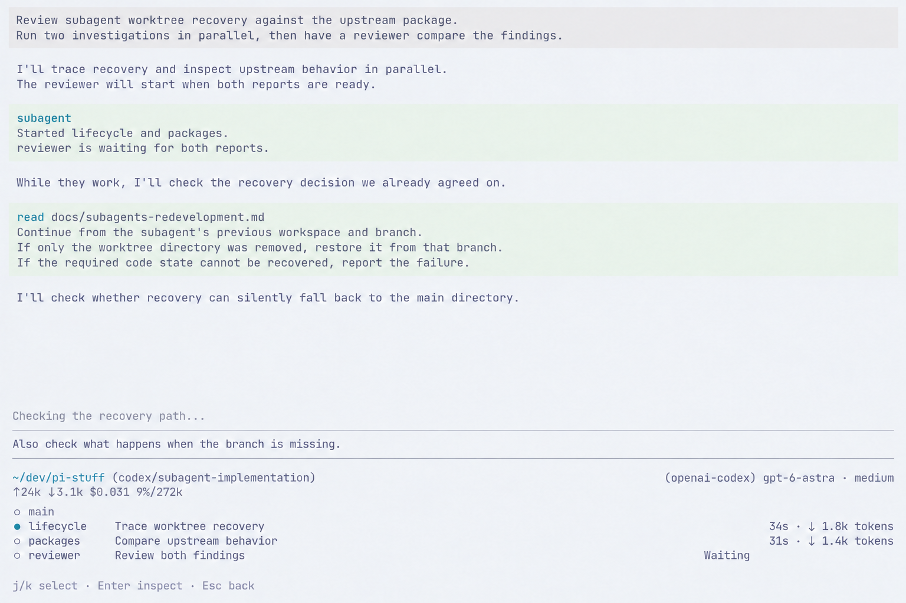
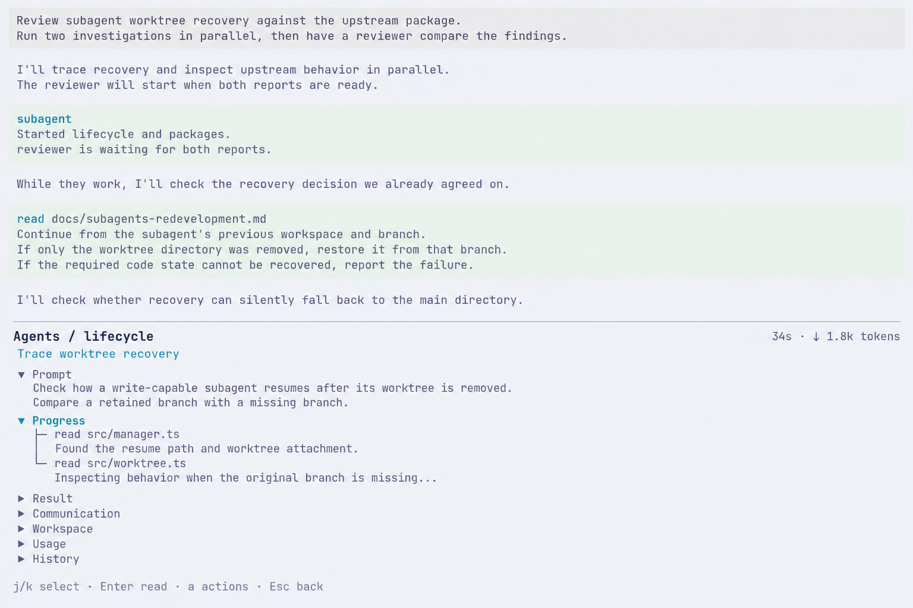

# Subagent UI redevelopment interview

[简体中文](i18n/zh-CN/subagents-redevelopment-ui.md). English is authoritative.

Status: part 1, main layout and page transitions, opened on 2026-09-20. UIR01-UIR02 below are proposals awaiting the maintainer's answers. Tracked in [#97](https://github.com/jczhang02/pi-stuff/issues/97), under [#64](https://github.com/jczhang02/pi-stuff/issues/64). Runtime scope is settled in the [redevelopment decisions](subagents-redevelopment.md).

Discuss the UI one part at a time, primarily through images of real usage scenarios. The sequence is main layout and transitions; FleetView and task structure; details and observability; interventions; completion and history; keyboard and visual consistency. This round covers only the first part. The previous UI is the starting point, not a wholesale adoption of its old runtime requirements.

## Visual reference

The current Ghostty configuration uses Catppuccin Latte, background `#eff1f5`, foreground `#4c4f69`, a 12pt slightly thickened font, disabled ligatures and 2px padding. The font stack is JetBrainsMono Nerd Font Mono, Symbols Nerd Font Mono and LXGW WenKai Mono. The configured default is 150 columns by 50 rows; Pi uses the same light theme and fullscreen mode. There was no live Terminal Control session to inspect in this round.

The images use that configuration and the earlier actual [FleetView](assets/subagents/light-fleet-120x36.png) and [detail](assets/subagents/light-detail-160x48.png) captures as visual references. Both are 1536x1024 ImageGen concept previews with illustrative task content and metrics, not screenshots of a running implementation. Font rasterization, cell geometry and keyboard behavior still need verification in Pi. The exact prompts and provenance are retained in [generation.json](assets/subagents-redevelopment-ui/generation.json).

## State 1: main with FleetView

The main agent starts lifecycle and package investigations; the reviewer waits for their reports. Main continues its own investigation above the editor. The full-width FleetView sits below the statusline. The selected lifecycle row changes only its circle; main has no description and normal execution has no Running label. The editor retains a draft while browsing focus is in FleetView, so its text caret is hidden.

**UIR01. Retain this main layout?** Recommendation: retain the main conversation, editor and statusline, with compact FleetView directly below. Use its rows to inspect subagents while keeping the main draft available.

## State 2: open lifecycle details

Opening lifecycle keeps the main conversation above and replaces the entire bottom interaction area with that subagent's detail. The main editor, main statusline and compact FleetView are absent while inspecting. This is inline inspection in the main session, not an overlay or a host-session switch. The detail header names the inspected agent; Prompt appears before Progress, with tool activity shown as a tree.

**UIR02. Use this bottom takeover for inspection and return to the retained main layout?** Recommendation: use the illustrated transition, give the detail the bottom area, and preserve the visible main conversation. Back restores the prior FleetView selection and main draft. Inspecting or returning does not stop background work.

## Scope of the illustrations

Only the two layout proposals above are being decided. The sample section names, metrics, shortcut hints and approximate height division illustrate the page relationships; the relevant later part will settle their details. The generation pass corrected the main-editor caret because FleetView held focus. Both final images were visually inspected for the main/detail transition, English text, selection treatment and removal of the main controls from detail. No new product code or terminal acceptance was performed.
