# Subagent UI redevelopment interview

[简体中文](i18n/zh-CN/subagents-redevelopment-ui.md). English is authoritative.

Status: UIR01 and revised UIR02 accepted on 2026-09-20; UIR03, UIR04 local help and UIR05 accepted on 2026-09-21. UIR06 proposes showing and answering a pending child question in detail and awaits an answer. FleetView help appears above its rows only while the list has keyboard focus. The first UIR02 image remains rejected design history. Tracked in [#97](https://github.com/jczhang02/pi-stuff/issues/97), under [#64](https://github.com/jczhang02/pi-stuff/issues/64). Runtime scope is settled in the [redevelopment decisions](subagents-redevelopment.md).

Discuss the UI one part at a time through real usage scenarios: main layout and transitions; FleetView and task structure; details and observability; interventions; completion and history; keyboard and visual consistency. The maintainer's feedback brings detail hierarchy into this round. The previous UI is a starting point, not a wholesale adoption of its old runtime requirements.

## Visual reference

The inspected Ghostty configuration uses Catppuccin Latte, background `#eff1f5`, foreground `#4c4f69`, a 12pt slightly thickened font, disabled ligatures and 2px padding. The font stack is JetBrainsMono Nerd Font Mono, Symbols Nerd Font Mono and LXGW WenKai Mono. The configured default is 150 columns by 50 rows; Pi uses the same light theme and fullscreen mode. There was no live Terminal Control session to inspect.

The images use that configuration and the earlier actual [FleetView](assets/subagents/light-fleet-120x36.png) and [detail](assets/subagents/light-detail-160x48.png) captures. They are 1536x1024 ImageGen concepts with illustrative task content and metrics. Font rasterization, cell geometry and keyboard behavior still need verification in Pi. Exact prompts and provenance are retained in [generation.json](assets/subagents-redevelopment-ui/generation.json).

## UIR01: main layout accepted

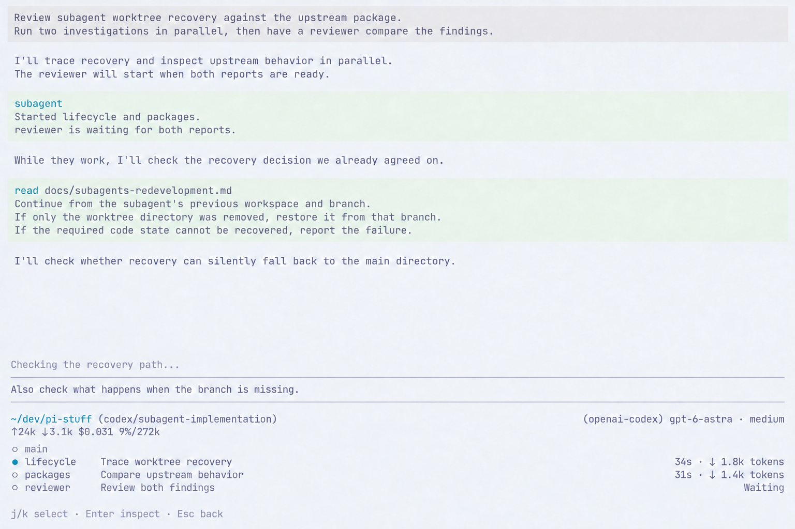

Keep the main conversation, editor and statusline, followed immediately by full-width FleetView. Main has no description. Selection changes only the circle; normal execution has no Running label. The editor retains its draft and hides its caret while focus is in FleetView.

The maintainer also required Waiting and similar state text to align with the elapsed/token area. The revised image places every row's trailing content in the same right-aligned region. Waiting ends at the same right edge as tokens, rather than occupying a separate position before the metrics. Metric rows share elapsed and token column positions; names and descriptions retain their own shared columns.

## Why the first detail design was rejected

The maintainer found the [first detail image](assets/subagents-redevelopment-ui/02-detail.png) redundant and hard to scan. Prompt, Progress and five additional categories had similar visual weight. A reader had to search the page for the latest useful information.

The observed [Claude Code task detail](https://github.com/jczhang02/pi-stuff/blob/42fe5afa96caf31a255b76ac6ec751999fc10413/docs/assets/claude-subagent-ui/05-task-detail.png) uses a compact identity/metrics header, current activity, prompt and local actions. Its complete transcript is a separate reading surface. The [research record](https://github.com/jczhang02/pi-stuff/blob/42fe5afa96caf31a255b76ac6ec751999fc10413/docs/claude-subagent-ui-research.md) distinguishes real CLI interaction from fixture-generated content.

Current [Claude Agent View documentation](https://code.claude.com/docs/en/agent-view#peek-and-reply) prioritizes recent output or a pending question in its peek. [Cursor's review workflow](https://docs.cursor.com/en/agent/review) makes the produced changes directly accessible from an agent response. These inform the proposal's information order. Their session switching, peek containers and GUI controls are not prerequisites for Pi's inline detail.

## UIR02: revised detail accepted

Opening a child replaces the entire bottom interaction area, with the visible main conversation above. Main editor, main statusline and FleetView are absent while inspecting. Returning restores the previous FleetView selection and main draft; background work continues. The maintainer accepted this revised hierarchy and its retained page relationship. The sample keys and exact height remain illustrative.

### While working

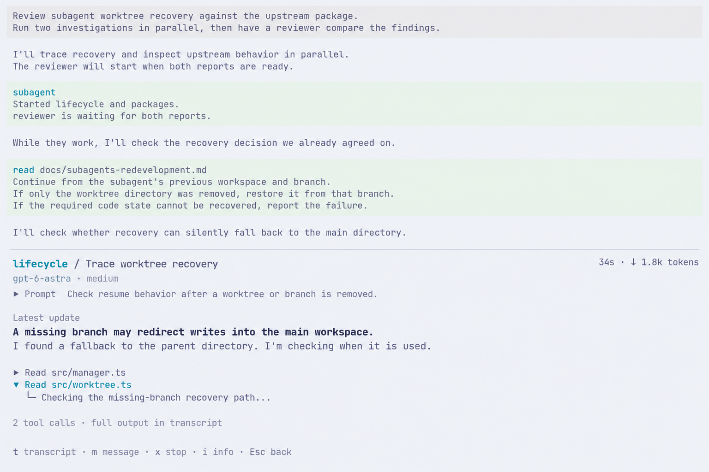

The header identifies the child and assignment once, with model and usage nearby. Prompt is a compact expandable line. The central content is the child's latest visible reply, followed by recent tool activity. The sample reply includes its own emphasized finding; the UI does not need another model call to invent a summary. The tool tree serves local activity, not a directory of every data category.

Transcript opens full recorded output. Info provides access to supporting configuration, workspace, usage and history. Their exact organization belongs to later rounds.

### After completion

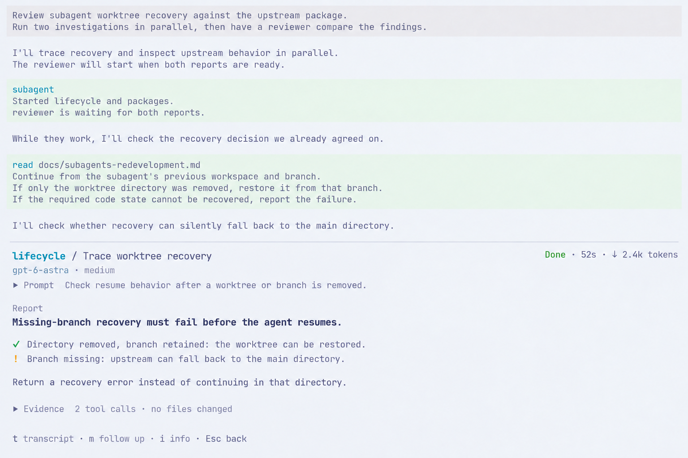

The same central area shows the final report directly. Its conclusion and supporting observations are readable without opening a Result section. Tool evidence is folded. The header says Done because the investigation completed successfully, even though its report identifies an upstream problem.

The working and completed images are states of one design. The local action hints change from message/stop to follow-up as appropriate. Key assignments and action behavior are illustrative until the interaction round.

**Accepted UIR02.** Show the latest reply and current activity while working, then the report on completion, with supporting information one step deeper. Preserve access to full evidence while making the first screen useful on its own. Concrete pending questions and errors still need their own design pass.

## UIR03: FleetView and task relationships accepted

FleetView remains the compact list accepted in UIR01. Its row layout does not change when a task has dependencies. Independent work needs no extra relationship diagram. When the selected task belongs to a dependency workflow, provide an entry to its actual dependency graph in the bottom inspection area. The exact entry key will be decided with keyboard interaction.

### Independent investigations

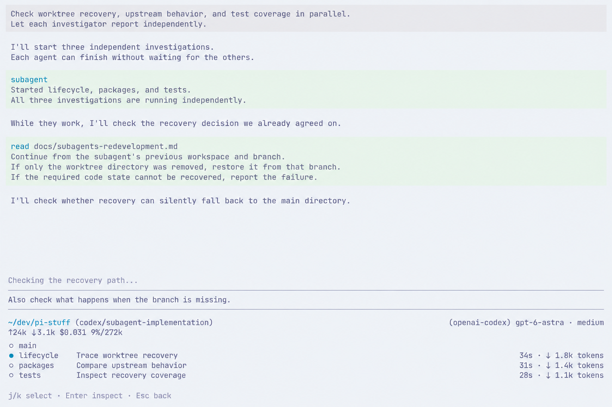

Lifecycle, packages and tests investigate independently. Each row can open its detail. There are no dependency arrows or an invented parent-child tree. The historical image's bottom `j/k` hint is superseded by the focus comparison in UIR04.

### A workflow with dependencies

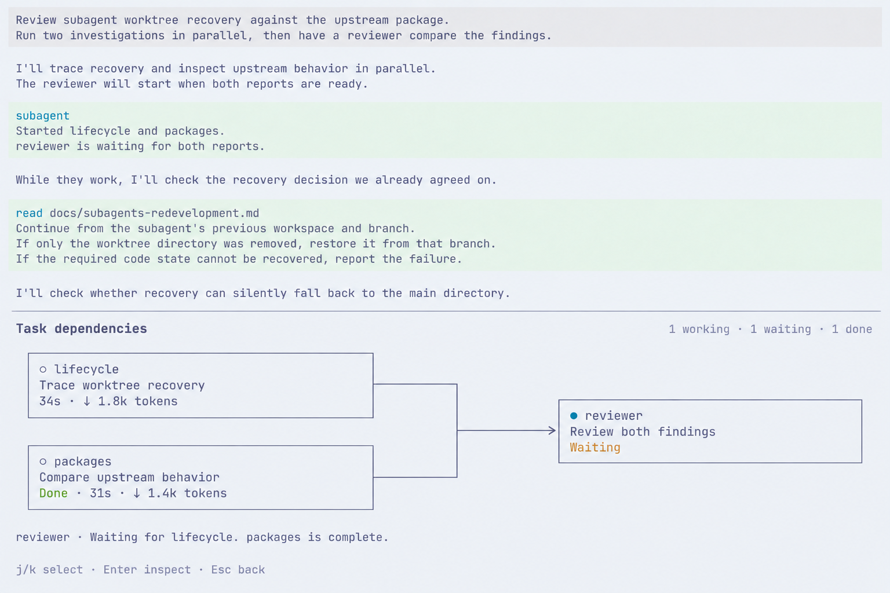

This is a separate scenario: reviewer requires the results of lifecycle and packages. The image shows the graph after opening it from FleetView. Packages is done, lifecycle is still working, and reviewer has not started. Both dependency edges remain visible; the selected-node line explains that lifecycle is the outstanding prerequisite.

Use one directed graph form for explicit dependencies, including a simple serial chain. Connect prerequisites to consumers. Select a node to inspect its state and open the accepted detail view; Back returns to the graph selection, then to FleetView. The upper main conversation stays visible, while the graph takes the bottom interaction region.

This accepted division uses a compact list and an on-demand relationship view, without a menu of interchangeable list/tree/graph renderers. Graphs come from recorded dependencies, not inferred relationships between prompt text or agent names. The sample reports and timings are illustrative. Its Waiting reason is truthful for this particular join; it is not a claim that every queued task is waiting on an unfinished dependency. Upstream's ready-wave scheduling remains the runtime baseline. Acceptance covers the relationship presentation, not the graph image's illustrative key hints.

**Accepted UIR03.** Keep FleetView as a list and offer an on-demand graph only for actual dependencies, with nodes opening the same detail view.

## UIR04: local help accepted

**Required correction.** FleetView being visible does not mean it has keyboard focus. The maintainer requires FleetView navigation/action help to appear only while focus is in that list. Typing in the main editor hides that help while retaining the agent rows.

### Reference behavior

The inspected Pi 0.85.1 [selection bindings](https://github.com/earendil-works/pi/blob/d981de1229ef899957bbe968bc8dcda02a21f477/packages/tui/src/keybindings.ts) default to up/down, Enter and Escape/Ctrl+C. Its [ExtensionSelector](https://github.com/earendil-works/pi/blob/d981de1229ef899957bbe968bc8dcda02a21f477/packages/coding-agent/src/modes/interactive/components/extension-selector.ts) additionally accepts `j/k`, but displays `↑↓ navigate` and configured confirm/cancel hints below the list. Other Pi selectors place help above the list; there is no single Pi-wide help position.

The recorded Claude Code 2.1.261 [focused FleetView](https://github.com/jczhang02/pi-stuff/blob/42fe5afa96caf31a255b76ac6ec751999fc10413/docs/assets/claude-subagent-ui/02-selected.txt) places action help above its rows. In the [editor-focused capture](https://github.com/jczhang02/pi-stuff/blob/42fe5afa96caf31a255b76ac6ec751999fc10413/docs/assets/claude-subagent-ui/04-message.txt), the rows remain but FleetView action help is replaced by editor-context help. Claude's separate row pointer and active-session circle have different meanings. Our accepted circle-only selection does not copy that two-marker scheme or imply host session switching.

The earlier `j/k select` footer was a concept choice, not a shared Pi/Claude default. Prefer Pi's configured selection bindings and show their actual keys. The new images use default arrow/Enter labels and Pi Stuff's fixed Esc-back rule.

### Main editor focused

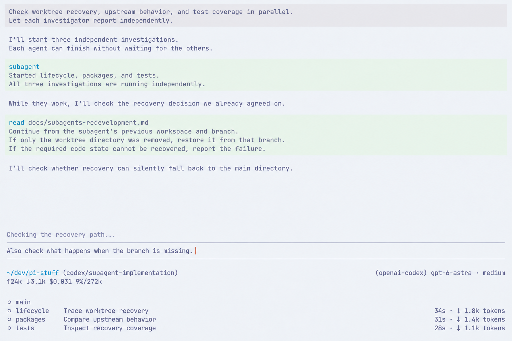

The draft has a visible text caret. All FleetView circles are hollow and local help is absent. The previous list selection is retained internally for returning to the list. Editor cursor movement, history and autocomplete keep their Pi behavior.

### FleetView focused

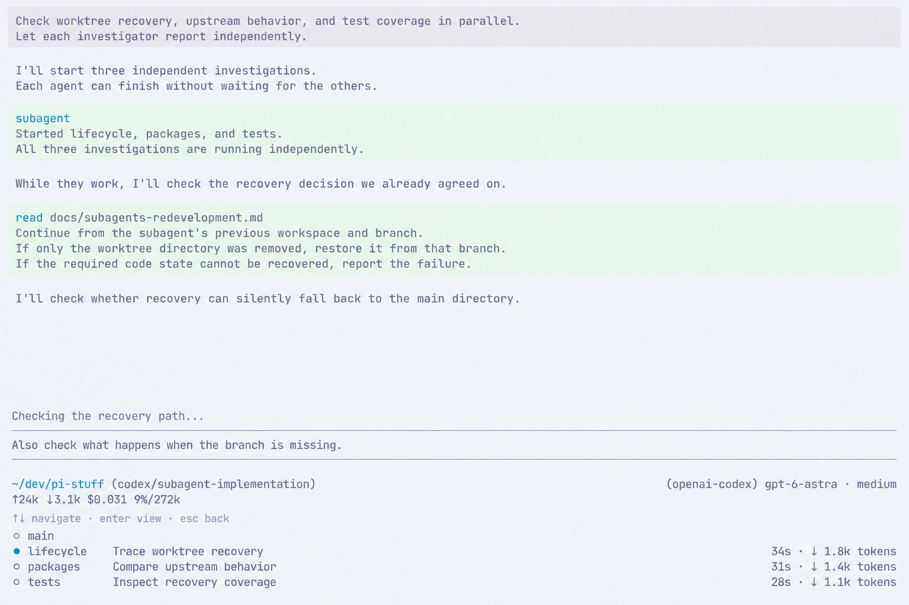

The draft remains, without its caret. Only the selected lifecycle circle is filled. One muted help line sits between statusline and rows: `↑↓ navigate · enter view · esc back`. There is no extra pointer, selected-row background or help below the list. The two concepts retain the same row positions; the spare line is illustrative, not a fixed-height requirement.

The accepted help position follows Claude's local action placement. Navigation follows Pi's selection bindings. Earlier approval of arrows to enter FleetView remains; the entry must preserve normal editor handling. This round does not define stop, message or other intervention shortcuts.

**Accepted UIR04.** Place FleetView's local action help above its rows, below the statusline, and change it with keyboard focus. Show FleetView actions when the list is focused; hide those actions when focus returns to the editor. The maintainer explicitly accepted this Claude-style help behavior. Exact hint wording and the images' hollow-circle treatment outside list focus remain illustrative; the earlier circle-only selection rule still applies.

## UIR05: sending an instruction from detail accepted

Scenario: lifecycle is investigating worktree recovery. The user wants it to focus on the missing-branch path and leave files unchanged. The following three images show successive states of that interaction.

### What upstream supports

Arhen's [steering tool](https://github.com/arhen/pi-extensions/blob/676b11eb415cd46fbede712b5bbb075ff3f043bf/packages/core/pi-core-subagent/src/index.ts#L351-L377) calls the running child's session with `streamingBehavior: "steer"`. Pi [queues that input](https://github.com/earendil-works/pi/blob/d981de1229ef899957bbe968bc8dcda02a21f477/packages/coding-agent/src/core/agent-session.ts) while streaming and removes it from the pending steering list when its user-message event starts. It does not immediately abort an executing tool or prove that the model understood the instruction.

This is distinct from sibling mailboxes, which recipients poll, and from replying to a child blocked on `ask_parent`. This round covers steering a working child. Completed-agent follow-up is already in RQ05; its UI and the pending-question UI will be considered with their respective scenarios.

Source inspection also exposes a false-positive path in [steerTask](https://github.com/arhen/pi-extensions/blob/676b11eb415cd46fbede712b5bbb075ff3f043bf/packages/core/pi-core-subagent/src/manager.ts#L1434-L1441): a specified ID can return success without a live child, and the session call is fire-and-forget. The redevelopment must validate the actual target and queue acceptance before displaying success. This is a source finding to reproduce and repair under the existing bug-fix scope, not an executed regression test or a new receipt protocol.

### 1. Compose while keeping the finding visible

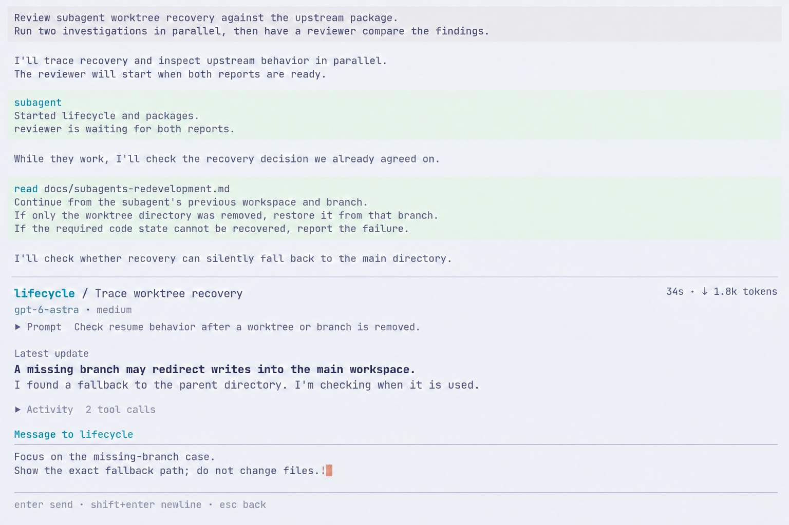

The detail's Message action opens a temporary local editor below the latest reply. Identity, assignment and current finding remain visible; the activity trail folds to make room. The composer names lifecycle as its recipient. It does not restore the main editor, statusline or FleetView, and does not switch the host session.

The illustrated keys are `m` to open Message, Enter to send, Shift+Enter for a newline and Esc to return to detail. Use Pi's configured submit/newline bindings and the fixed Esc-back rule. While typing, only composer help is shown; letters such as `m` and `x` are text, not detail actions. Esc sends nothing and preserves the local draft when reopening it for the same child.

### 2. Show the queued instruction

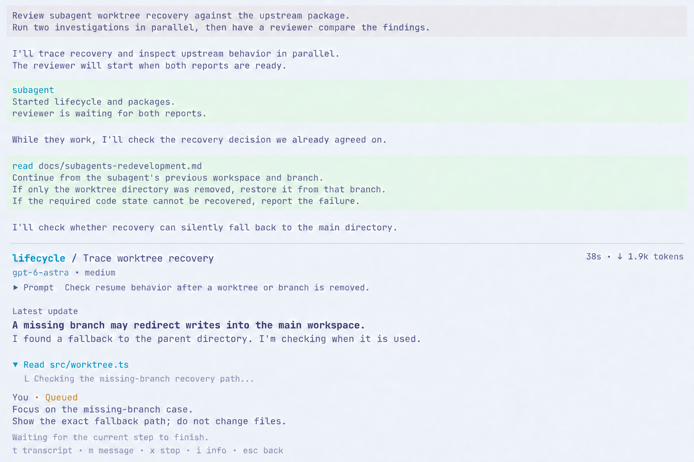

After queue acceptance, close the composer and restore detail. Keep the exact instruction visible with `Queued` while it remains pending. In this scene, a tool is still working, so the explanation says it is waiting for the current step to finish. Derive that explanation from actual activity; do not display it for every possible delay.

A submission error leaves the draft available and explains why the instruction was not queued. Do not show success from the upstream manager's boolean alone. Never label queue acceptance as Read, Applied or Acknowledged.

### 3. Let the child's reply show what happened

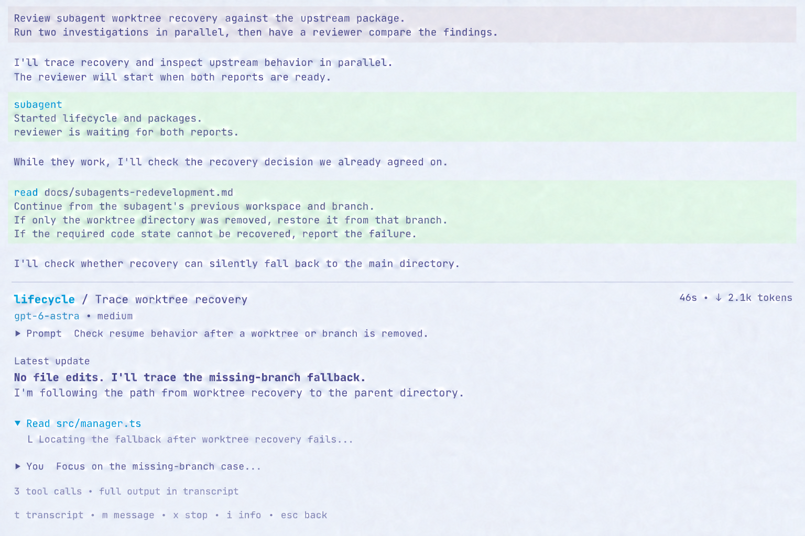

Once this instruction actually enters the conversation, remove its pending indication. An unrelated child event is not enough. The example then shows a new child reply: it will trace the missing-branch fallback without editing files. That text is illustrative model output, not a UI-generated acknowledgement or an enforced wording requirement.

The user's message folds to one line and remains available in the transcript. The latest child reply and current activity again take priority. There is no separate messaging dashboard or extra model call to summarize compliance.

**Accepted UIR05.** Use a temporary editor inside child detail, close it after actual queue acceptance, and show pending input followed by the child's actual response in the same detail. Preserve the draft on Esc or submission failure. It keeps the recipient and current work visible throughout the interaction without inventing a read or compliance receipt.

## UIR06: a child asks its parent a question

Scenario: lifecycle has found the worktree fallback and asks whether to reproduce it or continue tracing the source. These two images show the pending question and an optional human reply.

### What upstream supports

Arhen's [ask_parent](https://github.com/arhen/pi-extensions/blob/676b11eb415cd46fbede712b5bbb075ff3f043bf/packages/core/pi-core-subagent/src/child.ts#L18-L34) takes one plain-text question. It blocks the child and asks the parent agent, not the human directly. The [manager](https://github.com/arhen/pi-extensions/blob/676b11eb415cd46fbede712b5bbb075ff3f043bf/packages/core/pi-core-subagent/src/manager.ts#L572-L600) marks the child awaiting_parent and routes the question through the parent's pending wait result or a follow-up message.

The parent answers through [reply_subagent](https://github.com/arhen/pi-extensions/blob/676b11eb415cd46fbede712b5bbb075ff3f043bf/packages/core/pi-core-subagent/src/index.ts#L331-L350), which resolves the blocked call. This is different from steering a working child. Upstream [peek](https://github.com/arhen/pi-extensions/blob/676b11eb415cd46fbede712b5bbb075ff3f043bf/packages/core/pi-core-subagent/src/peek.ts#L136-L191) can inspect or cancel but has no human reply composer. The proposal adds that UI entry to the same reply operation, within the agreed single-tool design.

The [task snapshot](https://github.com/arhen/pi-extensions/blob/676b11eb415cd46fbede712b5bbb075ff3f043bf/packages/core/pi-core-subagent/src/types.ts#L18-L51) records the waiting state but not the question text. The UI must obtain the original text from the existing question event or child transcript and associate it with the live pending question. Do not infer a question from the latest reply or show an old question as still pending. This proposal does not add a durable question protocol or change recovery behavior.

Upstream has a [10-minute reply timeout](https://github.com/arhen/pi-extensions/blob/676b11eb415cd46fbede712b5bbb075ff3f043bf/packages/core/pi-core-subagent/src/manager.ts#L622-L650); after that, it returns a fallback instruction to the child. The UI follows the actual pending state. No countdown or human-approval gate is introduced.

### 1. Make the pending question the primary content

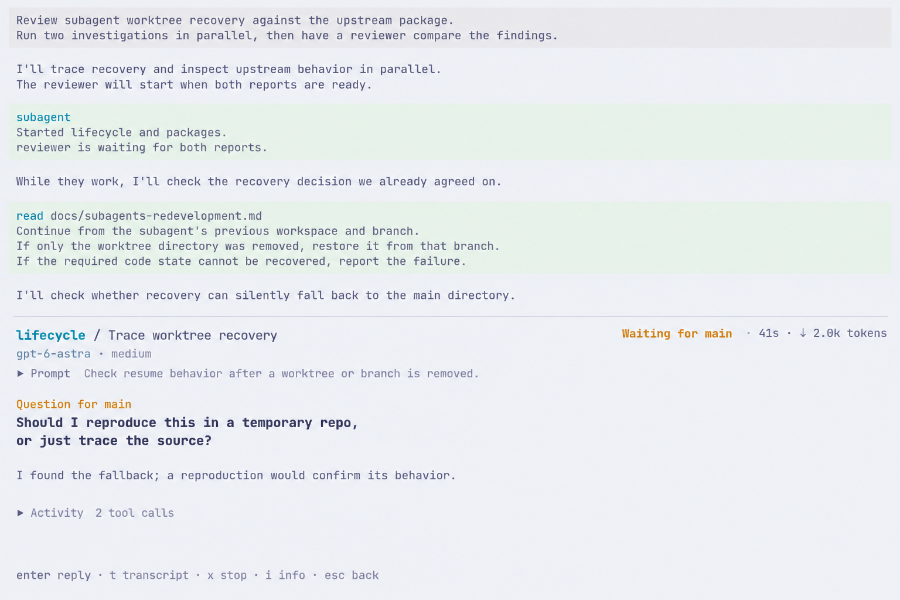

The header says Waiting for main, so it does not imply that the human must answer. The question replaces Latest update as the central content. The example's explanation is part of the child's question text, not a UI-generated summary. Prior tool activity folds below it; no live tool is depicted while this child is blocked.

The parent remains free to answer through its normal flow. Opening detail does not reserve the question for the human or interrupt the parent. The main transcript stays above, and the accepted bottom-detail layout remains.

### 2. Reply while keeping the question visible

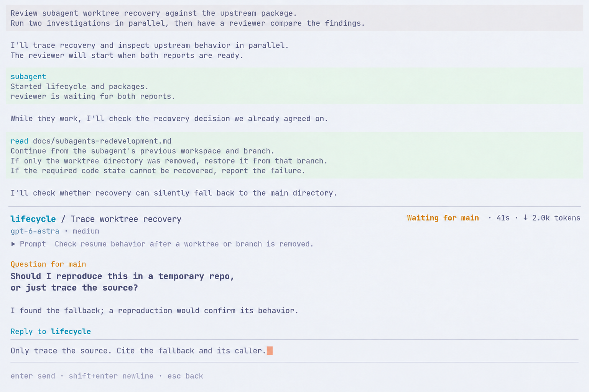

Enter opens a local editor labelled Reply to lifecycle. It uses the UIR05 composer pattern and Pi's configured submit/newline bindings, with Esc returning without sending. The original question stays visible. Typing uses composer bindings rather than detail shortcuts.

Submit answers this pending question through the reply operation; it does not enqueue a steering message. Close the composer only after the reply is accepted. The UI may briefly show Answer sent, but returns to normal working detail only when the child actually resumes. Its later reply and activity show the result; do not invent Read, Applied or Acknowledged.

Bind submission to the question that was opened. If it has already been answered, expired or cancelled, preserve the draft and refresh detail with a concise explanation. Do not send that draft to a later question or silently turn it into steering. A delivery failure also preserves the draft. These are correctness requirements for the proposed reply entry, not additional runtime features.

**UIR06 question. Give a pending question priority in child detail and allow an optional human reply through the same local composer, while the parent can still answer normally?** Recommendation: yes. It makes the blocker clear and reuses the accepted interaction.

## Verification and next step

UIR01-UIR05 remain accepted within their recorded scope. UIR06 is a proposal. Both question concepts were visually inspected for the waiting recipient, question priority and retained context while replying. Ghostty and Pi configuration were rechecked; the composer uses the configured block cursor. Source findings concern pinned arhen 1.3.55; reply delivery, timeout and race behavior were not executed this round. These are ImageGen concepts, not terminal acceptance evidence. This round changes documentation and images only. Await the UIR06 answer before advancing the interview.
