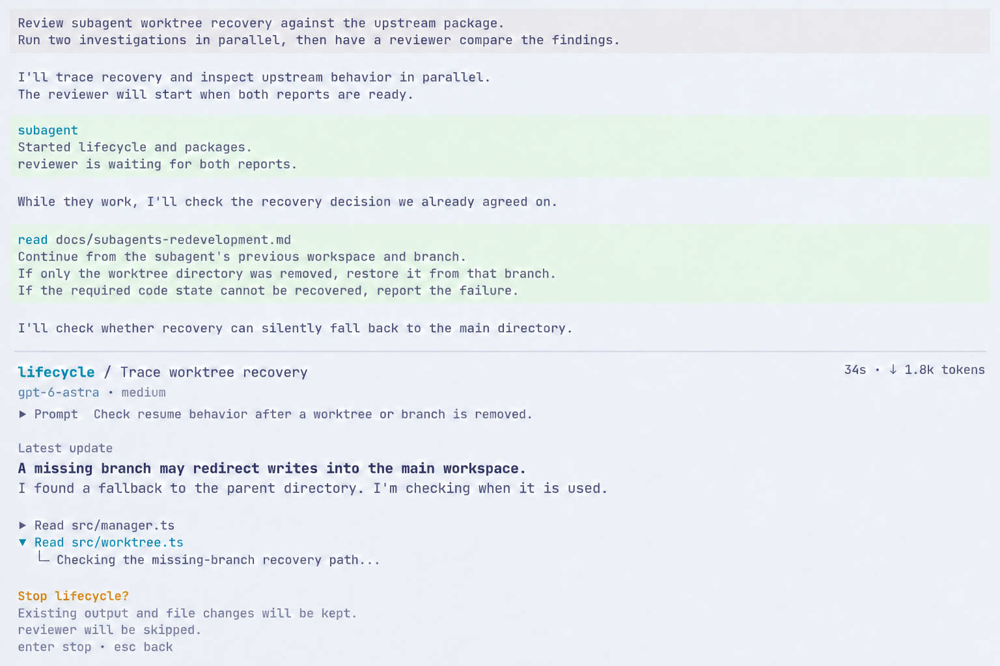
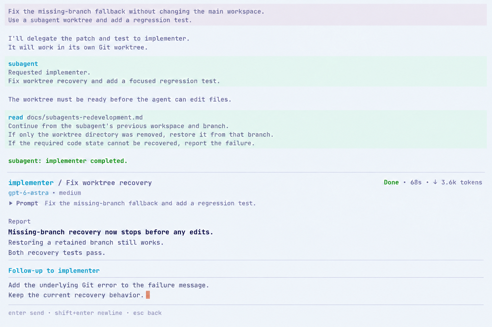
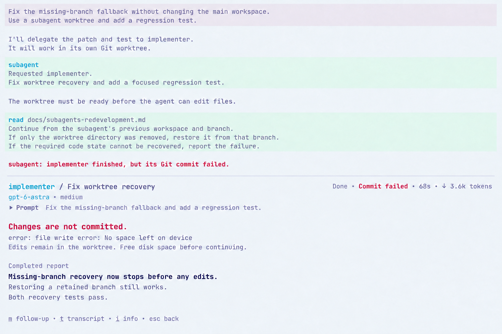

# Subagent UI decision spec · illustrated review edition

[简体中文](i18n/zh-CN/subagents-ui-decision-spec.md) · Companion: [Package and harness research](subagents-package-harness-research.md).

**Status: development paused; for review.** Consolidated on 2026-09-22. This document records existing UI decisions. It does not authorize further development or treat the current implementation and passing tests as product acceptance. Only this research/spec pair and its referenced images remain in the branch. The discarded implementation and earlier documents are available only through Git history.

## 1. Reading this spec

The document follows the user workflow rather than the interview rounds. Each surface explains what to read, what to do and how to return. Agreed direction comes from UIR01-UIR09 and the formal spec, including the maintainer's later requests for separators, duration formatting and collapsible messages. Concrete choices made during repairs are separated in section 10 rather than presented as individually approved designs.

Figures 1-8 are previously discussed **ImageGen concepts**, retained to explain intent. Their reports, paths, metrics and test claims are examples. Figure 9 is an **actual prototype capture**, showing the implementation rather than renewed approval. Later textual decisions take precedence over historical keys and geometry.

The inspected historical Ghostty/Pi reference used English UI, Catppuccin Latte, JetBrainsMono Nerd Font Mono / Symbols Nerd Font Mono / LXGW WenKai Mono, 12pt type, disabled ligatures, 2px padding and a default 150×50 viewport. Dark themes, 120×36 and 80×24 also matter. This is the recorded environment, not a fresh configuration inspection; concepts do not guarantee actual font rasterization or terminal-cell geometry.

## 2. Main: FleetView below the statusline

### Figure 1. Typing in the main editor

The order is main conversation, main editor, main statusline, then full-width FleetView. Statusline means the cwd/model/usage area. Fleet icons align with its left edge without another gutter. Main has only a name, no description.

The user is adding a requirement. The caret belongs to the main editor; agent rows remain visible without their local action hints. No second main session is created for the child.

### Figure 2. FleetView has focus

Selecting lifecycle changes only its circle. There is no full-row highlight, extra pointer or left gutter. A filled circle means keyboard selection, not an active host session. When focus leaves, the emphasis disappears but the previous selection remains remembered.

Fleet help appears **below the statusline and above the rows** while Fleet owns focus. It disappears on return to the editor. The blank line in figure 1 is not a permanent reserved-space requirement.

| Row element              | Decision                                                                                                         |
| ------------------------ | ---------------------------------------------------------------------------------------------------------------- |
| Name                     | No T1/T2 task numbers. Distinguish duplicate roles by assignment                                                 |
| Description              | Concise task text, not the entire prompt                                                                         |
| Duration                 | `34s`, `45m 14s`, `1h 2m`, rather than `2714s`                                                                   |
| Tokens                   | `↓ 8.2k tokens`: output for this request, not cumulative input/all usage                                         |
| Normal work              | Omit a redundant Running label                                                                                   |
| Waiting and other states | Share the metrics' trailing region and right edge, without shifting other rows into different columns            |
| Alignment                | Calculate name, description, elapsed and token widths for the visible list in terminal cells, not per-row spaces |

Updates do not reorder rows or steal focus. Overflow keeps selection visible and shows the visible range. Completed, failed and stopped children remain reopenable. No empty FleetView appears when there are no children.

## 3. Detail replaces the bottom interaction region

### Figure 3. A working child

Opening lifecycle keeps the main conversation above. Child detail replaces the bottom interaction region: **the main editor, main statusline and FleetView are absent**. A full-width separator marks the boundary. This is inspection, not an overlay or a fabricated host-agent switch.

The first screen should answer who the child is, what it is doing, its latest finding and whether anything needs attention. The information order is:

1. Compact identity/assignment with this request's elapsed time and output tokens.
2. Foldable Prompt above the principal output.
3. Actionable failure or pending question first; otherwise latest visible reply, then the direct report on completion.
4. A short Activity tool trail, with full evidence available on demand.
5. Local actions appropriate to the current state.

Tree indentation belongs to a tool call and its local content. It is not a category directory giving Prompt, Progress, Result and Errors equal weight. Use actual child text without another model-generated UI summary. Expanding Prompt must not duplicate the assignment text. Activity folds after completion or while composing.

| Reader      | Question it answers                                                       | Return path                                                      |
| ----------- | ------------------------------------------------------------------------- | ---------------------------------------------------------------- |
| Detail body | What is the current finding, question, report or error?                   | Originating FleetView/graph with selection restored              |
| Transcript  | What did the child receive, say and call?                                 | Detail; retained evidence, without a promise of hidden reasoning |
| Info        | Which model, tools, cwd/worktree, Git outcome and usage actually applied? | Detail; read-only                                                |
| History     | What happened on each previous assignment to this same child?             | Info → request list → old report; Esc reverses the path          |

Historical reports are read-only; actions must not silently target the current request. Returning to main restores its draft. Closing inspection does not stop explicitly dispatched background work.

## 4. Relationships: a list for independent work, a graph for dependencies

Three independent investigators use the list in figures 1/2. Do not invent edges or place all work in a tree. Offer a graph only when explicit dependencies exist; serial chains and DAGs use the same directed representation.

### Figure 4. Two investigations feed a reviewer

Packages is complete, lifecycle is working and reviewer needs its result. The explanation below must reflect scheduling evidence; arrows alone do not prove the reason for every wait.

**This is a relationship page opened from FleetView, not a tree/list/DAG mode selector.** The image's `j/k select` hint is historical. Later decisions prefer Pi's configured selection keys, normally Up/Down. Box sizes and spacing are not a final terminal-cell contract.

A selected node opens the same detail as FleetView; Back restores graph selection. Duplicate roles include assignment text. A bounded viewport keeps the selected node visible and marks edges continuing outside it. Layout must not delete dependencies to fit.

## 5. Intervene inside detail

### Figure 5. Reply to a child's question

`Waiting for main` means the parent agent, not necessarily the human. The parent can answer normally; opening detail does not reserve the question. A human Reply editor names its recipient and keeps the original question visible exactly once.

Submission binds to the question that was opened. If the parent answered, the question expired or the task stopped, retain the draft and explain the change. Do not send it to a newer question or convert it to steering. Close the composer after accepted delivery; use actual state to determine whether work resumed.

| Action          | Realistic example                                                                         | What the UI can claim                                                    |
| --------------- | ----------------------------------------------------------------------------------------- | ------------------------------------------------------------------------ |
| Message / steer | While lifecycle investigates, add "Only check the missing-branch path; do not edit files" | Name the recipient; preserve accepted input as Queued, not Read/Applied  |
| Reply           | The child asks "Reproduce or inspect source?"; answer "Inspect source"                    | Answer this blocked question, distinct from steering live work           |
| Resume          | Continue an investigation after failure or stop                                           | Continue the saved context when eligible; do not restart downstream work |
| Follow-up       | Ask the completed reviewer to check a fix                                                 | Create a new request record and retain the earlier report                |

These actions reuse one local composer pattern rather than separate dashboards. While typing, `m/x/p` are text. Esc sends nothing and retains the draft for its exact target in the current session; failures and resize also retain it. Unsent drafts are not promised across process restarts.

### Figure 6. Confirm stop within detail

Stop targets the current child. Work continues until confirmation; Esc dismisses. After confirmation, show Stopping until execution and request finalization actually end, then Stopped. Retain output, without equating a stop request with completed stopping and successful preservation.

Reviewer is skipped here because it depends on lifecycle. Independent packages continues. This is not recursive-tree cancellation or rollback of existing files. The image's preservation wording expresses intent; a failed save must be reported separately.

### Figure 7. Follow up after completion

Before submission, Done and metrics still describe the finished request. Acceptance starts a new request; earlier report, duration and usage remain in History. Context stays with the same child, without automatically rerunning prerequisites or dependents. The image's historical `68s` should read `1m 8s` under the later duration decision.

## 6. Observability: separate state, model output and preservation

### Figure 8. Report complete, code preservation failed

The model finished its report, but Git could not save a commit because of a disk error. Retain the report and prioritize the actual preservation failure. Done does not mean committed, or integrated into main. A report's "tests pass" claim is model text, not a UI-certified verification result.

| Actual condition                         | Compact state                          | Evidence retained in detail                                       |
| ---------------------------------------- | -------------------------------------- | ----------------------------------------------------------------- |
| Waiting on prerequisites                 | Waiting                                | Actual outstanding prerequisites                                  |
| Wave barrier or concurrency capacity     | Queued                                 | Known scheduling reason, not an invented dependency               |
| Launching                                | Starting                               | Current phase and available configuration                         |
| Normal execution                         | Elapsed/output metrics                 | Latest reply and actual tool activity                             |
| Awaiting parent answer                   | Waiting for main                       | Original pending question                                         |
| Accepted instruction pending consumption | Queued-input feedback                  | Exact instruction; preserve execution status separately           |
| Cancellation requested, not finalized    | Stopping                               | Latest output and reading/back, without conflicting actions       |
| Successful execution                     | Done                                   | Original report and request metrics                               |
| Failure / stop / dependency skip         | Failed / Stopped / Skipped             | Actual cause, incomplete work and eligible next action            |
| Normal Git finalization                  | Finalizing                             | Neither Stopping nor a premature successful-save claim            |
| Commit failure                           | Commit failed, possibly alongside Done | Full error and retained directory, without a successful-save line |

Missing usage is unavailable, not an invented zero. Empty output does not prove there is no session. A tool error does not necessarily fail the whole agent. Dispatch rejected before creating a child produces a main-chat error rather than a fabricated child row or transcript.

Main-chat `subagent` calls and background messages are orchestration evidence and should fold/expand like other tool messages. Keep the default compact while delivering necessary full content to the parent model. The parent gives the user-facing conclusion; evidence can be expanded for inspection. Do not repeatedly dump every old report into main.

## 7. Keyboard and focus contract

Actions must suit a 60% keyboard and tmux. An editor-edge Up/Down action enters Fleet only after native editing, history and completion did not consume it; `/subagents` is an explicit entry. No Alt+A, function row, Home/End or PageUp/PageDown requirement.

| Focus                   | Recorded actions                                                                                                        |
| ----------------------- | ----------------------------------------------------------------------------------------------------------------------- |
| Main editor             | Native editing/history/completion first; edge Up/Down enters Fleet                                                      |
| FleetView               | Configured Pi selection keys; confirm child opens detail, confirm main restores editor; `g` opens existing dependencies |
| Detail                  | `p` Prompt, `a` Activity, `t` Transcript, `i` Info, `g` existing graph                                                  |
| Detail intervention     | `m` eligible Message/Resume/Follow-up; `x` stop confirmation; confirm replies to a live question                        |
| Reading                 | `[`/`]` page with visible position; `f` follows new output                                                              |
| Info / History          | `h` opens history; Pi selection/confirm opens an old report                                                             |
| Local editor            | Native editing/submit/newline; Esc keeps the draft and returns                                                          |
| Main-chat tool messages | Native tool-expansion binding, normally Ctrl+O                                                                          |
| Back                    | Fixed Esc returns one level and restores focus/selection                                                                |

Hints reflect actual configured matchers. Feature letters belong only to their local surfaces. The former prototype's handling of global shortcuts inside inspection is not a new product decision.

## 8. Long content and narrow screens

Keep identity, essential state, input and exit available while paging a bounded body. Growing output must not indefinitely enlarge the bottom region. Paging away freezes the content being read; new output is indicated and replaces it only on explicit follow. Resize preserves the semantic reading position, not merely an obsolete line number.

Shortened paths, full errors, reports and usage remain inspectable. Graph overflow preserves selected-node and edge meaning. Below a useful size, show a resize notice and Esc. Use Pi semantic themes, cell widths and wrapping rather than alignment that works only for one English string length and light-theme viewport.

## 9. What to borrow from Pi and Claude

| Reference            | Agreed borrowing                                                                 | Not implied                                                    |
| -------------------- | -------------------------------------------------------------------------------- | -------------------------------------------------------------- |
| Claude FleetView     | Focus-related help above the list, compact columns, quick inspection             | Active-session identity, extra pointer or host-agent switching |
| Claude detail / peek | Useful latest output or question before full evidence                            | Overlay or attaching to another host session                   |
| Pi                   | Native editors, Markdown, tool/message renderers, keys, themes, notifications    | Copied editor engine or private host-container access          |
| Codex                | Shared column budgets, less secondary metadata when narrow, selection visibility | Full-row highlight, sidebar or host-task switching             |

Public Pi primitives are not a ready-made inspector. In the inspected extension API, `belowEditor` precedes the footer and cannot alone place Fleet after the statusline. Public editor/footer composition is the chosen direction. The full session required by native FooterComponent is not directly available in ordinary extension context; do not fake it with casts or private fields. These are implementation constraints, not concepts users should have to learn.

## 10. Concrete choices still subject to review at pause

The maintainer remains dissatisfied with the product. Record these choices for review without deciding them again on the user's behalf.

| Existing goal                           | Repair-era choice                                                                   | How to treat it                                                                                         |
| --------------------------------------- | ----------------------------------------------------------------------------------- | ------------------------------------------------------------------------------------------------------- |
| Enough room for long reports            | Up to roughly 3/4 screen, retaining at least 6 main rows                            | Recorded implementation choice, not proof the proportion is satisfactory                                |
| Reachable Activity                      | Explicit `a` moves it before the report; initial tool blocks are bounded            | Current solution, not an immutable visual requirement                                                   |
| Real work and queue feedback            | Description switches between assignment and executing tool; tail shows queued count | Implemented repair; stability and readability remain reviewable                                         |
| Internal messages should not flood main | Compact per-task notices may still coexist with a run summary                       | Folding and parent-answer roles are decided; final message density has no renewed satisfaction approval |
| Simple but complete detail              | Several local letter entries and current help wrapping                              | Preserve the binding record, not an assertion that current hint density looks final                     |

### Figure 9. Removed prototype, retained for comparison

This is a 2026-09-22 compiled-Pi/real-model PTY capture, not a new concept or native Ghostty-window screenshot. It establishes what was displayed, not user approval. Compare it with figure 3 for header hierarchy, reading space, repeated notices and hint density. The prototype implementation has been removed; this image remains as historical comparison.

## 11. Rejected alternatives and sources

Excluded: overlays, switching the actual host agent, retaining main editor/statusline/Fleet inside detail, full-row selection, an extra icon gutter, main description, task numbers, a tree for every workflow, a tree/list/graph picker, category-directory detail, persistent side navigation, invented UI summaries or Read/Applied receipts.

- [Original UIR01-UIR09 illustrated discussion](https://github.com/jczhang02/pi-stuff/blob/f139909d42ea2ae81129521ab1e7b4776119750c/docs/subagents-redevelopment-ui.md): discussion history and more state concepts.
- [Formal redevelopment spec](https://github.com/jczhang02/pi-stuff/blob/f139909d42ea2ae81129521ab1e7b4776119750c/docs/subagents-redevelopment-spec.md): sections 5-9 supply this consolidation; earlier F/Q/UI contracts do not automatically override it.
- [Pi-native/harness UI review](https://github.com/jczhang02/pi-stuff/blob/f139909d42ea2ae81129521ab1e7b4776119750c/docs/subagents-redevelopment-ui-review.md): reusable primitives and host capabilities that cannot be copied directly.
- [Image prompts and provenance](https://github.com/jczhang02/pi-stuff/blob/f139909d42ea2ae81129521ab1e7b4776119750c/docs/assets/subagents-redevelopment-ui/generation.json): figures 1-8, retained without editing away decision differences.
- [Implementation acceptance record](https://github.com/jczhang02/pi-stuff/blob/f139909d42ea2ae81129521ab1e7b4776119750c/docs/subagents-redevelopment-acceptance.md): figure 9 and actual test limits, not product acceptance.

During the development pause, these records preserve intent and history. Resuming implementation requires a new instruction; passing tests or an existing PR do not supply it.
