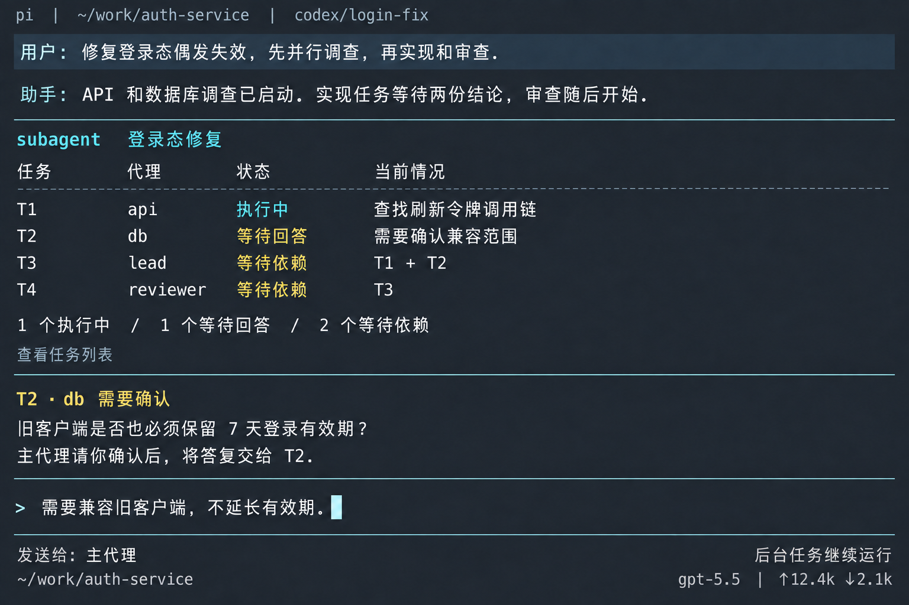
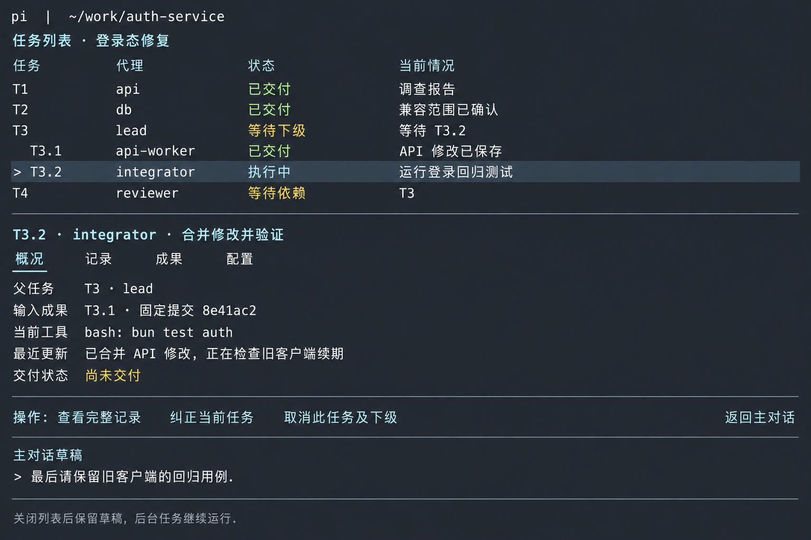
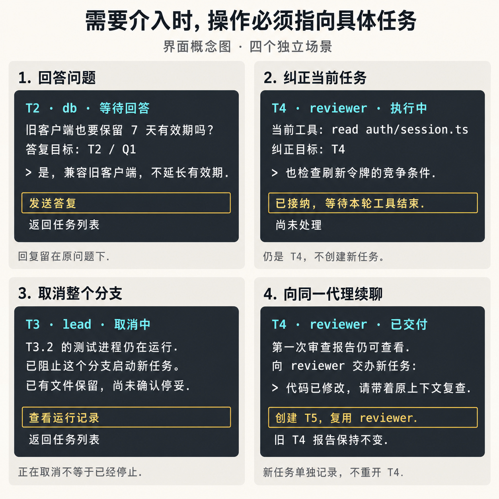

# Subagent UI concept and interaction draft

[简体中文](i18n/zh-CN/subagents-ui-draft.md) · English is normative.

Status: a design proposal for discussion, requested on 2026-09-14 in [#64](https://github.com/jczhang02/pi-stuff/issues/64#issuecomment-5663486691). The three images are generated concepts with fictional tasks, paths, counters and commits. They are not screenshots of a running extension. The [behavioral design](subagents-design.md), [acceptance scenarios](subagents-acceptance.md) and [Pi host design rules](../design.md) remain the constraints. This draft does not approve a new feature or settle tool parameters.

## Proposed interaction

Keep the main conversation as the place where the user directs work. Show a compact delegation summary there, open a task list when inspection is useful, and expand one task for its records, artifacts or controls. Inspection does not silently retarget the main editor. A task-specific composer names both the operation and the task before submission.

The list follows current task ownership. A retained agent's earlier assignments appear in its history, rather than becoming live descendants of an old task. This distinction makes branch cancellation understandable when the same agent has worked for different parent tasks.

### Main conversation

The login-fix example begins with two parallel investigations, followed by implementation and review. Each row answers: who is doing what, what state is it in, and what is it waiting for? Questions, failures and delivery produce useful conversation events; routine tool activity updates the existing summary. The four rows shown are a small-case example. Larger dispatches show a bounded preview, explicit hidden-item count and an entry to the full list.

The notice is a question the main agent has chosen to relay to the user. A child normally asks its direct parent, which answers from available information. Every child question does not automatically interrupt the human. Here the main editor still says "发送给: 主代理". A targeted answer composer is a separate explicit action, shown in the storyboard.

### Task list and selected-task details

The second image is later in the same example. T1 and T2 have delivered reports. Lead T3 delegated T3.1 and T3.2, and is waiting for T3.2. Reviewer T4 still waits for T3. T3.2 uses T3.1's saved artifact. Selecting T3.2 exposes its parent, current tool, last reported activity and input commit without dumping every tool call into the main conversation.

The selected task has four sections: overview, records, artifacts and configuration. Its agent identity links to earlier assignments and queued work. Status updates retain the selected row and scroll position. An attention filter exposes questions and failures without continuously reordering rows under the user's cursor. The main draft is preserved but inactive while list navigation owns focus.

### Intervention scenarios

These are separate moments, not four simultaneous dialogs. The first two panels distinguish a reply to an existing question from a correction to current work. The third shows cancellation still in progress. The fourth creates a new assignment for a retained reviewer while keeping its previous report immutable. The image shows interaction intent; action styling, exact wording and key bindings remain provisional.

## Scenario walkthroughs

| Scene                                                  | Real usage and visible sequence                                                                                                                                                                                                                                                        | Feedback and return behavior                                                                                                                                                                                                                                                                                                                                                 |
| ------------------------------------------------------ | -------------------------------------------------------------------------------------------------------------------------------------------------------------------------------------------------------------------------------------------------------------------------------------- | ---------------------------------------------------------------------------------------------------------------------------------------------------------------------------------------------------------------------------------------------------------------------------------------------------------------------------------------------------------------------------- |
| S01. Dispatch and dependency progress                  | Ask the main agent to investigate API and database behavior in parallel, then implement and review. The main agent dispatches work; the chat summary shows T1/T2 active and T3/T4 waiting for named dependencies. A serial-only case shows one active task and the later dependencies. | Each ready task may start as soon as its own dependencies and resources allow. A result wait may finish while background work continues. Show an actual state and reason, never an invented completion percentage.                                                                                                                                                           |
| S02. Inspect without redirecting input                 | Open the task list, select integrator T3.2, read its latest activity, then open records or artifacts. A search/filter finds retained assignments by task ID, agent or title.                                                                                                           | Header and composer expose the selected task separately from the main recipient. Returning restores the main draft, cursor and focus. Closing inspection does not cancel already-background work.                                                                                                                                                                            |
| S03. Resolve a child's question                        | DB task T2 asks its direct parent whether old clients keep seven days of validity. The parent answers, or relays the unresolved choice to the user. A targeted reply editor says "答复 T2 / Q1" and includes the question above the input.                                             | Receipt and use in a model input are distinguishable. The reply remains attached to Q1. Expiry says no answer arrived; a late answer does not start a new assignment. A waiting lead wakes to answer its child within the same parent task.                                                                                                                                  |
| S04. Correct current work                              | While reviewer T4 is reading a file, choose "纠正当前任务" and add a request to check refresh-token races. The draft names T4 and the operation.                                                                                                                                       | Show "已接纳, 等待本轮工具结束" until consumed. Accepted steering must be handled within T4 before completion. If T4 ended first, reject it and offer an explicit follow-up draft. If cancellation or failure prevents consumption, retain and report the unprocessed instruction on T4.                                                                                     |
| S05. Send a finding                                    | A database child tells an API sibling the agreed field names; the parent can inspect the exchange under records. A user choosing an ordinary message sees its agent and task target.                                                                                                   | "已保存, 尚未使用" is not "已理解". A message to ended work remains unconsumed on that task; it neither releases a held queue nor becomes a later task's input automatically. Cross-dispatch communication goes through the main agent.                                                                                                                                      |
| S06. Follow up with the same reviewer                  | After T4 delivers its report, choose "交办新任务" on the retained reviewer and ask for a second review. Show the saved context/configuration and actual starting code baseline; an explicit baseline change is visible.                                                                | Create T5 with its own record. Keep T4's report and fixed artifacts readable. If the reviewer is busy, T5 queues. A prior abnormal outcome shows the held queue and explicit recovery/release choices, rather than a running indicator.                                                                                                                                      |
| S07. Cancel a branch                                   | Select lead T3 and choose "取消此任务及下级". Show the unfinished owned tasks affected by the action. Completed T3.1 remains completed; unrelated later assignments on the same agents are outside this branch.                                                                        | After acceptance, show cancelling and any still-running tool, such as T3.2's tests. Block new branch work. Do not show stopped, release its execution slot, run its next assignment or offer workspace cleanup before stop confirmation. Returning to chat is available while cancellation continues.                                                                        |
| S08. Recover after interruption                        | Reopen the main session. Inspect restored task records, context, code baseline and any missing content. Confirm existing execution authority before presenting unfinished work as interrupted or offering continuation.                                                                | Another live instance or unknown process activity is a visible blocker to takeover. After reconciliation, continuation is explicit; writes do not replay automatically. Rebuilt committed code is distinguished from unsaved content that could not be recovered.                                                                                                            |
| S09. Review delivered code                             | Open a delivered worker's artifacts: report, fixed commit, changed files, diff and check evidence. Follow the originating task for each input. Ask the main agent to inspect or apply a chosen artifact.                                                                               | "已交付" means declared fulfillment with required readable saved results; "主代理尚未验收" is separate. Multiple write artifacts require an explicit integration task. A later branch movement cannot change an earlier input. Unsaved work is shown as unsaved, not as a deliverable commit.                                                                                |
| S10. Understand failure and blocked work               | Investigation fails; its unstarted consumers become skipped with the dependency and reason visible, while independent work continues. A replacement investigation later succeeds.                                                                                                      | The old failed/skipped graph stays visible. The main agent explicitly dispatches subsequent work against the new result. Startup/record-save errors, declared inability and provider retry are named separately. Provider retry does not mean rerunning an arbitrary failed task.                                                                                            |
| S11. Inspect configuration and limits                  | Open a task's configuration to see role source or inline role, model/thinking, context-copy choice, tools, extensions, rules/skills, workspace, effective limits and usage. A read-only reviewer can explain why it lacks a write tool.                                                | Show saved admission configuration separately from current restrictions and explicit changes. A tighter permission ceiling can request cancellation of affected running work; until stopped the UI says so. Queueing for a slot, waiting for an answer and a configured execution timeout have different explanations. Cost/token figures are accounting, not a hard budget. |
| S12. Leave a view, release a workspace, exit a session | Return from an inspector to chat; separately request workspace release after delivery; separately switch or exit the Pi session.                                                                                                                                                       | View close restores focus. Explicit cleanup reports unsaved, untracked or ignored content that prevents removal. A real session departure reports stopping/saving until both finish; save failure or a slow tool prevents a successful departure. Merely ending the main response leaves session-owned background work running.                                              |

## States and actions

The list should use a small readable vocabulary with a specific reason. Detailed records retain the distinctions needed for diagnosis.

| Visible state                                       | What the user learns                                                                             | Useful action                                                 |
| --------------------------------------------------- | ------------------------------------------------------------------------------------------------ | ------------------------------------------------------------- |
| Queued                                              | Waiting for an execution slot, or for this agent's earlier assignment.                           | Inspect queue and ordering reason.                            |
| Waiting for dependency / answer / children          | Exactly which task, question or descendant must settle.                                          | Open dependency, answer the question, or inspect descendants. |
| Running                                             | Current model/tool stage and latest reported activity.                                           | Read records, send a message, steer or request cancellation.  |
| Cancelling                                          | Cancellation accepted; name activity not yet confirmed stopped.                                  | Inspect remaining activity or return to chat.                 |
| Delivered                                           | Required results are saved and readable, fulfillment declared; main acceptance remains separate. | Read artifacts or create a follow-up.                         |
| Failed / unable / cancelled / skipped / interrupted | The actual terminal or recovery reason, with retained artifacts and queue effects.               | Inspect evidence and choose applicable recovery or new work.  |
| Activity unknown / restore blocked                  | Execution authority or required saved material is unresolved.                                    | Inspect the blocker; continuation stays unavailable.          |

Controls reflect current authority, not historical agent ancestry. Reusing an old child may be allowed while steering its current main-owned task is forbidden to a former parent. On a stale selection, recheck the operation and show why it no longer applies. Do not silently convert steering into follow-up or cancellation into a different terminal result. Required persistence failures remain prominent; optional observer errors are diagnostics and cannot rewrite the task outcome.

The main session has one model-facing `subagent` tool with an operation-selecting `command`. The human-facing labels above do not prescribe tool command names or JSON parameters. A list, detail view and targeted composer are several views of the same capability, not additional model tools.

## Pi fit and small terminals

- Inherit Pi's theme and configured input/select/back actions. Do not copy another product's key combinations wholesale: Pi already uses `Ctrl+O` for tool expansion, `Ctrl+T` for thinking, and `Shift+Tab` for thinking level. Show resolved hints in a runnable prototype.
- Use text status as well as semantic color. Preserve the host editor and footer. The generated dark palette is an example theme, not a replacement for Pi theming.
- A roomy terminal may show list and selected details together, as in the second image. At smaller sizes, show list then detail as separate pages. Keep ID, title, state and reason; move long paths, model names and usage to details. Never scale text down to fit.
- A long record view supports scrolling and returning to latest activity. State when a preview is truncated, older records are loading, or data is missing. Keep a route to the available full result.
- An empty list says no subagent tasks exist in this session. A failed read keeps the task identity and an actionable error. A terminal too small for the view gives a clear explanation and a working return action. Minimum dimensions and row limits need a real Pi prototype.
- Within inspection, the configured back action closes that view. A foreground wait needs a separate "stop waiting" intention from "cancel task". Exact host interruption routing must be exercised in the prototype; these bitmaps do not establish it.

## Capability coverage

This is a map from every retained feature to the proposed surface and walkthrough. It does not replace each feature's [runtime acceptance](subagents-acceptance.md).

| Features                     | Surface and scene                                                                                                                           |
| ---------------------------- | ------------------------------------------------------------------------------------------------------------------------------------------- |
| F01, F02, F03, F04, F05      | Chat summary, dependencies and fixed input results: S01, S02, S09, S10.                                                                     |
| F06, F07, F08, F09           | Background summary, queries, bounded waits and meaningful notifications: S01, S02, S03, S12.                                                |
| F10, F11, F12                | Branch cancellation, recovery and current-task steering: S04, S07, S08, S10.                                                                |
| F13, F14, F15                | Parent questions, continuing updates and peer exchanges: S03, S05; records show origin and target.                                          |
| F16, F17, F18, F19, F20, F21 | Inline/discovered roles, model/thinking, tools, directory, rules and skills: S11; dispatch remains available through the main conversation. |
| F22, F23, F24, F25           | Limits, execution clock, provider retry and accounting: S10, S11.                                                                           |
| F26, F27, F28, F29           | Workspaces, saved input artifacts, records and events: S08, S09, S12; optional observer errors stay diagnostic.                             |
| F30, F31, F32, F33           | Follow-up, copied history, recursive ownership and extension tools: S03, S06, S07, S11.                                                     |

## Reference evidence and our choices

Sources inspected on 2026-09-14. Source reading and upstream snapshots establish design references, not runtime acceptance of this extension.

| Reference                                                                                                                                                                                                                                                                                                                                                                                           | Observed pattern                                                                                                                                                                                                                   | How this draft uses it                                                                                                                   |
| --------------------------------------------------------------------------------------------------------------------------------------------------------------------------------------------------------------------------------------------------------------------------------------------------------------------------------------------------------------------------------------------------- | ---------------------------------------------------------------------------------------------------------------------------------------------------------------------------------------------------------------------------------- | ---------------------------------------------------------------------------------------------------------------------------------------- |
| [Pi official subagent example](https://github.com/earendil-works/pi/blob/ceea48f5d5d12fd7915dfefba2835ccd55f23bb9/packages/coding-agent/examples/extensions/subagent/README.md), locally inspected in `@earendil-works/pi-coding-agent@0.85.1`                                                                                                                                                      | Collapsed/expanded tool output, per-agent streaming and usage. The shipped host screenshot itself labels an older Pi version.                                                                                                      | Keep chat, editor and footer familiar. That screenshot is a host-shape reference, not evidence of the current extension's layout.        |
| [pi-fast-subagent render.ts](https://github.com/tuansondinh/pi-fast-subagent/blob/main/render.ts), local package 0.9.4                                                                                                                                                                                                                                                                              | One-line parallel summaries; expansion shows chronological execution events.                                                                                                                                                       | Summary first, records on demand. The URL is a moving branch; the inspected package version is the evidence boundary.                    |
| [nicobailon/pi-subagents fleet](https://github.com/nicobailon/pi-subagents/blob/aa75b3353836f7868898e3bd58234d21eaff1463/src/tui/fleet.ts), 0.67.0                                                                                                                                                                                                                                                  | Roster/inspector with navigation and task controls. Its [transcript reader](https://github.com/nicobailon/pi-subagents/blob/aa75b3353836f7868898e3bd58234d21eaff1463/src/tui/fleet-transcript.ts) bounds retained preview content. | Use a selected-task inspector and explicit truncation. Avoid a mandatory always-open fleet panel.                                        |
| [Claude Code interactive mode](https://code.claude.com/docs/en/interactive-mode#transcript-viewer), current official documentation                                                                                                                                                                                                                                                                  | Detailed transcript on demand; background-task inspection is distinct from the task checklist.                                                                                                                                     | Separate activity records from workflow state. Do not infer that `Ctrl+T` is a background-subagent switcher.                             |
| [Claude Code agent teams](https://code.claude.com/docs/en/agent-teams#choose-a-display-mode), current official documentation                                                                                                                                                                                                                                                                        | In-process teammate selection and optional split panes.                                                                                                                                                                            | Keep one terminal usable. Teammates are a reference product concept, not an assertion that Claude subagents share all team capabilities. |
| [Codex CLI /agent](https://learn.chatgpt.com/docs/developer-commands#switch-agent-threads-with-agent) and fixed [navigation source](https://github.com/openai/codex/blob/6b9826e3aa83b1a5947db50f4332cb9c65f1b340/codex-rs/tui/src/app/agent_navigation.rs)                                                                                                                                         | Agent selection with stable discovery order; official CLI documentation supports thread inspection.                                                                                                                                | Stable navigation, clear identity and explicit recipient. CLI evidence is kept separate from desktop panels.                             |
| [Codex CLI overview snapshot](https://github.com/openai/codex/blob/6b9826e3aa83b1a5947db50f4332cb9c65f1b340/codex-rs/tui/src/snapshots/codex_tui__app__agents_overview__tests__agents_overview.snap) and [activity snapshot](https://github.com/openai/codex/blob/6b9826e3aa83b1a5947db50f4332cb9c65f1b340/codex-rs/tui/src/snapshots/codex_tui__multi_agents__tests__collab_agent_transcript.snap) | Attention/working/finished states, selected details and compact spawn/input/wait events in recorded text renderings.                                                                                                               | Attention is easy to find; ordinary progress does not flood chat. These are checked-in snapshots, not sessions executed for this draft.  |

Arhen remains the functional starting point, through the existing feature inventory. Its UI is not adopted. The unverified Claude source mirror and package marketing illustrations are not used as product screenshot evidence. Our task ownership, steering acknowledgements, delivery/acceptance distinction and recovery controls come from the agreed Pi Stuff behavior, rather than a claim that every reference product implements them.

## Deliverables and next validation

The [generation manifest](assets/subagents-ui/generation.json) records the built-in ImageGen prompts and selected outputs. Original generated imagery is stored with this draft; no upstream source code or screenshots are copied into it. The Chinese image labels have matching explanations here and in the Chinese document.

Next, exercise this direction in a throwaway prototype using real Pi TUI components and the host editor/footer. Check selection stability, draft/recipient separation, wide and narrow layouts, record scrolling, task-end races during steering, cancellation still in progress, and session departure blocked on save/stop. Until then, exact key routing, component feasibility, terminal cell widths, light-theme contrast and interaction performance remain unverified. The present deliverable is the visual and scenario draft for discussion.
