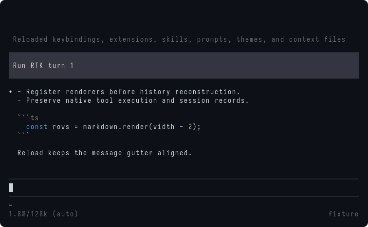
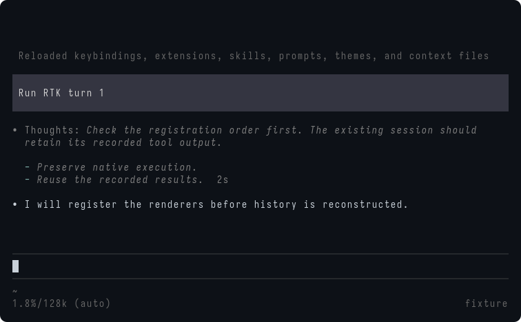
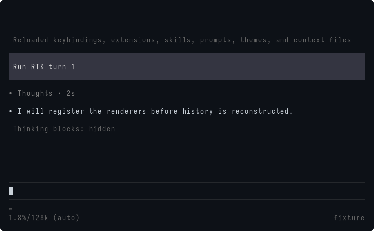
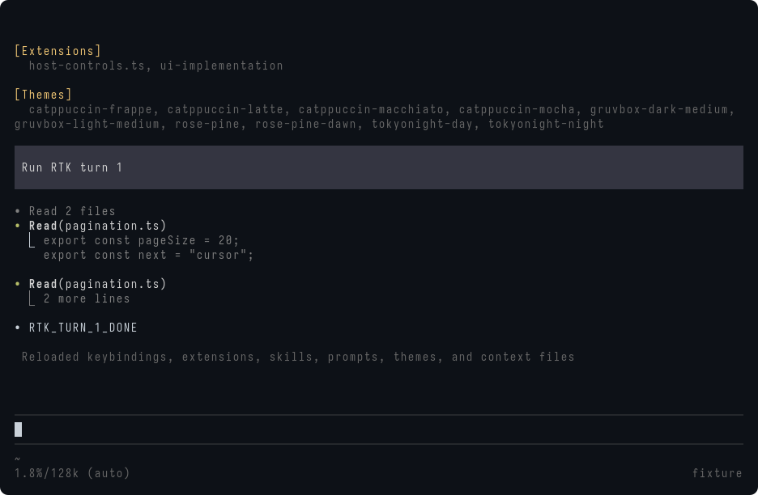

# UI integration experiments

[简体中文](i18n/zh-CN/ui-integration.md) · English is normative.

These experiments examine gaps between Pi's extension API and the accepted UI. The maintainer has [approved the assistant/Thoughts display adaptation](https://github.com/jczhang02/pi-stuff/issues/106#issuecomment-5786103200). The implementation adds the assistant gutter and Thoughts labels; observed thinking segments are timed in memory. Tool-history integration follows the public-API versus lookup comparison [decided separately](https://github.com/jczhang02/pi-stuff/issues/106#issuecomment-5785970338).

## Assistant and Thoughts: public API limits

The assistant experiment ran on the installed compiled Pi 0.87.0 / Bun 1.4.0, with an isolated deterministic provider and a 100×45 Terminal Control session. Production baseline: `5accad3`.

The experiment registered a Markdown transformer that prepended `• ` to assistant text and `• Thoughts: ` to thinking. It also exposed Pi's `setHiddenThinkingLabel` through a temporary command.

| Operation                                                                                      | Observed result                                                                                 | Consequence                                                  |
| ---------------------------------------------------------------------------------------------- | ----------------------------------------------------------------------------------------------- | ------------------------------------------------------------ |
| Prefix a response beginning with two Markdown list items                                       | The first line becomes `• - FIRST_LIST_ITEM`; the second marker remains two columns to its left | Source prefixing does not supply the accepted message gutter |
| Prefix visible thinking                                                                        | The entire Thoughts row remains italic; the captured frame contained 35 italic cells            | The prefix does not change Pi's default thinking typography  |
| Set the hidden label to `• Thoughts · 1s`, create another response, then set `• Thoughts · 2s` | Both historical thinking blocks display `2s`                                                    | A global label cannot represent independent durations        |

The `1s` and `2s` strings are deliberately assigned labels, not measured durations. The provider received the original prior assistant text without the display prefix.


Pi's [extension types](https://github.com/earendil-works/pi/blob/v0.87.0/packages/coding-agent/src/core/extensions/types.ts) expose the transformer before Markdown rendering and a string-valued hidden label. The [assistant component](https://github.com/earendil-works/pi/blob/v0.87.0/packages/coding-agent/src/modes/interactive/components/assistant-message.ts) applies italic thinking styles and owns local visibility overrides. There is no registered assistant-component factory in that extension API. The installed 0.85.1 declarations have the same relevant boundary.

### Behavior to preserve

The real-host message test checks that Ctrl+T changes the default and clears local overrides, clicking reveals only one thinking block, and Ctrl+O leaves thinking hidden. It also checks that the next model request contains the original assistant text. These are passing preservation checks; they do not establish the new typography or timing.

```sh
bun test tests/system/ui-messages.test.ts
PI_TEST_HOST=/opt/bin/pi bun test tests/system/ui-messages.test.ts
```

The deterministic provider sends reasoning before the final text. Only the provider stream is scripted; the tests drive the actual Pi TUI and its renderer. Welcome coverage remains in the same file.

### Approved compatibility boundary

The approved boundary is a display-only adapter around `AssistantMessageComponent` content assembly. Approval covers this integration approach, not completion or performance acceptance.

- Add the assistant gutter after Markdown parsing. Keep Pi's Markdown renderer, code highlighting, wrapping and native failure/Esc presentation.
- Adapt each Thoughts block's presentation and measured in-memory duration. Preserve Hide thinking, Ctrl+T and local mouse disclosure. Do not modify canonical messages, provider context or saved sessions; omit unavailable historical durations.
- Install once per active UI extension and restore on shutdown/reload. Check the supported host shape, preserve other extensions and fall back to native rendering when the adapter cannot apply safely. Do not change Pi installation files.
- Verify repeated reload, session replacement, theme/width changes, streaming, list/code-first responses and long-history performance before acceptance.

Using the global hidden-label setter as a timer would also repeatedly update historical components. Mutating saved thinking to add labels, as the [inspected pi-tool-display revision](https://github.com/MasuRii/pi-tool-display/blob/91cef7580078371f8dc49a8607222807ad6a424d/src/thinking-label.ts) does, conflicts with the agreed record-preservation requirement. Neither approach is selected.

### Assistant gutter implementation

The first slice wraps native content assembly, identifies the owning runtime through its registered identity Markdown transformer, and adds a two-column gutter to native Markdown children. It leaves Thoughts mouse regions and native error Text components alone. It does not prepend text to messages or replace Markdown parsing. Quit/reload disables the wrapper before restoring it when still owned; session replacement keeps it installed.

The wrapper reuses the native rendered-line array and keeps one width of prefixed output. Independent review caught repeated ANSI scanning in the initial version; it now recomputes only when native lines or width change. Full streaming and long-history performance acceptance remains pending.

Real-host tests cover list-first answers, reload, dark/light theme changes, 60/80/120 columns, repeated UI enable/disable and new sessions, plus the original thinking disclosure checks. They also check that the next provider request receives the original list text. These tests do not establish Thoughts styling, timing, concurrent SDK isolation or arbitrary external patch coexistence.

This compiled Pi 0.87.0 / Bun 1.4.0 capture uses an isolated deterministic provider, 80×24 cells and Pi's dark theme. Terminal Control exported the virtual terminal as SVG, then rsvg-convert produced the PNG. It is not a Ghostty-window screenshot.



### Thoughts labels

The next slice decorates the child inside Pi's existing Thoughts mouse region. Visible thinking begins with `• Thoughts: `; hidden thinking shows `• Thoughts`. Native italic Markdown is retained, as allowed by the maintainer. The label reserves width without altering the Markdown source, so lists keep their structure. Continuation rows use the same two-column gutter as the assistant text. Running blocks display `Thinking · Ns` in both visibility states. Completed hidden blocks display `Thoughts · Ns`; visible blocks append the duration to the body. These captures show an observed two-second reasoning interval.

Ctrl+T and local clicks still use Pi's visibility state. Review reproduced a crash when reloading and replacing a session containing Thoughts: the initial styling callback retained a stale extension context. The corrected callback retains Pi's live theme proxy instead. The regression test covers that transition and the next response.

The captures below use the same compiled host, isolated provider, 80×24 virtual terminal and SVG-to-PNG export as the assistant capture. They use Terminal Control's default export fonts, not the maintainer's Ghostty font stack.





### Timing boundaries

Timing uses Pi's public message events and a monotonic clock. A thinking start/delta begins or resumes a segment; text/tool output stops it, even when a provider delays `thinking_end` until the end of the whole response. Consecutive thinking blocks that Pi displays together sum their observed segments. Cancellation freezes the current segment. No timer, persisted field or message rewrite is added. Running labels update by whole seconds during Pi's existing redraws; completed output retains its cached layout.

A WeakMap associates each observed message object with its timings, including the finalized object. Reload and session replacement discard observations. Restored blocks retain the Thoughts label without an invented duration. The tests check two different durations, progress while the provider pauses, exclusion of a paused answer phase, cancellation/recovery, reload/resume and byte-identical saved records. The paused-provider fixture controls network delivery, not the displayed duration.

The following experiments compare early registration, SDK lookup and a narrower TUI lookup. The maintainer has since [approved the narrowed TUI lookup patch](https://github.com/jczhang02/pi-stuff/issues/106#issuecomment-5787082808).

## Tool definitions before history reconstruction

On 2026-09-22, an isolated probe intercepted the exported `AgentSession.getToolDefinition()` method in Pi 0.85.1 and the installed compiled Pi 0.87.0, both running Bun 1.4.0. The extension returned every definition unchanged. Both hosts queried historical tool definitions **before** emitting `session_start` on reload and resume. Each returned definition included its real `execute`, parameter schema and renderers. The current product registers its built-in replacements in `session_start`, after those history components have been assembled.

The inspected [AgentSession source](https://github.com/earendil-works/pi/blob/v0.85.1/packages/coding-agent/src/core/agent-session.ts) exposes this lookup publicly. The [interactive mode](https://github.com/earendil-works/pi/blob/v0.85.1/packages/coding-agent/src/modes/interactive/interactive-mode.ts) uses it when constructing tool components. Intercepting the method is still a compatibility patch, not a supported renderer-registration API.

Two further throwaway experiments used the existing isolated Pi-host fixture and Terminal Control 1.2.1. The product UI was disabled in those runs; the temporary extension owned only the experimental display adaptation. The production baseline was `12b0969`. [Retained observations](assets/ui/tool-lookup-experiment.json) include both hosts' lifecycle traces and terminal text.

| Experiment                                                                                                     | Observed on both hosts                                                                                                                                                                                                | Limit                                                                                                                             |
| -------------------------------------------------------------------------------------------------------------- | --------------------------------------------------------------------------------------------------------------------------------------------------------------------------------------------------------------------- | --------------------------------------------------------------------------------------------------------------------------------- |
| Copy a native Read definition and replace only its renderer slots                                              | Live display, three reloads and resume use the candidate renderer; recorded content survives a later file change                                                                                                      | This does not validate all built-in tools                                                                                         |
| Register custom Grep and Find fixtures, preserving Grep and explicitly opting Find into the candidate renderer | Grep keeps its custom rendering; Find uses the candidate; provider results remain the fixture's original results                                                                                                      | These are third-party-shaped fixtures, not acceptance of installed third-party packages                                           |
| Compare definitions and session data                                                                           | Returned `execute`, schema and prompt fields retain their original references; the observed existing session file stays byte-identical through reload/new/resume; reload/resume do not execute the custom tools again | This is not a complete UI-enabled/disabled equivalence test; cancellation and SDK execution overrides still need production tests |
| Reuse the unchanged product Read renderer and retrieval index                                                  | Two successful Reads group before a failed Read; the following success starts a new group. The failure stays visible. The same boundaries survive three reloads and resume                                            | Only Read without explicit offset/limit was tested; Web grouping and other lifecycle transitions remain untested here             |
| Open the restored group and use Ctrl+O                                                                         | Members align with ordinary tools; compact members hide their body; expansion reveals recorded content, including after the file changes                                                                              | This is functional evidence, not a long-history performance result                                                                |

History grouping needs one additional step. The temporary adapter retained the native `context.invalidate()` callback for results assembled before `session_start`. After the existing retrieval index restored its branch, it called each retained callback once and cleared the callback map. Pi then reran the result renderer against the restored index. This required no change to `ToolExecutionComponent` or the product retrieval implementation. Calling `setToolsExpanded()` with its current value is not an alternative: the inspected host returns without refreshing.

### Scope and export checks

A lifecycle-callback identity check passed on 0.85.1 but failed on compiled 0.87.0: its extension loader wraps event handlers in `registeredHandler`. Checking only the loaded extension's `resolvedPath` then passed both hosts, but independent review rejected it as sufficient ownership evidence: simultaneous SDK instances may load the same path.

Command handlers preserve their original identity on both hosts. The final grouping experiment uses that identity to match the owning loaded extension. A separate probe created two real SDK sessions with the same inline-extension name in each host; each query reached only its own adapter. Production can use the already registered `/ui` handler for this purpose, without adding a marker command. These probes establish runtime ownership, not complete concurrent SDK UI or configuration acceptance.

Review also caught a teardown problem: restoring only while at the top of a patch chain allows another extension to reinstall a stale wrapper later. The revised experiment first makes its wrapper inactive and transparent, then restores the original only if it still owns the method. The SDK probe checked both teardown orders and an intervening external wrapper. An inactive adapter stayed inactive when that external wrapper restored it, and the other live adapter kept working. Repeated foreign-wrapper churn, retained memory and actual third-party patch packages still need testing.

HTML export also uses the definition lookup. The 0.85.1 export retained the original session results and used the simple custom Grep/Find renderers; its embedded session data was decoded and checked. Read uses Pi's own HTML template, so this does not validate custom Read HTML or the product retrieval-group export. An initial assertion searched the HTML source directly and failed because Pi base64-encodes that data. This was an experiment error, not a product defect. Compiled 0.87.0 could not export because its installed `export-html/template.css` was missing. The same failure occurred without the interception. Export compatibility on that installation remains unverified; no installation files were changed.

### Tool integration comparison

At `511d8d3`, a new Read candidate registered through `pi.registerTool` during extension loading, following pi-tool-display's early-registration approach. It reused the product renderer and retrieval index, delegated execution to Pi's Read factory with the current cwd and image setting, and invalidated pre-start results once after restoring the group index. No Pi method was patched by this candidate.

Both Pi 0.85.1 and compiled Pi 0.87.0 under Bun 1.4.0 passed the same 66-assertion history scenario: live results, three reloads, new/resume, failure boundaries, aligned group disclosure, retained output after file changes and byte-identical session records. Early registration therefore solves this Read history scenario. The lookup candidate had already passed the same scenario above.

The ownership comparison created real SDK sessions within each host, loaded the early candidate and a foreign Read extension in both orders, and executed the selected Read definition against an isolated file. A second pair used the lookup candidate. [Retained results](assets/ui/tool-registration-comparison.json) record both hosts.

| Candidate                 | Candidate loaded first                                              | Foreign Read loaded first       |
| ------------------------- | ------------------------------------------------------------------- | ------------------------------- |
| Early public registration | Executed the native file read; foreign implementation was displaced | Kept the foreign implementation |
| Lookup adaptation         | Kept the foreign implementation                                     | Kept the foreign implementation |

On both hosts, `getAllTools()` during extension loading threw `Extension runtime not initialized`. Pi's [extension runner](https://github.com/earendil-works/pi/blob/v0.85.1/packages/coding-agent/src/core/extensions/runner.ts) keeps the first registration for a name. The inspected [pi-tool-display ownership guard](https://github.com/MasuRii/pi-tool-display/blob/91cef7580078371f8dc49a8607222807ad6a424d/src/tool-overrides.ts) proceeds with registration when that query is unavailable. This comparison implements the registration strategy; it does not claim to have executed that package unchanged.

**Initial comparison:** lookup adaptation preserved existing definitions better than the tested early-registration candidate. The later TUI-only proposal below narrows this boundary. The tested early-registration approach fails the requirement to preserve foreign tools independently of load order. Delaying registration loses the history benefit; imposing an extension order would add a user constraint. The inspected public ExtensionAPI has no unregister operation or original execution/renderer access with which to hand ownership back. This is a concrete limit of the tested approach, not proof that every possible public-API design is impossible. No production tool patch is approved by this comparison, and no performance winner is claimed.

The earlier SDK candidate used this boundary: Identify the owning runtime by its `/ui` command handler, decorate the actual definition before native history construction, preserve execution and schema, and refresh only pre-start result components after the group index is ready. Keep third-party renderers by default and use the same boundary for explicit takeover. Disable the adapter during teardown before attempting restoration; do not overwrite another extension's replacement.

Pi Stuff's Web definitions are also currently registered in `session_start`; that SDK candidate cannot decorate a definition that is still absent. Earlier registration through Pi's public API must preserve authentication, model selection and invalid-configuration behavior. Before production acceptance, integrate all tool families and Bash outcome observation, and rerun the existing failing history tests plus configuration, cancellation, media, lifecycle and patch-coexistence coverage. Measure the complete long-history workload with the adapter enabled and disabled. The two product reload/resume failures remain unresolved at `12b0969`; successful temporary experiments do not turn them into passing production tests. Full-tool behavior and startup/resume/interaction performance remain unverified for both candidates. Because early registration already failed a required ownership case, no comparative performance claim is inferred from the small functional runs.

### Approved boundary: TUI-only tool lookup

Follow-up experiments at `6ddfe8c` address Web definitions that do not exist when history is assembled. Web currently validates an explicit model before registration in `session_start`; moving registration earlier would change invalid-configuration behavior. A temporary SDK lookup fallback displayed absent WebFetch history without registering a callable tool, but review identified that it changed the public query from `undefined` to a definition. That fallback is not recommended.

The narrower candidate adapts only `InteractiveMode.getRegisteredToolDefinition`. The inspected native implementation calls this method when constructing tool components for streamed calls, execution start and historical messages. `AgentSession.getToolDefinition`, the execution registry and HTML export retain their original lookup. This method is private, despite its class being exported; it is a compatibility patch, not an extension API.

On both Pi 0.85.1 and compiled 0.87.0 / Bun 1.4.0, actual interactive runs passed live WebFetch, reload, reload after disabling `fetch_content`, and new-session/resume while disabled. Ctrl+O revealed the recorded body. There were exactly two initial local HTTP requests and no refetch during restoration; the existing session file remained byte-identical before the final observation turn. That turn's model request did not offer the disabled tool. In each run, the final resumed extension instance recorded two absent-definition queries while the SDK lookup still returned `undefined`; its counter resets on extension loading and is not a whole-run total. The SDK method itself remained unchanged. [Retained results](assets/ui/tool-display-lookup-experiment.json) record these observations.

**Approved implementation boundary:** use one TUI lookup adapter for both existing definitions and absent historical Web views, rather than stacking SDK and TUI patches. Preserve execution, registration, configuration validation and third-party renderers; scope adaptation to the owning runtime. Reuse native result invalidation after group restoration. Check the private host shape, fall back to native display when incompatible, and deactivate before conditional teardown restoration. No Pi installation files or session records are changed.

Independent review confirmed the narrower query boundary and the limited experiment. It does not establish all-tool behavior, third-party ownership, invalid-configuration recovery, WebSearch/WebRead, local mouse disclosure, export or performance. Those checks and the existing product history failures remain production acceptance work. The maintainer approved this boundary after the experiments. It supersedes the earlier SDK-lookup recommendation; full acceptance remains pending.

### Read integration

The first production slice installs the private TUI adapter and applies it to existing native Read definitions. Read is no longer re-registered by the UI: execution, schema, cwd and image settings remain those of the host definition. The adapter uses the existing assistant Markdown-transformer identity to identify its runtime, retains native image rendering, and invalidates pre-start result components once after the retrieval index restores. It remains installed across session replacement; quit/reload deactivates it before conditional restoration.

The native TUI lookup can return renderer-only fallbacks, so the adapter obtains full tool metadata separately through the unchanged SDK query. Missing definitions retain native display in this slice. Private-method/getter presence and the session instance are checked before adaptation. This is not yet the Web fallback or migration of the other tools.

The existing real-host resume test failed before this slice and passed afterward. Its coverage now also changes the source file after the original Read, checks retained historical output through three reloads, and compares the saved session bytes. Targeted checks cover aligned mouse disclosure, wide/combining text, native Read limits and image fallback. A separate third-party Read fixture checks its execution and per-call custom rendering across UI on/off/on and reload. Full performance and compatibility acceptance remain pending.

The focused Read suites pass on both hosts: seven tests and 65 assertions each. The capture below shows compiled Pi 0.87.0 after reload, with the restored group open and only the first result expanded. It uses a deterministic local provider, Pi dark theme and a 100×32 Terminal Control export, not a native Ghostty window.


