# Conversation UI

[简体中文](i18n/zh-CN/ui.md) · English is normative.

Implementation of [the accepted UI specification](https://github.com/jczhang02/pi-stuff/issues/106) is in progress. This branch currently changes native Bash, Write, Edit, Read, Grep, Find and Ls presentation. Web tools use the same retrieval presentation. Assistant/Thoughts presentation is not implemented yet. The prototype remains visual reference, not production acceptance evidence.

[Integration experiments](ui-integration.md) record public-API limits, actual captures and the pending assistant/tool-history proposals. Their experimental screenshots are not the target design.

## Welcome

The public Pi `setHeader` API hosts the old square-corner composition, with a single-column narrow layout. Model, provider, directory, active tool count and callable skills/extension commands come from the current host. The public API does not expose a complete extension count, so the prototype's sample count is not carried over. Welcome disappears on the first message and stays absent in existing sessions. Native resource listings, user messages, input and footer remain intact. Set `ui.welcome: false` to retain the native welcome independently.

These are actual Pi 0.85.1 / Bun 1.4.0 isolated terminal captures loading the extension. The fixture model belongs to the test provider. Palette: Pi's default dark theme. Export fonts: JetBrainsMono Nerd Font Mono, Symbols Nerd Font Mono, LXGW WenKai Mono. They do not establish Ghostty-window or real-model acceptance.

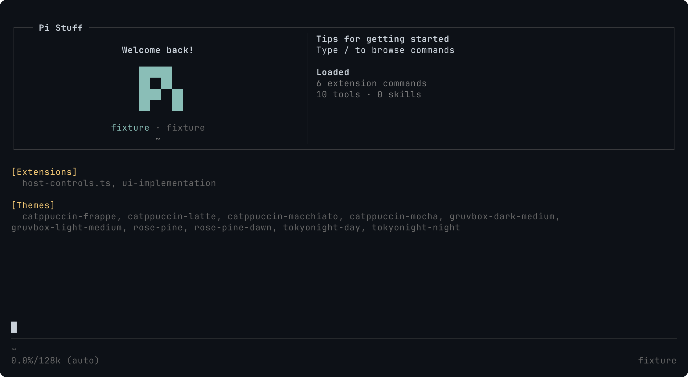

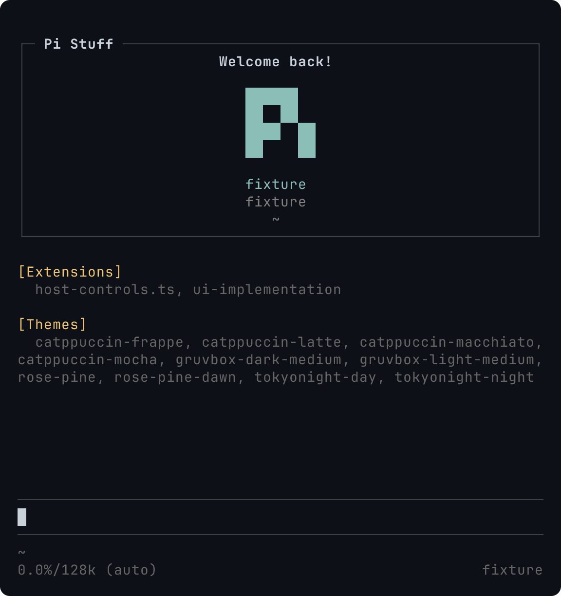

## Bash

All tools share the heading rule: a status dot, at most two compact rows, aligned continuations and the complete target on disclosure. Bash shows the command and `⎿` output. Completed output previews three rendered rows; running output shows the latest two. Hidden retained rows are counted as `n more lines`. Pi handles mouse disclosure and Ctrl+O. Short results retain the same native disclosure behavior even when both views look identical.

Configured timeout and upstream truncation/log information have separate result blocks. Expanding reveals only retained output. Tool execution uses Pi's public native definition with the host's configured shell path and command prefix. Other extensions' Bash definitions are left untouched.

Completed live calls show the actual process exit code and elapsed time. Timeout and cancellation remain visible when the body is folded, including a zero-row preview. Empty output stays visible without a hidden-row count. Failed native calls can retain their truncation/log notice only in error text; that notice is lifted into separate result blocks. Model-visible results and recorded errors are unchanged. Historical output without timing does not receive an invented duration.

Setup and spawn errors remain visible even with a zero-row preview. The following capture shows actual commands, retained output, an unsuccessful exit and a timeout, using the same isolated host and fonts as the welcome captures.

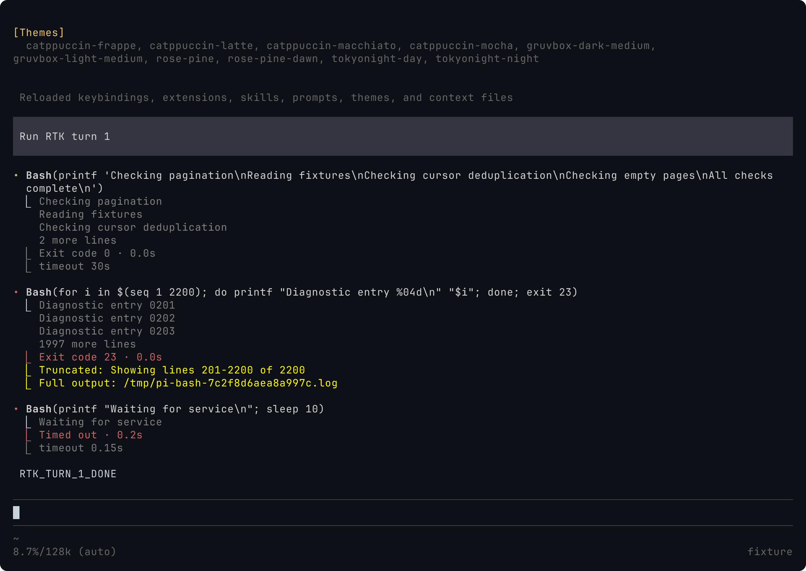

## Write

Write retains native file execution and shows the written source with Pi syntax highlighting. The compact result shows three rendered rows and a hidden-row count; native disclosure reveals the complete retained source. The result summary counts source lines rather than terminal wrapping. Error results retain the actual tool error text.

While model arguments are still streaming, the tool heading stays visible without claiming a completed write. Real-host tests check typing, resizing to 60 columns, completion and Esc before the arguments finish. The cancelled call creates no file, and the next turn can write normally.

CRLF content uses the same display normalization as native Write, so previews do not insert blank rows between source lines. Files retain their original line endings and tabs. Tool targets, Bash output, retrieval text, result blocks and code previews use Pi's terminal-sequence stripping helper before styling. This cleaning affects presentation only and remains active when RTK's model-result cleanup is disabled.

## Edit

Edit renders the native result patch with one line-number gutter, removal numbers from the old file and addition/context numbers from the new file. It highlights the available old and new source separately within each hunk, adds semantic backgrounds and shows six rendered rows before disclosure. Wrapped rows do not repeat the gutter. The summary counts added and removed source lines. Opening an old result uses its recorded patch even if the file has since changed. Syntax context outside the recorded hunks is unavailable.

The same Write/Edit sequence with default code settings, then with syntax colors, diff numbers and backgrounds disabled. Both captures use the isolated host at 80 columns.

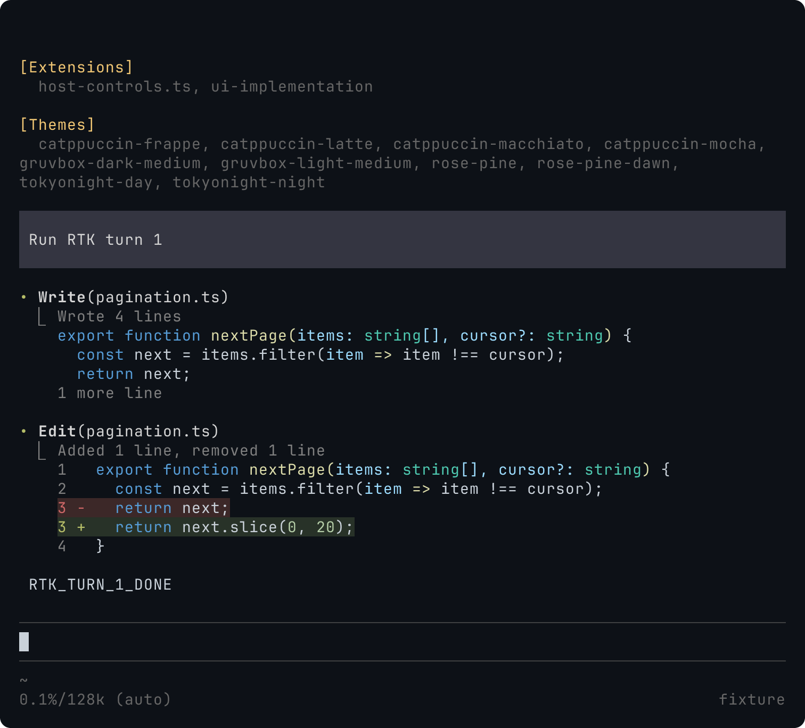

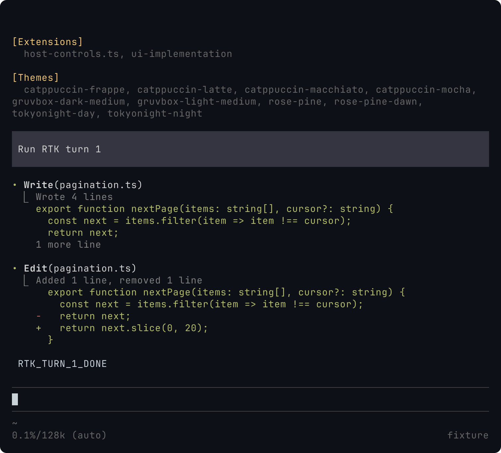

The same code sequence under compiled Pi 0.87.0 / Bun 1.4.0 with Catppuccin Latte, at 60, 80 and 120 columns. The isolated test terminal was configured with foreground `#4c4f69` and background `#eff1f5` before launching Pi; the capture's terminal cells confirmed those defaults. This fixes the earlier export-background mismatch without adding palette control to the extension. These captures establish virtual-terminal layout and colors, not a Ghostty-window test.

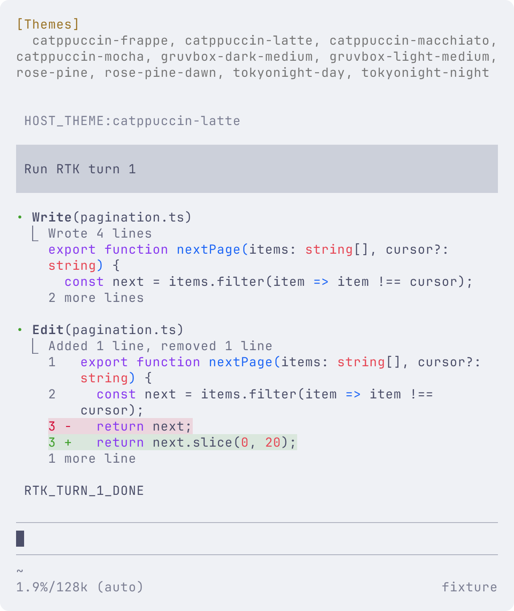

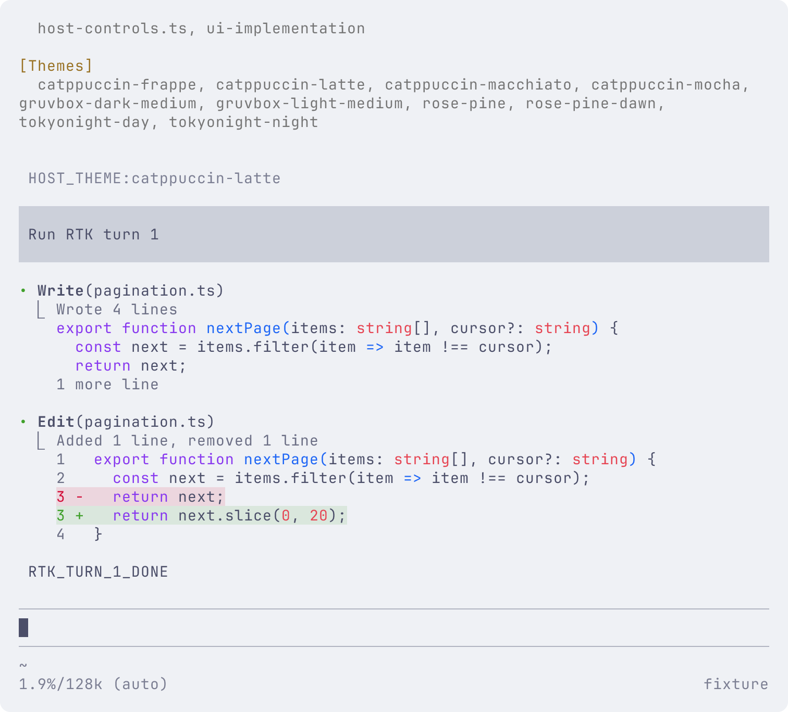

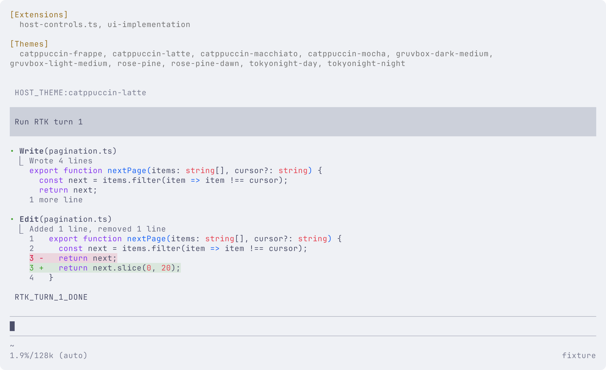

## Retrieval tools

Read, Grep, Find and Ls share a compact heading and retained-row hint. Native mouse disclosure or Ctrl+O reveals their text. No-match, empty and error results remain visible, as do upstream truncation and result-limit warnings. Ls is used only for an actual `ls` tool call; shell commands keep their Bash identity. Native Read image-resizing settings are preserved. Successful adjacent local and Web calls now form a compact group. Click its summary to show aligned compact tools, then click a tool to reveal its retained result. Ctrl+O reveals grouped results through native tool expansion. Pending calls, empty results, warnings, failures and ordinary Bash remain outside groups. The index stores call identities and counts, not duplicate output.

Parallel calls keep their original order even when they finish in a different order. A pending call remains visible; when it succeeds, it joins adjacent successful calls without crossing a failure. Session shutdown releases the old context before Pi can render a transition frame, so creating a new session does not crash or retain the previous group's members.

The group summary can collapse its members even after Ctrl+O expanded all tools. A later Ctrl+O change resets that local override. Assistant text, Thoughts (including hidden Thoughts), writes and new user turns separate groups. Host tests also cover local result limits, no-match outcomes and Web batch failures between successful reads.

Cancelling a pending Web call between completed reads leaves its result visible in place. The successful reads remain separate groups, and a later turn does not merge across the cancelled call or replay the request. The assistant's cancellation message remains native.

These 100-column captures show global expansion followed by a click on the group summary. Pi 0.87.0 / Bun 1.4.0, default dark theme, isolated deterministic provider, with native quiet startup enabled. Export fonts match the welcome captures. The global status remains expanded after the local group closes.

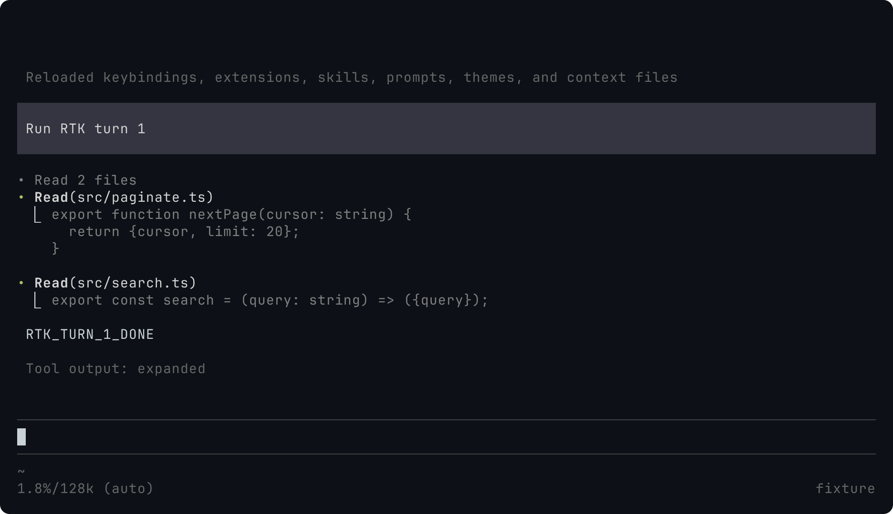

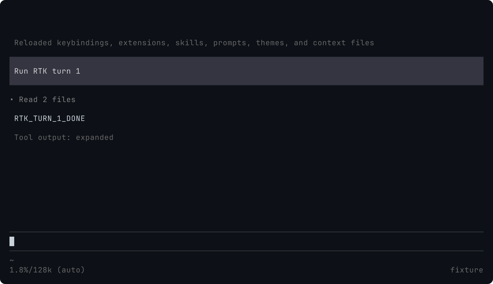

Read results containing images stay outside text groups and delegate result rendering to Pi. Pi retains image display, conversion and its text fallback with MIME type and dimensions. The fallback has been checked on the pinned host and the installed Pi 0.87.0 compiled host; actual Kitty/Ghostty image display still needs visual acceptance.

Hidden-row hints count retained body rows only. Native Read continuation instructions and local result-limit notices remain visible once, outside that count. Web headers and excerpt positions appear only on expansion, in their original item order.

If a native Read range produces a continuation notice that cannot be separated reliably, such as a fractional limit, the complete result remains visible. Presentation does not narrow Pi's accepted arguments.

## Web tools

The existing Web access tools display as WebSearch, WebFetch and WebRead. Compact headings show the operation count or retained-content label; expanded headings show query/URL/content ID and paging/find arguments. Their original API names, output and cache behavior are unchanged. Batch-item errors and retained-content paging notices remain visible while compact. This presentation does not fetch additional content on disclosure.

WebRead find with no excerpts shows `No matches found`; an empty page shows `No content` or `End of content` as applicable. These outcomes stay outside successful groups. The display follows the tool's UTF-16 content ranges to separate headers from source text, so header-like examples inside a page remain body content. When an earlier result hook makes those boundaries unrecognizable, the complete result remains visible outside groups without a guessed hidden-row count.

WebSearch's query/provider/selection/fallback header is also expansion-only. An empty search body shows `No results found`. Source text that resembles this header is retained, including fetched pages and multiline queries.

These Pi 0.87.0 / Bun 1.4.0 captures use the real search implementation with deterministic transport under a test alias, at 100 columns in the default dark theme. They verify display, not live search or grouping. Export fonts match the welcome captures.

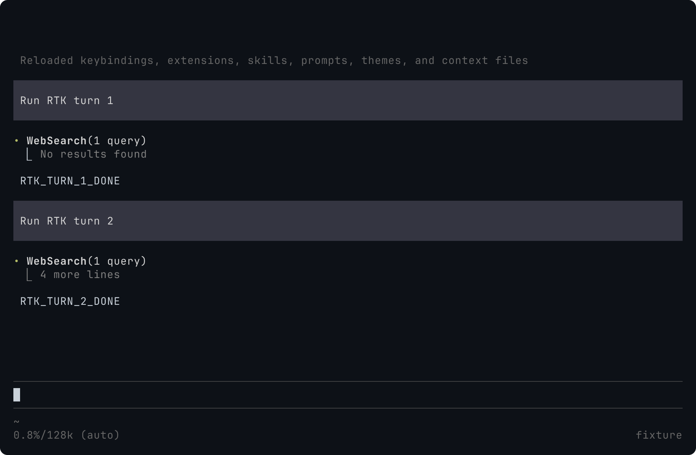

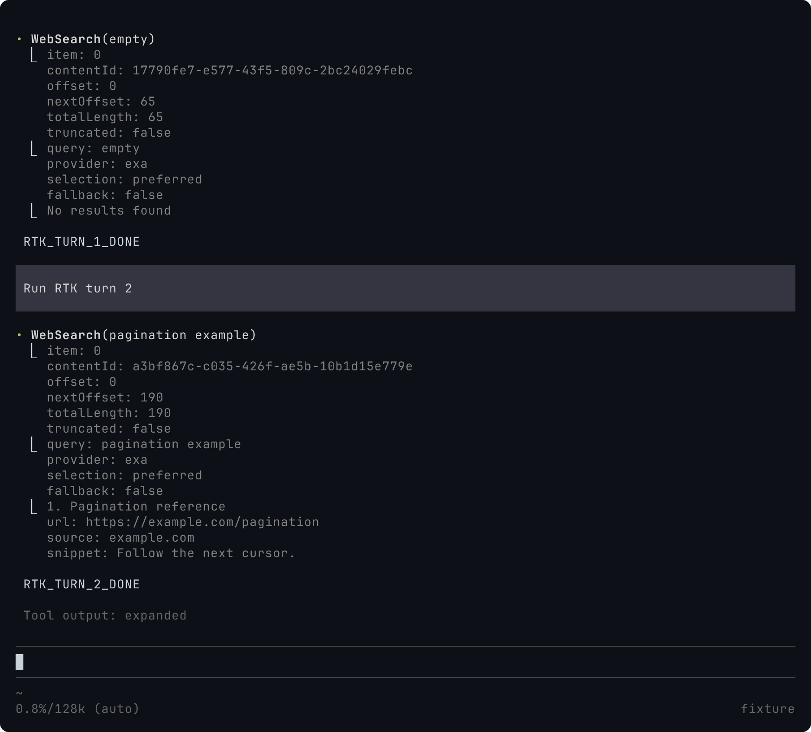

The following compiled Pi 0.87.0 / Bun 1.4.0 captures show a limited Read, two fetched pages and a WebRead with no matches, first compact and then expanded. They use an isolated deterministic provider, default dark theme and 100 columns; export fonts match the welcome captures. The expanded view retains each page's metadata beside its body.

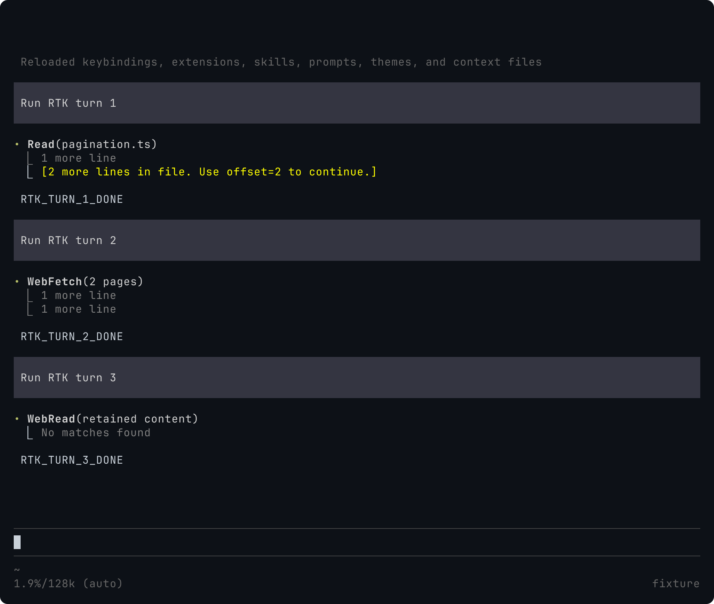

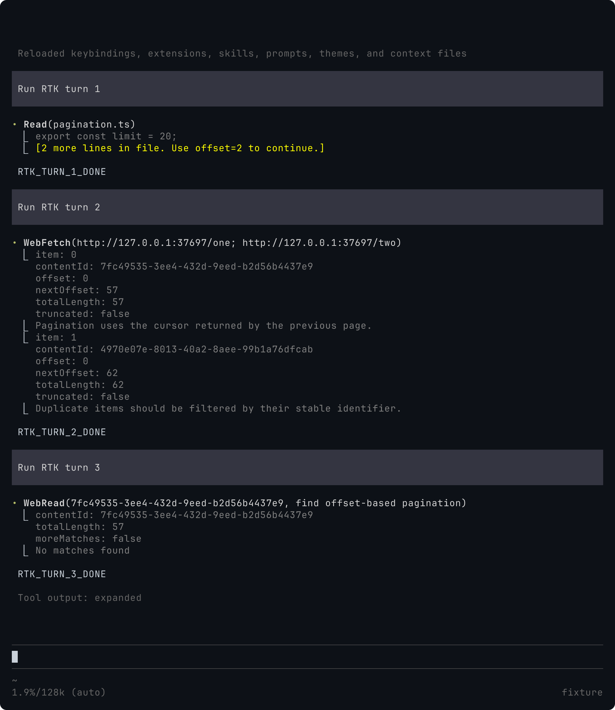

Tool errors and notices keep one `⎿` per result block, with wrapped continuations aligned beneath the text. The 60-column capture includes actual Read/Write errors and a Web authentication warning; no credential value is displayed.

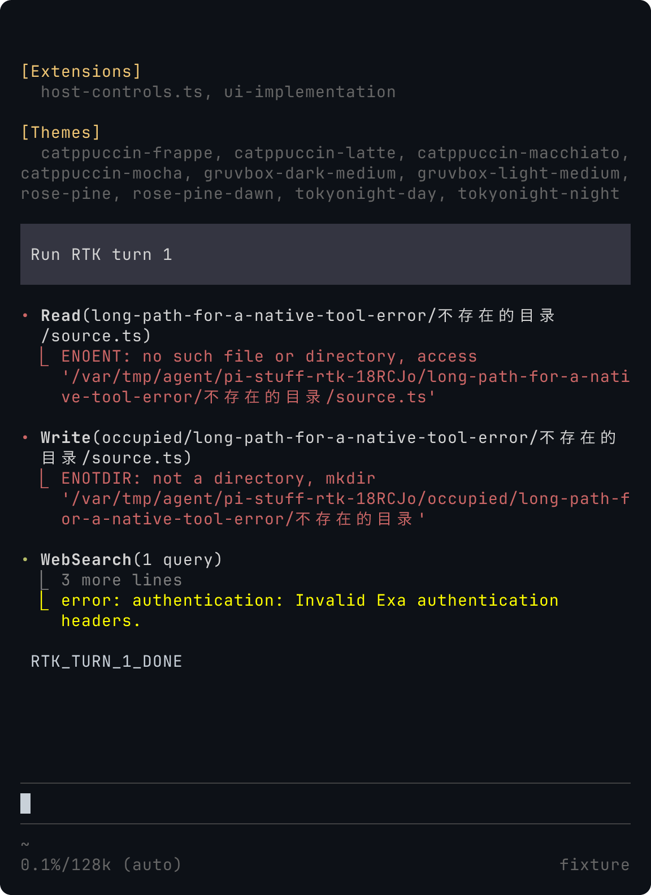

## Configuration

Add `ui` to the global `pi-stuff.json` beside existing `web`, `tools` and `rtk` settings. Reload Pi after editing. Project configuration is not read for these options.

```json
{
  "ui": {
    "enabled": true,
    "welcome": true,
    "retrievalGroups": true,
    "bashPreviewLines": 3,
    "bashRunningPreviewLines": 2,
    "writePreviewLines": 3,
    "editPreviewLines": 6,
    "codeHighlighting": true,
    "diffLineNumbers": true,
    "diffBackgrounds": true
  }
}
```

`retrievalGroups` defaults to `true`; `false` keeps individual retrieval tools.

`enabled` defaults to `true`; `false` leaves native tool rendering in place. All preview limits are nonnegative integers, with the defaults shown above. Zero hides the compact body while retaining the summary and hidden-row count. Limits do not change model-visible output, upstream truncation or expanded content.

`codeHighlighting` controls syntax colors in Write and Edit. `diffLineNumbers` and `diffBackgrounds` independently control the diff gutter numbers and addition/removal backgrounds. All three default to `true`. Disabling them preserves source text, `+/-` markers and native execution.

Open `/ui` for the global switch, retrieval grouping, preview limits and code presentation. The panel uses Pi's SettingsList and remains available when UI presentation is disabled. Settings are saved immediately; use `/reload` to apply them. A stale save is rejected if the file changed externally. Saving retains other configuration sections. Theme and Hide thinking remain in Pi's own settings.

The UI implementation is owned by `src/ui/`; the entrypoint registers it after shared configuration decoding. Configuration and remaining UI controls will be extended as their behavior is implemented.

## Verification status

Retrieval results reuse Pi's native result component and retain only the current width's layout. Repeated expansion of a 321-call conversation fell from a median 1,174 ms to 33 ms. A later native width check avoids rescanning fitting styled rows; first expansion fell from 1,097 ms to 102 ms in a fresh comparison. [Measurements and limits](ui-performance.md) include UI-on/off results, CPU, memory and raw observations. This is not complete performance acceptance.

Write/Edit reuse highlighted source and one width's wrapped body across disclosure changes. Pi's native invalidation clears these caches for theme changes, newly loaded syntax grammars and layout refreshes. There is no cache of every previously used width or theme.

A bounded disclosure experiment used Pi 0.85.1, Bun 1.4.0 and an 80×36 terminal: replace 1,500 TypeScript constant declarations, yielding 1,500 removed and 1,500 added rows, then alternate Ctrl+O ten times. Measured from key dispatch until the final source line or compact hidden-row count appeared, the median fell from 127 ms (119–149 ms) at `b8ffd3a` to 2 ms (1–4 ms) with caching. These observations include Terminal Control communication. They do not measure initial highlighting, memory, long-history resume or real-model latency, and do not replace the required full performance comparison.

The initial system tests use actual Pi 0.85.1 under Bun 1.4.0 with an isolated deterministic provider. They check compact/expanded output, model-visible content, timeout blocks, host shell settings and global UI controls. History regressions currently fail after reload and resume: historical tool components retain native renderers. Reload rebuilds those components before the session-start registration callbacks run. Live grouping, parallel completion, individual disclosure and starting a new session pass, but history acceptance does not. This lifecycle issue must be fixed before delivery. Compiled-host, full UI, independent review, performance and extended real-model acceptance remain outstanding.

An intermediate independent review of `bb03c4e..c43c503` found four blockers. Focused follow-ups verified the terminal-sequence, local group collapse, retrieval metadata-count and WebRead no-match fixes, including fractional Read limits and WebSearch's inner header. The Search display test uses the actual tool implementation with deterministic transport and a test alias; it does not establish production registration or grouping acceptance. Final full-diff review remains pending. Passing preservation tests do not establish assistant/Thoughts implementation or complete acceptance.
