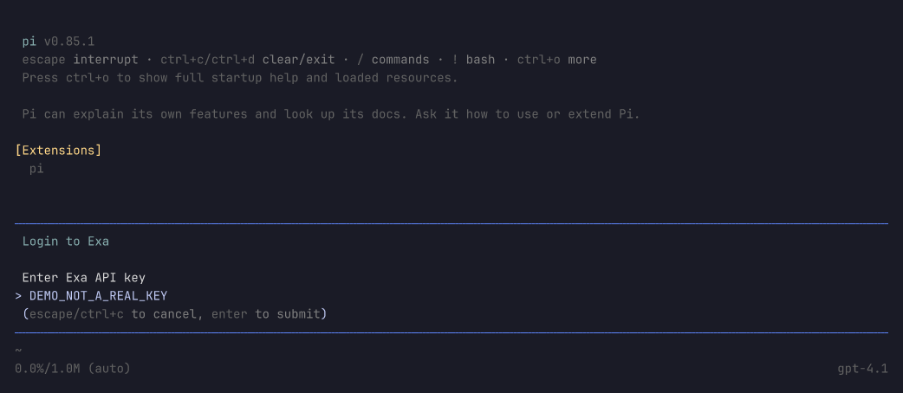

# Web access

[简体中文](i18n/zh-CN/web-access.md)

Pi Stuff provides three independent tools: `web_search`, `fetch_content` and `get_search_content`. Search returns source links; the model chooses which pages to fetch. There is no automatic page-fetching agent, browser-cookie integration or Exa chat model.

## Load the development extension

No release is published. From a reviewed checkout, install dependencies with the pinned Bun `1.4.0`, then load the source entrypoint:

```bash
bun install --frozen-lockfile --ignore-scripts
pi -e /absolute/path/to/pi-stuff/src/pi/index.ts
```

Replace the absolute path with your checkout. Load only one extension registering these tool names to avoid collisions. Extension code runs with your account's permissions. The tested target is the Linux Bun-compiled Pi `0.85.1`; other versions/platforms are not verified. Development checks also launch the installed Pi CLI through Bun. See [QA](quality-assurance.md#terminal-e2e) for these distinct profiles.

## Settings and credentials are separate

`pi-stuff.json` and `auth.json` live in Pi's **agent directory**, resolved by the host (`PI_CODING_AGENT_DIR` overrides its default). Pi Stuff does not read a project-local configuration file or create a second credential store.

An optional `pi-stuff.json`:

```json
{
  "tools": {
    "web_search": true,
    "fetch_content": true,
    "get_search_content": true
  },
  "web": {
    "provider": "openai"
  }
}
```

- Missing settings use defaults: all three tools permitted, OpenAI preferred.
- `web.provider` accepts `openai` or `exa`. It selects a search backend, not a chat model.
- Each `tools` entry independently permits registration. `false` omits that tool; Pi's own active-tool selection still decides which registered tools the model receives. Enabling a global switch never overrides that selection. Authentication registration itself does not add a tool or model.
- Edit settings and use `/reload`. Invalid JSON, wrong types or unknown top-level/web fields prevent Pi Stuff loading; fix the file and reload. Do not put `exaApiKey` here.

### Exa

Live compiled-host acceptance covered ordinary and domain-filtered Exa searches using only `auth.json`, with `EXA_API_KEY` absent, followed by a model-selected page fetch and find.

With the extension loaded, use `/login exa` to save an Exa API Key through Pi. Exa appears as an authentication provider, **never as a Pi Stuff chat model**. You can keep any supported chat model selected.

The host manages an entry with this shape in `auth.json` (the value below is a placeholder; preserve other provider entries):

```json
{
  "exa": {
    "type": "api_key",
    "key": "YOUR_EXA_API_KEY"
  }
}
```

Pi's built-in helper prefers the saved credential, then `EXA_API_KEY`. A rejected saved key does not trigger a retry using the environment key. Use `/logout` and select Exa to remove its stored entry; an existing environment key remains usable.

Subsequent searches resolve needed credentials through the host, so login/logout or credential-file changes need no `/reload`. An already-issued request keeps its resolved key and is not retroactively cancelled by logout. Changing the parent shell's environment requires restarting Pi; it cannot alter an already-running process.

**Pi 0.85.1 limitations:** its login input visibly renders the key. Avoid entering secrets while recording or sharing the terminal; directly managing the credential file is an alternative. With no chat model selected, login can save the key successfully and then report that Exa has no default model. Select an actual chat model, not Exa. Pi Stuff does not patch that host UI.

Actual isolated Pi 0.85.1 login screen, with an unsubmitted dummy value and a separate chat model still selected:



Keep `auth.json` out of ordinary configuration Git/cloud synchronization; use a separately encrypted backup if needed. Pi creates new credential files with `0600` permissions but preserves existing permissions. Plaintext files and environment variables are not encrypted storage, and `0600` does not isolate processes running as the same user.

### OpenAI and Codex

Use Pi's existing OpenAI/Codex authentication. By default, search uses the current model only if it is an official OpenAI/Codex Responses model. To keep a different chat model selected while using a particular search model, add an exact host-known model reference under `web`:

```json
{
  "web": {
    "provider": "openai",
    "openaiModel": {
      "provider": "openai",
      "id": "gpt-4.1"
    }
  }
}
```

This is a model-reference example, not a promise that your account has access. Custom OpenAI gateways are unsupported. An invalid explicit model fails configuration rather than guessing another model. Codex OAuth search has live acceptance evidence; the standalone OpenAI API-key billing path has not been live-verified.

## Tool calls

Ask Pi to use these tools, or supply equivalent arguments through its tool interface. They are not slash commands.

| Tool                      | Example arguments                                                                                                   | Result                                                                           |
| ------------------------- | ------------------------------------------------------------------------------------------------------------------- | -------------------------------------------------------------------------------- |
| `web_search`              | `{"queries":["Bun fetch documentation"],"maxResults":2}`                                                            | Ordered query results with actual provider, selection reason and fallback status |
| `web_search` with filters | `{"queries":["Python JSON documentation"],"includeDomains":["python.org"],"excludeDomains":["discuss.python.org"]}` | Exa-only search, locally checked source domains                                  |
| `fetch_content`           | `{"urls":["https://example.com"],"mode":"readable"}`                                                                | Extracted page text and a `contentId`; use `raw` for unextracted text            |
| `get_search_content`      | `{"contentId":"ID_FROM_RESULT","offset":8000,"limit":8000}`                                                         | Another page, with `nextOffset` and `truncated`                                  |
| `get_search_content`      | `{"contentId":"ID_FROM_RESULT","find":"needle"}`                                                                    | Case-insensitive matches and nearby text                                         |

Search accepts 1–5 queries, `maxResults` 1–20 (default 5), and up to 20 domains per filter. Domains are hostnames, not URLs or wildcards; a domain also matches its subdomains, and exclusions win. Filtering requires Exa authentication and never falls back to an unfiltered backend.

Ordinary search prefers `web.provider`. If that backend is unconfigured, an available alternative can be selected without counting as fallback. A temporary transport error, deadline, HTTP 408/429 or 5xx permits at most one alternate-provider attempt. Authentication errors, other HTTP errors, malformed replies and valid empty results do not. OpenAI returns its native answer/citations/sources; Exa returns titles, URLs and highlights.

## Limits and lifecycle

- A batch has at most five items and three active retrievals. Results preserve input order; one failed item does not discard other successes.
- Page fetches and provider attempts have 30-second deadlines; host authentication waits are separately bounded to 30 seconds. Cancellation stops Pi Stuff waiting and prevents subsequent provider attempts; the host owns any internal authentication work.
- Responses are limited to 5 MiB, retained text to 1 MiB per item, and tool output to 32 KiB. Follow `nextOffset` to retrieve more retained text. Offsets and lengths are **UTF-16 code units**, not bytes; do not mix `find` with `offset`/`limit`.
- Retained content is session-only, with a 32 MiB/64-item FIFO budget. Eviction, `/new`, `/reload` and shutdown invalidate content IDs. Hidden retained text is not copied into tool `details` or persisted for recovery; visible tool output can still be saved by Pi in session history.
- Fetch uses standard runtime networking and up to five redirects. Reachable HTTP(S) local/private targets are allowed; URL-embedded credentials are rejected. There is **no SSRF isolation boundary**, DNS/IP preflight or address pinning. Requests use `credentials: 'omit'`; browser cookies and webpage authentication are not reused.

Review URLs and returned material as external data, not instructions or permission to access additional resources.
