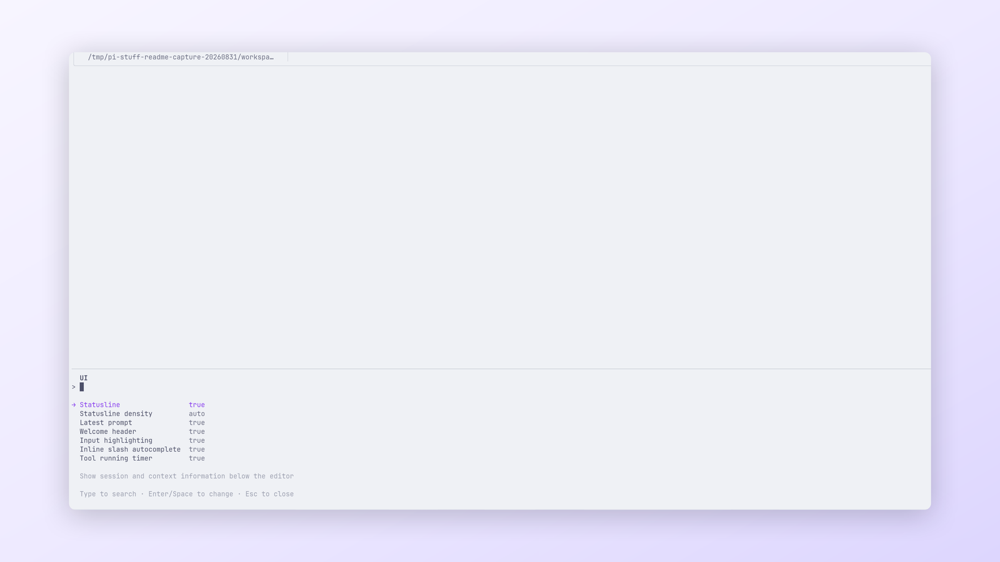
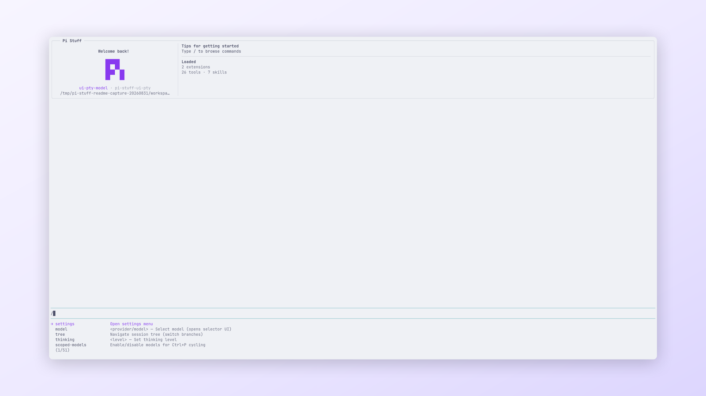

# `@jczhang02/pi-stuff`

[Simplified Chinese](../../docs/i18n/zh-CN/packages/pi-stuff/README.md)

The Pi Stuff Package adds focused interface, work, context, and integration capabilities to Pi.

<p align="center">
  <a href="../../docs/assets/readme/package/suite.png">
    
  </a>
  <br>
  <em>The shared UI dialog keeps Suite presentation settings in one native Pi surface.</em>
</p>

## Capabilities

| Area | Included capabilities |
| --- | --- |
| Interface | [Conversation UI](src/conversation-ui/README.md), [Session Naming](src/session-naming/README.md), [Tool Display](src/tool-display/README.md) |
| Work | [Goal](src/goal/README.md), [Background Work](src/background-work/README.md), [Agents](src/subagents/README.md), [Todo](src/todo/README.md) |
| Flow | [BTW](src/btw/README.md), [Notification](src/notification/README.md), [Ponytail](src/ponytail/README.md) |
| Context and integrations | [Context Management](src/context-management/README.md), [Web](src/web/README.md), [MCP](src/mcp/README.md), [RTK](src/rtk/README.md), [Codex](src/codex/README.md), [Code Mode](src/code-mode/README.md) |

## Installation

From the repository root:

```bash
pi install ./packages/pi-stuff
pi
```

The current certified Pi and toolchain versions are listed in
[`docs/compatibility.md`](../../docs/compatibility.md). Optional services and executables can be configured only when
their capabilities are needed.

<p align="center">
  <a href="../../docs/assets/readme/package/commands.png">
    
  </a>
  <br>
  <em>Slash completion exposes the command surface without a separate launcher.</em>
</p>

## Documentation

- [Getting started](../../docs/getting-started.md)
- [Capability guides](../../docs/README.md#capability-guides)
- [Command reference](../../docs/reference/commands.md)
- [Settings reference](../../docs/reference/settings.md)
- [Themes](../../docs/reference/themes.md)
- [Architecture](../../docs/architecture.md)
- [Troubleshooting](../../docs/troubleshooting.md)
