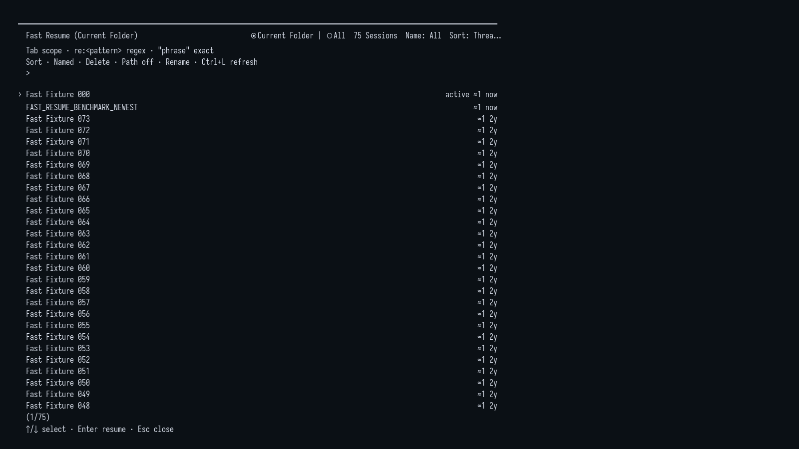

# Fast Resume

[Simplified Chinese](../../../../docs/i18n/zh-CN/packages/pi-stuff/src/fast-resume/README.md)

Pi's native Session selector, backed by exact name lookup and bounded transcript parsing instead of complete-history
JSON parsing.

  
   
  <em>Fast Resume changes how Session rows are loaded, not how Pi's selector looks or behaves.</em>

## Quick start

`/resume` opens Pi's native `SessionSelectorComponent` with Fast Resume loaders by default. Search, scope, sort,
rename, delete, and keyboard behavior remain Host-owned. If the certified interception seam is unavailable, Pi Stuff
calls the original native selector.

Set `fastResume.hijackResume` to `false` in `pi-stuff.json` to retain Pi's complete-history `/resume` and use
`/fast-resume` for the native selector with lightweight loaders instead.

## Contract

- The visible selector is Pi's exported native component. Pi Stuff does not maintain a parallel resume UI, search
  engine, list controller, or mutation workflow.
- Current Folder and All Sessions parse at most 1 MiB from each file front for transcript metadata. Files that fit
  the forward window are parsed in full. Oversized files receive one complete byte scan for the latest valid
  `session_info`, so an existing Session name is authoritative regardless of its position. Loading progress is passed
  to the native Header, and All Sessions are loaded only when requested.
- Selection delegates to Pi's `switchSession`; rename and confirmed deletion remain native selector behavior.
- Each open selector owns its loader operations. Closing the surface shuts down that owner; the native component keeps
  authority over refresh and late-result handling.
- Session JSONL files remain authoritative. Fast Resume creates no index, cache, database, or network traffic.

Bounded transcript parsing trades completeness for latency. Files that fit the 1 MiB forward window retain their
complete searchable text, message count, and last-message activity. Oversized files preserve their latest Session name
but can omit later message text, report a lower message count, and fall back to filesystem modification time for
ordering. Disable interception when complete-history search or exact message counts and activity matter.

## Documentation

- [Fast Resume guide](../../../../docs/capabilities/fast-resume.md)
- [Command reference](../../../../docs/reference/commands.md#sessions-and-side-questions)
- [Settings reference](../../../../docs/reference/settings.md#fastresume)
- [Architecture decision](../../../../docs/adr/0026-add-fast-resume.md)
- [Troubleshooting](../../../../docs/troubleshooting.md)
