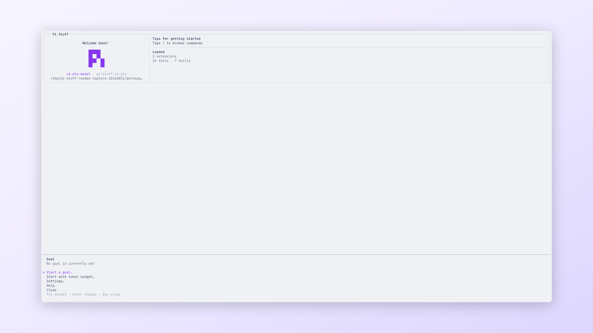

# Goal

[Simplified Chinese](../../../../docs/i18n/zh-CN/packages/pi-stuff/src/goal/README.md)

Persistent, evidence-gated work toward one Session objective.

<p align="center">
  <a href="../../../../docs/assets/readme/capabilities/goal.png">
    
  </a>
  <br>
  <em>The Goal manager starts, edits, pauses, and resumes durable work.</em>
</p>

## Quick start

```text
/goal implement and verify the requested change
/goal status
```

Use `/goal pause` and `/goal resume` to control automatic continuation. Use `/goal clear` when the objective should no
longer remain active.

## Highlights

- Continues settled work until completion, pause, budget, provider limit, or a verified blocker.
- Requires requirement-by-requirement evidence before `goal_complete` succeeds.
- Audits a stable blocker across three consecutive Goal turns.
- Persists objective, status, budget, and optional queue in the current Session.
- Preserves Goal identity across Pi's native compaction lifecycle.
- Shows current status, usage, budget, and elapsed time in the shared Statusline.

## Documentation

- [Goal guide](../../../../docs/capabilities/goal.md)
- [Command reference](../../../../docs/reference/commands.md#work-control)
- [Settings reference](../../../../docs/reference/settings.md#goal)
- [Architecture](../../../../docs/architecture.md#lifecycle-ownership)
