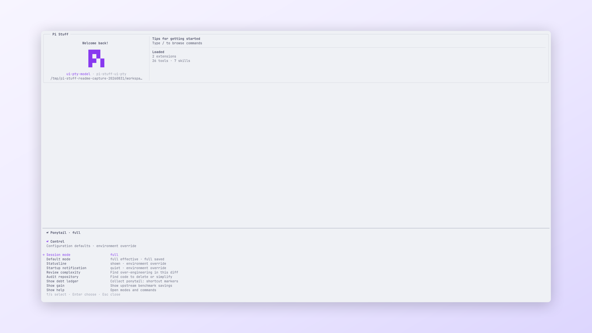

# Ponytail

[Simplified Chinese](../../../../docs/i18n/zh-CN/packages/pi-stuff/src/ponytail/README.md)

Session-scoped guidance for choosing the smallest adequate coding solution.

<p align="center">
  <a href="../../../../docs/assets/readme/capabilities/ponytail.png">
    
  </a>
  <br>
  <em>Ponytail shows the active mode and every guidance switch in one place.</em>
</p>

## Quick start

```text
/ponytail
/ponytail lite
/ponytail off
/ponytail-review
```

Bare `/ponytail` opens the control dialog. `full` is the default mode.

## Highlights

- Provides `off`, `lite`, `full`, and `ultra` Session modes.
- Keeps current mode in the Session and passes an effective snapshot to child Agents.
- Adds compact guidance and a six-Skill catalog only while active.
- Offers review, audit, debt, gain, and help commands.
- Controls default mode, Statusline identity, and startup notice.
- Resolves environment overrides before merged Pi Stuff settings.

## Documentation

- [Ponytail guide](../../../../docs/capabilities/ponytail.md)
- [Command reference](../../../../docs/reference/commands.md#ponytail)
- [Settings reference](../../../../docs/reference/settings.md#ponytail)
- [Upstream references](UPSTREAM.md)
