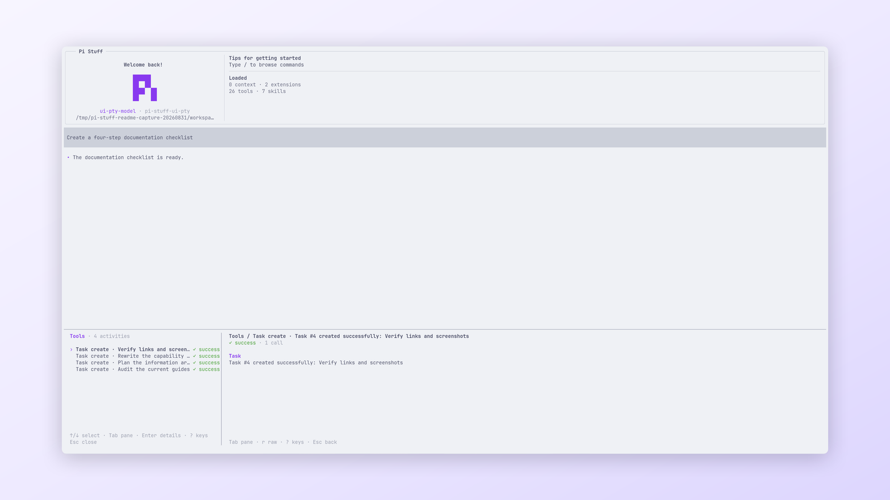

# Web Runtime

[Simplified Chinese](../../../../../docs/i18n/zh-CN/packages/pi-stuff/src/web/runtime/README.md)

Provider routing, extraction, stored-result retrieval, credential resolution, and SSRF enforcement for Pi Stuff Web.

  
   
  <em>The bundled Web runtime reports calls through the Suite's shared Tool Activity view.</em>

## Quick start

Use the parent [Web guide](../../../../../docs/capabilities/web.md) and its three Tools. The runtime executes each
search, fetch, or stored-content request from one immutable configuration snapshot.

## Highlights

- Routes configured search providers while keeping paid providers explicit.
- Extracts bounded HTTP, image, PDF, and GitHub content.
- Applies SSRF and domain policy at the outbound HTTP seam.
- Disables redirects before credentials or request bodies can cross origins.
- Restores valid Session result entries younger than one hour.
- Resolves bounded credential sources without persisting their values.

## Documentation

- [Web guide](../../../../../docs/capabilities/web.md)
- [Web Module README](../README.md)
- [Security contract](SECURITY.md)
- [Upstream references](UPSTREAM.md)
