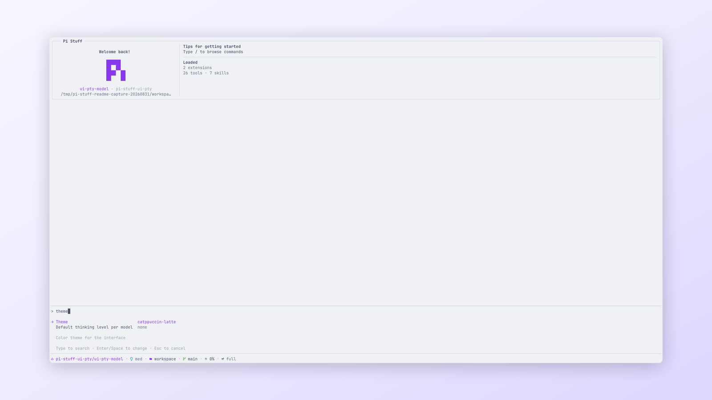

# Catppuccin themes

[Simplified Chinese](../../../docs/i18n/zh-CN/packages/pi-stuff/themes/README.md)

Pi Stuff includes all four flavors of Catppuccin for Pi.

  
   
  <em>Catppuccin Latte applied across the Welcome card, editor, and Statusline.</em>

## Available themes

| Theme | Settings value |
| --- | --- |
| Catppuccin Latte | `catppuccin-latte` |
| Catppuccin Frappé | `catppuccin-frappe` |
| Catppuccin Macchiato | `catppuccin-macchiato` |
| Catppuccin Mocha | `catppuccin-mocha` |

Choose a theme from Pi's `/settings` menu. Pi applies the selection immediately and handles truecolor and 256-color
terminal output.

## Color mapping

Each flavor maps Pi's text, emphasis, borders, Markdown, syntax, selection, and Tool states to the official
[Catppuccin Palette 1.8.0](https://github.com/catppuccin/palette/blob/v1.8.0/palette.json). Tool backgrounds use subtle
Mauve, Green, and Red blends for active, successful, and failed states.

See the [theme guide](../../../docs/reference/themes.md) for direct settings and palette details. The palette license
is available in [`LICENSE`](LICENSE).
