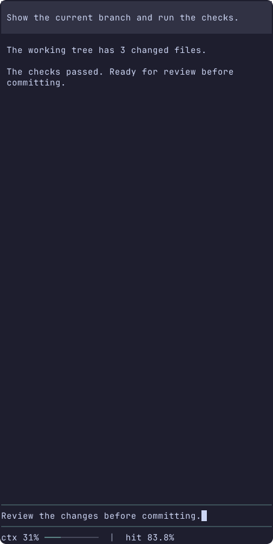

# Single-line statusline prototype

This throwaway prototype runs inside real Pi. It answers whether complete-field hiding keeps the selected B layout readable without abbreviating labels, removing spaces or adding rows. Retain it on `codex/statusline-prototype`; it is not registered by the production package.

中文: 这是在真实 Pi 中运行的一次性原型, 用于验证方案 B 在窄屏下仅隐藏完整字段的效果. 不简写标签、不删空格、不增加行. 原型保留在 `codex/statusline-prototype` 分支, 不接入正式包.

## Run

Working directory: the `codex/statusline-prototype` worktree. Install the pinned dependencies with `bun install --frozen-lockfile --ignore-scripts` if needed, then start a shared foreground terminal:

```sh
PI_TEST_HOST=/opt/bin/pi bun run tui run pi-statusline --host opentui -- bun prototypes/statusline/run.ts --theme catppuccin-latte --scenario extended
```

`PI_TEST_HOST` selects the local compiled Pi executable. Omit it to use the installed Pi 0.85.1 CLI under Bun. Use `catppuccin-mocha` for the dark theme. Scenarios are `base`, `extended` (goal and quota), and `long` (long project/branch names, including wide characters). These are launch arguments, not controls inside Pi.

Type and edit in Pi's native editor, press Enter to submit, and Esc to interrupt the two-second sample reply. Successful replies advance the sample counters; cancellation leaves them unchanged. Use Pi's normal exit action, or stop the named session:

```sh
bun run tui show pi-statusline
bun run tui stop pi-statusline
```

Resize the foreground terminal itself. Terminal Control 1.2.1's `run` follows its outer PTY size; its CLI `resize` command does not resize a foreground run.

中文: 在该 worktree 中运行上面的命令. `PI_TEST_HOST` 指向本机编译版 Pi; 省略后使用仓库安装的 Pi 0.85.1 CLI. `catppuccin-mocha` 是暗色主题. `base` 为基础字段, `extended` 加入 goal 和额度, `long` 使用含中文的长项目名和长分支名. 所有场景选择都在启动参数中完成. 原生编辑器支持编辑、Enter 提交和 Esc 取消. 每次样例回复约两秒, 成功后增加样例计数, 取消不增加. 缩放时调整承载原型的终端窗口. 查看及停止命令见上.

## Layout decision

Every field retains its complete text. The context meter is always ten continuous line characters; its filled portion uses Pi's semantic thinking color. Fields remain in a fixed display order. Space is assigned in this priority order: context, cache hit, model/effort, goal, quota, project, branch, tokens, estimated cost. If the next field does not fit, it and every lower-priority field are hidden. This avoids filling holes with less important fields and making the layout jump unpredictably.

For the `extended` sample:

| Width    | Visible fields                                                   |
| -------- | ---------------------------------------------------------------- |
| 150      | Project, branch, model/effort, context, hit, goal, quota, tokens |
| 100 / 80 | Model/effort, context, hit, goal                                 |
| 50       | Context and hit                                                  |

The footer remains one row and restores fields when widened. There is no overflow count or details entry. Priorities are the remaining design choice for maintainer review; they are not a production policy. Below the width of a complete context field, the footer is empty rather than clipped.

中文: 每项保留完整文本. ctx 进度条固定十个连续线条字符, 已用部分采用 Pi 的语义颜色. 显示顺序固定; 空间优先分配给 ctx、cache hit、模型/思考强度、goal、额度、项目、分支、token 和估算费用. 下一项放不下时, 隐藏它及所有更低优先级字段, 不用较小的低优先级字段回填空隙. `extended` 在 150 列显示除费用外的字段, 100/80 列显示模型、ctx、hit 和 goal, 50 列保留 ctx 与 hit. 放宽后字段恢复, 始终一行, 不加溢出计数或详情入口. 优先级仍供评审, 尚未成为正式产品规则. 窄到连完整 ctx 都放不下时, footer 留空而不截断.

## Evidence and limits

The committed PNGs are actual Terminal Control captures at 150/100/80/50 columns and 50 rows, using Catppuccin Latte/Mocha and the font stack `JetBrainsMono Nerd Font Mono, Symbols Nerd Font Mono, LXGW WenKai Mono`. The original whole Pi screen is preserved. They are headless terminal evidence, not native Ghostty/compositor screenshots.




The capture driver exercised all three scenarios in both themes, each resizing 150 → 100 → 80 → 50 → 150, then editing, submitting, interrupting and resubmitting. It checked that the complete ctx/hit text remained on one row and that the wide footer was restored exactly. See [verification.txt](captures/verification.txt). Reproduce with:

```sh
PI_TEST_HOST=/opt/bin/pi bun prototypes/statusline/capture.ts /tmp/pi-statusline-captures
bun run check
git diff --check
```

Verified locally with Bun 1.4.0, compiled Pi 0.87.0, Terminal Control 1.2.1 and the repository's Pi API declarations at 0.85.1. The host uses temporary settings/session directories and a local custom streaming provider. Replies, project/branch, token/cost, context, hit, goal and quota values are deterministic samples; no account usage or repository changes are queried. No real model request or check command is executed. The editor, message rendering, streaming, cancellation and terminal resize are Pi's real behavior. The custom provider uses Pi's [documented extension API](https://github.com/earendil-works/pi/blob/v0.85.1/packages/coding-agent/docs/custom-provider.md).

中文: 截图来自真实 Terminal Control 会话, 覆盖 150/100/80/50 列、50 行、明暗主题及指定字体栈, 保留整个 Pi 屏幕. 它们是无头终端证据, 不是 Ghostty 原生窗口或合成器截图. 六组场景均完成缩窄及恢复、编辑、提交、取消和再次提交, 验证 ctx/hit 完整处于同一行, 放宽后恢复原字段. 运行环境及复现命令见上. 项目名、分支、回复和所有统计值都是确定样例, 不读取账号额度或实际仓库状态, 不请求模型或执行检查命令. 编辑器、消息、流式响应、取消及缩放由真实 Pi 提供. 临时设置和会话目录在退出时清理.

## Tracking

Issue [#110](https://github.com/jczhang02/pi-stuff/issues/110), Beads `pi-stuff-dmo`. Owner: `codex:01a0c7d6-a1a0-76d2-9995-08ea5fa365b3`. Baseline: `bb03c4e98874bbd6b0ee09c1e79ddb30e8319e31`. Source is confined to this prototype directory. Product adoption and merging require a separate decision.

中文: 任务、负责人和基线见上. 源码仅位于此原型目录. 正式接入与合并需另行决定.
