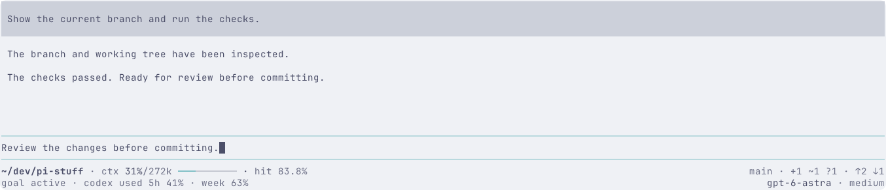
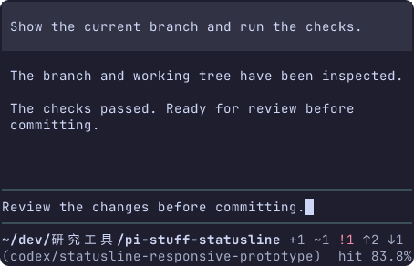

# Two-row statusline prototype

This throwaway prototype runs in real Pi. It explores whether two rows can preserve directory and Git information while making model/context/cache statistics easier to scan. It is retained on `codex/statusline-prototype`, outside the production package.

中文: 这个一次性原型在真实 Pi 中运行, 验证双行能否保住目录和 Git 信息, 同时让模型、上下文与缓存统计更易扫读. 保留在 `codex/statusline-prototype`, 不接入正式包.

## Run

From the prototype worktree, with the repository's pinned dependencies installed:

```sh
PI_TEST_HOST=/opt/bin/pi bun run tui run pi-statusline --host opentui -- bun prototypes/statusline/run.ts --theme catppuccin-latte --scenario extended
```

Omit `PI_TEST_HOST` to use the installed Pi 0.85.1 CLI under Bun. Choose `catppuccin-mocha` for dark mode. Scenarios: `base` has a clean branch; `extended` adds changes, goal and quota; `long` uses a full long branch, a directory containing wide characters and a conflict. Scenario selection stays outside the evaluated UI.

Use Pi's native editor, Enter to submit and Esc to cancel the two-second sample response. Successful responses advance the sample usage. Resize the foreground terminal itself: Terminal Control 1.2.1 `run` follows its outer PTY, not CLI `resize`. An already-running instance can load the revised footer through Pi's `/reload` command.

```sh
bun run tui show pi-statusline
bun run tui stop pi-statusline
```

中文: 在原型 worktree 中执行上述命令. 省略 `PI_TEST_HOST` 后使用安装的 Pi 0.85.1 CLI; 暗色主题选 `catppuccin-mocha`. `base` 是干净分支, `extended` 加入改动、goal 和额度, `long` 包含长分支、中文目录与冲突. 原生编辑器支持输入、Enter 提交、Esc 取消约两秒的样例回复. 成功回复增加统计. 缩放时调整前台终端本身; 已运行的实例可以用 `/reload` 载入修改.

## Layout and extension placement

The footer uses two rows with left and right anchors:

| Row    | Left zone                                  | Right zone                                     |
| ------ | ------------------------------------------ | ---------------------------------------------- |
| First  | Full directory, context/capacity/hit block | Branch, working-tree counts, commit divergence |
| Second | Third-party status                         | Model, thinking effort                         |

Adjacent fields in each zone use `·`. One elastic gap separates the two zones and puts their outer fields against the terminal edges. Compound values such as `+1 ~1 ?1` remain one Git field with ordinary internal spaces. No alignment padding appears within a zone. Authored labels are lowercase, including `codex`; actual directory, branch, model and external values retain their original casing.

Context follows the directory with the exact format `ctx 31%/272k ━━━━━━━━━━ · hit 83.8%`. Capacity attaches directly to the percentage, with no spaces around the slash; the meter follows after one space. Capacity is part of ctx; there is no separate window field. The complete context/capacity/hit block is shown or hidden together. Third-party statuses remain in the lower-left zone, now starting at its left edge. The goal/quota sample is an optional atomic group. It never takes over the Git or model anchors and is hidden first when space runs out. A future integration can pass additional complete status fields into this zone; this prototype does not add an extension API or poll real providers.

On row one, optional context yields to full directory/Git. On row two, extension status and then thinking effort yield before the model. Fields disappear whole, without abbreviations or smaller-field backfill. At 50 columns, the ordinary sample retains directory, complete Git state and model/effort, hiding the context block; it returns at 80 columns. Visible context always retains the capacity and ten continuous meter characters.

For long identities, directory and branch retain separate left/right anchors on row one when possible, moving working-tree/divergence fields to row two. If the names themselves cannot share a row, row one becomes directory/worktree and row two becomes branch/divergence. At 50 columns this long sample hides runtime metrics entirely so all identity and Git state survives. Individual names beyond the physical viewport use an ellipsis; there is no third row or overflow counter.

Ordinary Git states use neutral text; only conflicts use an error color. `clean` means no changes, `+1` staged, `~1` modified, `?1` untracked, `!1` conflicted, `↑2` ahead and `↓1` behind. Values are file counts and commit divergence, not changed-line counts. The fixtures do not cover every operation such as rebase or detached HEAD. Routine token/cache-read-write details, costs, provider and auto labels remain absent from this reduced layout.

中文: Footer 固定双行、左右分区. 第一行左侧完整目录后是ctx/容量/hit整体, 右侧分支、工作区计数与提交领先/落后. 第二行左侧第三方状态, 右侧模型与思考强度. 同一区域内相邻字段用 `·` 分隔, 两个区域之间仅一个弹性间隙, 区域内部不填充空白. `+1 ~1 ?1` 等复合计数仍是一个 Git 字段, 内部使用普通空格. 自定义标签全部小写, 包括 `codex`; 实际目录、分支、模型和外部值保留原始大小写.

中文: ctx紧随目录, 精确样式为 `ctx 31%/272k ━━━━━━━━━━ · hit 83.8%`, 容量直接接在百分比后, 斜杠两侧不加空格, 进度条与数值之间一个空格. 容量合入ctx, 不再有独立window字段; ctx/容量/hit整块显隐. 第三方字段仍在左下, 现在从该区域最左端开始. goal/额度作为一个可选整体, 不占Git/模型锚点. 第一行ctx整体让位于完整目录/Git; 第二行扩展、思考强度先于模型退让. 不简写、不零碎回填. 普通50列保留目录、完整Git和模型/强度, 隐藏ctx块; 80列恢复. 显示时容量与十字符连续进度条均完整保留. 本原型不增加扩展API或真实数据读取.

中文: 长身份优先在第一行左右保留目录与分支, 把工作区/提交计数移到第二行. 两个名称也放不下时, 第一行变为左目录/右工作区计数, 第二行为左分支/右领先落后. 该长样例在 50 列隐藏全部运行统计, 保住完整身份和 Git 状态. 单项名称超过物理宽度才使用省略号, 不加第三行或溢出计数. 普通 Git 状态为中性色, 冲突使用错误色. `clean` 为干净, `+1` 暂存、`~1` 修改、`?1` 未跟踪、`!1` 冲突、`↑2` 领先、`↓1` 落后; 数字是文件数与提交数, 不是代码行数. 样例未覆盖 rebase/detached HEAD 等所有操作. token/缓存读写明细、费用、provider和auto继续不常驻.

## Evidence and limits

The PNGs are actual headless Terminal Control captures at 150/100/80/50 columns and 16 rows, in Latte and Mocha, using `JetBrainsMono Nerd Font Mono, Symbols Nerd Font Mono, LXGW WenKai Mono`. They show the complete terminal viewport, not a cropped mockup or native Ghostty/compositor capture.




The one-shot driver covers each theme/scenario at 150 → 100 → 80 → 50 → 150, then editing, submit, cancellation and resubmit. Assertions check two rows, full sample identities and Git states at every width, the exact context/capacity/hit block immediately after the directory when it fits, left/right alignment, dot separators, lowercase sample labels, whole extension groups, absence of removed details and restoration. The driver waits for both right anchors and a complete runtime-row tail after resize, then captures a stable frame. It rejects partial extension values. See [verification.txt](captures/verification.txt).

```sh
PI_TEST_HOST=/opt/bin/pi bun prototypes/statusline/capture.ts /tmp/pi-statusline-captures
bun run check
git diff --check
```

Environment: Bun 1.4.0, compiled Pi 0.87.1, Terminal Control 1.2.1, repository API declarations at Pi 0.85.1. Temporary settings/sessions are cleaned up. The local provider and all displayed directory/Git/account/usage data are deterministic samples; no Git status, account quota, real model request or check command is executed. The native editor, message rendering, streaming, cancellation and resize are real Pi behavior. The provider uses Pi's [documented extension API](https://github.com/earendil-works/pi/blob/v0.85.1/packages/coding-agent/docs/custom-provider.md).

中文: PNG 来自真实无头 Terminal Control, 包含完整 16 行终端视口, 覆盖明暗主题和 150/100/80/50 列, 字体栈见上. 它们不是裁剪的设计图或原生 Ghostty/合成器截图. 一次性驱动验证各场景的缩窄与恢复、编辑、提交、取消和再次提交, 检查双行、完整目录/分支/Git 计数、可容纳时紧随目录且格式精确的ctx/容量/hit整体、左右对齐、圆点分隔、小写样例标签、扩展组整体显隐、无已移除明细及恢复结果. 缩放后等待两个右侧锚点和完整行尾再抓稳定帧, 截断的扩展组会导致验证失败. 复现命令及版本见上. 临时设置/会话会清理. 所有目录、Git、账号与用量均为确定样例, 不查询真实状态、不调用模型或检查命令; 编辑器、消息、流式输出、取消和缩放使用原生 Pi.

## Tracking

Issue [#110](https://github.com/jczhang02/pi-stuff/issues/110), draft PR [#111](https://github.com/jczhang02/pi-stuff/pull/111), Beads `pi-stuff-dmo`. Owner: `codex:01a0c7d6-a1a0-76d2-9995-08ea5fa365b3`. Baseline: `bb03c4e98874bbd6b0ee09c1e79ddb30e8319e31`. Production adoption and merging require a separate decision.

中文: 关联任务、草稿 PR、负责人和基线见上. 正式接入与合并另行决定.
