# Claude Code /tui default captures

[Research / 研究](../../../docs/research/claude-code-default-tui-2026-09-22.md) · [中文报告](../../../docs/i18n/zh-CN/research/claude-code-default-tui-2026-09-22.md) · [Manifest](manifest.json)

Official Claude Code 2.1.261, explicit `/tui default`, isolated local tools and fixed model responses. Each image is an actual terminal export. Active states are point-in-time frames. See the report for setup failures and reruns.

官方客户端实际执行隔离工具, 模型回复固定. 每张图均为真实终端导出; 运行中画面仅代表捕获时刻. 失败探针及重跑见报告.

## cancelled-120

[Inputs](cancelled-120/case.json) · [Tool exchanges](cancelled-120/exchanges.json)

### cancelled

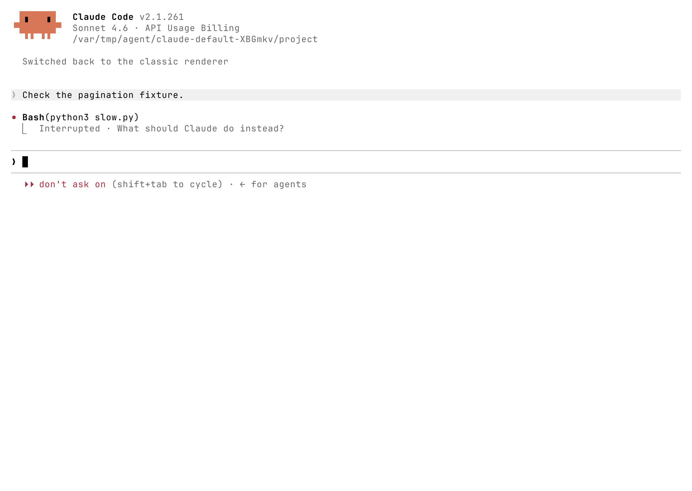

[Text](cancelled-120/cancelled.txt) · [Raw ANSI gzip](cancelled-120/cancelled.ansi.gz)

### expanded

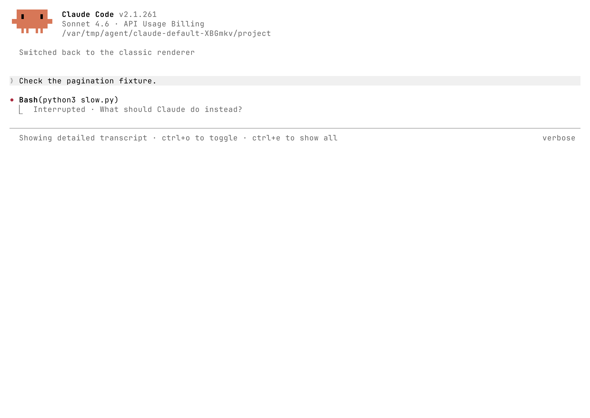

[Text](cancelled-120/expanded.txt) · [Raw ANSI gzip](cancelled-120/expanded.ansi.gz)

### mode

[Text](cancelled-120/mode.txt) · [Raw ANSI gzip](cancelled-120/mode.ansi.gz)

### restored

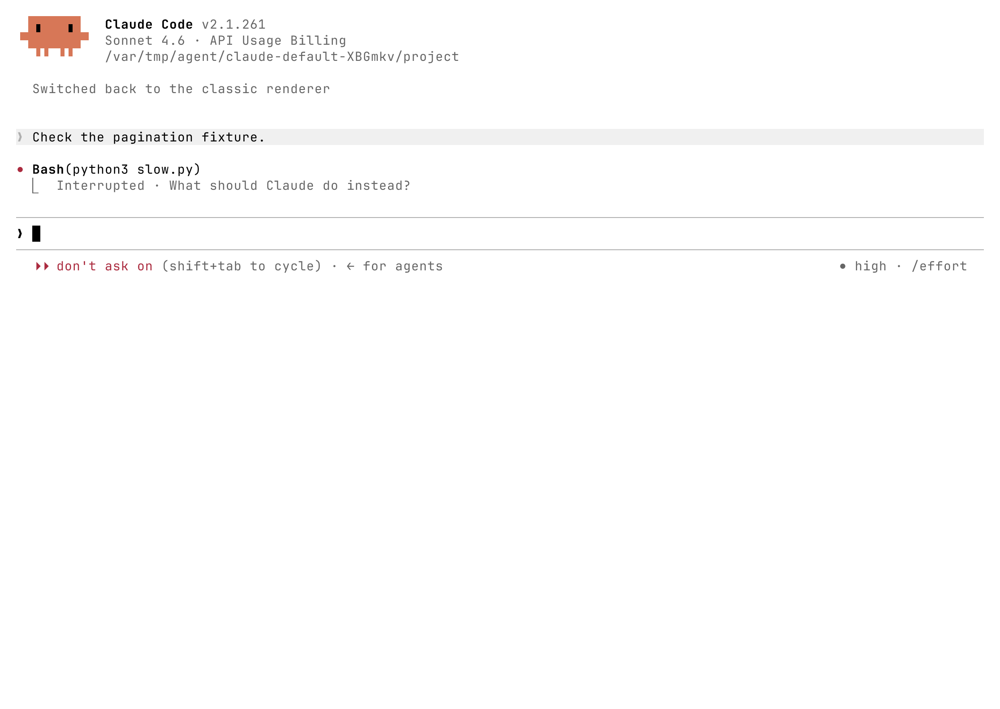

[Text](cancelled-120/restored.txt) · [Raw ANSI gzip](cancelled-120/restored.ansi.gz)

### running-late

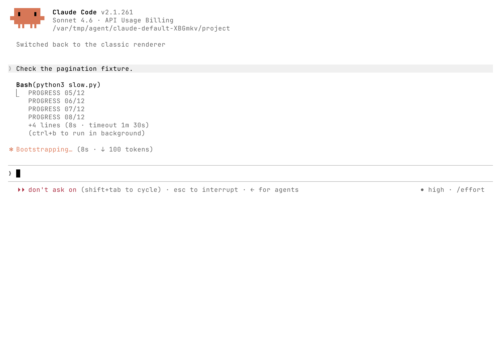

[Text](cancelled-120/running-late.txt) · [Raw ANSI gzip](cancelled-120/running-late.ansi.gz)

### running

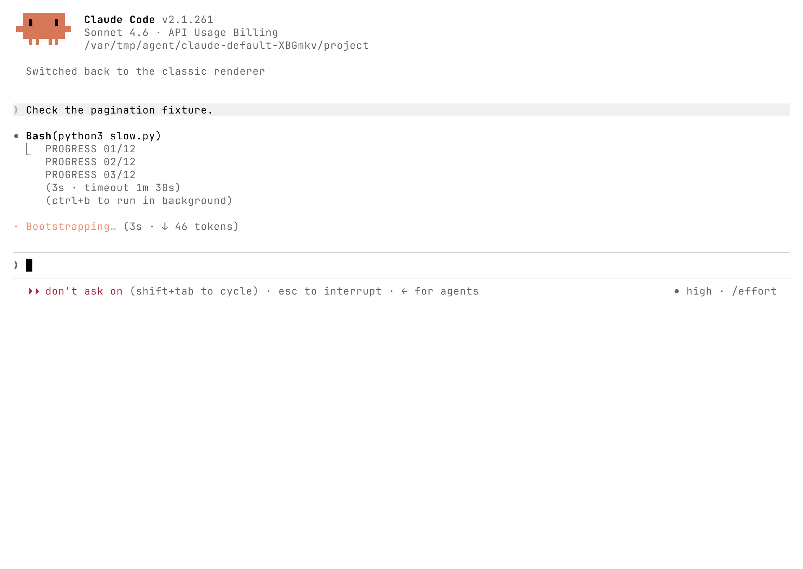

[Text](cancelled-120/running.txt) · [Raw ANSI gzip](cancelled-120/running.ansi.gz)

### startup

[Text](cancelled-120/startup.txt) · [Raw ANSI gzip](cancelled-120/startup.ansi.gz)

## edit-120

[Inputs](edit-120/case.json) · [Tool exchanges](edit-120/exchanges.json)

### compact

[Text](edit-120/compact.txt) · [Raw ANSI gzip](edit-120/compact.ansi.gz)

### expanded

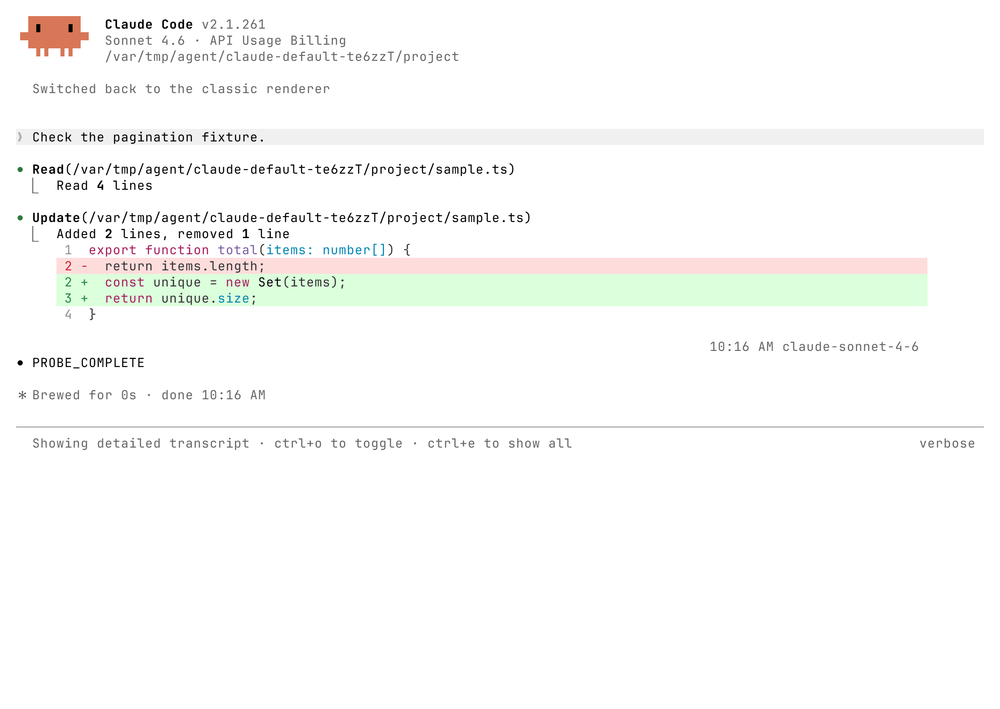

[Text](edit-120/expanded.txt) · [Raw ANSI gzip](edit-120/expanded.ansi.gz)

### mode

[Text](edit-120/mode.txt) · [Raw ANSI gzip](edit-120/mode.ansi.gz)

### restored

[Text](edit-120/restored.txt) · [Raw ANSI gzip](edit-120/restored.ansi.gz)

### startup

[Text](edit-120/startup.txt) · [Raw ANSI gzip](edit-120/startup.ansi.gz)

## edit-long-120

[Inputs](edit-long-120/case.json) · [Tool exchanges](edit-long-120/exchanges.json)

### compact

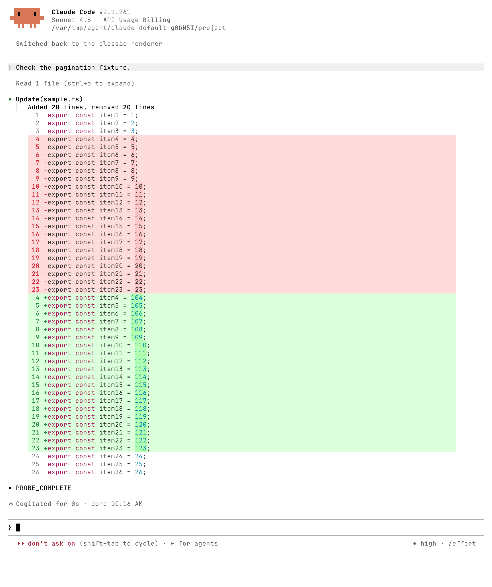

[Text](edit-long-120/compact.txt) · [Raw ANSI gzip](edit-long-120/compact.ansi.gz)

### expanded

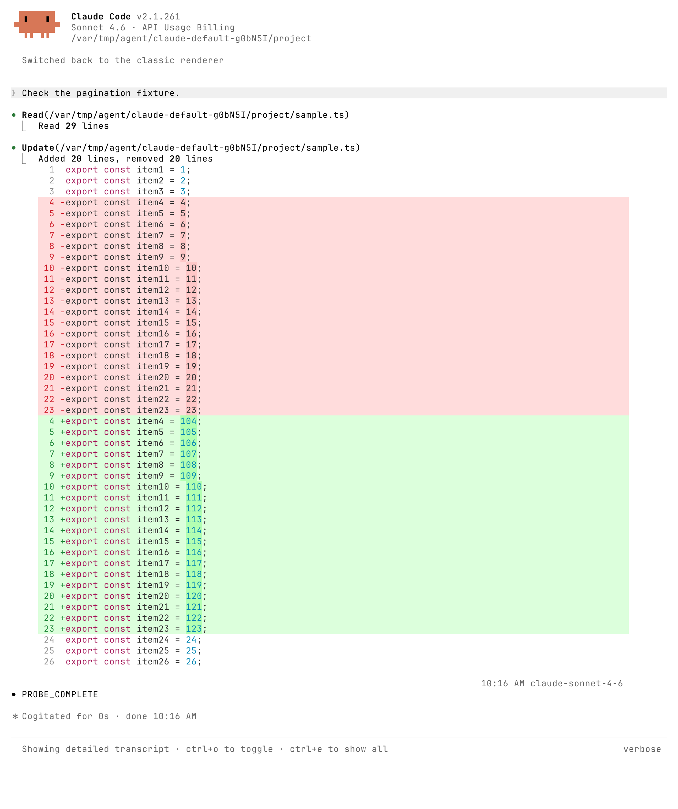

[Text](edit-long-120/expanded.txt) · [Raw ANSI gzip](edit-long-120/expanded.ansi.gz)

### mode

[Text](edit-long-120/mode.txt) · [Raw ANSI gzip](edit-long-120/mode.ansi.gz)

### restored

[Text](edit-long-120/restored.txt) · [Raw ANSI gzip](edit-long-120/restored.ansi.gz)

### startup

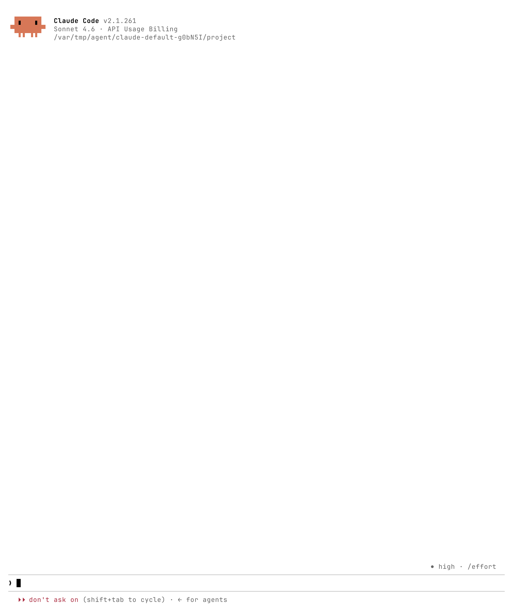

[Text](edit-long-120/startup.txt) · [Raw ANSI gzip](edit-long-120/startup.ansi.gz)

## empty-120

[Inputs](empty-120/case.json) · [Tool exchanges](empty-120/exchanges.json)

### compact

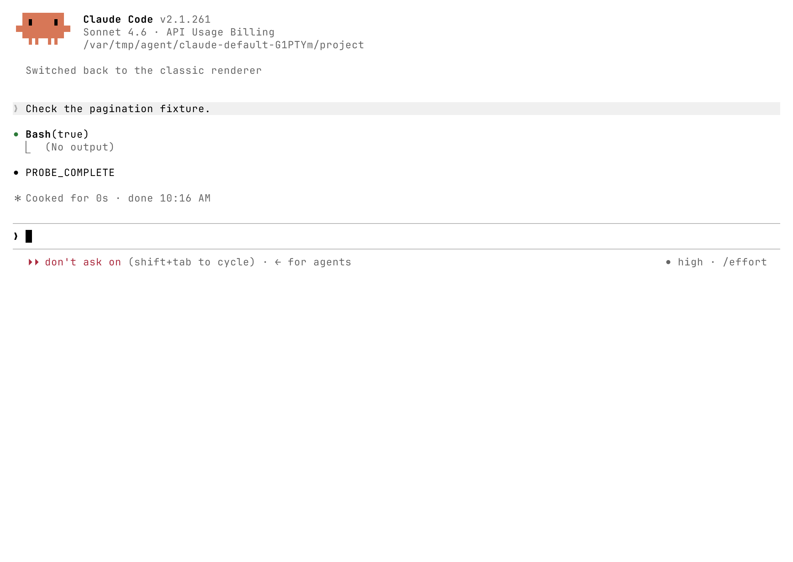

[Text](empty-120/compact.txt) · [Raw ANSI gzip](empty-120/compact.ansi.gz)

### expanded

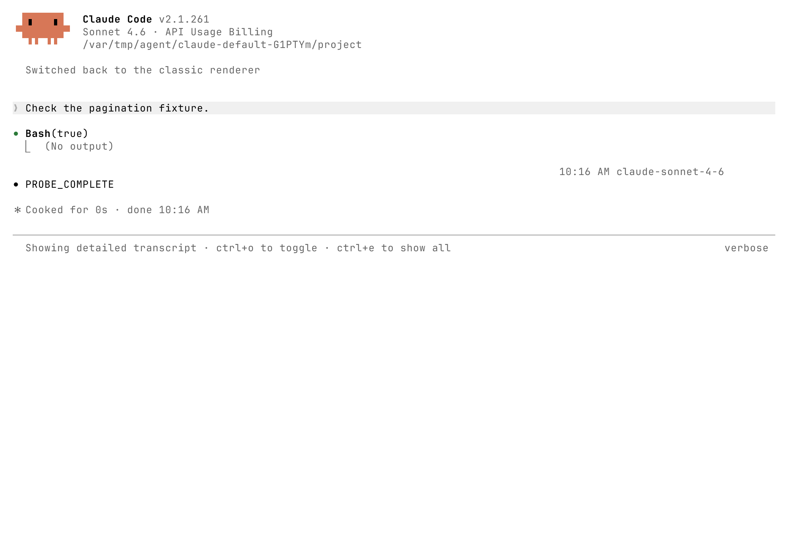

[Text](empty-120/expanded.txt) · [Raw ANSI gzip](empty-120/expanded.ansi.gz)

### mode

[Text](empty-120/mode.txt) · [Raw ANSI gzip](empty-120/mode.ansi.gz)

### restored

[Text](empty-120/restored.txt) · [Raw ANSI gzip](empty-120/restored.ansi.gz)

### startup

[Text](empty-120/startup.txt) · [Raw ANSI gzip](empty-120/startup.ansi.gz)

## failed-120

[Inputs](failed-120/case.json) · [Tool exchanges](failed-120/exchanges.json)

### compact

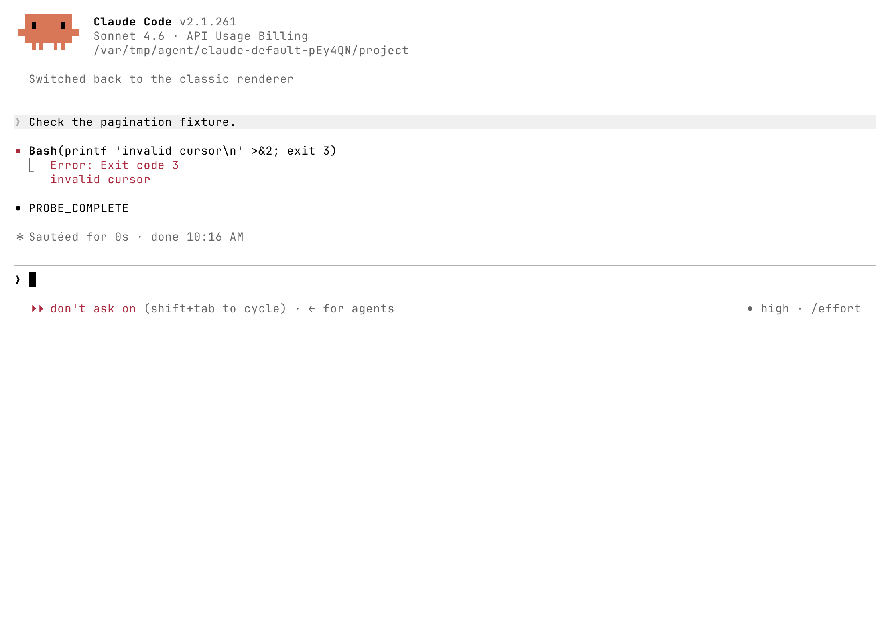

[Text](failed-120/compact.txt) · [Raw ANSI gzip](failed-120/compact.ansi.gz)

### expanded

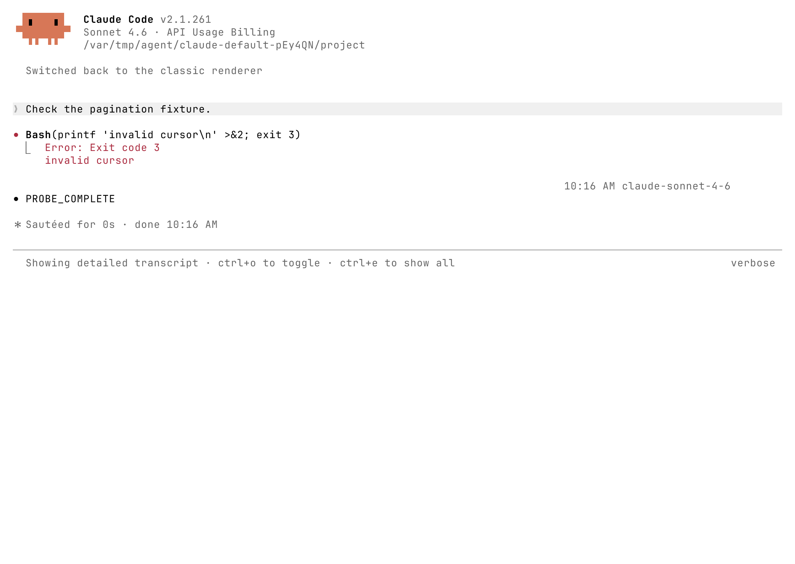

[Text](failed-120/expanded.txt) · [Raw ANSI gzip](failed-120/expanded.ansi.gz)

### mode

[Text](failed-120/mode.txt) · [Raw ANSI gzip](failed-120/mode.ansi.gz)

### restored

[Text](failed-120/restored.txt) · [Raw ANSI gzip](failed-120/restored.ansi.gz)

### startup

[Text](failed-120/startup.txt) · [Raw ANSI gzip](failed-120/startup.ansi.gz)

## long-no-timeout-120

[Inputs](long-no-timeout-120/case.json) · [Tool exchanges](long-no-timeout-120/exchanges.json)

### compact

[Text](long-no-timeout-120/compact.txt) · [Raw ANSI gzip](long-no-timeout-120/compact.ansi.gz)

### expanded

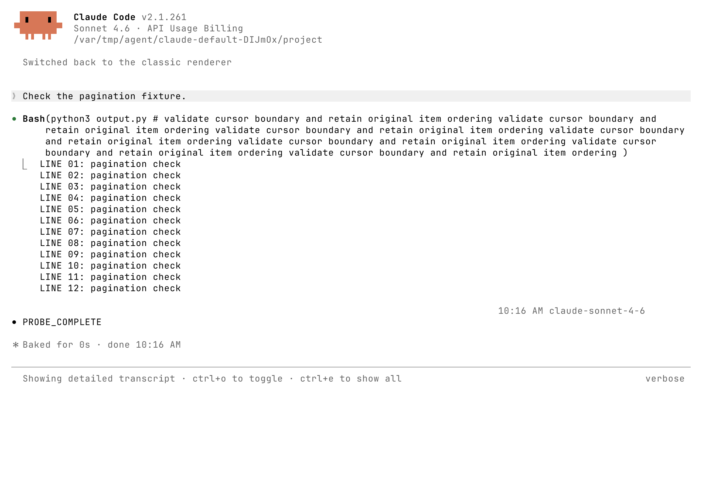

[Text](long-no-timeout-120/expanded.txt) · [Raw ANSI gzip](long-no-timeout-120/expanded.ansi.gz)

### mode

[Text](long-no-timeout-120/mode.txt) · [Raw ANSI gzip](long-no-timeout-120/mode.ansi.gz)

### restored

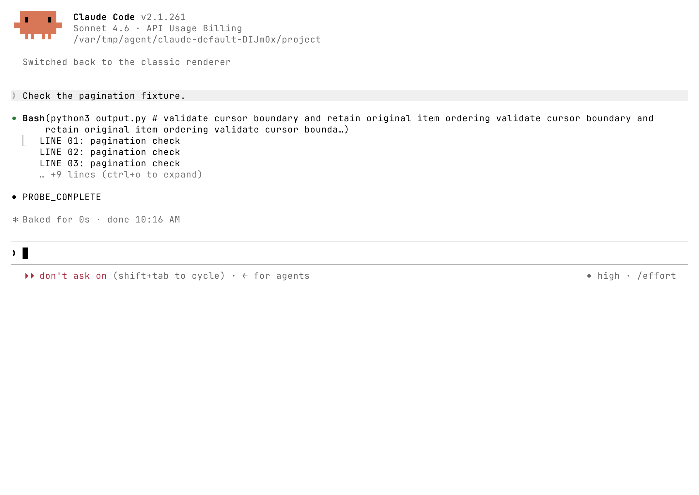

[Text](long-no-timeout-120/restored.txt) · [Raw ANSI gzip](long-no-timeout-120/restored.ansi.gz)

### startup

[Text](long-no-timeout-120/startup.txt) · [Raw ANSI gzip](long-no-timeout-120/startup.ansi.gz)

## long-timeout-120

[Inputs](long-timeout-120/case.json) · [Tool exchanges](long-timeout-120/exchanges.json)

### compact

[Text](long-timeout-120/compact.txt) · [Raw ANSI gzip](long-timeout-120/compact.ansi.gz)

### expanded

[Text](long-timeout-120/expanded.txt) · [Raw ANSI gzip](long-timeout-120/expanded.ansi.gz)

### mode

[Text](long-timeout-120/mode.txt) · [Raw ANSI gzip](long-timeout-120/mode.ansi.gz)

### restored

[Text](long-timeout-120/restored.txt) · [Raw ANSI gzip](long-timeout-120/restored.ansi.gz)

### startup

[Text](long-timeout-120/startup.txt) · [Raw ANSI gzip](long-timeout-120/startup.ansi.gz)

## long-timeout-80

[Inputs](long-timeout-80/case.json) · [Tool exchanges](long-timeout-80/exchanges.json)

### compact

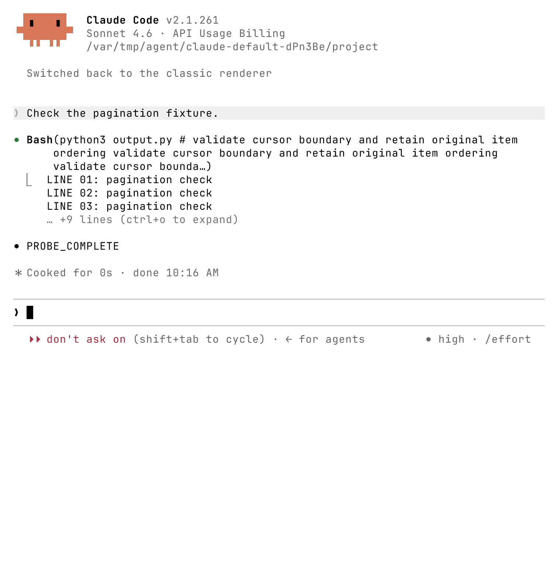

[Text](long-timeout-80/compact.txt) · [Raw ANSI gzip](long-timeout-80/compact.ansi.gz)

### expanded

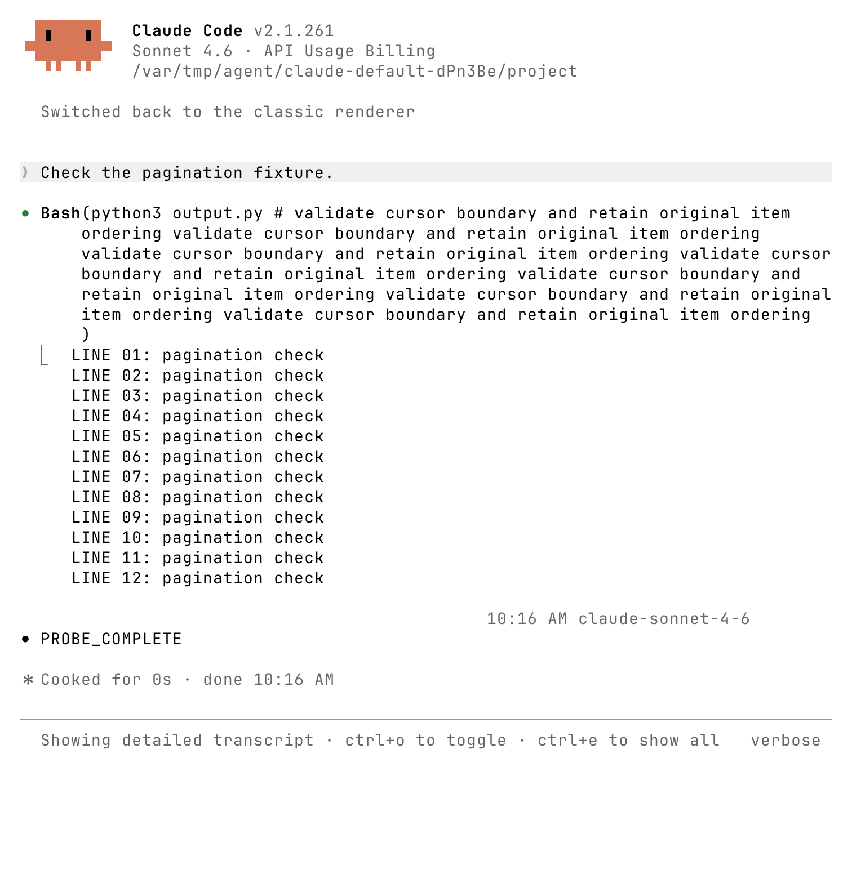

[Text](long-timeout-80/expanded.txt) · [Raw ANSI gzip](long-timeout-80/expanded.ansi.gz)

### mode

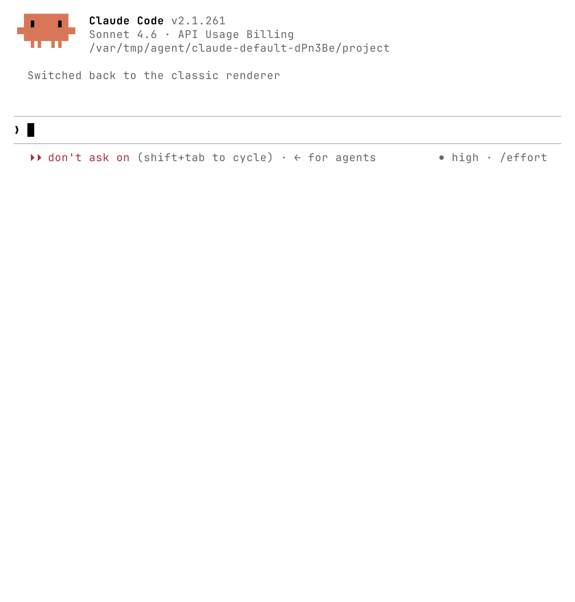

[Text](long-timeout-80/mode.txt) · [Raw ANSI gzip](long-timeout-80/mode.ansi.gz)

### restored

[Text](long-timeout-80/restored.txt) · [Raw ANSI gzip](long-timeout-80/restored.ansi.gz)

### startup

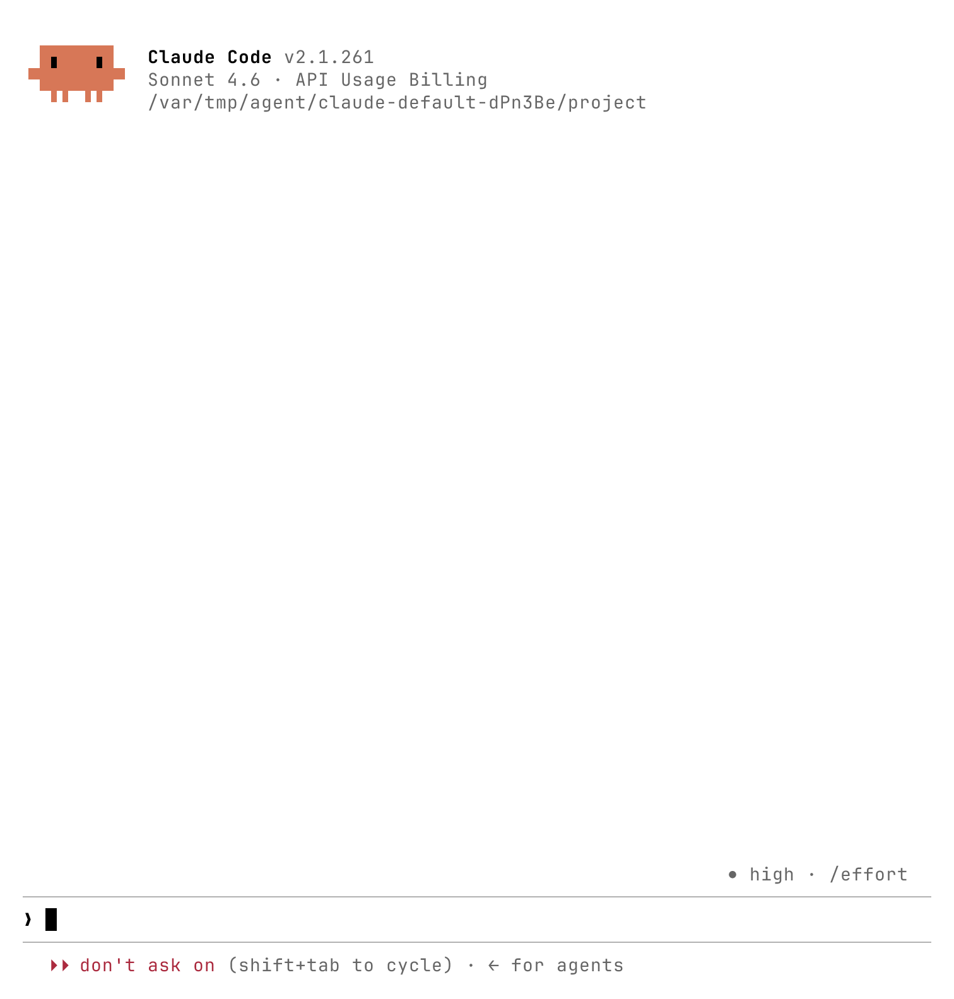

[Text](long-timeout-80/startup.txt) · [Raw ANSI gzip](long-timeout-80/startup.ansi.gz)

## mixed-120

[Inputs](mixed-120/case.json) · [Tool exchanges](mixed-120/exchanges.json)

### compact

[Text](mixed-120/compact.txt) · [Raw ANSI gzip](mixed-120/compact.ansi.gz)

### expanded

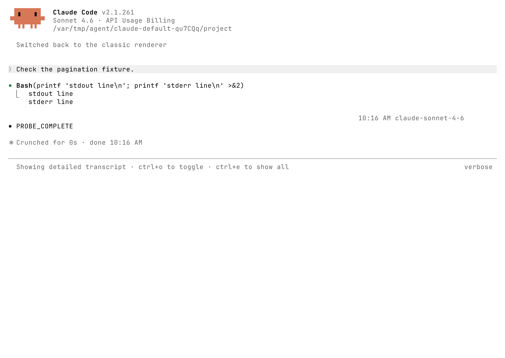

[Text](mixed-120/expanded.txt) · [Raw ANSI gzip](mixed-120/expanded.ansi.gz)

### mode

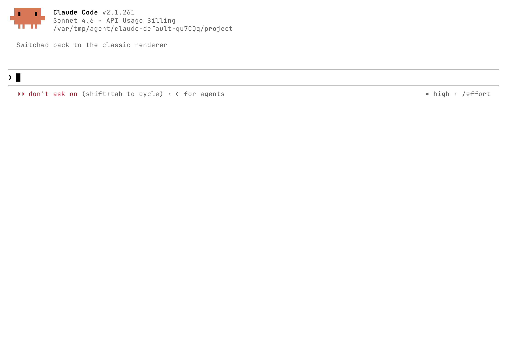

[Text](mixed-120/mode.txt) · [Raw ANSI gzip](mixed-120/mode.ansi.gz)

### restored

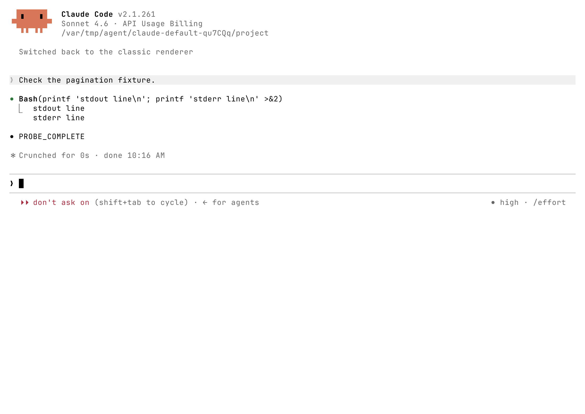

[Text](mixed-120/restored.txt) · [Raw ANSI gzip](mixed-120/restored.ansi.gz)

### startup

[Text](mixed-120/startup.txt) · [Raw ANSI gzip](mixed-120/startup.ansi.gz)

## retrieval-120

[Inputs](retrieval-120/case.json) · [Tool exchanges](retrieval-120/exchanges.json)

### compact

[Text](retrieval-120/compact.txt) · [Raw ANSI gzip](retrieval-120/compact.ansi.gz)

### expanded

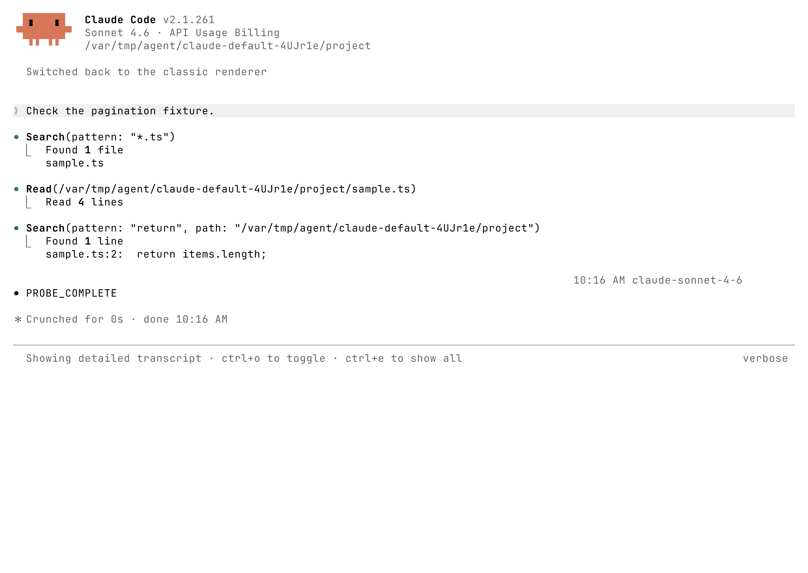

[Text](retrieval-120/expanded.txt) · [Raw ANSI gzip](retrieval-120/expanded.ansi.gz)

### mode

[Text](retrieval-120/mode.txt) · [Raw ANSI gzip](retrieval-120/mode.ansi.gz)

### restored

[Text](retrieval-120/restored.txt) · [Raw ANSI gzip](retrieval-120/restored.ansi.gz)

### startup

[Text](retrieval-120/startup.txt) · [Raw ANSI gzip](retrieval-120/startup.ansi.gz)

## running-120

[Inputs](running-120/case.json) · [Tool exchanges](running-120/exchanges.json)

### compact

[Text](running-120/compact.txt) · [Raw ANSI gzip](running-120/compact.ansi.gz)

### expanded

[Text](running-120/expanded.txt) · [Raw ANSI gzip](running-120/expanded.ansi.gz)

### mode

[Text](running-120/mode.txt) · [Raw ANSI gzip](running-120/mode.ansi.gz)

### restored

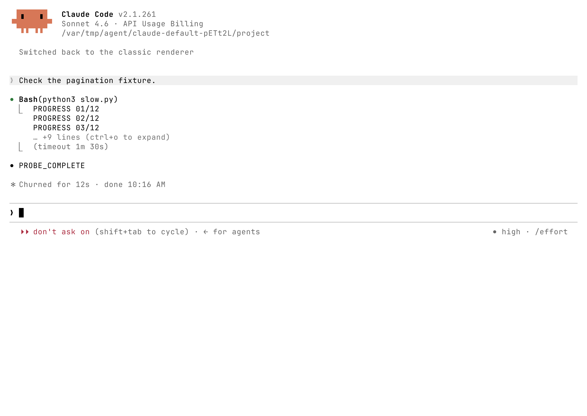

[Text](running-120/restored.txt) · [Raw ANSI gzip](running-120/restored.ansi.gz)

### running-late

[Text](running-120/running-late.txt) · [Raw ANSI gzip](running-120/running-late.ansi.gz)

### running

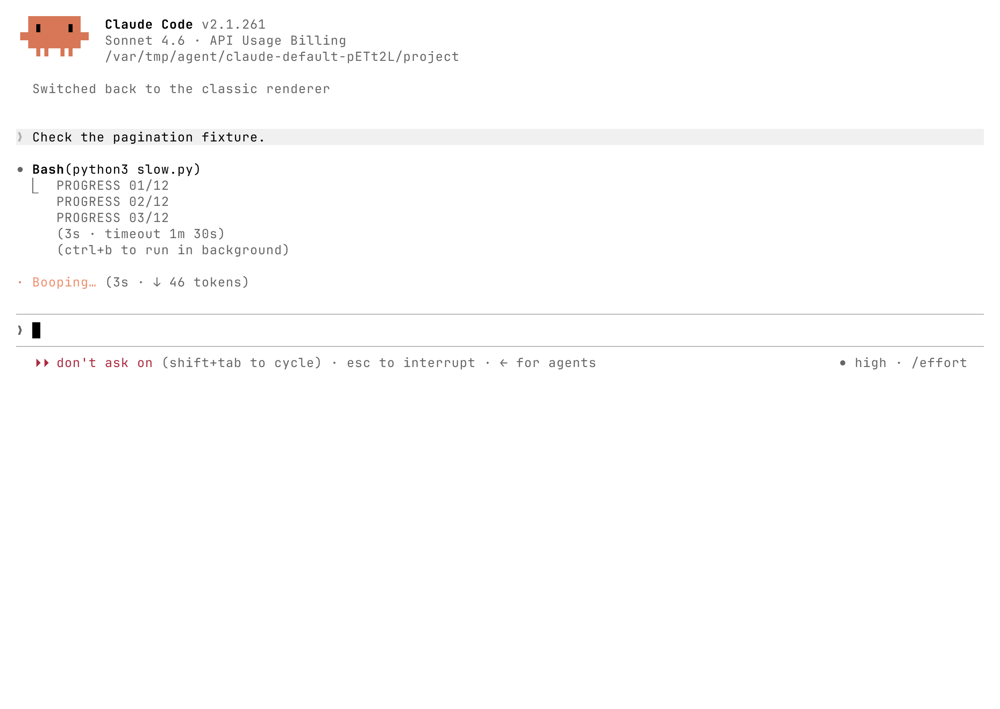

[Text](running-120/running.txt) · [Raw ANSI gzip](running-120/running.ansi.gz)

### startup

[Text](running-120/startup.txt) · [Raw ANSI gzip](running-120/startup.ansi.gz)

## short-120

[Inputs](short-120/case.json) · [Tool exchanges](short-120/exchanges.json)

### compact

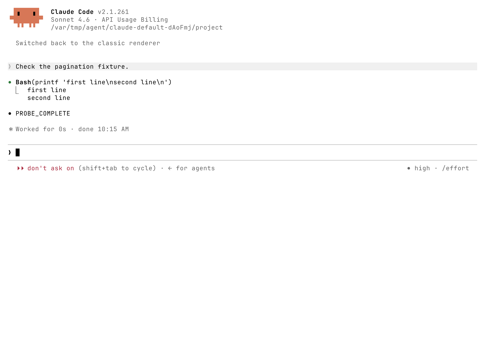

[Text](short-120/compact.txt) · [Raw ANSI gzip](short-120/compact.ansi.gz)

### expanded

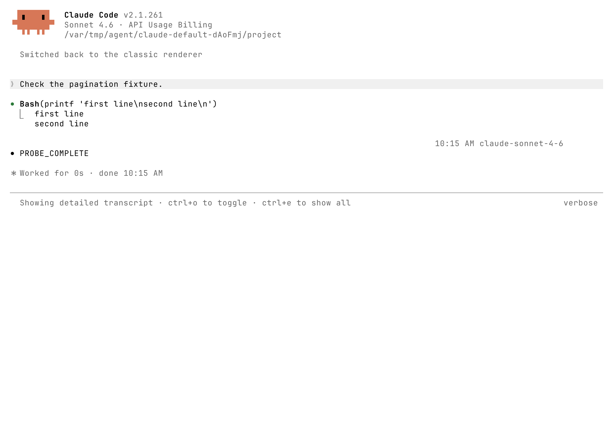

[Text](short-120/expanded.txt) · [Raw ANSI gzip](short-120/expanded.ansi.gz)

### mode

[Text](short-120/mode.txt) · [Raw ANSI gzip](short-120/mode.ansi.gz)

### restored

[Text](short-120/restored.txt) · [Raw ANSI gzip](short-120/restored.ansi.gz)

### startup

[Text](short-120/startup.txt) · [Raw ANSI gzip](short-120/startup.ansi.gz)

## slow-default-120

[Inputs](slow-default-120/case.json) · [Tool exchanges](slow-default-120/exchanges.json)

### compact

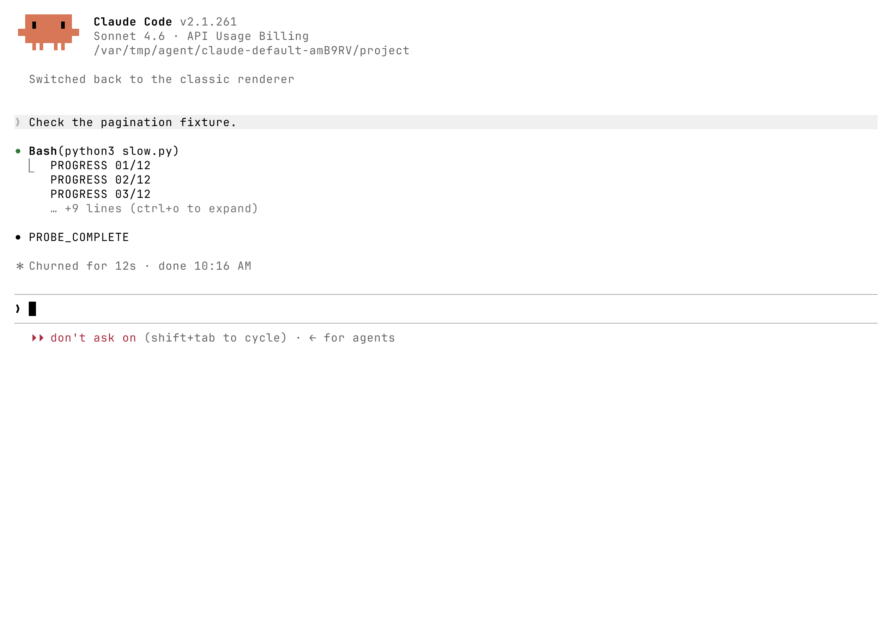

[Text](slow-default-120/compact.txt) · [Raw ANSI gzip](slow-default-120/compact.ansi.gz)

### expanded

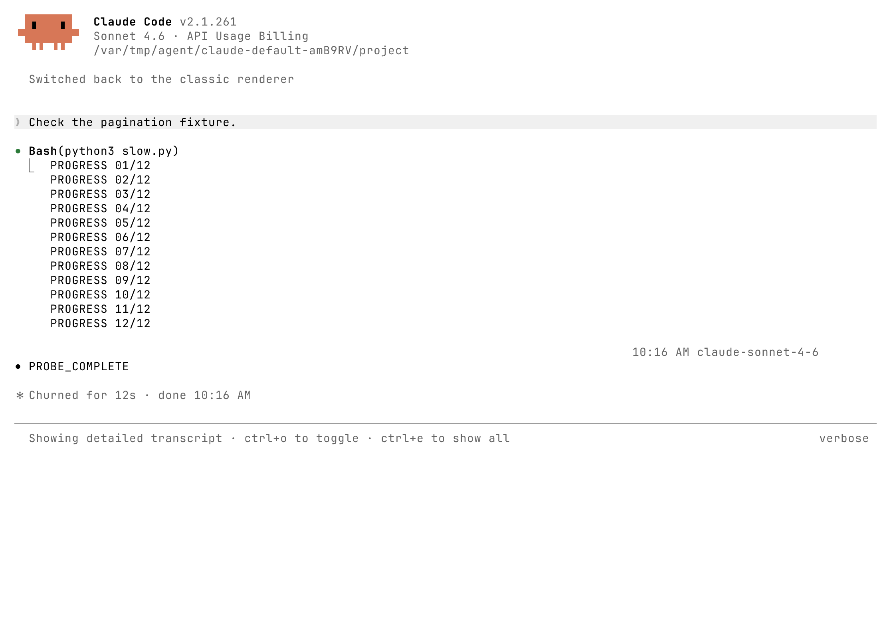

[Text](slow-default-120/expanded.txt) · [Raw ANSI gzip](slow-default-120/expanded.ansi.gz)

### mode

[Text](slow-default-120/mode.txt) · [Raw ANSI gzip](slow-default-120/mode.ansi.gz)

### restored

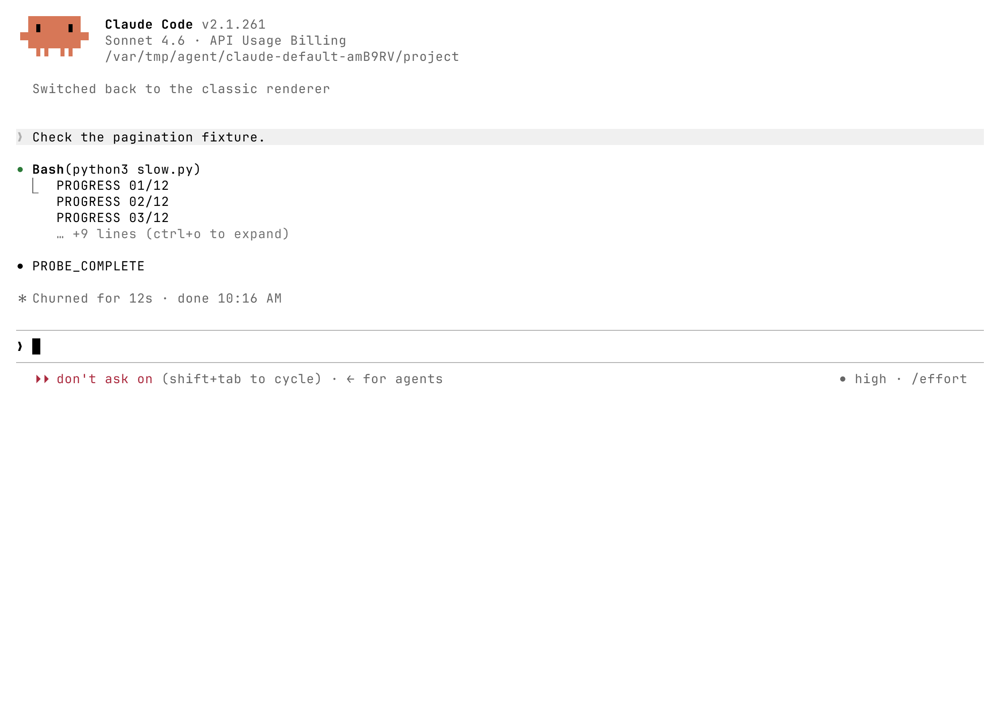

[Text](slow-default-120/restored.txt) · [Raw ANSI gzip](slow-default-120/restored.ansi.gz)

### running-late

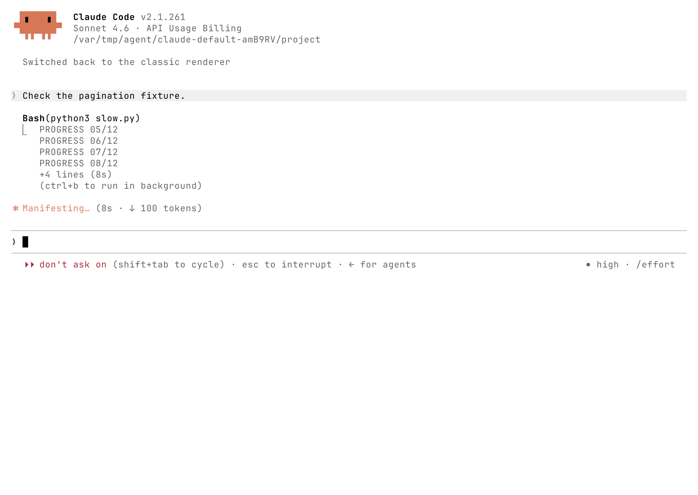

[Text](slow-default-120/running-late.txt) · [Raw ANSI gzip](slow-default-120/running-late.ansi.gz)

### running

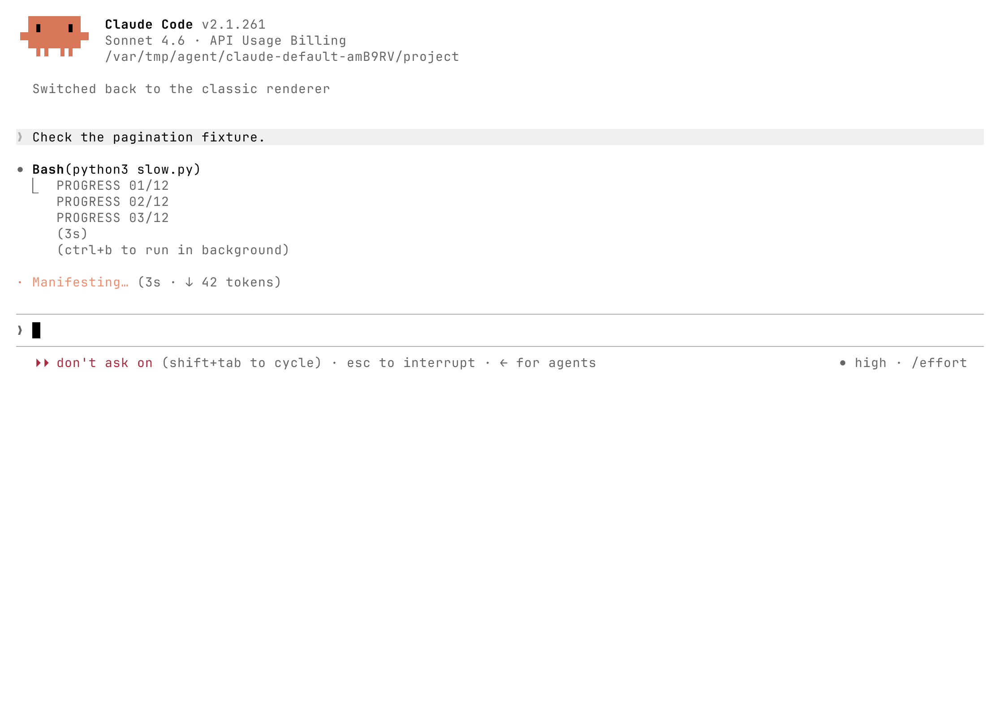

[Text](slow-default-120/running.txt) · [Raw ANSI gzip](slow-default-120/running.ansi.gz)

### startup

[Text](slow-default-120/startup.txt) · [Raw ANSI gzip](slow-default-120/startup.ansi.gz)

## timeout-120

[Inputs](timeout-120/case.json) · [Tool exchanges](timeout-120/exchanges.json)

### compact

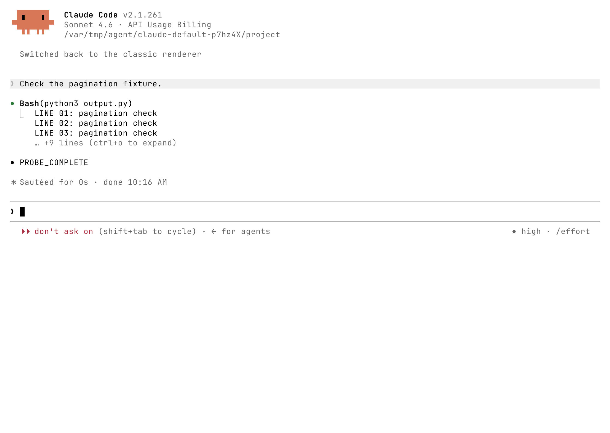

[Text](timeout-120/compact.txt) · [Raw ANSI gzip](timeout-120/compact.ansi.gz)

### expanded

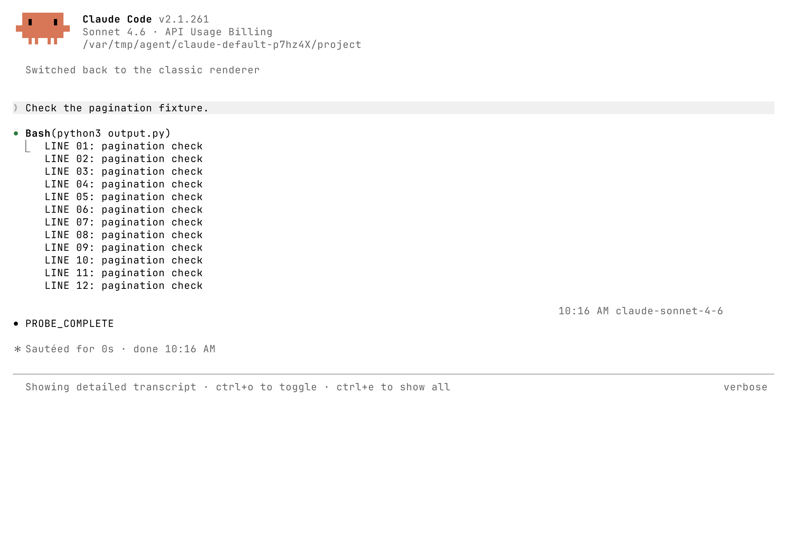

[Text](timeout-120/expanded.txt) · [Raw ANSI gzip](timeout-120/expanded.ansi.gz)

### mode

[Text](timeout-120/mode.txt) · [Raw ANSI gzip](timeout-120/mode.ansi.gz)

### restored

[Text](timeout-120/restored.txt) · [Raw ANSI gzip](timeout-120/restored.ansi.gz)

### startup

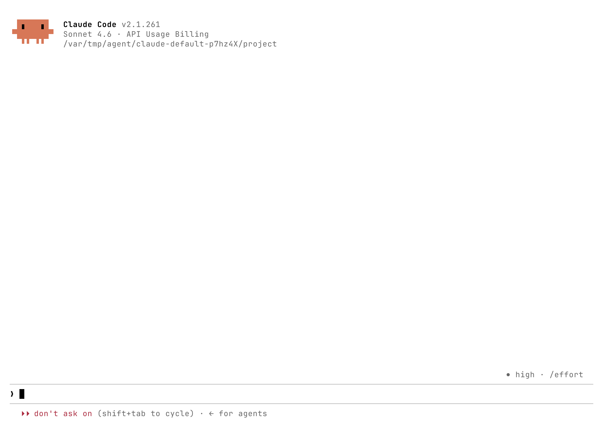

[Text](timeout-120/startup.txt) · [Raw ANSI gzip](timeout-120/startup.ansi.gz)

## timeout-error-120

[Inputs](timeout-error-120/case.json) · [Tool exchanges](timeout-error-120/exchanges.json)

### compact

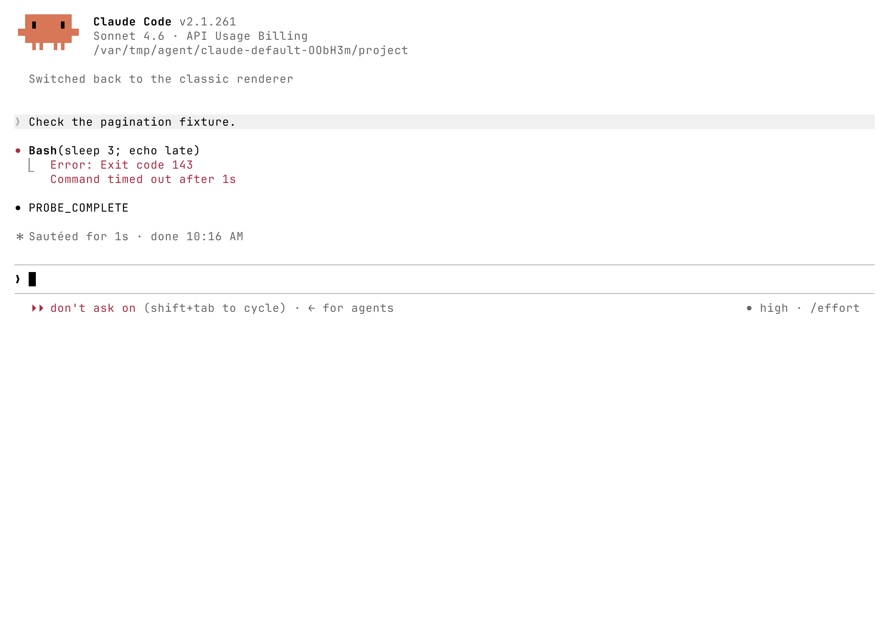

[Text](timeout-error-120/compact.txt) · [Raw ANSI gzip](timeout-error-120/compact.ansi.gz)

### expanded

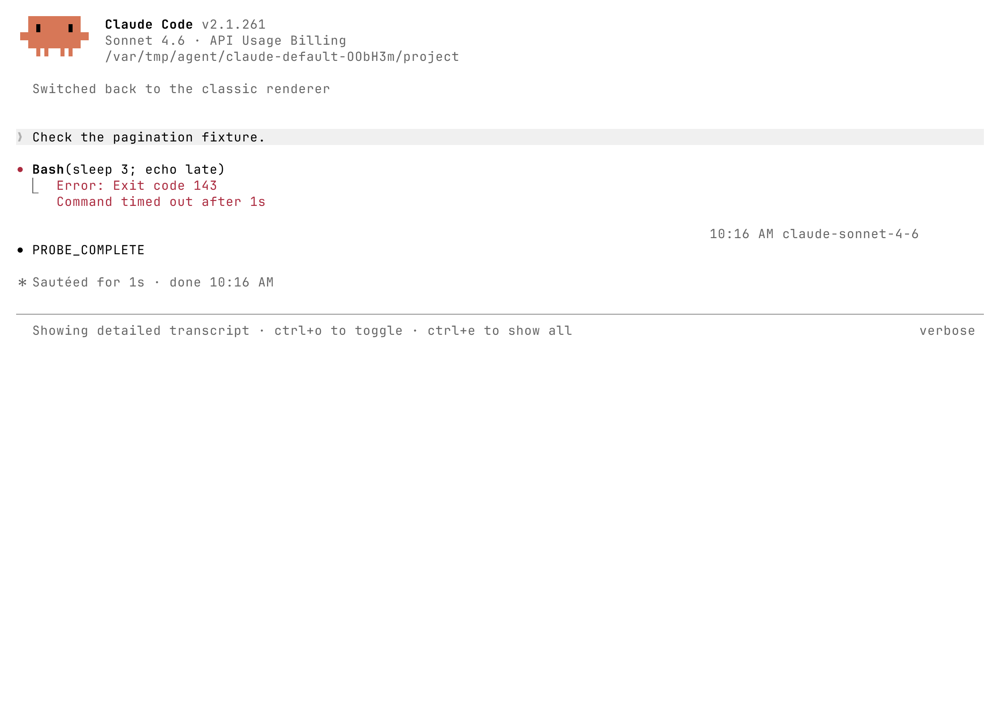

[Text](timeout-error-120/expanded.txt) · [Raw ANSI gzip](timeout-error-120/expanded.ansi.gz)

### mode

[Text](timeout-error-120/mode.txt) · [Raw ANSI gzip](timeout-error-120/mode.ansi.gz)

### restored

[Text](timeout-error-120/restored.txt) · [Raw ANSI gzip](timeout-error-120/restored.ansi.gz)

### startup

[Text](timeout-error-120/startup.txt) · [Raw ANSI gzip](timeout-error-120/startup.ansi.gz)

## write-120

[Inputs](write-120/case.json) · [Tool exchanges](write-120/exchanges.json)

### compact

[Text](write-120/compact.txt) · [Raw ANSI gzip](write-120/compact.ansi.gz)

### expanded

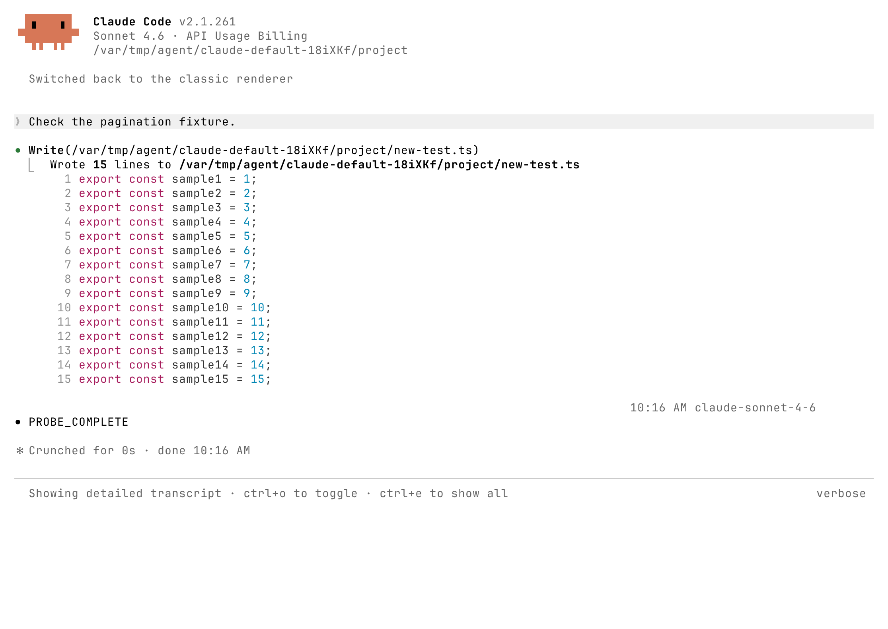

[Text](write-120/expanded.txt) · [Raw ANSI gzip](write-120/expanded.ansi.gz)

### mode

[Text](write-120/mode.txt) · [Raw ANSI gzip](write-120/mode.ansi.gz)

### restored

[Text](write-120/restored.txt) · [Raw ANSI gzip](write-120/restored.ansi.gz)

### startup

[Text](write-120/startup.txt) · [Raw ANSI gzip](write-120/startup.ansi.gz)
