# Native Pi output reference / 原生输出参考

[Prototype / 原型入口](../README.md)

This appendix contains three kinds of evidence: native Pi components supplied with fixed data, reconstructed host-only text composition, and historical diff candidates. Each image identifies its source below. These are not live-provider captures or additional UI requirements. Conditional announcements and optional extension surfaces are inventory only.

此附录包含三类证据: 固定数据下的 Pi 原生组件、重建的宿主文本组合、历史 diff 候选. 每图下方标明来源, 不代表真实提供方执行或新增 UI 需求. 条件公告及可选扩展界面仅属于盘点范围.

## catalog-assistant-aborted-catppuccin-latte-120x40-main

Source / 来源: Pi 0.85.1 AssistantMessageComponent / Pi 0.85.1 AssistantMessageComponent

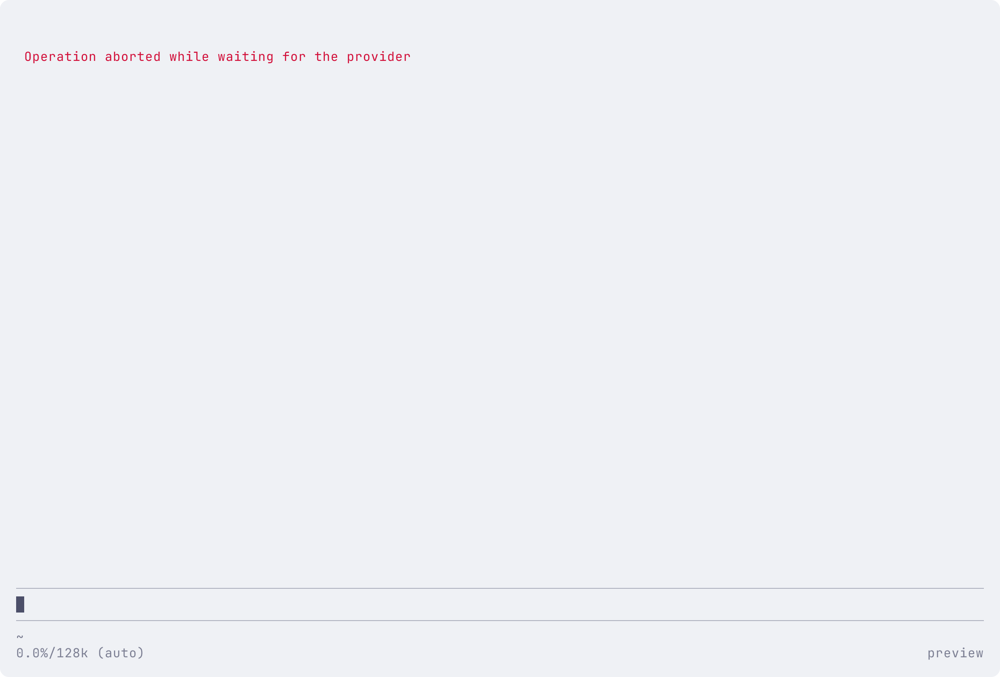

[Text](catalog-assistant-aborted-catppuccin-latte-120x40-main.txt) · [ANSI](catalog-assistant-aborted-catppuccin-latte-120x40-main.ansi)

## catalog-assistant-error-catppuccin-latte-120x40-main

Source / 来源: Pi 0.85.1 AssistantMessageComponent / Pi 0.85.1 AssistantMessageComponent

[Text](catalog-assistant-error-catppuccin-latte-120x40-main.txt) · [ANSI](catalog-assistant-error-catppuccin-latte-120x40-main.ansi)

## catalog-assistant-markdown-catppuccin-latte-120x40-main

Source / 来源: Pi 0.85.1 AssistantMessageComponent / Pi 0.85.1 AssistantMessageComponent

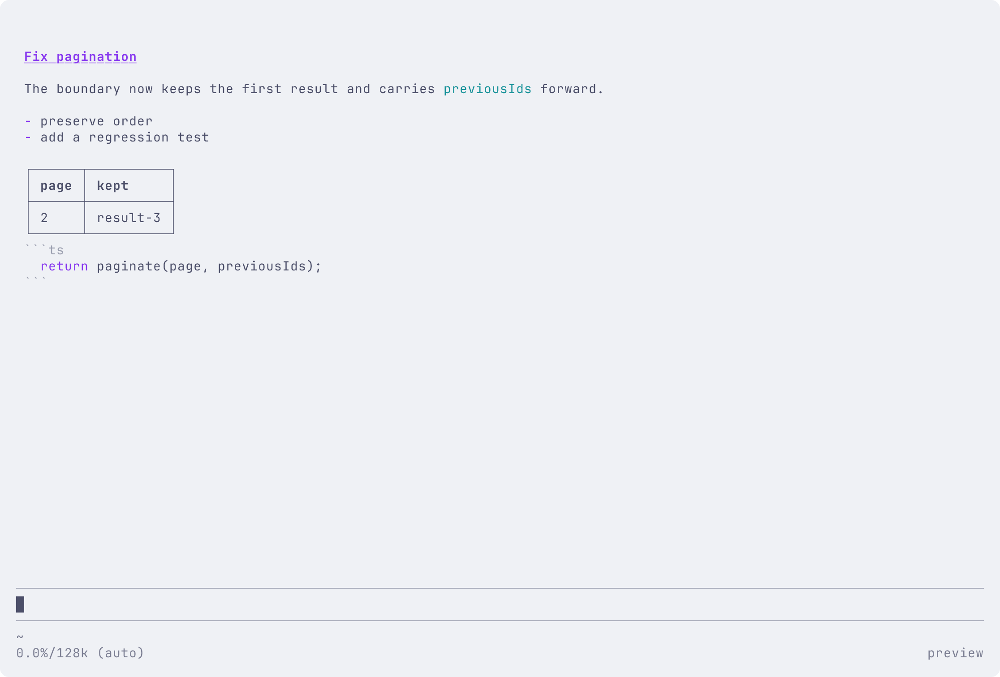

[Text](catalog-assistant-markdown-catppuccin-latte-120x40-main.txt) · [ANSI](catalog-assistant-markdown-catppuccin-latte-120x40-main.ansi)

## catalog-assistant-thinking-collapsed-catppuccin-latte-120x40-main

Source / 来源: Pi 0.85.1 AssistantMessageComponent / Pi 0.85.1 AssistantMessageComponent

[Text](catalog-assistant-thinking-collapsed-catppuccin-latte-120x40-main.txt) · [ANSI](catalog-assistant-thinking-collapsed-catppuccin-latte-120x40-main.ansi)

## catalog-assistant-thinking-expanded-catppuccin-latte-120x40-main

Source / 来源: Pi 0.85.1 AssistantMessageComponent / Pi 0.85.1 AssistantMessageComponent

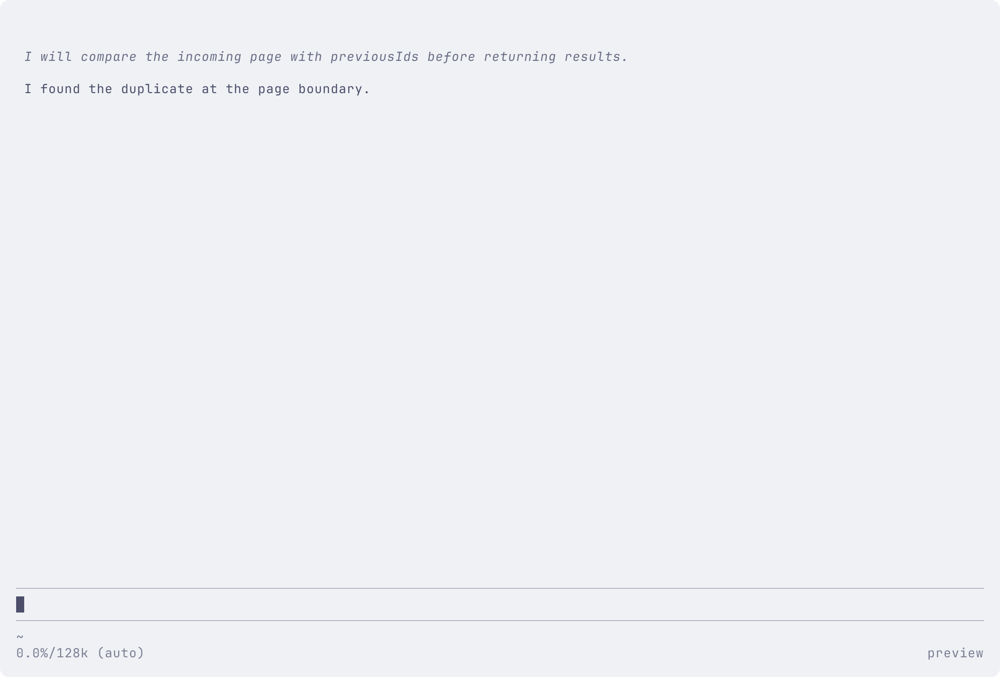

[Text](catalog-assistant-thinking-expanded-catppuccin-latte-120x40-main.txt) · [ANSI](catalog-assistant-thinking-expanded-catppuccin-latte-120x40-main.ansi)

## catalog-assistant-truncated-catppuccin-latte-120x40-main

Source / 来源: Pi 0.85.1 AssistantMessageComponent / Pi 0.85.1 AssistantMessageComponent

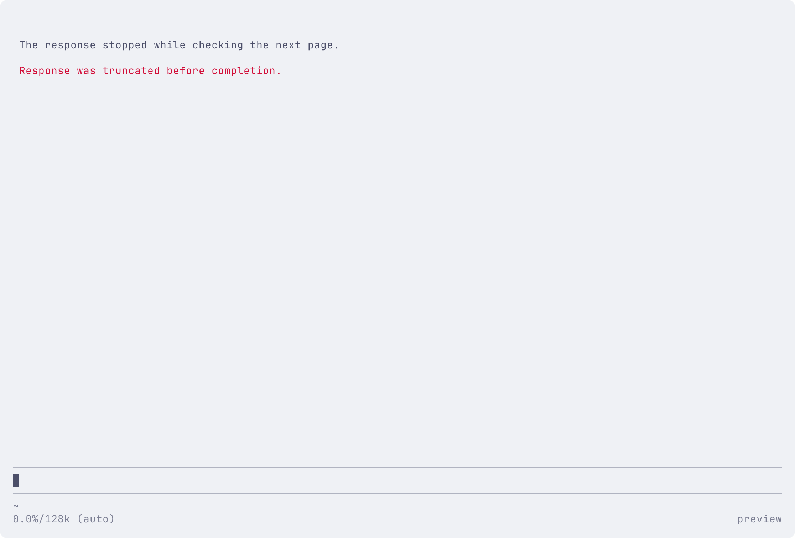

[Text](catalog-assistant-truncated-catppuccin-latte-120x40-main.txt) · [ANSI](catalog-assistant-truncated-catppuccin-latte-120x40-main.ansi)

## catalog-branch-collapsed-catppuccin-latte-120x40-main

Source / 来源: Pi 0.85.1 BranchSummaryMessageComponent / Pi 0.85.1 BranchSummaryMessageComponent

[Text](catalog-branch-collapsed-catppuccin-latte-120x40-main.txt) · [ANSI](catalog-branch-collapsed-catppuccin-latte-120x40-main.ansi)

## catalog-branch-expanded-catppuccin-latte-120x40-main

Source / 来源: Pi 0.85.1 BranchSummaryMessageComponent / Pi 0.85.1 BranchSummaryMessageComponent

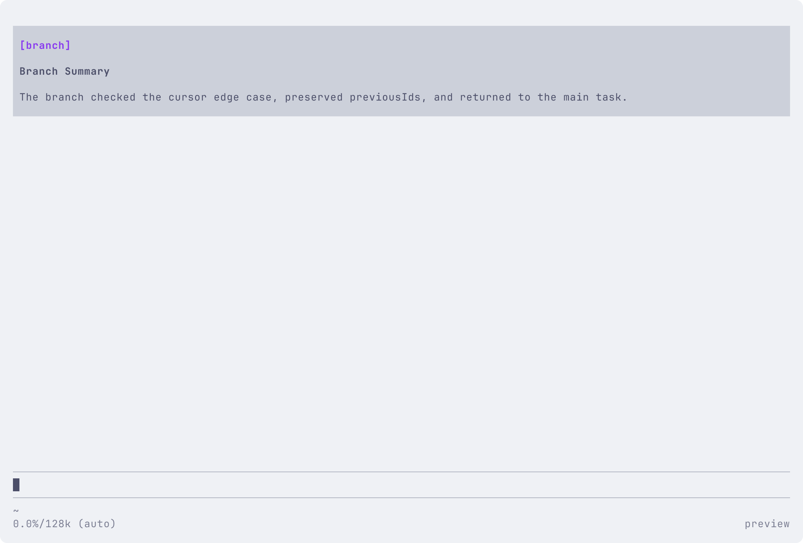

[Text](catalog-branch-expanded-catppuccin-latte-120x40-main.txt) · [ANSI](catalog-branch-expanded-catppuccin-latte-120x40-main.ansi)

## catalog-compaction-collapsed-catppuccin-latte-120x40-main

Source / 来源: Pi 0.85.1 CompactionSummaryMessageComponent / Pi 0.85.1 CompactionSummaryMessageComponent

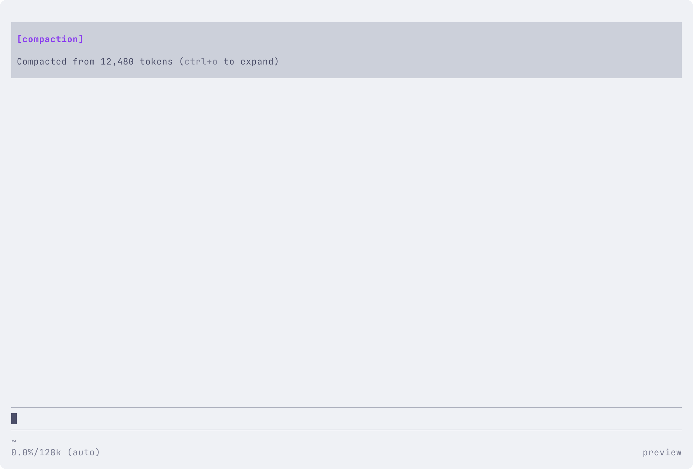

[Text](catalog-compaction-collapsed-catppuccin-latte-120x40-main.txt) · [ANSI](catalog-compaction-collapsed-catppuccin-latte-120x40-main.ansi)

## catalog-compaction-expanded-catppuccin-latte-120x40-main

Source / 来源: Pi 0.85.1 CompactionSummaryMessageComponent / Pi 0.85.1 CompactionSummaryMessageComponent

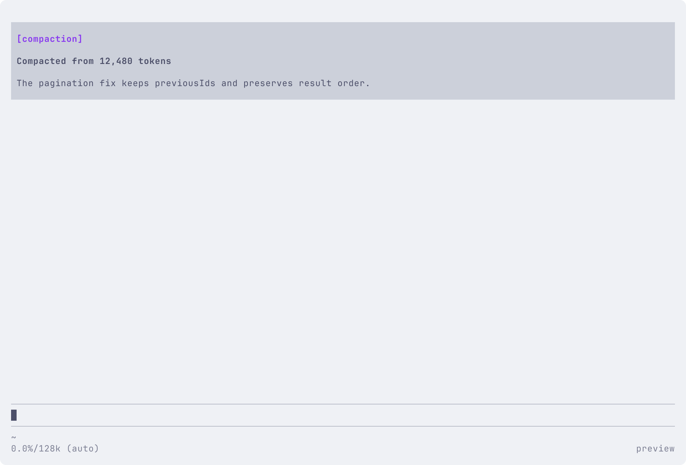

[Text](catalog-compaction-expanded-catppuccin-latte-120x40-main.txt) · [ANSI](catalog-compaction-expanded-catppuccin-latte-120x40-main.ansi)

## catalog-custom-message-fallback-catppuccin-latte-120x40-main

Source / 来源: Pi 0.85.1 CustomMessageComponent default renderer / Pi 0.85.1 CustomMessageComponent default renderer

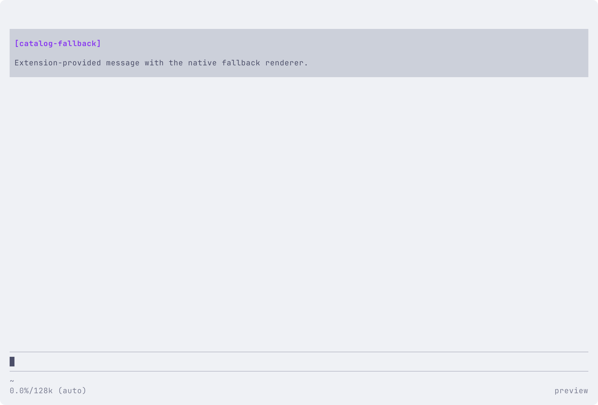

[Text](catalog-custom-message-fallback-catppuccin-latte-120x40-main.txt) · [ANSI](catalog-custom-message-fallback-catppuccin-latte-120x40-main.ansi)

## catalog-extension-error-catppuccin-latte-120x40-main

Source / 来源: Pi 0.85.1 ExtensionRunner onError + InteractiveMode.showExtensionError / Pi 0.85.1 ExtensionRunner onError + InteractiveMode.showExtensionError

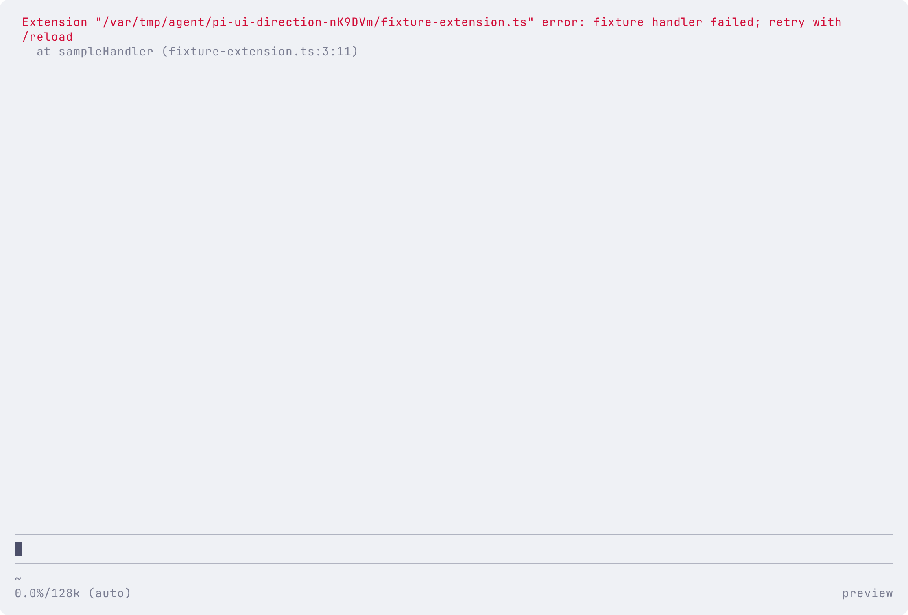

[Text](catalog-extension-error-catppuccin-latte-120x40-main.txt) · [ANSI](catalog-extension-error-catppuccin-latte-120x40-main.ansi)

## catalog-host-activity-catppuccin-latte-120x40-main

Source / 来源: Pi StatusIndicator uses Loader; frozen Loader samples, not transcript placement / Pi StatusIndicator uses Loader; frozen Loader samples, not transcript placement

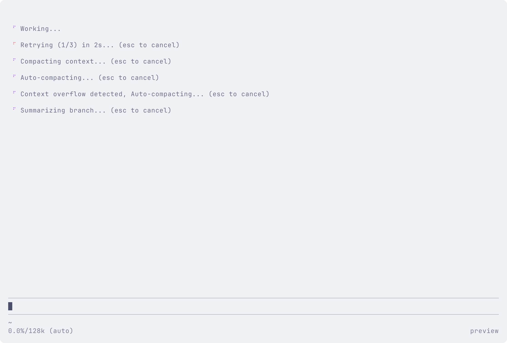

[Text](catalog-host-activity-catppuccin-latte-120x40-main.txt) · [ANSI](catalog-host-activity-catppuccin-latte-120x40-main.ansi)

## catalog-host-armin-catppuccin-latte-120x40-main

Source / 来源: Pi /arminsayshi command, actual host component / Pi /arminsayshi command, actual host component

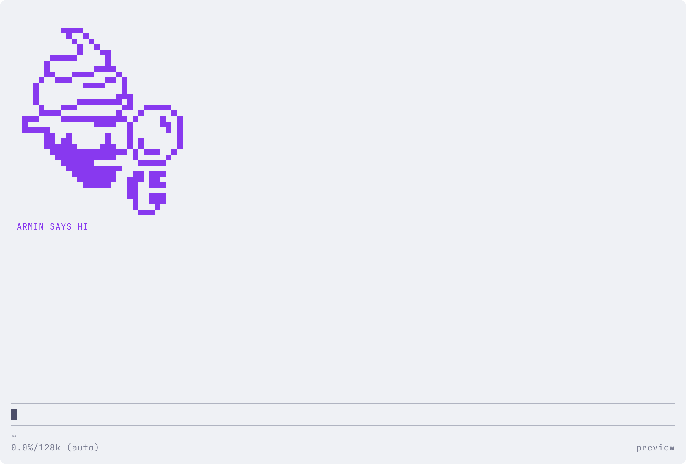

[Text](catalog-host-armin-catppuccin-latte-120x40-main.txt) · [ANSI](catalog-host-armin-catppuccin-latte-120x40-main.ansi)

## catalog-host-command-info-catppuccin-latte-120x40-main

Source / 来源: Pi handleSessionCommand Text composition, reconstructed fixture / Pi handleSessionCommand Text composition, reconstructed fixture

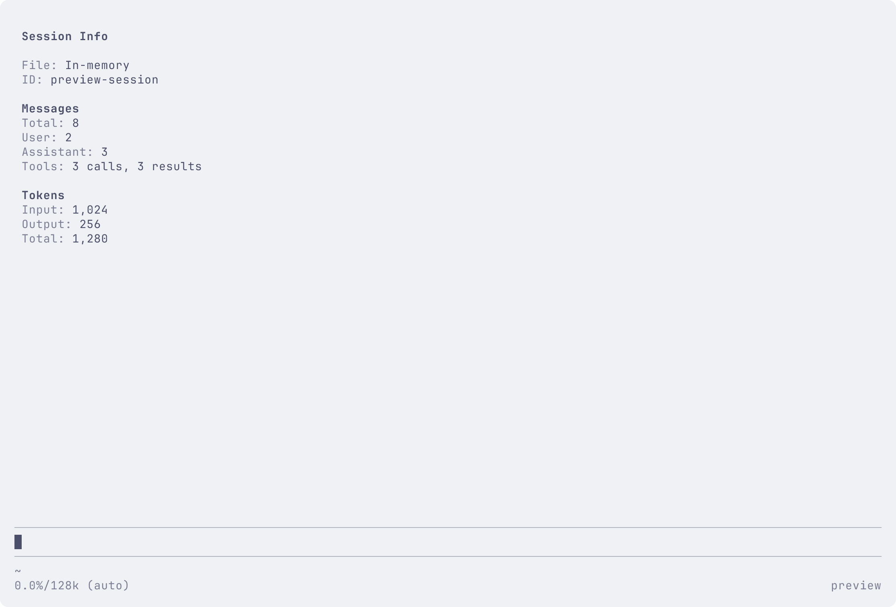

[Text](catalog-host-command-info-catppuccin-latte-120x40-main.txt) · [ANSI](catalog-host-command-info-catppuccin-latte-120x40-main.ansi)

## catalog-host-command-markdown-catppuccin-latte-120x40-main

Source / 来源: Pi handleChangelogCommand / handleHotkeysCommand composition, reconstructed fixture / Pi handleChangelogCommand / handleHotkeysCommand composition, reconstructed fixture

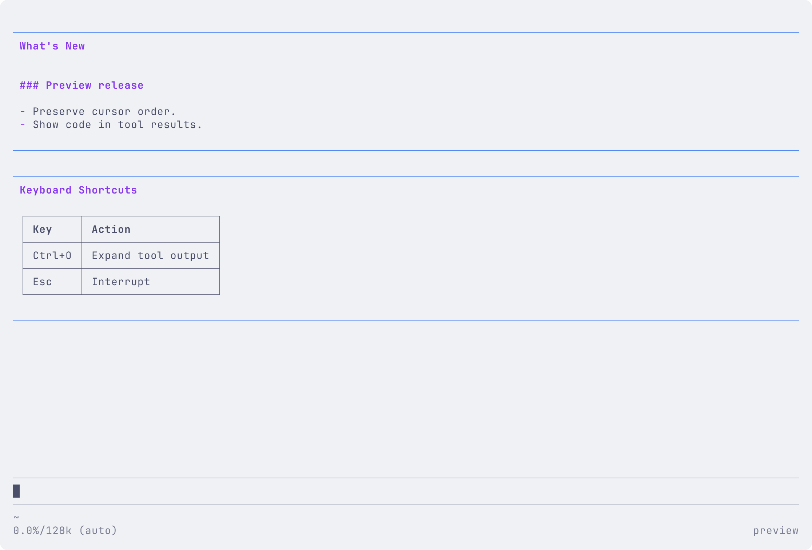

[Text](catalog-host-command-markdown-catppuccin-latte-120x40-main.txt) · [ANSI](catalog-host-command-markdown-catppuccin-latte-120x40-main.ansi)

## catalog-host-custom-entry-catppuccin-latte-120x40-main

Source / 来源: Pi registerEntryRenderer + appendEntry, actual host fallback / Pi registerEntryRenderer + appendEntry, actual host fallback

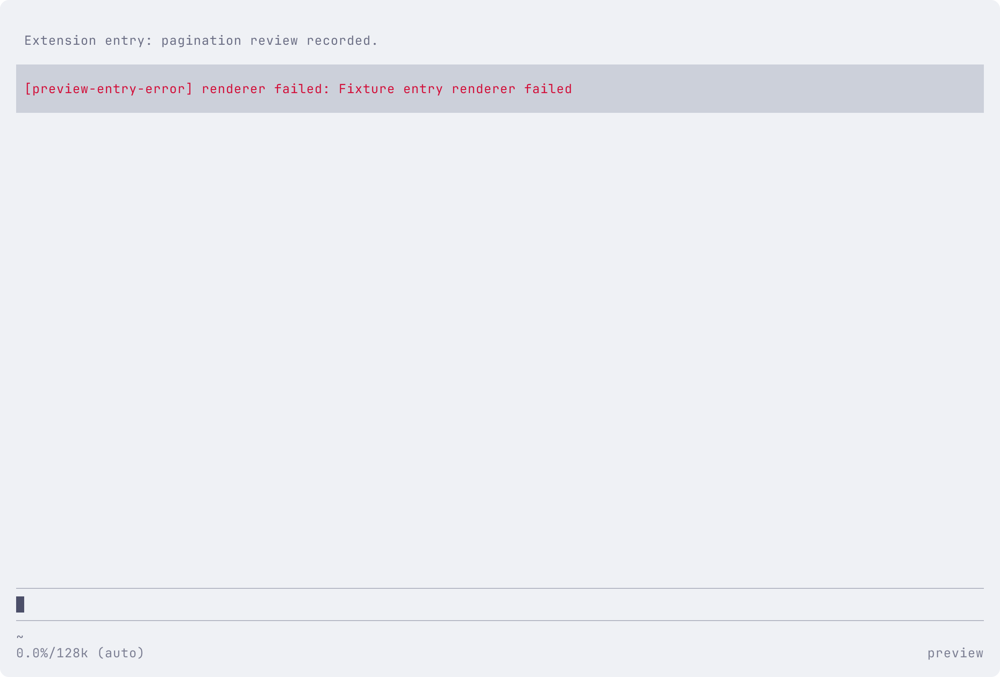

[Text](catalog-host-custom-entry-catppuccin-latte-120x40-main.txt) · [ANSI](catalog-host-custom-entry-catppuccin-latte-120x40-main.ansi)

## catalog-host-daxnuts-catppuccin-latte-120x40-main

Source / 来源: Pi opencode + kimi-k2.5 model selection condition, actual host component / Pi opencode + kimi-k2.5 model selection condition, actual host component

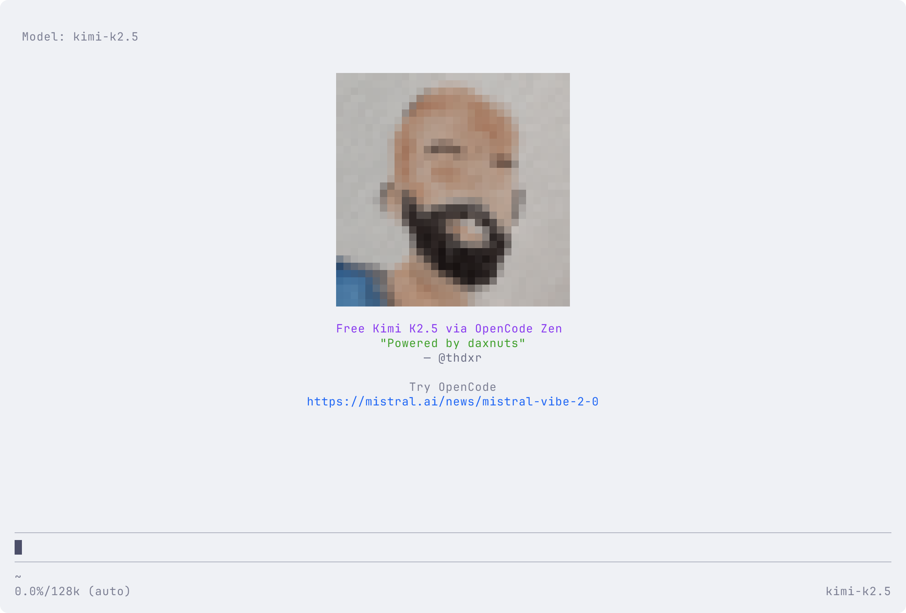

[Text](catalog-host-daxnuts-catppuccin-latte-120x40-main.txt) · [ANSI](catalog-host-daxnuts-catppuccin-latte-120x40-main.ansi)

## catalog-host-earendil-catppuccin-latte-120x40-main

Source / 来源: Pi /dementedelves command, actual host component / Pi /dementedelves command, actual host component

[Text](catalog-host-earendil-catppuccin-latte-120x40-main.txt) · [ANSI](catalog-host-earendil-catppuccin-latte-120x40-main.ansi)

## catalog-host-updates-catppuccin-latte-120x40-main

Source / 来源: Pi showNewVersionNotification / showPackageUpdateNotification composition, reconstructed fixture / Pi showNewVersionNotification / showPackageUpdateNotification composition, reconstructed fixture

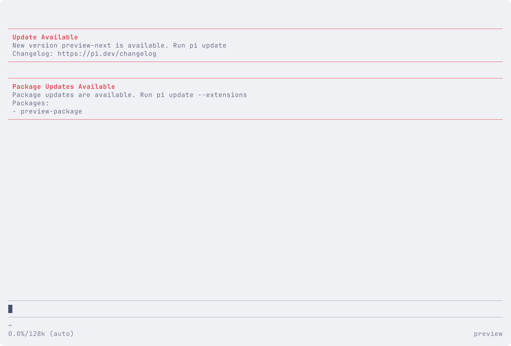

[Text](catalog-host-updates-catppuccin-latte-120x40-main.txt) · [ANSI](catalog-host-updates-catppuccin-latte-120x40-main.ansi)

## catalog-notice-error-catppuccin-latte-120x40-main

Source / 来源: Pi 0.85.1 ctx.ui.notify(error) / Pi 0.85.1 ctx.ui.notify(error)

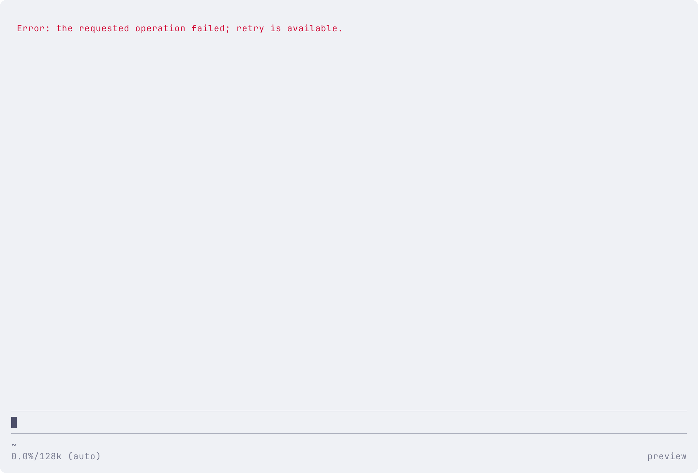

[Text](catalog-notice-error-catppuccin-latte-120x40-main.txt) · [ANSI](catalog-notice-error-catppuccin-latte-120x40-main.ansi)

## catalog-notice-info-catppuccin-latte-120x40-main

Source / 来源: Pi 0.85.1 ctx.ui.notify(info) / Pi 0.85.1 ctx.ui.notify(info)

[Text](catalog-notice-info-catppuccin-latte-120x40-main.txt) · [ANSI](catalog-notice-info-catppuccin-latte-120x40-main.ansi)

## catalog-notice-warning-catppuccin-latte-120x40-main

Source / 来源: Pi 0.85.1 ctx.ui.notify(warning) / Pi 0.85.1 ctx.ui.notify(warning)

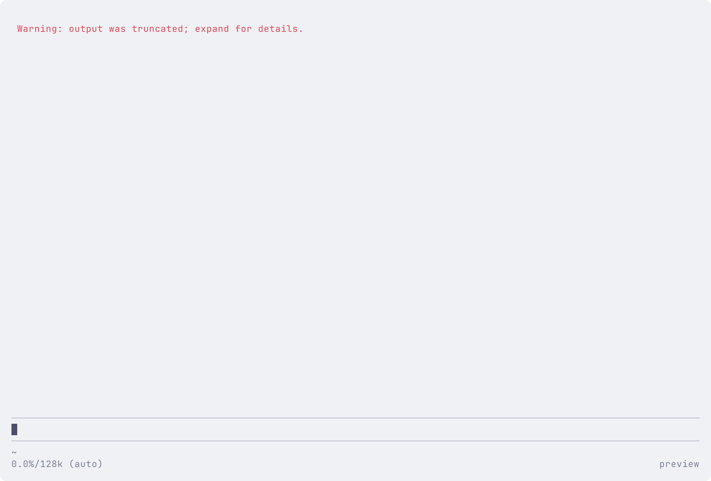

[Text](catalog-notice-warning-catppuccin-latte-120x40-main.txt) · [ANSI](catalog-notice-warning-catppuccin-latte-120x40-main.ansi)

## catalog-rtk-rewrite-failure-catppuccin-latte-120x40-main

Source / 来源: Pi Stuff src/rtk/register.ts failureNotice + Pi 0.85.1 Bash renderer/ctx.ui.notify(error) / Pi Stuff src/rtk/register.ts failureNotice + Pi 0.85.1 Bash renderer/ctx.ui.notify(error)

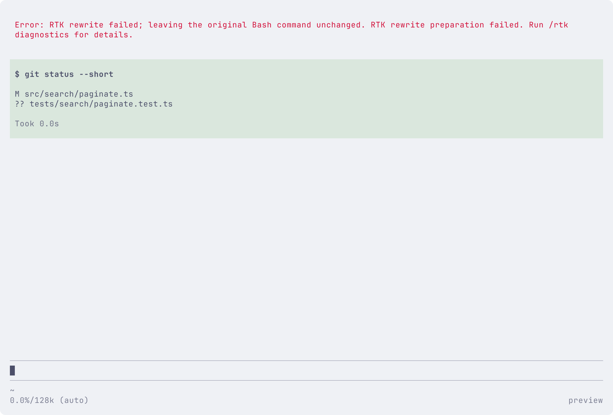

[Text](catalog-rtk-rewrite-failure-catppuccin-latte-120x40-main.txt) · [ANSI](catalog-rtk-rewrite-failure-catppuccin-latte-120x40-main.ansi)

## catalog-rtk-rewrite-success-catppuccin-latte-120x40-main

Source / 来源: Static offline reconstruction of Pi Stuff RTK rewrite + Pi 0.85.1 Bash renderer / Static offline reconstruction of Pi Stuff RTK rewrite + Pi 0.85.1 Bash renderer

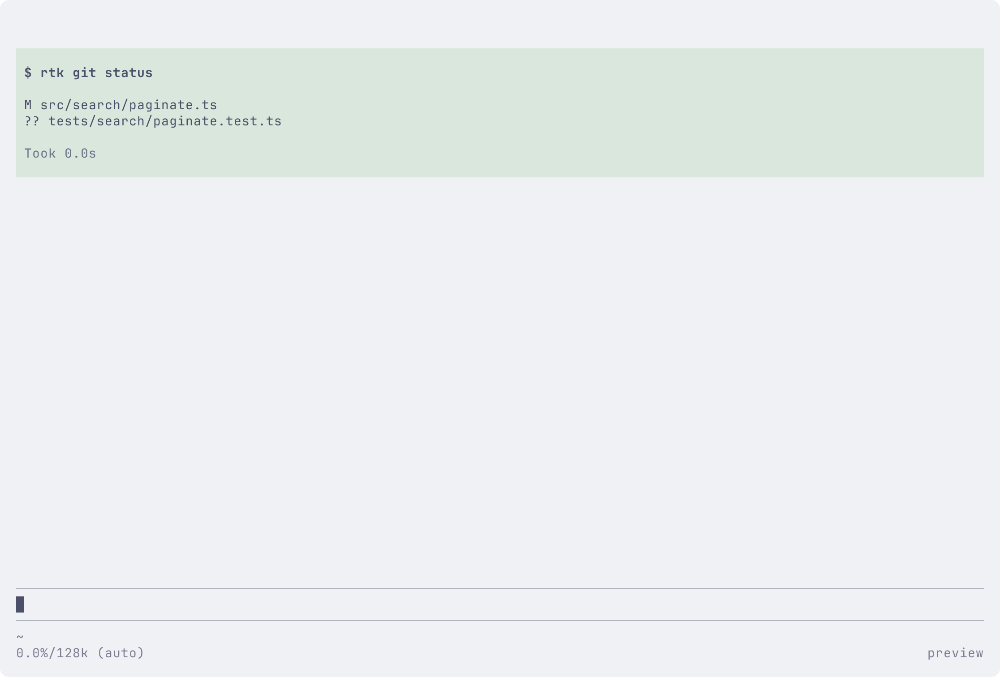

[Text](catalog-rtk-rewrite-success-catppuccin-latte-120x40-main.txt) · [ANSI](catalog-rtk-rewrite-success-catppuccin-latte-120x40-main.ansi)

## catalog-shell-interrupted-catppuccin-latte-120x40-main

Source / 来源: Pi 0.85.1 native renderer; static tool data, Web page data via current Content formatter / Pi 0.85.1 native renderer; static tool data, Web page data via current Content formatter

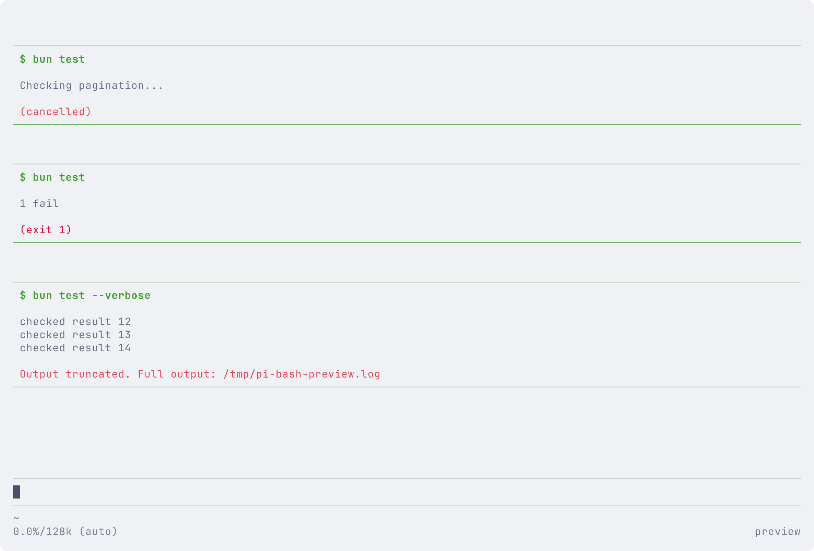

[Text](catalog-shell-interrupted-catppuccin-latte-120x40-main.txt) · [ANSI](catalog-shell-interrupted-catppuccin-latte-120x40-main.ansi)

## catalog-shell-modes-catppuccin-latte-120x40-main

Source / 来源: Pi 0.85.1 BashExecutionComponent / Pi 0.85.1 BashExecutionComponent

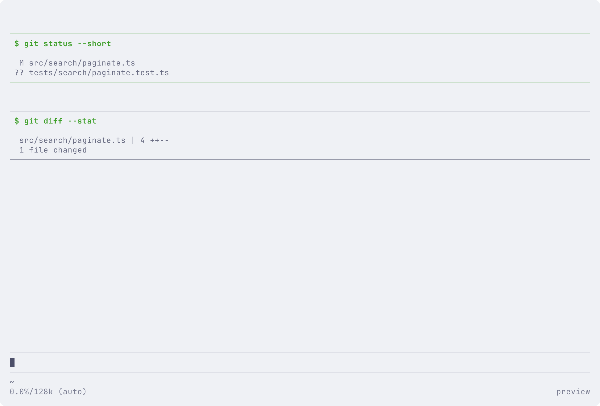

[Text](catalog-shell-modes-catppuccin-latte-120x40-main.txt) · [ANSI](catalog-shell-modes-catppuccin-latte-120x40-main.ansi)

## catalog-skill-collapsed-catppuccin-latte-120x40-main

Source / 来源: Pi 0.85.1 SkillInvocationMessageComponent / Pi 0.85.1 SkillInvocationMessageComponent

[Text](catalog-skill-collapsed-catppuccin-latte-120x40-main.txt) · [ANSI](catalog-skill-collapsed-catppuccin-latte-120x40-main.ansi)

## catalog-skill-expanded-catppuccin-latte-120x40-main

Source / 来源: Pi 0.85.1 SkillInvocationMessageComponent / Pi 0.85.1 SkillInvocationMessageComponent

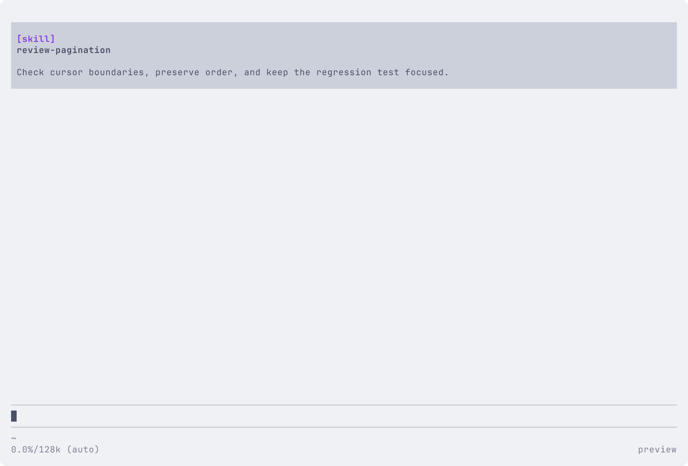

[Text](catalog-skill-expanded-catppuccin-latte-120x40-main.txt) · [ANSI](catalog-skill-expanded-catppuccin-latte-120x40-main.ansi)

## catalog-tool-bash-states-catppuccin-latte-120x40-main

Source / 来源: Pi 0.85.1 createBashToolDefinition + ToolExecutionComponent / Pi 0.85.1 createBashToolDefinition + ToolExecutionComponent

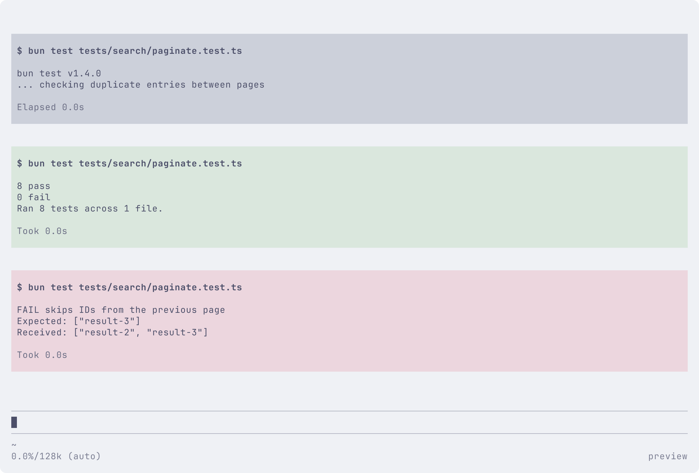

[Text](catalog-tool-bash-states-catppuccin-latte-120x40-main.txt) · [ANSI](catalog-tool-bash-states-catppuccin-latte-120x40-main.ansi)

## catalog-tool-bash-truncated-catppuccin-latte-120x40-main

Source / 来源: Pi 0.85.1 native renderer; static tool data, Web page data via current Content formatter / Pi 0.85.1 native renderer; static tool data, Web page data via current Content formatter

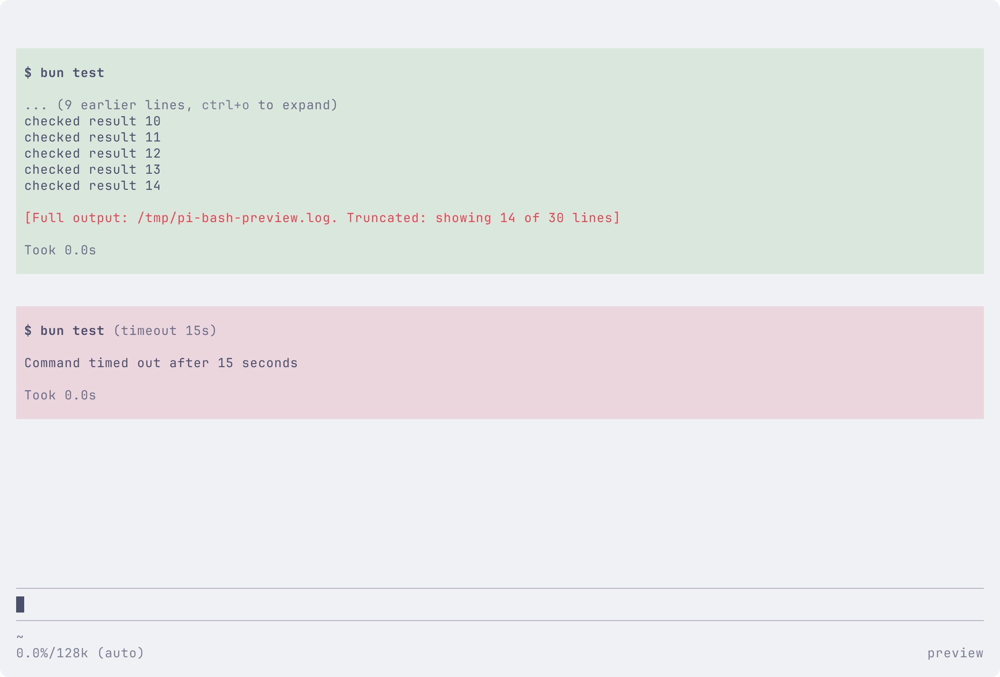

[Text](catalog-tool-bash-truncated-catppuccin-latte-120x40-main.txt) · [ANSI](catalog-tool-bash-truncated-catppuccin-latte-120x40-main.ansi)

## catalog-tool-edit-catppuccin-latte-120x40-main

Source / 来源: Pi 0.85.1 createEditToolDefinition + ToolExecutionComponent / Pi 0.85.1 createEditToolDefinition + ToolExecutionComponent

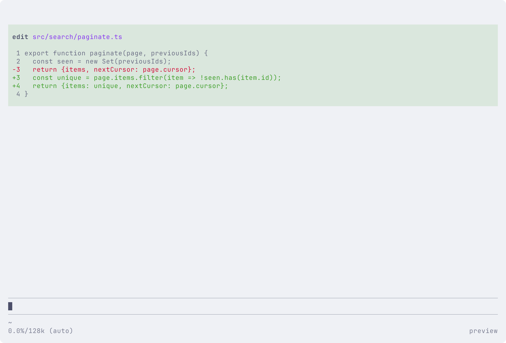

[Text](catalog-tool-edit-catppuccin-latte-120x40-main.txt) · [ANSI](catalog-tool-edit-catppuccin-latte-120x40-main.ansi)

## catalog-tool-empty-errors-catppuccin-latte-120x40-main

Source / 来源: Pi 0.85.1 native renderer; static tool data, Web page data via current Content formatter / Pi 0.85.1 native renderer; static tool data, Web page data via current Content formatter

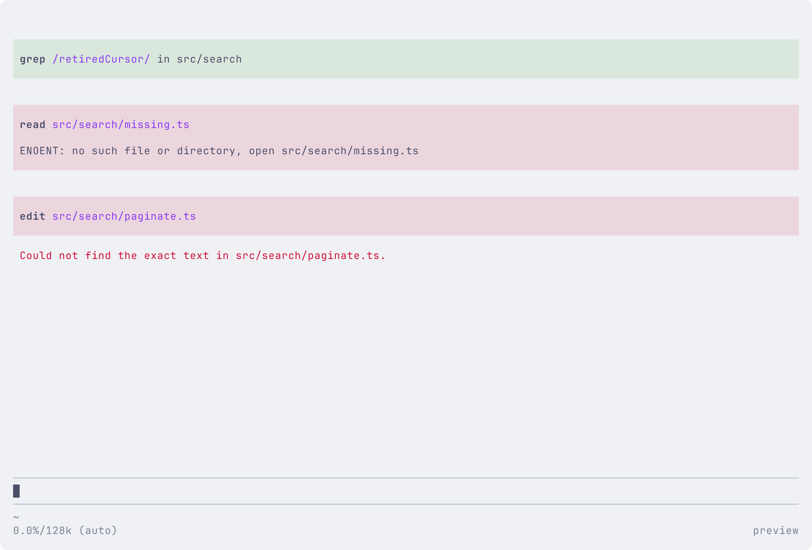

[Text](catalog-tool-empty-errors-catppuccin-latte-120x40-main.txt) · [ANSI](catalog-tool-empty-errors-catppuccin-latte-120x40-main.ansi)

## catalog-tool-find-catppuccin-latte-120x40-main

Source / 来源: Pi 0.85.1 createFindToolDefinition + ToolExecutionComponent / Pi 0.85.1 createFindToolDefinition + ToolExecutionComponent

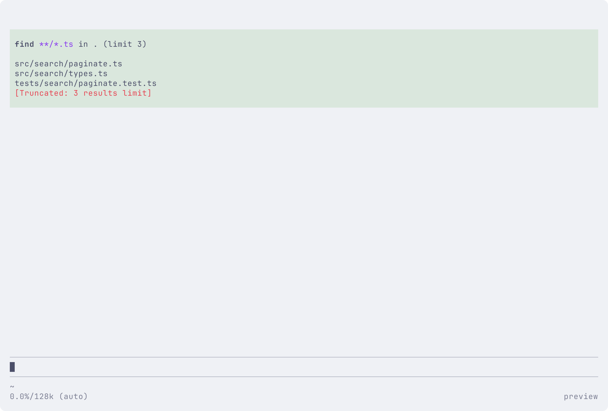

[Text](catalog-tool-find-catppuccin-latte-120x40-main.txt) · [ANSI](catalog-tool-find-catppuccin-latte-120x40-main.ansi)

## catalog-tool-grep-catppuccin-latte-120x40-main

Source / 来源: Pi 0.85.1 createGrepToolDefinition + ToolExecutionComponent / Pi 0.85.1 createGrepToolDefinition + ToolExecutionComponent

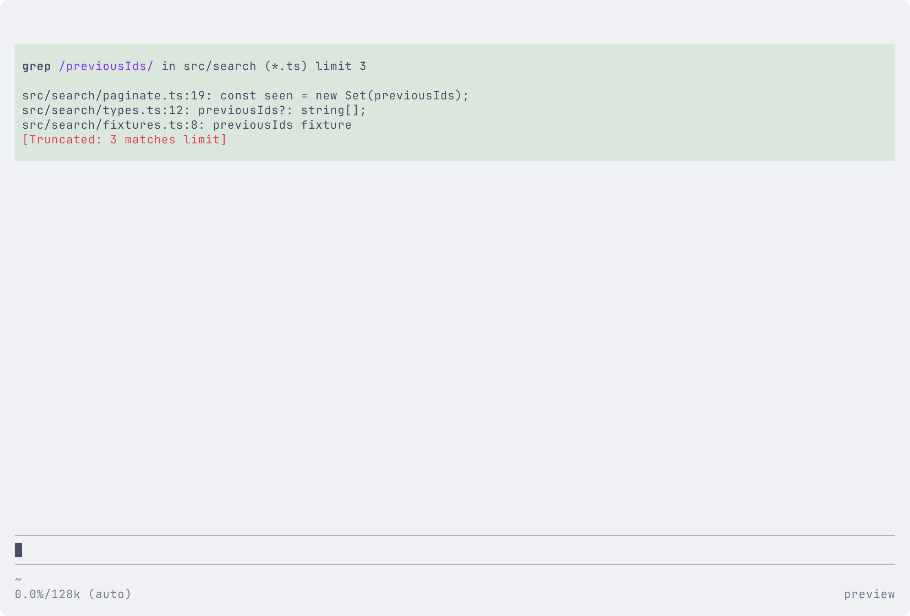

[Text](catalog-tool-grep-catppuccin-latte-120x40-main.txt) · [ANSI](catalog-tool-grep-catppuccin-latte-120x40-main.ansi)

## catalog-tool-image-fallback-catppuccin-latte-120x40-main

Source / 来源: Pi 0.85.1 ToolExecutionComponent image content / Pi 0.85.1 ToolExecutionComponent image content

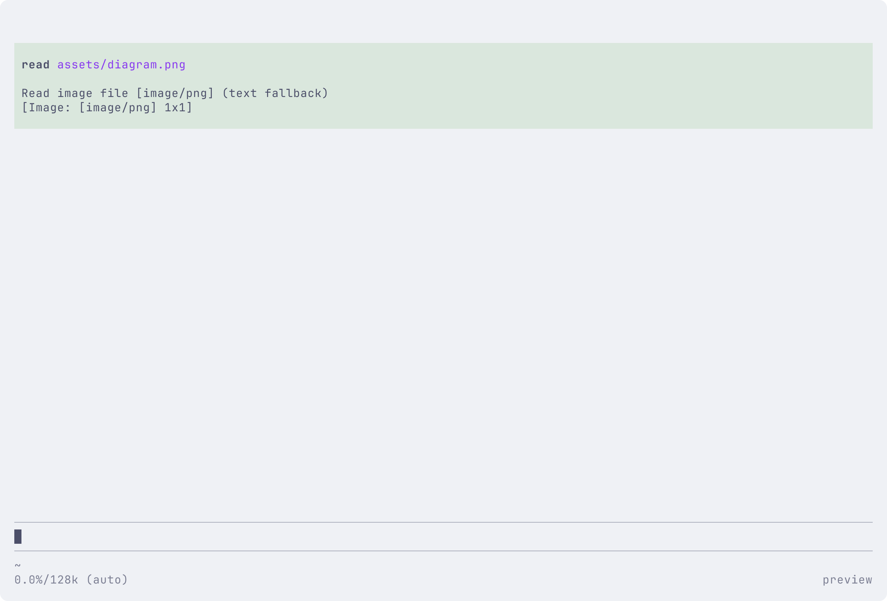

[Text](catalog-tool-image-fallback-catppuccin-latte-120x40-main.txt) · [ANSI](catalog-tool-image-fallback-catppuccin-latte-120x40-main.ansi)

## catalog-tool-ls-catppuccin-latte-120x40-main

Source / 来源: Pi 0.85.1 createLsToolDefinition + ToolExecutionComponent / Pi 0.85.1 createLsToolDefinition + ToolExecutionComponent

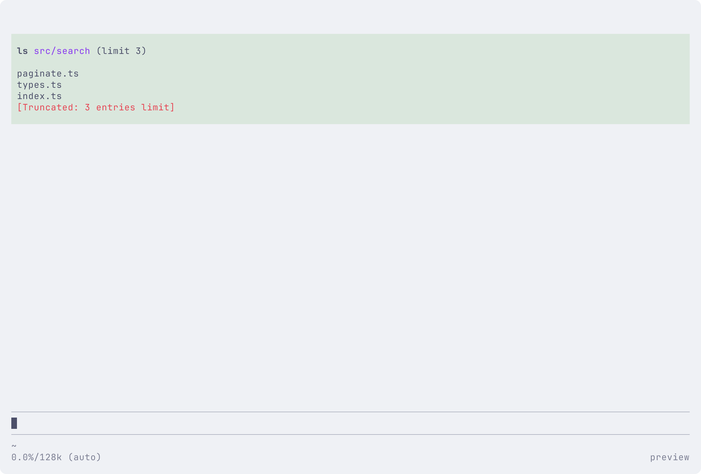

[Text](catalog-tool-ls-catppuccin-latte-120x40-main.txt) · [ANSI](catalog-tool-ls-catppuccin-latte-120x40-main.ansi)

## catalog-tool-preview-states-catppuccin-latte-120x40-main

Source / 来源: Pi 0.85.1 native renderer; static tool data, Web page data via current Content formatter / Pi 0.85.1 native renderer; static tool data, Web page data via current Content formatter

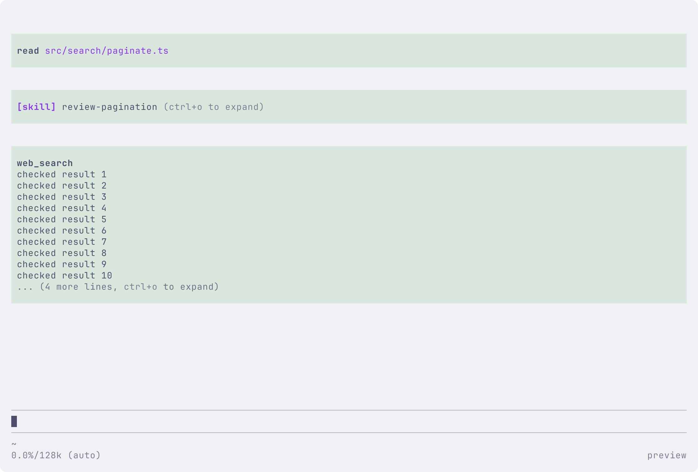

[Text](catalog-tool-preview-states-catppuccin-latte-120x40-main.txt) · [ANSI](catalog-tool-preview-states-catppuccin-latte-120x40-main.ansi)

## catalog-tool-read-catppuccin-latte-120x40-main

Source / 来源: Pi 0.85.1 createReadToolDefinition + ToolExecutionComponent / Pi 0.85.1 createReadToolDefinition + ToolExecutionComponent

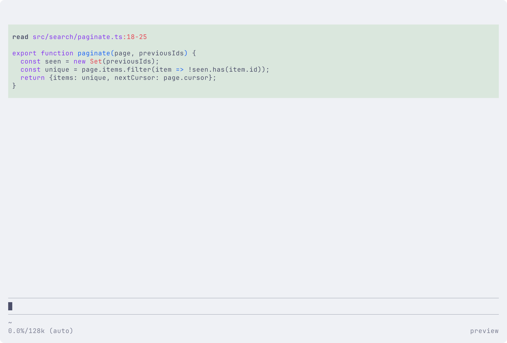

[Text](catalog-tool-read-catppuccin-latte-120x40-main.txt) · [ANSI](catalog-tool-read-catppuccin-latte-120x40-main.ansi)

## catalog-tool-write-catppuccin-latte-120x40-main

Source / 来源: Pi 0.85.1 createWriteToolDefinition + ToolExecutionComponent / Pi 0.85.1 createWriteToolDefinition + ToolExecutionComponent

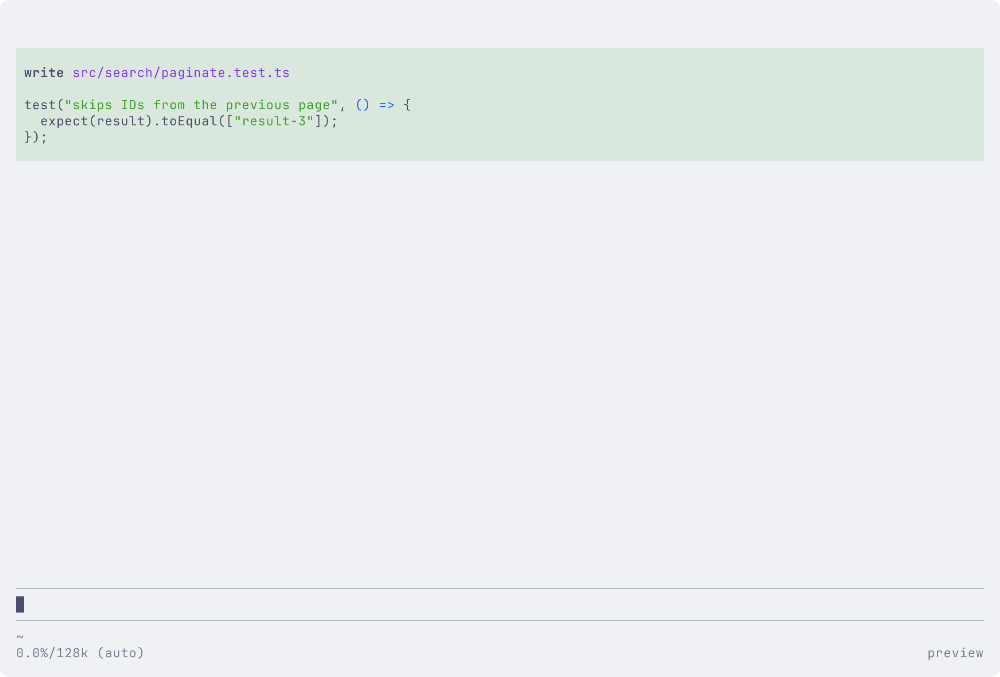

[Text](catalog-tool-write-catppuccin-latte-120x40-main.txt) · [ANSI](catalog-tool-write-catppuccin-latte-120x40-main.ansi)

## catalog-user-markdown-catppuccin-latte-120x40-main

Source / 来源: Pi 0.85.1 UserMessageComponent / Pi 0.85.1 UserMessageComponent

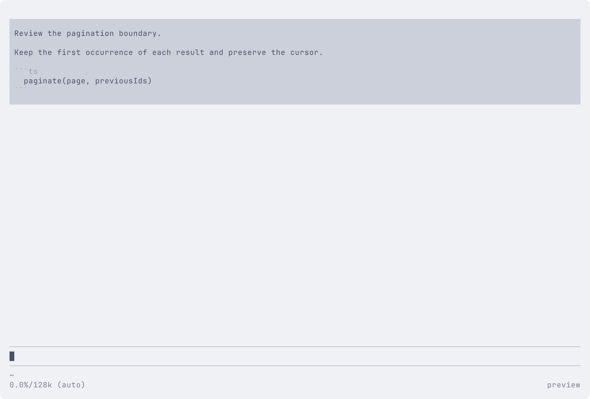

[Text](catalog-user-markdown-catppuccin-latte-120x40-main.txt) · [ANSI](catalog-user-markdown-catppuccin-latte-120x40-main.ansi)

## catalog-web-content-catppuccin-latte-120x40-main

Source / 来源: Pi Stuff src/web/tools.ts/content.ts formatter + Pi 0.85.1 generic ToolExecutionComponent / Pi Stuff src/web/tools.ts/content.ts formatter + Pi 0.85.1 generic ToolExecutionComponent

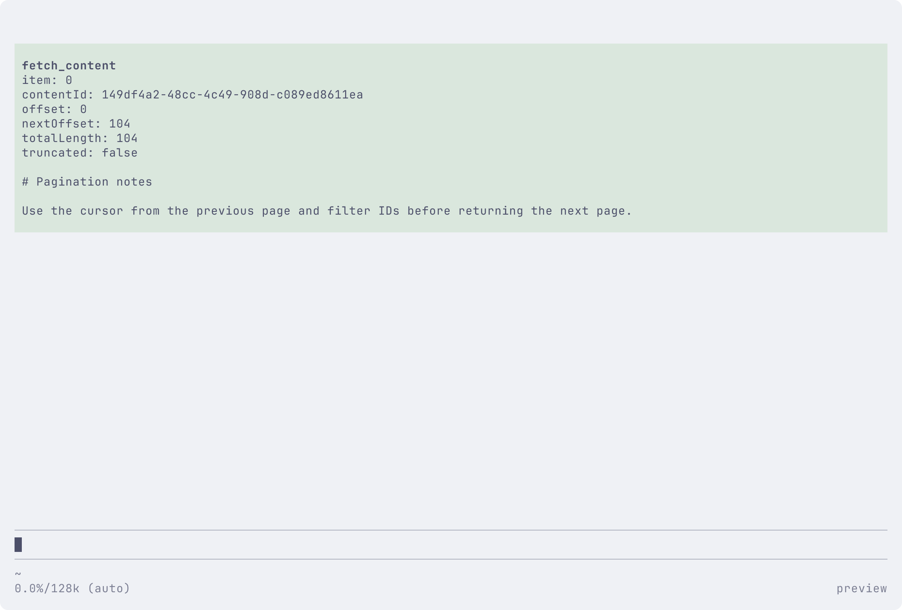

[Text](catalog-web-content-catppuccin-latte-120x40-main.txt) · [ANSI](catalog-web-content-catppuccin-latte-120x40-main.ansi)

## catalog-web-errors-catppuccin-latte-120x40-main

Source / 来源: Pi 0.85.1 native renderer; static tool data, Web page data via current Content formatter / Pi 0.85.1 native renderer; static tool data, Web page data via current Content formatter

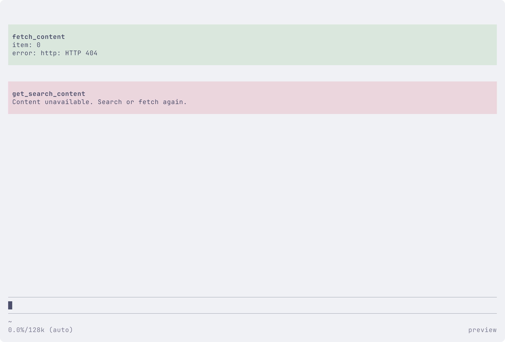

[Text](catalog-web-errors-catppuccin-latte-120x40-main.txt) · [ANSI](catalog-web-errors-catppuccin-latte-120x40-main.ansi)

## catalog-web-page-catppuccin-latte-120x40-main

Source / 来源: Pi 0.85.1 native renderer; static tool data, Web page data via current Content formatter / Pi 0.85.1 native renderer; static tool data, Web page data via current Content formatter

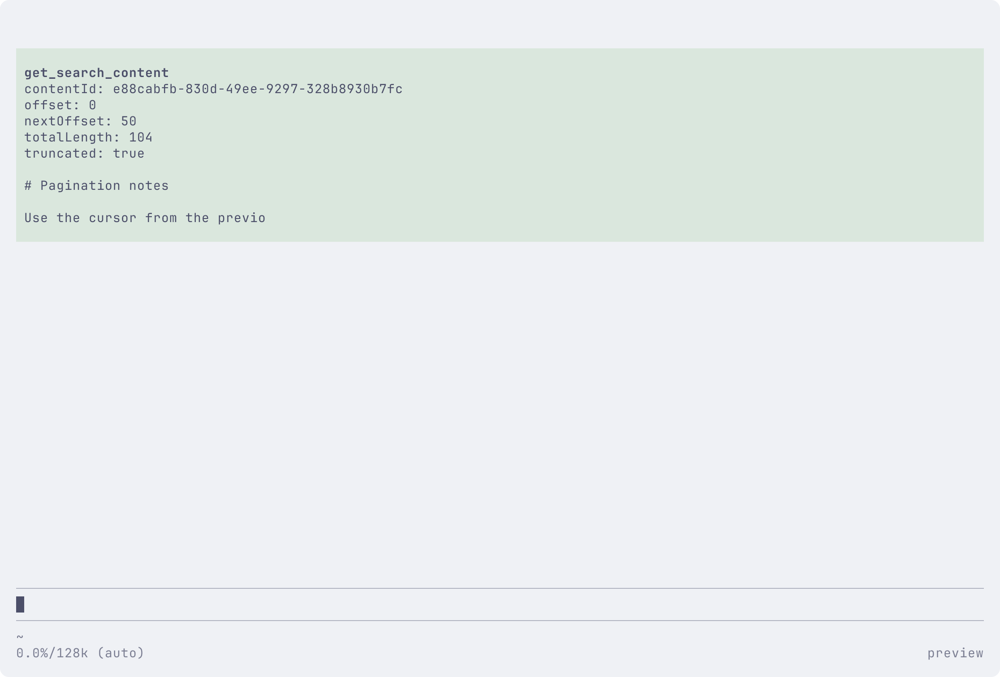

[Text](catalog-web-page-catppuccin-latte-120x40-main.txt) · [ANSI](catalog-web-page-catppuccin-latte-120x40-main.ansi)

## catalog-web-page-find-catppuccin-latte-120x40-main

Source / 来源: Pi Stuff src/web/content.ts formatter + Pi 0.85.1 generic ToolExecutionComponent / Pi Stuff src/web/content.ts formatter + Pi 0.85.1 generic ToolExecutionComponent

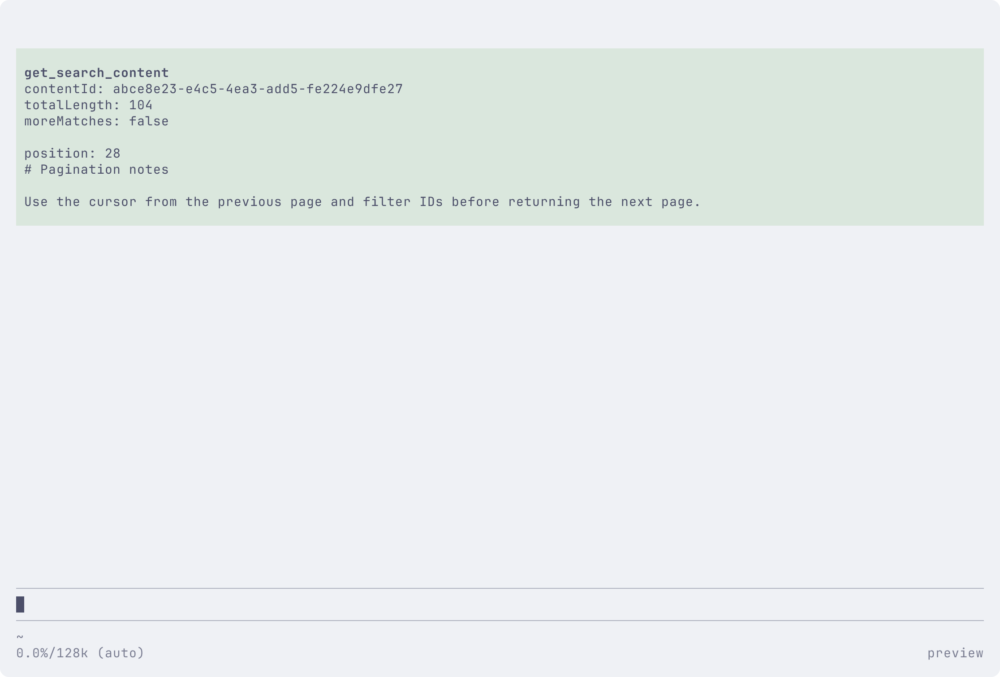

[Text](catalog-web-page-find-catppuccin-latte-120x40-main.txt) · [ANSI](catalog-web-page-find-catppuccin-latte-120x40-main.ansi)

## catalog-web-search-catppuccin-latte-120x40-main

Source / 来源: Pi Stuff src/web/tools.ts formatter + Pi 0.85.1 generic ToolExecutionComponent / Pi Stuff src/web/tools.ts formatter + Pi 0.85.1 generic ToolExecutionComponent

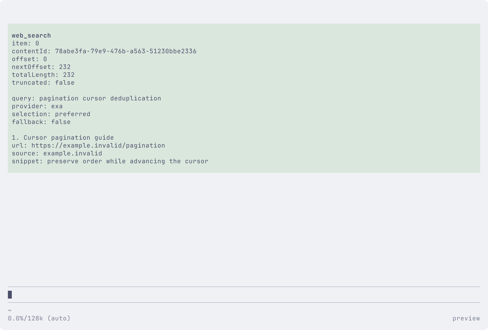

[Text](catalog-web-search-catppuccin-latte-120x40-main.txt) · [ANSI](catalog-web-search-catppuccin-latte-120x40-main.ansi)

## diff-catppuccin-latte-120x40-main

Historical layout candidate, not the current UI. / 历史 diff 布局候选, 不是当前 UI.

[Text](diff-catppuccin-latte-120x40-main.txt) · [ANSI](diff-catppuccin-latte-120x40-main.ansi)

## diff-paired-catppuccin-latte-120x40-main

Historical layout candidate, not the current UI. / 历史 diff 布局候选, 不是当前 UI.

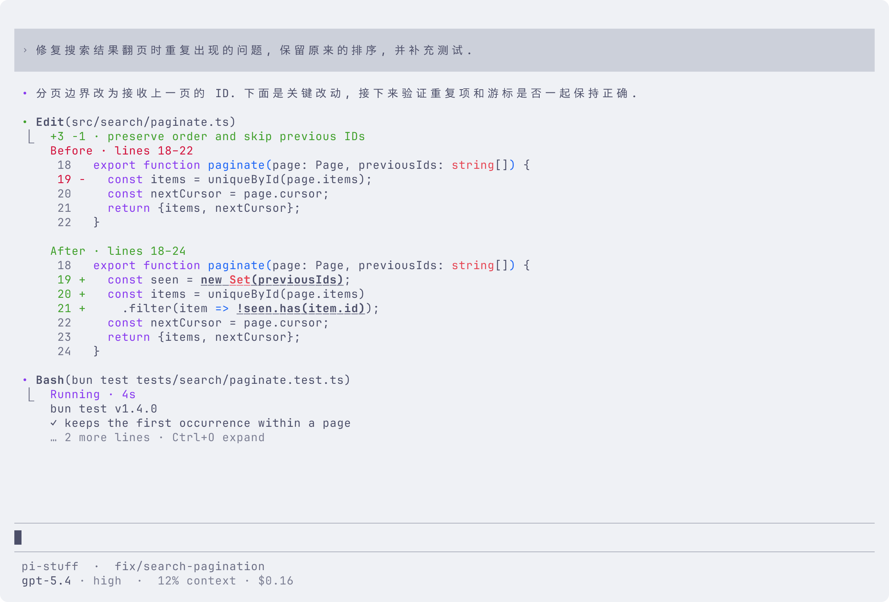

[Text](diff-paired-catppuccin-latte-120x40-main.txt) · [ANSI](diff-paired-catppuccin-latte-120x40-main.ansi)

## diff-paired-catppuccin-latte-80x40-main

Historical layout candidate, not the current UI. / 历史 diff 布局候选, 不是当前 UI.

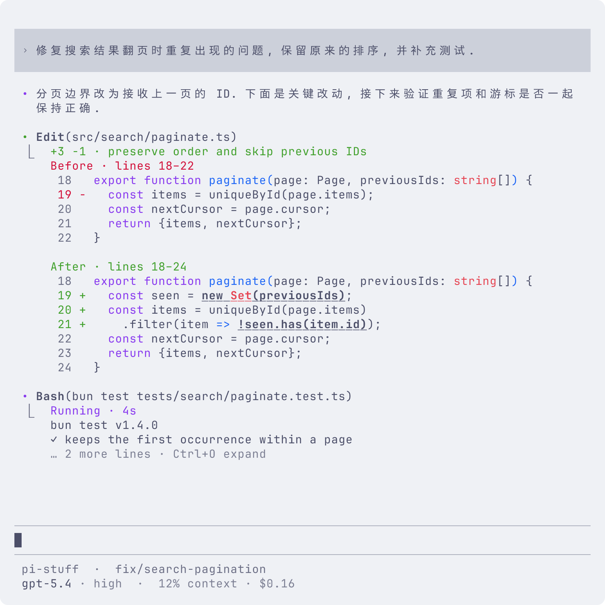

[Text](diff-paired-catppuccin-latte-80x40-main.txt) · [ANSI](diff-paired-catppuccin-latte-80x40-main.ansi)

## diff-paired-catppuccin-mocha-120x40-main

Historical layout candidate, not the current UI. / 历史 diff 布局候选, 不是当前 UI.

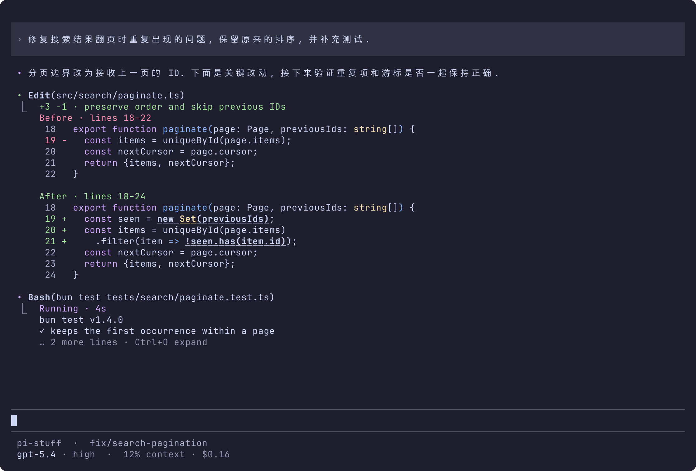

[Text](diff-paired-catppuccin-mocha-120x40-main.txt) · [ANSI](diff-paired-catppuccin-mocha-120x40-main.ansi)

## diff-split-catppuccin-latte-120x40-main

Historical layout candidate, not the current UI. / 历史 diff 布局候选, 不是当前 UI.

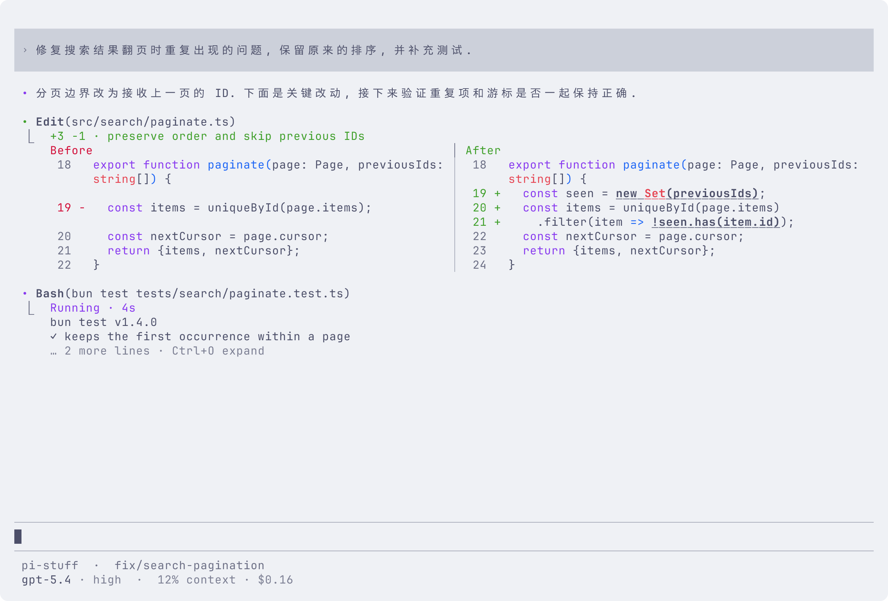

[Text](diff-split-catppuccin-latte-120x40-main.txt) · [ANSI](diff-split-catppuccin-latte-120x40-main.ansi)

## diff-split-catppuccin-latte-80x40-main

Historical layout candidate, not the current UI. / 历史 diff 布局候选, 不是当前 UI.

[Text](diff-split-catppuccin-latte-80x40-main.txt) · [ANSI](diff-split-catppuccin-latte-80x40-main.ansi)

## diff-split-catppuccin-mocha-120x40-main

Historical layout candidate, not the current UI. / 历史 diff 布局候选, 不是当前 UI.

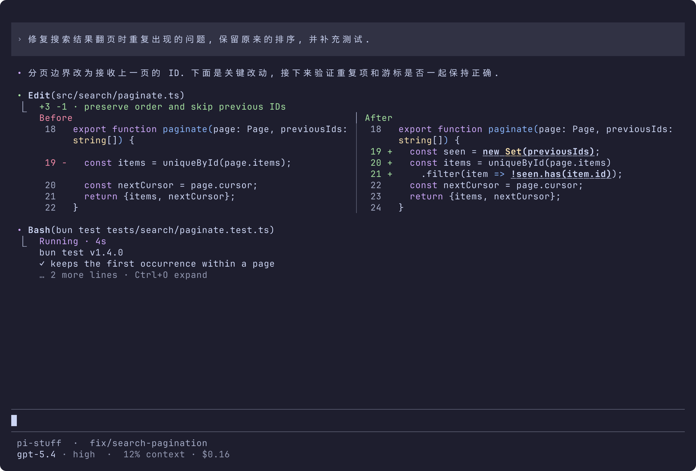

[Text](diff-split-catppuccin-mocha-120x40-main.txt) · [ANSI](diff-split-catppuccin-mocha-120x40-main.ansi)

## diff-unified-catppuccin-latte-120x40-main

Historical layout candidate, not the current UI. / 历史 diff 布局候选, 不是当前 UI.

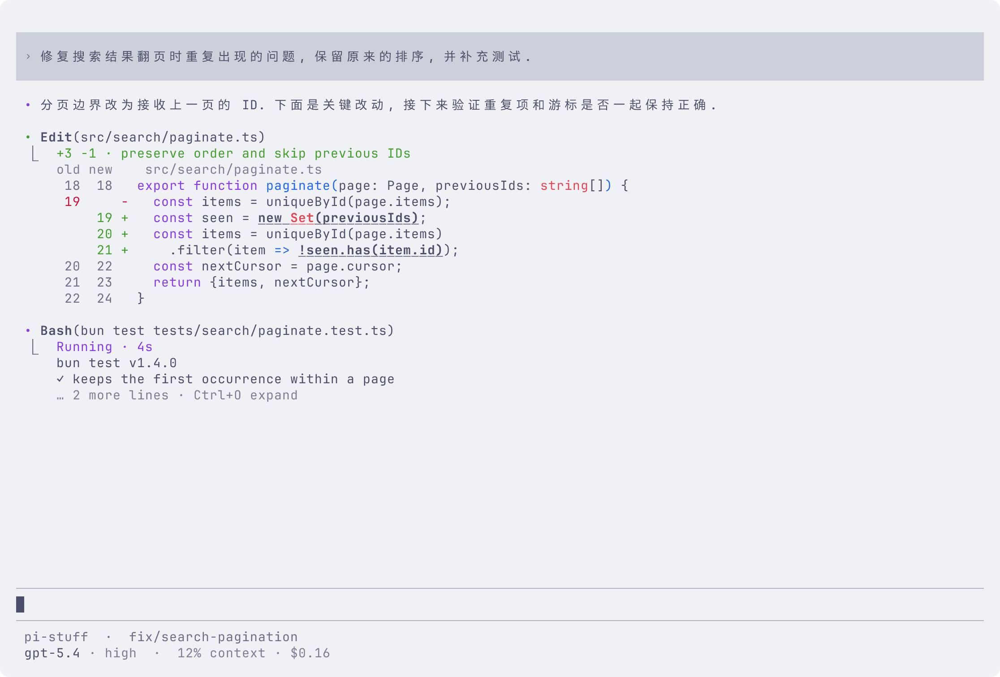

[Text](diff-unified-catppuccin-latte-120x40-main.txt) · [ANSI](diff-unified-catppuccin-latte-120x40-main.ansi)

## diff-unified-catppuccin-latte-80x40-main

Historical layout candidate, not the current UI. / 历史 diff 布局候选, 不是当前 UI.

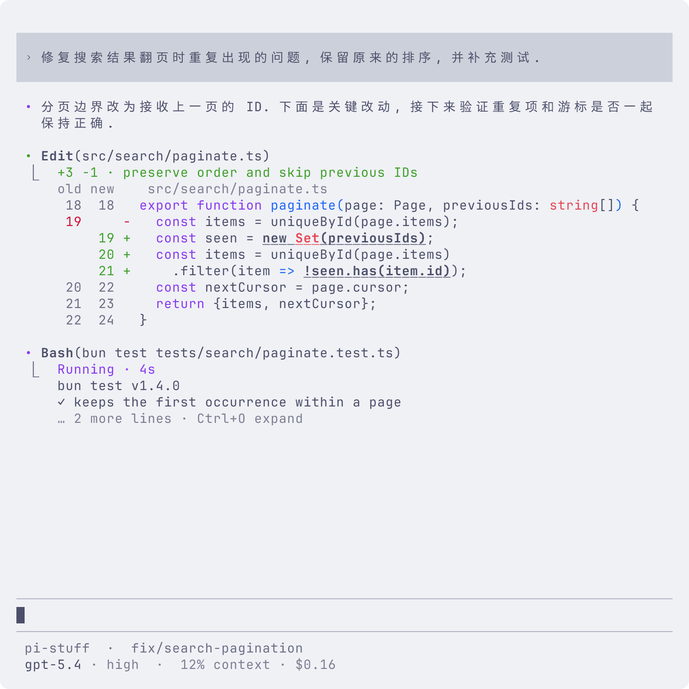

[Text](diff-unified-catppuccin-latte-80x40-main.txt) · [ANSI](diff-unified-catppuccin-latte-80x40-main.ansi)

## diff-unified-catppuccin-mocha-120x40-main

Historical layout candidate, not the current UI. / 历史 diff 布局候选, 不是当前 UI.

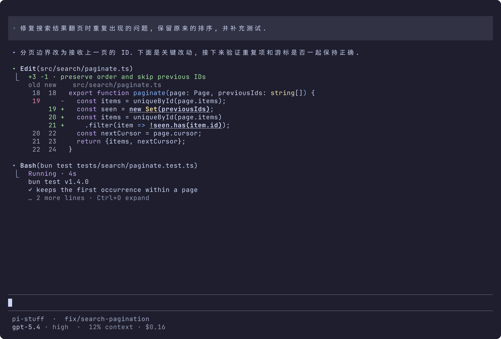

[Text](diff-unified-catppuccin-mocha-120x40-main.txt) · [ANSI](diff-unified-catppuccin-mocha-120x40-main.ansi)
